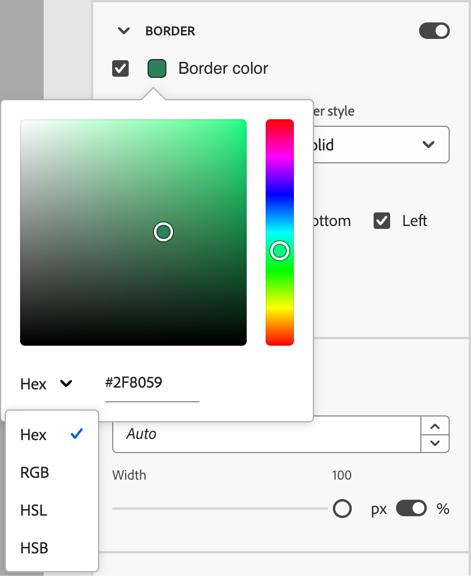
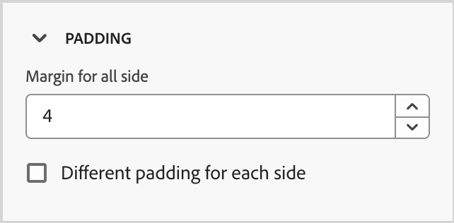

# 스니펫

<!-- Content authoring steps for reuse -->

## 의도 데이터 구성 {#intent-data-note}

>[!NOTE]
>
>의도 데이터는 Journey Optimizer B2B edition 인스턴스에 대해 구성될 때 포함됩니다. 또한 하나 이상의 게시된 여정 **또는**&#x200B;이(가) 구매 그룹을 만들어야 합니다. Intent Detection 모델 및 키워드, 제품 및 범주를 제출하는 방법에 대한 자세한 내용은 [Intent Data](../user/admin/intent-data.md)를 참조하십시오.

## AEM Assets 라이선스 노트 {#aem-assets-licensing-note}

>[!NOTE]
>
>AEM Assets as a Cloud Service 및 Dynamic Media 라이선스는 통합을 위한 필수 요건입니다. [Dynamic Media withOpen API](https://experienceleague.adobe.com/en/docs/experience-manager-cloud-service/content/assets/dynamicmedia/dynamic-media-open-apis/dynamic-media-open-apis-overview){target="_blank"}이(가) 활성화되어 있는지 확인하십시오. 통합은 _게재 계층_&#x200B;의 저장소로 제한됩니다. _작성자 계층_&#x200B;을 사용하고 이 계층을 변환하려면 Adobe Experience Manager 지원 팀에 문의하십시오. 
>계약 및 구성에 따라 시각적 컨텐츠를 디자인할 때 Adobe Experience Manager Assets as a Cloud Service에서 Adobe Journey Optimizer B2B edition에 직접 액세스할 수 있습니다.

## 콘텐츠 작성 - 구성 요소 - 구조 단계 {#structures-step}

1. 콘텐츠 디자인을 시작하려면 **[!UICONTROL Structures]**&#x200B;에서 항목을 드래그하여 캔버스에 놓습니다.

   _[!UICONTROL 구조]_&#x200B;에서 필요한 만큼 항목을 추가하고 오른쪽 창에서 각 항목의 설정을 편집합니다.

   >[!TIP]
   >
   >_[!UICONTROL n:n 열]_ 구성 요소를 선택하여 선택한 열 수(3개에서 10개 사이)를 정의합니다. 열 아래로 화살표를 이동하여 각 열의 너비를 정의할 수도 있습니다.

   {width="800" zoomable="yes"}

   각 열 크기는 구조 구성 요소의 전체 너비의 10%보다 작을 수 없습니다. 빈 열만 제거할 수 있습니다.

## 컨텐츠 작성 - 구성 요소 - 컨텐츠 단계 {#contents-step}

1. **[!UICONTROL 내용]** 섹션을 확장하고 하나 이상의 구조 구성 요소에 필요한 만큼 요소를 추가합니다.

   {width="800" zoomable="yes"}
   <!--
   reference to the contents elements--->

## 컨텐츠 작성 - 구성 요소 - 설정 단계 {#settings-step}

1. 필요한 경우 _[!UICONTROL 설정]_ 또는 _[!UICONTROL 스타일]_ 탭에서 각 구성 요소를 추가로 사용자 지정할 수 있습니다.

   예를 들어 각 구성 요소의 텍스트 스타일, 패딩 또는 여백을 변경할 수 있습니다.

## 콘텐츠 작성 - 에셋 단계 {#assets-step}

1. _자산_ 선택기에서 자산 라이브러리에 저장된 자산을 직접 선택할 수 있습니다.

   에셋이 포함된 폴더를 두 번 클릭합니다. 항목을 구조 구성 요소로 끌어다 놓습니다.

   소스 유형의 자산을 사용하는 방법에 대한 자세한 내용은 [콘텐츠에 자산 추가](../user/content/assets-overview.md#use-assets-for-content-authoring)를 참조하십시오.

   {width="800" zoomable="yes"}

## 콘텐츠 작성 - 개인화 단계 {#personalization-step}

1. 개인화 필드를 삽입하여 프로필 속성, 대상자 멤버십, 컨텍스트 속성 등에서 콘텐츠를 사용자 지정합니다.

## 컨텐츠 작성 - 조건 컨텐츠 단계 활성화 {#dynamic-content-step}

1. 조건부 규칙에 따라 다이내믹 콘텐츠를 추가하고 타겟팅된 프로필에 콘텐츠를 적용하려면 **[!UICONTROL 조건 콘텐츠 사용]**&#x200B;을 클릭하십시오.

## 컨텐츠 작성 - 링크 추적 단계 {#links-tracking-step}

1. 추적되는 콘텐츠의 모든 URL을 표시하려면 왼쪽 창에서 **[!UICONTROL 링크]** 탭을 선택하십시오.

   _추적 유형_ 또는 _레이블_&#x200B;을 수정하고 필요한 경우 태그를 추가할 수 있습니다.

## 콘텐츠 구성 요소 - 고급 스타일 {#styles-advanced}

값이 있는 추가 CSS 호환 특성을 적용하려면 **[!UICONTROL 고급]** 스타일 설정을 사용하십시오. 기존 속성의 값을 변경하거나 새 값을 추가할 수 있습니다. 스타일이 상위-하위 구성 요소(요소)에 대한 CSS 상속 모델을 사용하여 구성 요소에 적용됩니다.

표시된 속성은 구성 요소에 대해 현재 정의된 스타일을 반영합니다. [CSS 정의](https://www.w3schools.com/CSSref/index.php){target="_blank"}에 따라 값을 변경할 수 있습니다. _추가_(**+**) 아이콘을 클릭하여 구성 요소에 대한 새 스타일 특성을 추가합니다.

{width="250"}

## 콘텐츠 구성 요소 - 가로 정렬 스타일 {#styles-alignment-h}

**[!UICONTROL 맞춤]** 섹션을 확장하고 사용할 가로 맞춤(왼쪽, 가운데 또는 오른쪽)을 선택합니다. 이 스타일은 표준 `text-align` CSS 스타일로 변환되며 구성 요소가 포함된 구성 요소 내에 배치되는 방식에 영향을 줍니다.

{width="250"}

## 콘텐츠 구성 요소 - 세로 정렬 스타일 {#styles-alignment-v}

**[!UICONTROL 맞춤]** 섹션을 확장하고 사용할 세로 맞춤(위쪽, 중간 또는 아래쪽)을 선택합니다. 이 스타일은 표준 `vertical-align` CSS 스타일로 변환되며 포함된 구성 요소 내의 위치에 영향을 줍니다.

{width="250"}

## 콘텐츠 구성 요소 - 가로 및 세로 정렬 스타일 {#styles-alignment-h-v}

**[!UICONTROL 맞춤]** 섹션을 확장하고 사용할 가로 및 세로 맞춤을 선택합니다. 정렬 스타일은 HTML 구성 요소가 포함된 구성 요소(구조적 또는 컨테이너) 내에 배치되는 방식에 영향을 줍니다.

가로 맞춤은 표준 `text-align` CSS 스타일로 변환되며 왼쪽, 가운데 또는 오른쪽에서 선택할 수 있습니다. 세로 맞춤은 표준 `vertical-align` CSS 스타일로 변환되며 위쪽, 중간 또는 아래쪽에서 선택할 수 있습니다.

{width="300"}

## 컨텐츠 구성 요소 - 배경 스타일 {#styles-background}

오른쪽 패널에서 _[!UICONTROL 스타일]_ 탭을 선택한 상태에서 **[!UICONTROL 배경]** 섹션을 사용하여 구성 요소의 배경색을 정의합니다.

확인란을 선택하고 색상 사각형을 클릭하여 선택기에서 색상을 선택합니다. 알려진 RGB, HSL, HSB 또는 16진수 값을 입력하여 색상을 선택할 수 있습니다. 또는 색상 슬라이더와 색상 필드를 사용하여 색상을 선택할 수 있습니다.

{width="300"}

## 콘텐츠 구성 요소 - 테두리 스타일 {#styles-border}

1. _[!UICONTROL 스타일]_ 탭을 선택한 오른쪽 패널에서 **[!UICONTROL 테두리]** 섹션을 확장하고 구성 요소의 테두리를 표시하는 옵션을 설정합니다.

1. 토글을 오른쪽으로 이동하여 테두리 표시 옵션을 활성화하고 디자인 기준에 따라 설정합니다.

   * **[!UICONTROL 테두리 색상]**&#x200B;을 설정하려면 확인란을 선택하고 색상 사각형을 클릭하여 선택기에서 색상을 선택합니다. 알려진 RGB, HSL, HSB 또는 16진수 값을 입력하여 색상을 선택할 수 있습니다. 또는 색상 슬라이더와 색상 필드를 사용하여 색상을 선택할 수 있습니다.

   {width="300"}

   * **[!UICONTROL 테두리 크기]**(선 폭)을 설정하려면 위쪽 및 아래쪽 화살표 아이콘을 클릭하여 픽셀 수를 늘리거나 줄입니다.

   * **[!UICONTROL 테두리 스타일]**&#x200B;을(를) 설정하려면 표준 CSS `border-style` 값 목록에서 값을 선택하십시오.

   * 테두리가 표시되는 위치를 확인하려면 각 **[!UICONTROL 테두리 위치]** 확인란을 선택하십시오.

   {width="250"}

1. **[!UICONTROL 테두리 반지름]**&#x200B;의 경우 모퉁이에 대해 원하는 곡선에 따라 숫자 값을 설정하십시오.

   값이 0(기본값)이면 사각형 모서리가 생성됩니다.

## 컨텐츠 구성 요소 - 여백 스타일 {#styles-margin}

_[!UICONTROL 스타일]_ 탭이 선택된 오른쪽 패널에서 **[!UICONTROL 여백]** 섹션을 확장하고 구조적 구성 요소 내에서 여백 간격에 대한 옵션을 설정합니다. 이 스타일은 CSS `margin` 매개 변수를 복제합니다. 이 매개 변수는 다른 구성 요소와 구분하여 구성 요소 테두리 외부의 공간으로 제어합니다. 구성 요소 주위에 간격을 만들어 위치 및 주변 컨텐츠 레이아웃에 영향을 줍니다.

디자인 요구에 따라 여백 값을 픽셀 단위로 설정합니다. 구성 요소의 모든 면, 상단, 왼쪽-오른쪽 또는 각 면에 대한 여백을 독립적으로 설정할 수 있습니다.

* **모든 면** - 모든 면에 적용할 하나의 값을 설정하려면 **[!UICONTROL 각 면에 대해 다른 여백]** 확인란의 선택을 취소하십시오. 위쪽 및 아래쪽 화살표 아이콘을 클릭하여 픽셀 수를 늘리거나 줄입니다.

  {width="250"}

* **위쪽-아래쪽** - 위쪽 및 아래쪽 여백을 같은 값으로 설정하려면 위쪽 및 아래쪽 설정 사이에 _잠김_ 아이콘을 설정합니다. 에 대한 위쪽 및 아래쪽 화살표 아이콘을 클릭하여 픽셀 수를 늘리거나 줄입니다.

* **왼쪽-오른쪽** - 왼쪽 및 오른쪽 여백을 같은 값으로 설정하려면 왼쪽 및 오른쪽 설정 사이에 _잠김_ 아이콘을 설정합니다. 에 대한 위쪽 및 아래쪽 화살표 아이콘을 클릭하여 픽셀 수를 늘리거나 줄입니다.

  {width="250"}

* **독립** - 각 여백을 독립 값으로 설정하려면 _잠금 해제됨_ 아이콘을 위쪽 및 아래쪽 설정 사이, 왼쪽 및 오른쪽 사이로 설정합니다. 각 설정에 대해 의 위쪽 및 아래쪽 화살표 아이콘을 클릭하여 픽셀 수를 늘리거나 줄입니다.

  {width="250"}

## 컨텐츠 구성 요소 - 패딩 스타일 {#styles-padding}

_[!UICONTROL 스타일]_ 탭을 선택한 오른쪽 패널에서 **[!UICONTROL 패딩]** 섹션을 확장하고 구조적 구성 요소 내에서 패딩에 대한 옵션을 설정합니다. 이 스타일은 구성 요소의 콘텐츠와 테두리 사이의 공간인 CSS `padding` 매개 변수를 복제합니다. 패딩은 내용과 구성 요소 테두리 사이의 거리를 제어하는 데 사용할 수 있는 내부 공간을 제공합니다.

디자인 요구에 따라 패딩 값을 픽셀 단위로 설정합니다. 구성 요소의 모든 면, 상단, 왼쪽-오른쪽 또는 각 면에 대한 패딩을 독립적으로 설정할 수 있습니다.

* **모든 면** - 모든 면에 적용할 하나의 값을 설정하려면 **[!UICONTROL 각 면에 대해 다른 패딩]** 확인란의 선택을 취소하십시오. 위쪽 및 아래쪽 화살표 아이콘을 클릭하여 픽셀 수를 늘리거나 줄입니다.

  {width="250"}

* **위쪽-아래쪽** - 위쪽 및 아래쪽 패딩을 같은 값으로 설정하려면 위쪽 및 아래쪽 설정 사이에 _잠김_ 아이콘을 설정합니다. 에 대한 위쪽 및 아래쪽 화살표 아이콘을 클릭하여 픽셀 수를 늘리거나 줄입니다.

* **왼쪽-오른쪽** - 왼쪽 및 오른쪽 패딩을 같은 값으로 설정하려면 왼쪽 및 오른쪽 설정 사이에 _잠김_ 아이콘을 설정합니다. 에 대한 위쪽 및 아래쪽 화살표 아이콘을 클릭하여 픽셀 수를 늘리거나 줄입니다.

  {width="250"}

* **독립** - 각 면에 대한 패딩을 독립 값으로 설정하려면 _Unlocked_ 아이콘을 위쪽 및 아래쪽 설정 사이 및 왼쪽 및 오른쪽 사이에 설정합니다. 각 설정에 대해 의 위쪽 및 아래쪽 화살표 아이콘을 클릭하여 픽셀 수를 늘리거나 줄입니다.

  {width="250"}

## 콘텐츠 구성 요소 - 크기 스타일 {#styles-size}

_[!UICONTROL 스타일]_ 탭을 선택한 오른쪽 패널에서 **[!UICONTROL 크기]** 섹션을 확장하고 구성 요소 높이 및 너비에 대한 옵션을 설정합니다.

* **[!UICONTROL 높이]** - 위쪽 및 아래쪽 화살표 아이콘을 클릭하여 픽셀 수를 늘리거나 줄입니다. 빈 값(자동)은 기본값이며 내용에 따라 요소의 높이 크기를 조정합니다.

* **[!UICONTROL 너비]** - 픽셀이나 백분율로 너비를 설정하려면 토글을 사용합니다.

   * 백분율 너비의 경우 슬라이더를 사용하여 백분율 값을 설정합니다. 백분율은 포함 블록의 콘텐츠 상자를 기반으로 요소 크기를 결정합니다. 이 콘텐츠 상자에서는 패딩과 테두리가 제외됩니다. 예를 들어 값 50은 요소 너비를 포함된 블록 콘텐츠 너비의 50%로 설정합니다.

     {width="250"}

   * 픽셀 기반 너비의 경우 위쪽 및 아래쪽 화살표 아이콘을 클릭하여 픽셀 수를 늘리거나 줄입니다. 비어 있는 값(자동)은 기본값이며 내용에 따라 요소의 너비를 조정합니다.

     {width="250"}

## 콘텐츠 구성 요소 - 텍스트 스타일 {#styles-text}

_[!UICONTROL 스타일]_ 탭을 선택한 오른쪽 패널에서 **[!UICONTROL 텍스트]** 섹션을 확장하고 구성 요소 텍스트 스타일에 대한 옵션을 설정합니다.

* **[!UICONTROL 글꼴 모음]** - 아래쪽 화살표 아이콘을 클릭하여 구성 요소에서 텍스트에 사용할 글꼴 모음을 선택합니다.

* **[!UICONTROL 글꼴 크기]** - 위쪽 및 아래쪽 화살표 아이콘을 클릭하여 글꼴 크기를 늘리거나 줄이거나 값을 입력합니다. 입력한 값의 경우 소수를 사용할 수 있습니다.

* **[!UICONTROL 선 높이]** - 위쪽 및 아래쪽 화살표 아이콘을 클릭하여 선 높이를 늘리거나 줄이거나 값을 입력합니다. 입력한 값의 경우 소수를 사용할 수 있습니다.

  {width="250"}

* **[!UICONTROL 텍스트 스타일]** - 텍스트 스타일의 아이콘을 선택합니다. _굵게_, _기울임꼴_, _밑줄_ 또는 _취소선_.

* **[!UICONTROL 텍스트 맞춤]** - 가로 텍스트 맞춤 아이콘을 선택합니다. _왼쪽_, _가운데_, _오른쪽_ 또는 _양쪽 맞춤_.

* **[!UICONTROL 글꼴 색상]** - 선택기에서 글꼴 색상을 선택하려면 색상 사각형을 클릭합니다. 알려진 RGB, HSL, HSB 또는 16진수 값을 입력하여 색상을 선택할 수 있습니다. 또는 색상 슬라이더와 색상 필드를 사용하여 색상을 선택할 수 있습니다.

  {width="300"}

## 컨텐츠 - 이미지 선택 - Marketo DAM {#me-dam}

Journey Optimizer B2B edition 라이브러리 또는 연결된 Market Engage 인스턴스에서 이미지 에셋을 찾아보고 선택하려면 이 유형을 선택합니다.

{width="700" zoomable="yes"}

대화 상자에서 선택한 저장소에서 이미지를 선택할 수 있습니다. 자산을 추가하려면 **[!UICONTROL 선택]**&#x200B;을 클릭합니다.

필요한 에셋을 찾는 데 도움이 되는 도구가 있습니다.

* 조건에 따라 표시된 항목을 필터링하려면 왼쪽 상단의 _필터_ 아이콘을 클릭하십시오.

* 표시된 항목을 자산 이름과 일치하도록 필터링하려면 _검색_ 필드에 텍스트를 입력하십시오.

  {width="700" zoomable="yes"}

## 컨텐츠 - 이미지 선택 - AEM Assets {#aem-assets-dam}

[구성된 Experience Manage Assets 저장소](../user/admin/configure-aem-repositories.md)에서 이미지 에셋을 찾아보고 선택하려면 이 유형을 선택하십시오.

_[!UICONTROL Assets 선택]_ 대화 상자에서 사용 가능한 도구를 사용하여 이미지를 선택하여 필요한 에셋을 찾은 다음 **[!UICONTROL 선택]**&#x200B;을 클릭합니다.

* 오른쪽 상단에서 **[!UICONTROL 저장소]**&#x200B;를 변경합니다.

* 오른쪽 상단의 **[!UICONTROL 자산 관리]**&#x200B;를 클릭하여 다른 브라우저 탭에서 Assets 저장소를 열고 AEM Assets 관리 도구를 사용합니다.

* 표시를 _목록 보기_, **[!UICONTROL 눈금 보기]**, **[!UICONTROL 갤러리 보기]** 또는 **[!UICONTROL 폭포 보기]**(으)로 변경하려면 오른쪽 상단의 **[!UICONTROL 보기 유형]** 선택기를 클릭하십시오.

* 오름차순과 내림차순 사이의 정렬 순서를 변경하려면 _정렬 순서_ 아이콘을 클릭하십시오.

  {width="700" zoomable="yes"}

* **[!UICONTROL 정렬 기준]** 메뉴 화살표를 클릭하여 정렬 기준을 **[!UICONTROL 이름]**, **[!UICONTROL 크기]** 또는 **[!UICONTROL 수정됨]**(으)로 변경합니다.

* 조건에 따라 표시된 항목을 필터링하려면 왼쪽 상단의 _필터_ 아이콘을 클릭하십시오.

* 표시된 항목을 자산 이름과 일치하도록 필터링하려면 _검색_ 필드에 텍스트를 입력하십시오.

  {width="700" zoomable="yes"}

## 컨텐츠 - 이미지 업로드 {#image-upload}

시스템에서 파일을 선택하고 Journey Optimizer B2B edition 자산 라이브러리로 가져오려면 이 유형을 선택하십시오.

_[!UICONTROL 이미지 업로드]_ 대화 상자에서 시스템의 파일을 파일 상자로 끌어서 놓습니다. 최대 파일 크기는 100MB입니다.

{width="450"}(으)로 가져오기

선택한 이미지의 파일 이름이 대화 상자에 표시됩니다. 에셋 파일 이름은 폴더 간에 고유해야 하며 이름의 파일이 이미 있는 경우 메시지가 표시됩니다. 이름에는 최대 100자를 사용할 수 있으며 특수 문자(예: `;`, `:`, `\` 및 `|`)를 사용할 수 없습니다.

**[!UICONTROL 가져오기]**&#x200B;를 클릭합니다.

## 참여 점수 활동 {#engagement-activities}

| 활동 이름 | 설명 | 참여 유형 | 최대 일일 빈도 수 | 기본 모델 활동 가중치 |
| --- | --- | --- | --- | --- |
| [!UICONTROL 이벤트 참석] | 멤버가 이벤트에 참여함 | 이벤트 | 20 | 60 |
| [!UICONTROL 이메일 클릭됨] | 멤버가 판매 이메일의 링크를 클릭함 | 이메일 | 20 | 30 |
| [!UICONTROL 이메일 열림] | 멤버가 이메일을 열람함 | 이메일 | 20 | 30 |
| [!UICONTROL 양식 작성됨] | 멤버가 웹 페이지에서 양식을 작성하고 제출함 | 웹 | 20 | 40 |
| [!UICONTROL 즐거운 순간] | 멤버에게 “즐거운 순간”이 있음 | 선별 | 20 | 60 |
| [!UICONTROL 링크 클릭 수] | 멤버가 웹 페이지의 링크를 클릭함 | 웹 | 20 | 40 |
| [!UICONTROL 페이지 보기] | 구성원이 웹 페이지를 봅니다. | 웹 | 20 | 40 |
| [!UICONTROL 이벤트에 등록] | 이벤트에 등록된 멤버 | 이벤트 | 20 | 60 |
