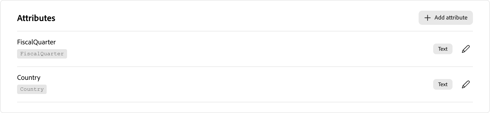

# 프로그램 유형

프로그램 유형은 [프로그램](../marketing/programs.md) 및 해당 멤버의 중요한 측면을 정의하며 서로 다른 유형의 마케팅 프로그램을 구별합니다. 각 프로그램 유형은 프로그램 유형을 사용하는 프로그램에 대해 상속되는 다음 속성을 정의합니다.

* **특성** - 특성은 이벤트 날짜 및 위치 특성과 같은 프로그램 유형의 중요한 측면을 설명합니다.

* **프로그램 상태 흐름** - 각 상태는 프로그램 유형의 단계(예: 1, 2 또는 3)에 할당됩니다. 프로그램 구성원은 단계 번호가 같은 상태(예: _표시 안 함_&#x200B;에서 _참석함_)에서만 이동하거나 단계 번호가 높은 상태(예: _초대됨_&#x200B;에서 _등록됨_)로만 이동할 수 있습니다.

  프로그램 상태는 상호 배타적이고 선형적이므로 개인은 프로그램당 하나의 상태 값만 가질 수 있습니다. 상태를 디자인할 때 사이에서 이동하도록 허용할 상태를 생각해 보십시오. 예를 들어 어떤 사람이 웨비나에 나타나지 않았지만 나중에 온디맨드에 참석할 수 있는 옵션이 있는 경우, 동일한 상태 번호를 갖도록 하거나 프로그램 구성원이 이동할 수 있도록 온디맨드를 더 높은 상태 번호로 설정할 수 있습니다.

>[!NOTE]
>
>프로그램 유형을 하나 이상의 프로그램에서 사용하는 경우 편집할 수 없습니다.

사용자 지정 프로그램 형식을 정의하려면(_T):_

1. [!DNL Adobe Journey Optimizer B2B Prime] 왼쪽 탐색에서 **[!UICONTROL 관리]**&#x200B;를 확장하고 **[!UICONTROL 프로그램 유형]**&#x200B;을 선택합니다.

   {width="800" zoomable="yes"}

1. 오른쪽 상단의 **[!UICONTROL 유형 만들기]**&#x200B;를 클릭합니다.

1. 고유한 **[!UICONTROL 이름]**(필수) 및 **[!UICONTROL 설명]**(선택 사항)을 입력하십시오.

   {width="600" zoomable="yes"}

   >[!TIP]
   >
   >설명을 포함하는 것이 모범 사례이며 프로그램 유형 라이브러리를 더 쉽게 관리할 수 있습니다.

1. **[!UICONTROL 유형 만들기]**&#x200B;를 클릭합니다.

1. 프로그램 유형에 대해 **[!UICONTROL 특성]**&#x200B;을(를) 추가합니다.

   추가할 각 속성에 대해 다음을 수행합니다.

   * **[!UICONTROL 특성 추가]**&#x200B;를 클릭합니다.
   * **[!UICONTROL API 이름]**&#x200B;을(를) 선택하고 **[!UICONTROL 표시 이름]**&#x200B;을(를) 입력하십시오.
   * **[!UICONTROL 저장]**&#x200B;을 클릭합니다.

   {width="600" zoomable="yes"}

1. **[!UICONTROL 프로그램 상태]**&#x200B;에 대한 단계를 정의합니다.

   플로우에 포함할 각 단계를 정의합니다.

   * **[!UICONTROL 단계 추가]**&#x200B;를 클릭합니다.
   * 상태 이름을 입력합니다.
   * (선택 사항) **[!UICONTROL 상태 추가]**&#x200B;를 클릭하고 단계에 포함할 추가 상태 이름을 입력합니다.

   성공적인 프로그램 실행으로 추적할 모든 단계에 대해 **[!UICONTROL 성공으로 표시]** 확인란을 선택합니다.

   {width="600" zoomable="yes"}

1. 변경 사항을 저장하고 프로그램 유형 목록으로 돌아가려면 **[!UICONTROL 완료]**&#x200B;를 클릭하십시오.