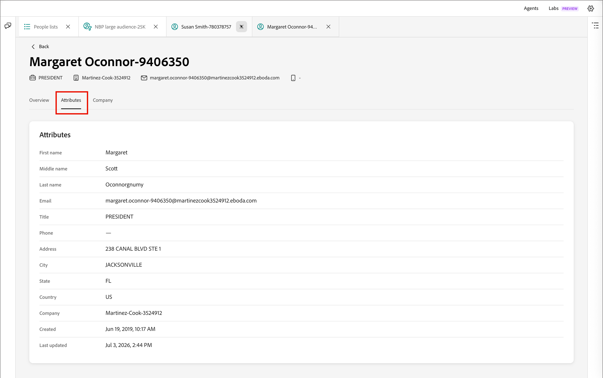

# 개인 정보

[!DNL Adobe Journey Optimizer B2B Prime]에서 [사용자 목록](./people-lists.md)의 _[!UICONTROL 구성원]_ 탭에서 사용자 이름을 클릭하면 해당 사용자에 대한 통합 보기로 사용자 세부 정보 페이지가 열립니다. 이 페이지에서는 다음 사항을 제공합니다.

* AI가 생성한 담당자, 참여 및 의도 요약
* 전체 활동 기록
* 프로필 및 회사 속성
* 사용자에 대한 질문에 답변할 수 있는 AI Assistant 채팅 인터페이스 범위

## 사용자 세부 정보 열기 {#open-person-details}

1. 왼쪽 탐색에서 **[!UICONTROL 마케팅 관리]**&#x200B;를 확장합니다.

1. **[!UICONTROL 마케팅]** 리소스 목록의 오른쪽에서 **[!UICONTROL 사람 목록]**&#x200B;을 선택합니다.

1. 동적 또는 정적 목록을 엽니다.

1. 목록에 있는 사용자의 **[!UICONTROL 이름]**&#x200B;을(를) 클릭합니다.

   {width="600" zoomable="yes"}

사용자 세부 정보 페이지가 **[!UICONTROL 개요]**, **[!UICONTROL 특성]** 및 **[!UICONTROL 회사]** 탭으로 열립니다.

## 페이지 헤더 {#page-header}

머리글에는 연락처 스트립을 한눈에 볼 수 있을 뿐만 아니라 개인 이름이 페이지 제목으로 표시됩니다.

* 직위
* 회사
* 이메일 주소
* 전화번호

원래 목록으로 돌아가려면 **[!UICONTROL 뒤로]**&#x200B;를 클릭합니다.

## 개요 탭 {#overview-tab}

**[!UICONTROL 개요]** 탭에는 잠재 고객 요약 카드와 활동 타임라인이 포함되어 있습니다.

{width="700" zoomable="yes"}

### 리드 요약 {#lead-summary}

세 가지 카드는 AI가 생성한 개인의 평가를 제공합니다.

| 카드 | 내용 |
|---|---|
| **[!UICONTROL 사용자]** | 해당 사용자에 대한 [파생 사용자](./personas.md), 역할, 회사 및 산업을 설명하는 짧은 설명. 자세한 내용을 보려면 정보 아이콘을 클릭하십시오. |
| **[!UICONTROL 참여]** | [개인 참여 점수](./engagement-scores.md), 트렌드(예: _증가_) 및 수준(_낮음_, _Medium_, _높음_). |
| **[!UICONTROL 의도]** | 상황별 지침과 제품 의도를 향상시키는 데 도움이 되는 링크를 사용하여 구매 의도를 감지했거나 _감지된 항목 없음_&#x200B;입니다. |

### 활동 {#activities}

잠재 고객 요약 아래에 **[!UICONTROL 활동]** 패널에 날짜별로 그룹화된 개인의 전체 상호 작용 기록이 나열됩니다. 각 날짜 그룹은 확장 가능하고 축소 가능하며 각 행에 타임스탬프, 활동 유형 태그(예: _[!UICONTROL 데이터 값 변경]_, _[!UICONTROL 목록에 추가]_, _[!UICONTROL 여정에 사용자 추가]_ 또는 _[!UICONTROL 여정 노드 전환]_) 및 발생한 사항에 대한 일반 언어 설명이 표시됩니다. 해당하는 경우 관련 오브젝트로 이동하기 위한 **[!UICONTROL 목록 보기]** 또는 **[!UICONTROL 여정 보기]**&#x200B;와 같은 링크가 설명에 포함됩니다.

패널 컨트롤을 사용하여 타임라인에서 작업할 수 있습니다.

* **활동 유형** - 타임라인을 전자 메일 전송, 웨비나 상호 작용 또는 목록 및 여정 변경 사항과 같은 특정 활동 유형으로 필터링합니다.
* **날짜 범위** - 달력 컨트롤을 사용하여 타임라인을 특정 날짜 범위로 제한합니다.
* **[!UICONTROL 내보내기]** - 표시되는 활동 데이터를 내보냅니다.
* **[!UICONTROL 모두 축소] / [!UICONTROL 모두 확장]** - 한 번에 열거나 닫은 모든 날짜 그룹화를 전환합니다.

## 속성 탭 {#attributes-tab}

{width="700" zoomable="yes"}

**[!UICONTROL 특성]** 탭에는 레이블/값 목록으로 저장된 개인의 프로필 필드가 표시됩니다.

* 이름
* 가운데 이름
* 성
* 이메일
* 직함
* 전화
* 주소
* 구/군/시
* 주/도
* 국가
* 회사
* 생성됨
* 마지막 업데이트

## 회사 탭 {#company-tab}

{width="700" zoomable="yes"}

**[!UICONTROL 회사]** 탭에는 개인의 회사와 관련된 그래픽 데이터가 표시됩니다.

* 회사
* 업종
* 연간 수익
* 청구지 거리
* 청구지 시
* 청구지 주
* 청구지 우편번호
* 청구지 국가

사용 가능한 데이터가 없는 필드는 대시로 표시됩니다.

## AI 도우미에게 개인에 대해 묻기 {#ask-ai-assistant}

페이지 상단 근처에 있는 **[!UICONTROL AI Assistant]** 패널 아이콘을 열어 현재 개인 레코드에 대한 도움을 받으십시오. 패널이 해당 사용자에 대한 범위를 엽니다. 메시지 스레드 아래에 있는 칩(예: _개인: [개인 이름]_)이 프롬프트를 기록할 대상을 확인합니다.

{width="700" zoomable="yes"}

### 추천 프롬프트에서 시작 {#suggested-prompts}

개인 세부 정보 페이지에서 패널을 열면 AI Assistant가 다음과 같은 상황별 시작 메시지와 기본 제안 프롬프트를 제공합니다.

* _이해 도움말 [개인 이름]_
* _[사용자 이름]의 성향 설명_
* _[개인 이름]의 참여 활동 요약_

제안 프롬프트를 클릭하거나 패널 하단의 입력 상자에 자신의 질문을 입력합니다.

### 응답 검토 {#review-response}

AI 도우미가 답변을 작성하는 동안 프롬프트를 선택하면 순차적 상태 단계(예: _ID별 사용자 조회_ 및 _사용자 스토리 가져오기_)로 표시된 여러 단계 [스킬](../agents/skills.md)이 실행됩니다. 응답은 개인에 대한 프로필 세부 사항, 참여 내역 및 이메일 성능을 포함할 수 있는 구조화된 요약입니다.

thumbs-up/thumbs-down 컨트롤을 사용하여 응답을 평가합니다. 모든 AI Assistant 출력과 마찬가지로 응답을 사용하기 전에 검토하십시오. 자세한 내용은 [Adobe Generative AI 사용 지침](https://www.adobe.com/kr/legal/licenses-terms/adobe-dx-gen-ai-user-guidelines.html){target="_blank"}을 참조하세요.
