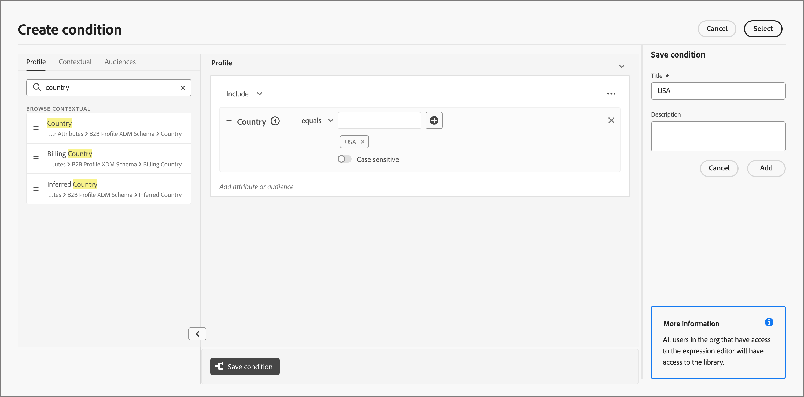

# 조건부 콘텐츠

조건부 콘텐츠를 사용하면 조건부 규칙에 따라 이메일 및 조각 콘텐츠를 조정할 수 있습니다. 이러한 규칙은 프로필 속성 또는 컨텍스트 이벤트를 사용하여 정의됩니다. 규칙 빌더에서 조건부 규칙을 만들어 개인 여정 간에 재사용할 수 있도록 저장할 수 있습니다.

조각 및 전자 메일 메시지에 조건부 콘텐츠를 추가하기 위해 [!DNL Journey Optimizer B2B Prime]에서는 _조건_ 라이브러리에 저장된 조건부 규칙을 적용할 수 있습니다. [이메일 콘텐츠](./email-authoring.md) 또는 [조각](./fragment-authoring.md)을(를) 작성할 때 시각적 디자인 공간 내에 조건부 규칙을 적용합니다.

## 조건부 콘텐츠 추가 {#add-conditional-content}

>[!CONTEXTUALHELP]
>id="ajo-b2b-prime_conditional_content"
>title="조건부 콘텐츠"
>abstract="조건부 규칙을 사용하여 여러 콘텐츠 구성 요소 변형을 만듭니다. 메시지를 전송할 때 다음 조건 중 어느 것도 충족되지 않으면 기본 변형의 콘텐츠가 표시됩니다."

>[!CONTEXTUALHELP]
>id="ajo-b2b-prime_conditional_rule_select"
>title="조건부 콘텐츠"
>abstract="라이브러리에 저장된 조건부 규칙을 사용하거나 새로 만듭니다."

시각적 디자인 공간에서 [조각](./fragment-authoring.md) 또는 [이메일](./email-authoring.md)을(를) 작성할 때 조건부 규칙을 사용하여 콘텐츠 구성 요소에 대해 여러 변형을 정의합니다.

1. 콘텐츠 구성 요소를 선택하고 구성 요소 도구 모음에서 **[!UICONTROL 조건부 콘텐츠 활성화]** 아이콘을 클릭합니다.

   [콘텐츠 구성 요소 도구 모음](./content-components.md#content-component-toolbars)을 참조하세요.

   구성 요소는 조건부 구성 요소로 활성화되었음을 나타내기 위해 주황색으로 표시됩니다. **[!UICONTROL 조건부 콘텐츠]** 창은 왼쪽에 _기본 변형_ 및 _변형 - 1_&#x200B;과 함께 표시됩니다.

   {width="700" zoomable="yes"}

   선택하고 활성화한 원래 콘텐츠는 기본값이며 정의하는 변형에 대해 충족되는 조건부 규칙이 없을 때 적용됩니다.

   이 창에서는 조건부 규칙을 사용하여 선택한 콘텐츠 구성 요소에 대해 여러 변형을 정의할 수 있습니다.

1. 첫 번째 변형(_변형 - 1_) 위로 마우스를 가져간 후 _조건 선택_ 아이콘()을 클릭합니다.

   {width="700" zoomable="yes"}

   _[!UICONTROL 조건 선택]_ 대화 상자가 열리고 조건 라이브러리가 표시됩니다.

   원하는 조건에 대한 세부 정보를 보려면 _추가 메뉴_ 아이콘(**...**)을 클릭하십시오. **[!UICONTROL 정보 보기]**&#x200B;를 선택하세요.

   {width="600" zoomable="yes"}

   필요한 조건이 없으면 **[!UICONTROL 새로 만들기]**&#x200B;를 클릭하여 [조건부 규칙을 만듭니다](#create-conditional-rule).

1. 조건부 규칙을 선택하고 **[!UICONTROL 선택]**&#x200B;을 클릭하여 변형과 연결합니다.

<!-- 

   You can review the associated condition by clicking the _More menu_ icon (**...**) for the variant and choosing **[!UICONTROL View condition]**.

   {width="600" zoomable="yes"}

   Click X at the top right to close the popup.

   {width="500"}

   -->

1. 가독성을 높이려면 _추가 메뉴_ 아이콘(**...**)을 클릭하여 변형 이름을 바꾸세요. 변형에 대해 **[!UICONTROL 이름 바꾸기]**&#x200B;를 선택합니다.

   변형 및 해당 의도를 식별하는 데 도움이 되는 변형의 의미 있는 이름을 입력합니다.

   {width="600" zoomable="yes"}

1. 왼쪽 창에서 변형을 선택한 상태에서 조건이 true일 때 메시지에 표시되는 방식을 변경하려면 구성 요소를 변경합니다.

   이 예에서 텍스트 구성 요소에 대한 변형은 수신자 지역에 따라 다른 설명을 사용합니다.

   {width="600" zoomable="yes"}

1. 필요한 경우 **[!UICONTROL 변형 추가]**&#x200B;를 클릭하여 다른 변형을 정의합니다.

   2~5단계를 반복하여 조건을 선택하고, 변형의 이름을 변경하고, 변형에 대한 구성 요소를 변경합니다.

   콘텐츠 구성 요소에 필요한 만큼 변형을 추가할 수 있습니다. 언제든지 왼쪽 창에서 선택한 변형을 변경하여 조건에 대한 콘텐츠 구성 요소가 표시되는 방식을 확인합니다.

   >[!IMPORTANT]
   >
   >조건부 콘텐츠는 변형이 나열된 순서로 연결된 규칙에 대해 평가됩니다. true로 평가되는 조건이 있는 첫 번째 변형이 구성 요소에 사용됩니다.
   >
   >메시지를 보낼 때 정의된 변형 조건 중 어느 것도 true로 평가되지 않으면 콘텐츠 구성 요소가 **[!UICONTROL 기본 변형]**&#x200B;에 따라 표시됩니다.

1. 변형을 삭제하려면 _추가 메뉴_ 아이콘(**...**)을 클릭하세요. 변형에 대해 **[!UICONTROL 삭제]**&#x200B;를 선택합니다.

   확인 대화 상자에서 **[!UICONTROL 삭제]**&#x200B;를 클릭합니다.

## 조건부 규칙 {#conditional-rules}

조건부 규칙은 true 또는 false로 평가할 수 있는 조건부 표현식 세트입니다. 프로필 속성이나 컨텍스트 이벤트와 같은 다양한 필터를 기반으로 메시지에 표시할 콘텐츠 변형을 결정하려면 이 규칙을 사용합니다.

규칙은 조건 라이브러리에 저장되며, 여기서 조직의 이메일 및 조각 콘텐츠를 재사용할 수 있습니다.

<!--
M1.5 info -- out of date?

### Condition filters {#condition-filters}

| Condition type | Filters | Description |
| -------------- | ------- | ----------- |
| **Account** | Account Attributes | Attributes from the account profile, including: <li>Annual revenue</li><li>City</li><li>Country</li><li>Employee size</li><li>Industry</li><li>Name</li><li>SIC code</li><li>State</li> |
| | [!UICONTROL Special filters] > [!UICONTROL Has Buying Group] | The account does or does not have members of buying groups. The filter can also be evaluated against one or more of the following criteria: <li>Solution Interest</li><li>Buying Group status</li><li>Completeness Score</li><li>Engagement Score</li> |
| **Person** | [!UICONTROL Activity history] > [!UICONTROL Email] | Email activities associated with the journey: <li>[!UICONTROL Clicked link in email]</li><li>Opened Email</li><li>Was delivered email</li><li>Was sent email</li> These conditions are evaluated using a selected email message from earlier in the journey. |
| | [!UICONTROL Person Attributes] | Attributes from the person profile, including: <li>City</li><li>Country</li><li>Date of birth</li><li>Email address</li><li>Email invalid</li><li>Email suspended</li><li>First name</li><li>Inferred state region</li><li>Job title</li><li>Last name</li><li>Mobile phone number</li><li>Phone number</li><li>Postal code</li><li>State</li><li>Unsubscribed</li><li>Unsubscribed reason</li> |
| | [!UICONTROL Special filters] > [!UICONTROL Member of Buying Group] | The person is or is not a buying group member evaluated against one or more of the following criteria: <li>Solution Interest</li><li>Buying Group status</li><li>Completeness Score</li><li>Engagement Score</li><li>Is Removed</li><li>Role</li> |
-->

### 조건부 규칙 만들기 {#create-conditional-rule}

>[!CONTEXTUALHELP]
>id="ajo-b2b-prime_conditions_rule_editor"
>title="조건 만들기"
>abstract="속성과 상황별 이벤트를 결합하여 이메일 메시지에 표시할 콘텐츠 변형을 결정하는 규칙을 작성합니다."

구성 요소 변형에 대한 조건을 선택할 때 디자인 공간에서 조건부 규칙 빌더에 액세스합니다.

1. _[!UICONTROL 조건 선택]_ 대화 상자에서 **[!UICONTROL 새로 만들기]**&#x200B;를 클릭합니다.

   {width="700" zoomable="yes"}

   이 작업은 _[!UICONTROL 조건 만들기]_ 대화 상자를 엽니다. 대화 상자 도구를 사용하여 속성을 캔버스로 결합합니다(Experience Platform의 세그먼트 빌드 경험과 유사). 필터 속성은 다음 세 개의 탭으로 구성됩니다.

   * **[!UICONTROL 프로필]** - B2B 프로필 XDM 스키마는 Adobe Experience Platform에 정의된 XDM(Experience Data Model) 스키마와 연결된 모든 프로필 속성을 나열합니다.

   * **[!UICONTROL 상황별]** - 메시지가 여정에 사용되는 경우 이 탭을 통해 상황별 여정 필드를 사용할 수 있습니다.

   * **[!UICONTROL 대상]** - Adobe Experience Platform 세분화 서비스에서 만든 세그먼트 정의에서 생성된 모든 대상을 나열합니다.

   {width="700" zoomable="yes"}

1. 필요에 따라 조건부 규칙을 만듭니다.

   규칙에 포함할 각 필터에 대해 항목을 규칙 캔버스로 드래그하여 놓습니다. 필터를 확장하고 표현식을 완료합니다.

   {width="700" zoomable="yes"}

   필요에 따라 추가 필터를 드래그 앤 드롭합니다.

   필터를 두 개 이상 포함하는 경우 필터를 적용하는 방법에 따라 필터 논리 설정을 전환할 수 있습니다.

   * **[!UICONTROL 및]** - 필터가 true인 경우 규칙이 true로 평가됩니다. **모두**.
   * **[!UICONTROL Or]** - 필터의 **any**&#x200B;이(가) true인 경우 규칙이 true로 평가됩니다.

   {width="700" zoomable="yes"}

1. 조건에 대한 사용자 지정 규칙을 사용하려면 **[!UICONTROL 선택]**&#x200B;을 클릭하세요.

   규칙을 재사용할 수 있도록 하려면 라이브러리에 규칙을 추가할 수 있습니다.

### 라이브러리에 조건 추가 {#add-to-library}

1. 조건 만들기 대화 상자에서 하단의 **[!UICONTROL 조건 저장]**&#x200B;을 클릭합니다.

1. 오른쪽에서 **[!UICONTROL 이름]**(필수)과 **[!UICONTROL 설명]**(선택 사항)을 규칙에 입력하십시오.

   조직의 다른 사용자가 중복 조건을 만드는 대신 이름을 재사용할 수 있도록 하려면 의미 있는 이름과 유용한 설명을 사용하십시오.

   {width="700" zoomable="yes"}

1. **[!UICONTROL 추가를 클릭합니다]**.

   조건부 규칙은 라이브러리에 저장되며 현재 변형에 대해 선택할 수 있습니다. 또한 라이브러리에 포함되어 개인 여정 간의 다른 다이내믹 콘텐츠 변형에서 사용됩니다.

>[!NOTE]
>
>라이브러리에 저장된 조건부 규칙은 수정할 수 없습니다. 그러나 저장된 규칙을 사용하여 새 규칙을 만들 수 있습니다. 이렇게 하려면 조건부 규칙을 열고 원하는 대로 변경한 다음 새 이름으로 라이브러리에 저장합니다.

<!--

### Duplicate a rule {#duplicate-rule}

Conditional rules saved to the library cannot be modified. However, you can duplicate an existing rule and change it to create a new rule.

1. Click the _More menu_ icon (**...**) for the variant and choose **[!UICONTROL Duplicate]**.

   A duplicate of the rule opens in the rule builder. Use the duplicate as a starting point for the rule that you want to build.

   {width="600" zoomable="yes"}

1. In the rule builder, change, add, or delete conditions according to what you need.

1. Change the name and description to match the purpose or items in the rule.

1. When your conditional rule is complete, click **[!UICONTROL Save]**.
-->
