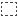
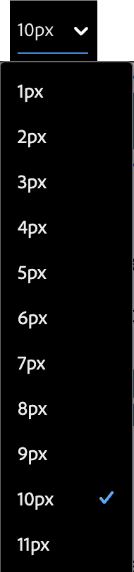
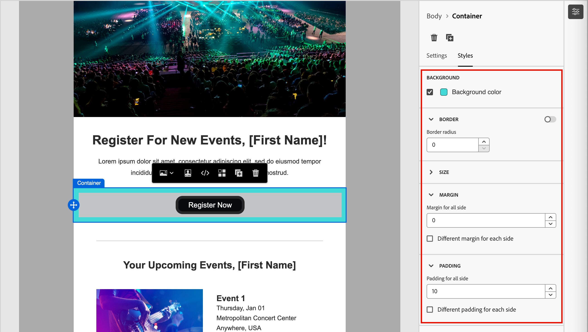
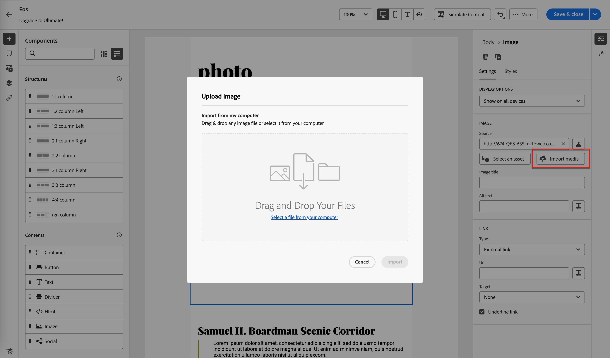
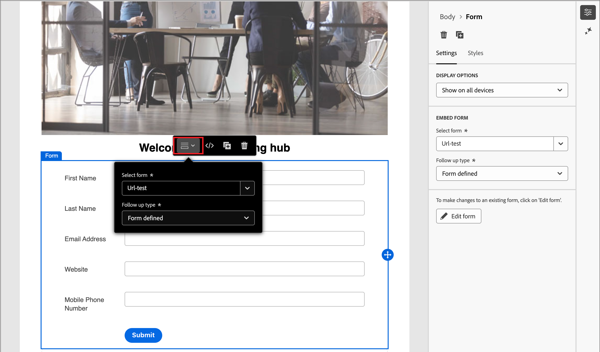

# 콘텐츠 구성 요소 {#content-components}

>[!CONTEXTUALHELP]
>id="ajo-b2b-prime_content_components_email"
>title="콘텐츠 구성 요소 정보"
>abstract="콘텐츠 구성 요소는 이메일을 디자인하는 데 사용할 수 있는 빈 콘텐츠 플레이스홀더입니다."

>[!CONTEXTUALHELP]
>id="ajo-b2b-prime_content_components_landing_page"
>title="콘텐츠 구성 요소 정보"
>abstract="콘텐츠 구성 요소는 랜딩 페이지를 디자인하는 데 사용할 수 있는 빈 콘텐츠 플레이스홀더입니다."

>[!CONTEXTUALHELP]
>id="ajo-b2b-prime_content_components_fragment"
>title="콘텐츠 구성 요소 정보"
>abstract="콘텐츠 구성 요소는 조각을 디자인하는 데 사용할 수 있는 빈 콘텐츠 플레이스홀더입니다."

>[!CONTEXTUALHELP]
>id="ajo-b2b-prime_content_components_template"
>title="콘텐츠 구성 요소 정보"
>abstract="콘텐츠 구성 요소는 템플릿을 디자인하는 데 사용할 수 있는 빈 콘텐츠 플레이스홀더입니다."

전자 메일, 랜딩 페이지, 템플릿 및 시각적 조각에 대한 콘텐츠를 디자인할 때 [!UICONTROL 콘텐츠 구성 요소]를 사용하여 시각적 디자인 요소를 추가합니다.

<!-- You can add as many content components as you need inside one or more [structure components](./structure-components.md), which define the layout. -->

## 컨텐츠 라이브러리

구성 요소 라이브러리의 **[!UICONTROL 콘텐츠]** 섹션에는 사용 가능한 콘텐츠 구성 요소가 표시됩니다.

| 아이콘 | 구성 요소 | 설명 |
| --------- | ---- | ----------- |
|  | [컨테이너](#container) | 구성 요소를 그룹화하거나 영역에 배경이나 테두리 스타일을 적용하는 데 사용할 수 있는 사각형 컨테이너를 포함하도록 이 구성 요소를 디자인에 추가합니다. |
|  | [단추](#button) | 클릭 가능한 단추 요소를 포함하도록 이 구성 요소를 디자인에 추가합니다. |
|  | [텍스트](#text) | 텍스트 본문을 포함하도록 이 구성 요소를 디자인에 추가합니다. |
|  | [분할기](#divider) | 디자인에 이 구성 요소를 추가하여 콘텐츠의 영역을 구분하는 가로선을 포함하십시오. |
|  | [HTML](#html) | 이 구성 요소를 디자인에 추가하여 기존 HTML의 여러 부분을 복사하여 붙여넣습니다. 이 구성 요소를 사용하여 모듈화된 무료 HTML 블록을 만들어 일부 외부 콘텐츠를 재사용할 수 있습니다. |
|  | [이미지](#image) | 디자인에 이 구성 요소를 추가하여 이미지 파일을 삽입합니다. |
|  | [Social](#social) | 이 구성 요소를 디자인에 추가하여 소셜 미디어 페이지에 대한 링크를 삽입합니다. |
|  | [양식](#form) | **_랜딩 페이지에만 사용할 수 있습니다._** 디자인에 이 구성 요소를 추가하여 작성된 양식을 삽입합니다. |

## 콘텐츠 구성 요소 도구 모음

캔버스에서 도구 모음을 선택하면 각 콘텐츠 구성 요소 유형에 도구 모음이 표시됩니다. 구성 요소 유형에 따라 달라지는 사용 가능한 도구를 사용하면 렌더링된 콘텐츠에서 바로 구성 요소를 사용하여 손쉽게 작업할 수 있습니다. 도구 모음에는 구성 요소 유형에 적용할 수 있는 서식 및 기능 기능이 포함되어 있습니다.

{width="450"}

### 서식 도구

+++텍스트 스타일 변경

<table>
    <tr>
        <th style="width: 30%;">도구</th>
        <th style="width: 50%;">사용</th>
        <th style="width: 20%;">구성 요소</th>
    </tr>
    <tr>
        <td></td>
        <td>선택한 텍스트 문자열에 굵게, 기울임꼴, 밑줄 또는 취소선, 위 첨자 또는 아래 첨자를 적용합니다.</td>
        <td><li>버튼 <li>텍스트</td>
    </tr>
</table>

+++

+++수평 정렬

<table>
    <tr>
        <th style="width: 30%;">도구</th>
        <th style="width: 50%;">사용</th>
        <th style="width: 20%;">구성 요소</th>
    </tr>
    <tr>
        <td></td>
        <td>구성 요소 콘텐츠에 수평 정렬 유형을 적용합니다. 왼쪽, 가운데, 오른쪽 또는 양쪽 맞춤을 선택합니다. </td>
        <td><li>버튼 <li>텍스트</td>
    </tr>
</table>

+++

+++목록 만들기

<table>
    <tr>
        <th style="width: 30%;">도구</th>
        <th style="width: 50%;">사용</th>
        <th style="width: 20%;">구성 요소</th>
    </tr>
    <tr>
        <td></td>
        <td>순차 또는 비순차 목록 서식을 구성 요소 텍스트에 적용합니다.</td>
        <td><li>텍스트</td>
    </tr>
</table>

+++

+++제목 설정

<table>
    <tr>
        <th style="width: 20%;">도구</th>
        <th style="width: 60%;">사용</th>
        <th style="width: 20%;">구성 요소</th>
    </tr>
    <tr>
        <td></td>
        <td>커서 위치에 대한 단락에 머리글 수준 서식을 적용합니다.</td>
        <td><li>버튼 <li>텍스트</td>
    </tr>
</table>

+++

+++글꼴 크기

<table>
    <tr>
        <th style="width: 20%;">도구</th>
        <th style="width: 60%;">사용</th>
        <th style="width: 20%;">구성 요소</th>
    </tr>
    <tr>
        <td></td>
        <td>선택한 텍스트에 글꼴 크기를 적용합니다. 도구를 클릭하고 크기를 선택하거나 px 값을 입력합니다.</td>
        <td><li>버튼 <li>텍스트</td>
    </tr>
</table>

+++

+++글꼴 색상

<table>
    <tr>
        <th style="width: 40%;">도구</th>
        <th style="width: 40%;">사용</th>
        <th style="width: 20%;">구성 요소</th>
    </tr>
    <tr>
        <td></td>
        <td>선택한 텍스트에 글꼴 색상을 적용합니다. 선택기에서 색상을 선택하고 색상 슬라이더와 색상 필드를 사용하여 색상을 선택합니다. 또는 알려진 RGB, HSL, HSB 또는 16진수 값을 입력할 수 있습니다. </td>
        <td><li>버튼 <li>텍스트</td>
    </tr>
</table>

+++

+++링크 삽입

<table>
    <tr>
        <th style="width: 40%;">도구</th>
        <th style="width: 40%;">사용</th>
        <th style="width: 20%;">구성 요소</th>
    </tr>
    <tr>
        <td></td>
        <td>선택한 텍스트 또는 요소에 대해 클릭 가능한 링크를 만듭니다. <li>이메일 콘텐츠 - 외부 URL 또는 랜딩 페이지를 지정합니다.<li>랜딩 페이지 콘텐츠 - 외부 링크를 지정합니다.</td>
        <td><li>버튼 <li>텍스트 <li>이미지 </td>
    </tr>
</table>

+++

+++링크 제거

<table>
    <tr>
        <th style="width: 15%;">도구</th>
        <th style="width: 60%;">사용</th>
        <th style="width: 25%;">구성 요소</th>
    </tr>
    <tr>
        <td></td>
        <td> 선택한 텍스트 또는 요소에 대해 클릭 가능한 링크를 제거합니다.</td>
        <td><li>버튼 <li>텍스트 <li>이미지 </td>
    </tr>
</table>

+++

### 기능 도구

| 도구 | 이름 | 사용 |
| ---- | ---- | ----- |
| {width="40"} | 개인화 추가 | 개인화 편집기를 사용하여 구성 요소 콘텐츠에 개인화 토큰을 삽입합니다. [자세히 알아보기](./email-authoring.md#personalize-content) |
| {width="40"} | 소스 코드 표시 | 읽기 전용 팝업에 구성 요소의 HTML 소스 코드를 표시합니다.  {width="200"} |
| {width="40"} | 조건부 콘텐츠 활성화 | (이메일 및 조각) 구성 요소에 대해 조건부 변형을 활성화합니다. |
| {width="40"} | 복제 | 구성 요소의 복사본을 만들고 바로 아래에 추가합니다. |
| {width="40"} | 삭제 | 구성 요소를 제거합니다. |

## 디자인에 콘텐츠 구성 요소 추가

1. 시각적 디자인 공간에서 기존 템플릿을 사용하거나 필요한 구조 구성 요소를 빈 캔버스에 추가하여 레이아웃을 정의합니다.

1. **[!UICONTROL 구성 요소]** 라이브러리에서 선택한 콘텐츠 구성 요소의 _드래그 핸들_ 을 선택한 다음 구조 구성 요소로 끌어다 놓습니다.

   단일 구조 구성 요소와 구조 구성 요소의 각 열에 여러 구성 요소를 추가할 수 있습니다.

   {width="600" zoomable="yes"}

1. 오른쪽의 **[!UICONTROL 설정]** 및 **[!UICONTROL 스타일]** 탭이나 캔버스에 표시된 컨텍스트 도구 모음을 사용하여 구성 요소 표시를 조정합니다.

   예를 들어 구성 요소의 텍스트 스타일, 패딩 또는 여백을 변경할 수 있습니다.

   {width="600" zoomable="yes"}

디자인으로 작업하는 동안 [기능 도구](#functional-tools) 섹션에서 **삭제** 및 **복제** 도구를 사용하여 구성 요소를 제거하거나 복제할 수도 있습니다.

## 콘텐츠 구성 요소 설정 및 스타일

구성 요소를 추가하면 시각적 디자인 공간에서 해당 구성 요소가 선택되고 오른쪽 패널에 해당 속성이 표시됩니다. 언제든지 구성 요소를 선택하여 설정 및 스타일을 변경할 수도 있습니다. 대부분의 설정 및 스타일은 구성 요소에 따라 다르지만, 선택한 콘텐츠 구성 요소에 적용할 수 있는 몇 가지 표준 설정 및 스타일이 있습니다.

### 표시 옵션

데스크톱 또는 모바일 장치 표시에서 구성 요소를 제외하려면 **[!UICONTROL 표시 옵션]** 설정을 변경합니다. 기본값인 _[!UICONTROL 모든 장치에서 표시]_&#x200B;를 사용하면 모든 장치에서 표시할 수 있습니다. 장치 유형별로 구성 요소를 배타적으로 설정하려면 다른 설정을 선택하십시오.

* _[!UICONTROL 데스크톱 장치에서만 표시]_ - 데스크톱 장치에서는 구성 요소를 표시하고 모바일 장치에서는 제외하려면 이 설정을 선택합니다.
* _[!UICONTROL 모바일 장치에서만 표시]_ - 휴대폰, 태블릿과 같은 모바일 장치에서 구성 요소를 표시하고 데스크톱 장치에서는 제외하려면 이 설정을 선택합니다.

{width="400" zoomable="yes"}

### 컨테이너 {#container}

컨테이너를 사용하여 콘텐츠 구성 요소 그룹에 특정 스타일을 적용합니다. [!UICONTROL Container] 구성 요소를 추가한 다음 그 안에 다른 콘텐츠 구성 요소를 추가하십시오. 이 구성 요소는 HTML에서 `div` 요소를 사용하는 방법과 유사합니다. 컨테이너에 포함된 콘텐츠 구성 요소에 적용된 스타일과 다른 고유한 스타일을 컨테이너에 적용할 수 있습니다.

예를 들어 _[!UICONTROL 컨테이너]_ 구성 요소를 추가한 다음 해당 컨테이너 내부에 _[!UICONTROL 버튼]_ 구성 요소를 추가하면 컨테이너에 대해 특정 영역 스타일을 사용하고 필요에 따라 버튼과 해당 배경에 스타일을 지정할 수 있습니다.

{width="600" zoomable="yes"}

+++배경

{{styles-background}}

+++

+++테두리

{{styles-border}}

+++

+++크기

{{styles-size}}

+++

+++여백

{{styles-margin}}

+++

+++패딩

{{styles-padding}}

+++

### 버튼 {#button}

[!UICONTROL Button] 구성 요소를 사용하여 클릭 가능한 단추를 하나 이상 콘텐츠에 삽입합니다. 단추를 사용하여 페이지 뷰어 또는 이메일 수신자를 지원 콘텐츠(게시된 랜딩 페이지 또는 외부 링크)로 리디렉션합니다.

#### 단추 텍스트 추가

버튼 구성 요소가 캔버스에 표시되면 도구 모음에는 텍스트 서식 지정과 개인화 및 조건부 변형에 대한 옵션이 포함됩니다. 편집기 도구 모음 옵션에 대한 자세한 내용은 [콘텐츠 구성 요소 도구 모음](#content-component-toolbars)을 참조하십시오.

단추 레이블 텍스트를 입력하고 서식을 설정하면 콘텐츠에 맞게 단추 크기가 조정됩니다.

{width="500" zoomable="yes"}

#### 링크 옵션 설정 {#button-set-link-options}

_[!UICONTROL 설정]_ 탭에서 **[!UICONTROL 링크]** 옵션을 사용하여 대상 페이지를 로드하기 위한 단추 텍스트, 링크 대상 및 브라우저 동작을 정의합니다.

1. 링크의 **[!UICONTROL Type]** 설정:

   * **[!UICONTROL 외부 링크]** - 표준 URL을 링크 대상으로 사용하려면 이 형식을 선택하십시오.

     **[!UICONTROL Url]**&#x200B;에서 링크 대상의 URL을 입력하십시오. _개인화_(  ) 아이콘을 클릭하여 개인화 토큰을 URL의 매개 변수로 사용합니다.

     {width="200"}

   * **랜딩 페이지** - <!-- Journey Optimizer B2B Edition (_Beta_) or -->연결된 Marketo Engage 인스턴스에서 게시된 랜딩 페이지를 선택하려면 이 유형을 선택하십시오.

     **[!UICONTROL 랜딩 페이지]** 옵션의 경우 게시된 랜딩 페이지를 선택하십시오. _페이지 선택_ 아이콘()을 클릭하고 [게시된 랜딩 페이지를 선택](./landing-pages.md#link-to-landing-page)합니다.

     {width="200"}

1. **[!UICONTROL Label]**&#x200B;의 경우 단추 안에 표시할 텍스트를 입력하십시오.

   단추 크기는 사용자가 설정한 텍스트와 스타일에 따라 조정됩니다.

1. **[!UICONTROL Target]**&#x200B;의 경우 연결된 대상을 전자 메일 또는 페이지에서 리디렉션하는 방법을 선택하십시오.

   * _[!UICONTROL 없음]_ - 기본 브라우저나 클라이언트 동작(기본값)을 사용하여 링크를 엽니다.
   * _[!UICONTROL Blank]_ - 새 창 또는 탭에서 링크를 엽니다.
   * _[!UICONTROL 자체]_ - 같은 프레임에서 링크를 엽니다.
   * _[!UICONTROL 상위]_ - 상위 프레임에서 링크를 엽니다.
   * _[!UICONTROL 위쪽]_ - 창의 전체 본문에서 링크를 엽니다.

#### 스타일 설정

**[!UICONTROL 스타일]** 탭에서 단추 스타일을 사용자 지정합니다.

+++배경

{{styles-background}}

+++

+++텍스트

{{styles-text}}

+++

+++테두리

{{styles-border}}

+++

+++크기

{{styles-size}}

+++

+++정렬

{{styles-alignment-h-v}}

+++

+++단추 여백

{{styles-margin}}

+++

+++컨테이너 여백

{{styles-margin}}

+++

+++패딩

{{styles-padding}}

+++

+++고급

{{styles-advanced}}

+++

### 텍스트 {#text}

텍스트 구성 요소를 사용하여 콘텐츠에 텍스트 블록을 삽입합니다. 캔버스에서 텍스트 구성 요소를 선택한 경우 텍스트를 입력하고 도구 모음 옵션을 사용하여 인라인 서식과 개인화 토큰 및 조건부 변형을 포함한 옵션을 추가합니다.

**[!UICONTROL 스타일]** 탭에서 텍스트 구성 요소 스타일을 사용자 지정합니다.

+++배경

{{styles-background}}

+++

+++텍스트

이 스타일은 전체 텍스트 블록에 적용됩니다. 선택한 텍스트 문자열에 인라인 스타일을 적용할 수 있습니다.

{{styles-text}}

+++

+++테두리

{{styles-border}}

+++

+++크기

{{styles-size}}

+++

+++여백

{{styles-margin}}

+++

+++패딩

{{styles-padding}}

+++

+++고급

{{styles-advanced}}

+++

### 구분선 {#divider}

콘텐츠의 섹션 사이에 선형 분할을 통합하려면 _분할기_ 구성 요소를 추가하십시오.

+++배경

{{styles-background}}

+++

+++선

_[!UICONTROL 스타일]_ 탭을 선택한 오른쪽 패널에서 **[!UICONTROL 선]** 섹션을 확장하고 구성 요소 높이 및 너비에 대한 옵션을 설정합니다.

* **[!UICONTROL 색상]** - 선택기에서 색상을 선택하려면 색상 사각형을 클릭합니다. 알려진 RGB, HSL, HSB 또는 16진수 값을 입력하여 색상을 선택할 수 있습니다. 또는 색상 슬라이더와 색상 필드를 사용하여 색상을 선택할 수 있습니다.

* **[!UICONTROL 높이]** - 위쪽 및 아래쪽 화살표 아이콘을 클릭하여 픽셀 수를 늘리거나 줄입니다. 빈 값(자동)은 기본값이며 내용에 따라 요소의 높이 크기를 조정합니다.

* **[!UICONTROL 너비]** - 픽셀이나 백분율로 너비를 설정하려면 토글을 사용합니다.

   * 백분율 너비의 경우 슬라이더를 사용하여 백분율 값을 설정합니다. 백분율은 포함 블록의 콘텐츠 상자를 기반으로 요소 크기를 결정합니다. 이 콘텐츠 상자에서는 패딩과 테두리가 제외됩니다. 예를 들어 값 50은 요소 너비를 포함된 블록 콘텐츠 너비의 50%로 설정합니다.

  {width="250"}

   * 픽셀 기반 너비의 경우 위쪽 및 아래쪽 화살표 아이콘을 클릭하여 픽셀 수를 늘리거나 줄입니다. 비어 있는 값(자동)은 기본값이며 내용에 따라 요소의 너비를 조정합니다.

* **[!UICONTROL 스타일]** - 표준 CSS `line-style` 값 목록에서 값을 선택합니다(예: _Solid_, _Dotted_, _Dashed_).

+++

+++크기

{{styles-size}}

+++

+++정렬

{{styles-alignment-h}}

+++

+++여백

{{styles-margin}}

+++

+++패딩

{{styles-padding}}

+++

+++고급

{{styles-advanced}}

+++

### HTML {#html}

HTML 구성 요소를 사용하여 기존 HTML의 일부를 추가합니다. 이 구성 요소는 외부 콘텐츠를 재사용하는 모듈식 HTML 요소를 쉽게 만들 수 있는 방법을 제공합니다.

1. 캔버스에서 구성 요소를 선택하고 도구 모음에서 _소스 코드 표시_ 아이콘을 클릭합니다.

   {width="450"}

1. 텍스트 상자에 HTML을 붙여 넣고 **[!UICONTROL 저장]**&#x200B;을 클릭합니다.

   {width="600" zoomable="yes"}

   HTML이 유효하면 캔버스에서 요소를 렌더링합니다. 다른 콘텐츠 구성 요소 중 하나에 매핑되는 요소인 경우 구성 요소 유형에 따라 오른쪽 패널에서 설정 및 스타일을 변경할 수 있습니다. 그렇지 않으면 HTML 구성 요소로 유지됩니다.

HTML 구성 요소의 경우 오른쪽 패널에서 전체 HTML 구성 요소에 대해 다음 스타일을 설정할 수 있습니다.

+++배경

{{styles-background}}

+++

+++테두리

{{styles-border}}

+++

+++크기

{{styles-size}}

+++

+++정렬

{{styles-alignment-h-v}}

+++

+++여백

{{styles-margin}}

+++

+++패딩

{{styles-padding}}

+++

+++고급

{{styles-advanced}}

+++

### 이미지 {#image}

[!UICONTROL 이미지] 구성 요소를 사용하여 콘텐츠에 이미지 자산을 삽입합니다. 캔버스에서 _이미지_ 구성 요소를 선택하면 표시된 이미지 에셋 파일을 추가하거나 변경할 수 있습니다.

{width="400" zoomable="yes"}

#### 이미지 자산 추가 {#add-image-asset}

이미지 자산을 추가할 방법 선택:

* **[!UICONTROL 에셋 선택]** - [!DNL Journey Optimizer B2B Prime] Assets 라이브러리에서 이미지 에셋을 찾아보고 선택하려면 이 유형을 선택하십시오.

  {width="700" zoomable="yes"}

  대화 상자에서 선택한 저장소에서 이미지를 선택할 수 있습니다. 자산을 추가하려면 **[!UICONTROL 선택]**&#x200B;을 클릭합니다.

  필요한 에셋을 찾는 데 도움이 되는 도구가 있습니다.

   * 조건에 따라 표시된 항목을 필터링하려면 왼쪽 상단의 _필터_ 아이콘을 클릭하십시오.

   * 표시된 항목을 자산 이름과 일치하도록 필터링하려면 _검색_ 필드에 텍스트를 입력하십시오.

* **[!UICONTROL 미디어 가져오기]** - 시스템에서 파일을 선택하고 [!DNL Journey Optimizer B2B Prime] 자산 라이브러리로 가져오려면 이 유형을 선택하십시오.

  _[!UICONTROL 이미지 업로드]_ 대화 상자에서 시스템의 파일을 파일 상자로 끌어서 놓습니다. 최대 파일 크기는 100MB입니다.

  {width="450"}

  선택한 이미지의 파일 이름이 대화 상자에 표시됩니다. 에셋 파일 이름은 폴더 간에 고유해야 하며 이름의 파일이 이미 있는 경우 메시지가 표시됩니다. 이름에는 최대 100자를 사용할 수 있으며 특수 문자(예: `;`, `:`, `\` 및 `|`)를 사용할 수 없습니다.

  **[!UICONTROL 가져오기]**&#x200B;를 클릭합니다.

오른쪽 패널에서 이미지 제목과 이미지에 대한 대체 텍스트를 추가할 수 있습니다.

{width="250"}

#### 링크 옵션 설정 {#image-set-link-options}

_[!UICONTROL 설정]_ 탭에서 **[!UICONTROL 링크]** 옵션을 사용하여 대상 페이지와 대상 페이지를 로드하기 위한 브라우저 동작과 이미지를 연결합니다.

1. 링크의 **[!UICONTROL Type]** 설정:

   * **[!UICONTROL 외부 링크]** - 표준 URL을 링크 대상으로 사용하려면 이 형식을 선택하십시오.

     **[!UICONTROL Url]**&#x200B;에서 링크 대상의 URL을 입력하십시오. _개인화_(  ) 아이콘을 클릭하여 개인화 토큰을 URL의 매개 변수로 사용합니다.

     {width="250"}

   * **랜딩 페이지** - <!-- Journey Optimizer B2B Edition (_Beta_) or -->연결된 Marketo Engage 인스턴스에서 게시된 랜딩 페이지를 선택하려면 이 유형을 선택하십시오.

     **[!UICONTROL 랜딩 페이지]** 옵션의 경우 게시된 랜딩 페이지를 선택하십시오. _페이지 선택_ 아이콘()을 클릭하고 [게시된 랜딩 페이지를 선택](./landing-pages.md#link-to-landing-page)합니다.

     {width="250"}

1. **[!UICONTROL Label]**&#x200B;의 경우 이미지 링크에 대한 설명 텍스트를 선택적으로 입력하십시오.

1. **[!UICONTROL Target]**&#x200B;의 경우 연결된 대상을 전자 메일 또는 페이지에서 리디렉션하는 방법을 선택하십시오.

   * _[!UICONTROL 없음]_ - 기본 브라우저나 클라이언트 동작(기본값)을 사용하여 링크를 엽니다.
   * _[!UICONTROL Blank]_ - 새 창 또는 탭에서 링크를 엽니다.
   * _[!UICONTROL 자체]_ - 같은 프레임에서 링크를 엽니다.
   * _[!UICONTROL 상위]_ - 상위 프레임에서 링크를 엽니다.
   * _[!UICONTROL 위쪽]_ - 창의 전체 본문에서 링크를 엽니다.

#### 스타일 설정

오른쪽 패널에서 이미지 구성 요소의 스타일을 설정합니다.

+++배경

{{styles-background}}

+++

+++테두리

{{styles-border}}

+++

+++크기

{{styles-size}}

+++

+++정렬

{{styles-alignment-h}}

+++

+++여백

{{styles-margin}}

+++

+++패딩

{{styles-padding}}

+++

+++고급

{{styles-advanced}}

+++

### 소셜 {#social}

_소셜_ 구성 요소를 사용하여 소셜 미디어 페이지에 대한 링크를 콘텐츠에 삽입합니다. 여기에는 세 가지 기본 소셜 미디어 유형이 포함되어 있지만 필요에 따라 유형을 추가하거나 제거할 수 있습니다.

{width="600" zoomable="yes"}

* 소셜 미디어 유형을 추가하려면 _추가_( **+**) 아이콘을 클릭하고 추가할 소셜 미디어 유형을 선택하십시오.

  {width="250"}

* 소셜 미디어 유형을 제거하려면 소셜 미디어 아이콘 옆에 있는 **X**&#x200B;을(를) 클릭합니다.

각 소셜 미디어 유형에 대해 카드를 확장하여 옵션을 설정합니다.

* **[!UICONTROL URL]** - 소셜 미디어 그래픽 또는 아이콘에 연결할 소셜 미디어 URL을 입력합니다.
* **[!UICONTROL Source]** - 기본값 대신 자신의 이미지를 사용하려면 이미지 자산을 선택하십시오. Assets 라이브러리에서 이미지를 선택하거나, 시스템에서 이미지 파일을 가져올 수 있습니다. 이미지 에셋 선택 및 가져오기에 대한 자세한 내용은 [이미지 구성 요소 정보](#add-the-image-asset)를 참조하세요.
* **[!UICONTROL 대체 텍스트]** - 표시된 이미지에 대한 대체 텍스트를 입력합니다.

확장된 소셜 미디어 유형에 대한 {width="250"}

모든 소셜 미디어 그래픽에 대해 일관된 표시 크기를 정의하려면 **[!UICONTROL 이미지 크기]**&#x200B;를 설정하십시오.

_Social_ 구성 요소에 대해 다음 스타일 옵션을 설정할 수 있습니다.

+++배경

{{styles-background}}

+++

+++테두리

{{styles-border}}

+++

+++크기

{{styles-size}}

+++

+++정렬

{{styles-alignment-h}}

+++

+++여백

{{styles-margin}}

+++

+++패딩

{{styles-padding}}

+++

+++고급

{{styles-advanced}}

+++

### 양식(랜딩 페이지만) {#form}

_Form_ 구성 요소를 사용하여 게시된 양식을 랜딩 페이지 또는 랜딩 페이지 템플릿에 추가하십시오. 양식을 만들고 게시하는 방법에 대한 자세한 내용은 [Forms](./forms.md)을 참조하세요.

1. 구성 요소 도구 모음에서 _양식_ 도구를 클릭하거나 오른쪽의 **[!UICONTROL 양식 포함]** 속성을 사용하여 게시된 양식을 선택합니다.

   {width="600"}

1. 양식에 대한 기본 **[!UICONTROL 후속 작업 형식]**&#x200B;을(를) 재정의하려면 페이지나 템플릿의 요구 사항에 따라 설정을 변경합니다.

   이 페이지는 양식에 대한 _감사 페이지_&#x200B;라고도 하며 이 설정은 방문자가 양식을 제출할 때 수행되는 작업을 결정합니다.

   * **[!UICONTROL 페이지에서 유지]** - 양식을 제출할 때 방문자를 동일한 페이지에 유지하려면 이 옵션을 선택하십시오.

   * **[!UICONTROL 랜딩 페이지]** - 후속 작업으로 [!DNL Journey Optimizer B2B Prime] 또는 Marketo Engage 랜딩 페이지를 선택하려면 이 옵션을 선택하십시오.

   * **[!UICONTROL 외부 URL]** - URL을 후속 페이지로 지정하려면 이 옵션을 선택하십시오. 방문자가 양식을 제출하면 브라우저가 지정된 URL을 로드합니다.

     >[!TIP]
     >
     >파일을 다운로드하는 데 양식을 사용하려는 경우 호스팅된 파일의 URL을 지정할 수 있습니다. 이 구성에서 제출 버튼은 다운로드 버튼으로 작동합니다.

     {width="280"}

필요한 경우 오른쪽 패널의 **[!UICONTROL 스타일]** 탭을 선택하여 구조 구성 요소 내에서 양식 여백을 설정합니다.

{{styles-margin}}
