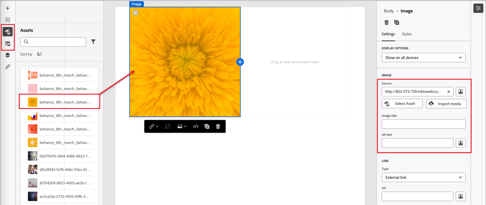

# 이메일 콘텐츠 작성

[!DNL Adobe Journey Optimizer B2B Prime]에서 이메일 디자인 공간은 마케터가 이메일을 작성하는 시각적 캔버스를 제공합니다. 왼쪽 및 상단 패널(구조, 콘텐츠 구성 요소, 템플릿, 조각 등)의 이메일 디자인 도구는 드래그 앤 드롭으로 처음부터 빌드를 지원합니다. 템플릿에서 시작하거나, 원시 HTML을 붙여넣거나, 재사용 가능한 시각적 조각에서 메시지를 조합하도록 선택할 수도 있습니다.

>[!IMPORTANT]
>
>하위 도메인, 인증, IP 풀 및 전자 메일 채널 구성에 대한 관리자 설정은 [전자 메일 게재 기능](../start/email-deliverability.md) 및 [전자 메일 채널 구성](../admin/email-channel-configuration.md)을 참조하십시오.

[!DNL Journey Optimizer B2B Prime]에서 모든 전자 메일은 개인 여정 내의 _[!UICONTROL 전자 메일 보내기]_ 작업과 연결됩니다. 여정 디자인부터 이메일 정의까지 전체 워크플로는 하나의 지속적인 경험에서 발생합니다. [개인 여정에 _전자 메일 보내기_ 노드를 추가](../marketing/action-nodes.md#add-an-action-node)하면 **[!UICONTROL 전자 메일 만들기]**&#x200B;를 클릭하여 프로세스를 시작하십시오. 먼저 이메일에 대한 작업 및 콘텐츠 설정을 정의합니다. **[!UICONTROL 전자 메일 본문 편집]**&#x200B;을 클릭하여 전자 메일 콘텐츠 디자인 공간을 시작합니다. 다음 옵션 중에서 전자 메일을 디자인할 방법을 선택할 수 있습니다.

* 시각적 디자인 인터페이스를 사용하여 [이메일을 처음부터 디자인하기](#design-from-scratch). 빈 캔버스에서 드래그 앤 드롭을 사용하여 구성 요소별로 이메일 레이아웃 구성 요소를 빌드합니다. 이 방법은 새 템플릿 또는 일회성 이메일을 만드는 데 가장 적합합니다.

* [기존 HTML 콘텐츠를 코드 편집기로 가져오거나](#import-html-content)시각적 캔버스와 함께 작업합니다.

* 기본 제공 또는 사용자 지정 전자 메일 서식 파일 목록에서 [기존 서식 파일을 선택하십시오](#templates). 이 방법은 반복 가능한 이메일 사용 사례에 가장 적합합니다.

<!-- * Upload a design prototype (JPG, PNG, PDF, or Figma export) and have AI Assistant convert it into a responsive HTML email. (Image to HTML (Img2HTML) -->

{width="800" zoomable="yes"}

## 이메일 디자인 도구 {#email-design-tools}

* **상단 도구 모음:** 저장, 뒤로, 코드 편집기로 전환, 미리 보기 컨트롤.
* **왼쪽 패널:** 구조(열 레이아웃), 콘텐츠(텍스트, 단추, 이미지, 분할자, 소셜, HTML), 조각, 템플릿, 탐색 트리(전자 메일의 DOM 스타일 계층 구조).
* **센터 캔버스:** 데스크톱 및 모바일 미리 보기가 있는 WYSIWYG 편집기.
* **오른쪽 패널:** 콘텐츠 속성, 배경, 테두리, 패딩 및 개인 맞춤화를 포함하여 현재 선택한 구성 요소에 대한 설정 및 스타일입니다.

>[!BEGINSHADEBOX]

## 이메일 디자인 모범 사례 {#design-best-practices}

HTML 및 CSS 모범 사례를 따르는 것은 이메일 클라이언트 간에 일관된 렌더링을 보장하는 데 도움이 됩니다.

| 접근 방식 | 지침 |
| -------- | -------- |
| **권장** | 정적, 표 기반 레이아웃 · HTML 표 및 중첩된 표 · 600~800px의 템플릿 너비 · 간단한 인라인 CSS · 웹에 적합한 글꼴 |
| **주의하여 사용** | 배경 이미지(제한된 클라이언트 지원) · 사용자 정의 웹 글꼴(항상 대체 글꼴을 정의) · 800픽셀 이상 넓은 레이아웃 · 이미지 맵 |
| **방지** | JavaScript, iframe 또는 Flash · 포함된 오디오 또는 비디오 · HTML forms · Div 기반 레이아웃 |

>[!NOTE]
>
>이메일 콘텐츠는 해당 디지털 접근성 요구 사항도 충족해야 합니다. 머리글을 논리적으로 구성하고, 모든 이미지에 대체 텍스트를 제공하고, 밝은 모드와 어두운 모드 모두에서 색상 대비를 확인합니다.

>[!ENDSHADEBOX]

## 이메일 콘텐츠 처음부터 만들기 {#design-from-scratch}

시각적 콘텐츠 디자인 공간을 사용하여 이메일의 구조와 콘텐츠를 정의합니다. 간단한 드래그 앤 드롭 작업으로 구조 구성 요소를 추가 및 이동하여 이메일 콘텐츠의 레이아웃 및 구성을 초 이내에 디자인할 수 있습니다.

1. _[!UICONTROL 이메일 디자인]_ 페이지에서 **[!UICONTROL 처음부터 디자인]** 옵션을 선택합니다.

<!-- 

1. In the _[!UICONTROL Create email]_ dialog, choose the type of email content that you want to author.

   * **[!UICONTROL Use Themes]** - Choose this option to create the email in _Theme mode_. In this mode, you can use a defined brand theme to streamline the content authoring process and make sure that the design aligns with defined standards.

   * **[!UICONTROL Manual Styling]** - Choose this option to create the email in _Manual mode_. In this mode, you manually set the styling for all structure and content components that you add to the blank canvas.

-->

1. 캔버스에 구조 및 콘텐츠 구성 요소를 [추가](#structure-content)합니다.

1. [링크 검토 및 업데이트](#preview-and-edit-linked-urls).

1. [이메일을 테스트합니다](#check-and-test-the-email).

내용이 만족스러우면 **[!UICONTROL 저장]**&#x200B;을 클릭하세요.

## 기존 HTML 콘텐츠 가져오기 {#import-html-content}

<!-- originally  from   /help/_includes/content-design-import.md but copied and revised to omit the part about Marketo Engage assets and AEM assets -->

가져온 콘텐츠는 다음과 같을 수 있습니다.

* 통합 스타일시트가 있는 HTML 파일
* HTML 파일, 스타일 시트(.css) 및 이미지가 포함된 .zip 파일

  >[!NOTE]
  >
  >.zip 파일 구조에는 제한 사항이 없습니다. 그러나 참조는 상대적이어야 하며 .zip 폴더의 트리 구조와 일치해야 합니다. 이미지는 항상 [자산 저장소](./digital-asset-management.md)에 업로드됩니다.

HTML 콘텐츠가 포함된 파일을 가져오려면(_T):_

1. 디자인 홈 페이지에서 **[!UICONTROL HTML 가져오기]** 옵션을 선택합니다.

1. HTML 콘텐츠가 포함된 HTML 또는 .zip 파일을 드래그 앤 드롭하고 **[!UICONTROL 가져오기]**&#x200B;를 클릭합니다.

{width="500"}

>[!NOTE]
>
>`<table>` 태그를 HTML 파일의 첫 번째 레이어로 사용하면 맨 위 레이어 태그의 배경 및 너비 설정을 포함하여 스타일이 손실될 수 있습니다.

시각적 이메일 편집기 도구를 사용하여 필요에 따라 가져온 콘텐츠를 개인화할 수 있습니다.

## 템플릿 선택 {#templates}

전자 메일 디자인 공간을 열 때 **[!UICONTROL 디자인 템플릿 선택]** 섹션을 사용하여 기본 제공 샘플 템플릿 또는 저장된 사용자 지정 템플릿에서 시작합니다. 전체 워크플로를 보려면 [전자 메일에 템플릿 사용](./templates.md#use-in-journey)을 참조하세요.

>[!NOTE]
>
>저장된 템플릿에는 하나 이상의 구성 요소에 적용되는 거버넌스(콘텐츠 잠금) 설정이 있을 수 있습니다. [관리되는 템플릿에서 전자 메일을 작성](./template-content-governance.md)할 때 비주얼 디자인 스페이스에서 잠긴 구성 요소에 대한 지침을 제공합니다.

## 구조 및 콘텐츠 추가 {#structure-content}

시각적 이메일 편집기를 사용하여 이메일 메시지를 작성하십시오. 프리 헤더를 추가하고 열 및 분할자로 레이아웃을 구성한 다음 이미지, 단추 및 텍스트와 같은 콘텐츠 구성 요소로 해당 구조를 채웁니다. 고급 스타일을 위해 사용자 지정 CSS를 적용하고 어두운 모드에서 디자인이 렌더링되는 방식을 미리 볼 수도 있습니다.

### 사전 머리글 설정 {#preheader}

프리 헤더는 받은 편지함 미리 보기의 제목 줄 뒤에 표시되는 텍스트 코드 조각입니다. [!DNL Journey Optimizer B2B Prime]에서 제목 줄과 함께 전자 메일 속성 화면이 아닌 전자 메일 디자인 공간의 시각적 캔버스에 프리 헤더가 구성되어 있습니다.

왼쪽 탐색 트리에서 **[!UICONTROL 본문]**&#x200B;을(를) 선택한 상태에서 오른쪽의 **[!UICONTROL 설정]** 패널을 엽니다.

**[!UICONTROL 사전 머리글]** 텍스트 영역을 클릭하고 사전 머리글 복사본을 입력합니다. 서식 있는 텍스트 컨트롤을 사용하여 필요에 따라 서식 및 [개인화 토큰](#personalize-content)을 적용하려면 _개인화 추가_( ) 아이콘을 클릭하십시오.

>[!TIP]
>
>프리 헤더를 40~100자 사이로 유지합니다. 제목란을 보완하고(반복하지 않음) 수신자에게 이메일을 열 수 있는 추가 이유를 제공해야 합니다.

### 다크 모드 {#dark-mode}

다크 모드 렌더링은 CSS `prefers-color-scheme` 미디어 쿼리를 통해 지원됩니다. 이메일 디자인 도구에는 어두운 모드 미리 보기 및 이메일 클라이언트 지원을 위한 사용자 정의 스타일을 정의하는 옵션이 포함되어 있습니다. 이를 통해 텍스트가 읽을 수 있고, 로고가 표시되며, 브랜드 색상이 어두운 배경과 대비되는지 확인할 수 있습니다.

미리 보기, 사용자 지정 다크 모드 설정 구성, 이메일 클라이언트 지원 및 모범 사례 테스트에 대한 자세한 지침은 [이메일 콘텐츠의 다크 모드](./email-dark-mode.md)를 참조하세요.

### 구조 및 콘텐츠 구성 요소 추가 {#components}

[구조 구성 요소](./structure-components.md) 및 [콘텐츠 구성 요소](./content-components.md)를 캔버스에 추가하여 전자 메일 레이아웃을 빌드합니다.

왼쪽 패널의 **[!UICONTROL 구조]** 및 **[!UICONTROL 내용]** 섹션에서 항목을 드래그한 다음 오른쪽의 _[!UICONTROL 설정]_ 및 _[!UICONTROL 스타일]_ 탭에서 각 구성 요소를 구성합니다.

### 사용자 정의 CSS 추가 {#custom-css}

표준 구성 요소 설정 이상의 고급 스타일을 위해 사용자 지정 CSS를 이메일 디자인 공간에 바로 추가할 수 있습니다. 이미지, 단추 및 텍스트와 같은 콘텐츠 구성 요소를 포함하기 전에 이 최상위 수준의 스타일을 추가하는 것이 좋습니다.

단계, 구문 규칙 및 문제 해결은 [콘텐츠에 대한 사용자 지정 CSS 추가](./design-custom-css.md)를 참조하십시오.

>[!NOTE]
>
>전자 메일 메시지가 잠긴 콘텐츠가 있는 [템플릿을 사용하여 디자인된 경우](./template-content-governance.md), 사용자 지정 CSS를 콘텐츠에 추가할 수 없습니다. 단추 레이블이 **[!UICONTROL 사용자 지정 CSS 보기]**(으)로 변경되고 콘텐츠에 이미 있는 사용자 지정 CSS는 읽기 전용입니다.

### 조각 추가 {#visual-fragments}

시각적 조각은 [!DNL Journey Optimizer B2B Prime]에서 여러 콘텐츠 에셋에서 참조할 수 있는 재사용 가능한 디자인 구성 요소입니다. 일반적으로 미리 만들고 빠르게 삽입하여 보다 빠르고 일관성 있는 작성을 가능하게 하는 콘텐츠 블록입니다.

다음 예제에서는 콘텐츠를 작성할 때 조각을 추가하는 단계에 대해 간략하게 설명합니다.

1. 조각 목록을 열려면 _조각_ 아이콘( )을 선택합니다.

   다음과 같은 작업을 수행할 수 있습니다.

   * 목록을 정렬합니다.
   * 목록을 검색, 검색 또는 필터링합니다.
   * 축소판 보기와 목록 보기 간에 전환합니다.
   * 최근에 만들어진 조각을 반영하도록 목록을 새로 고칩니다.

   {width="700" zoomable="yes"}

1. 조각을 구조 구성 요소로 끌어다 놓습니다.

   편집기는 이메일 구조의 섹션/요소 내에서 조각을 렌더링합니다.

   조각의 콘텐츠는 구조 내에서 동적으로 업데이트되어, 이메일에서 조각이 렌더링되는 방식을 미리 봅니다.

<!-- 
>[!BEGINSHADEBOX]

**Editable fields in customizable fragments**

A visual fragment can include editable fields that you can customize. Custom fields allow you to modify parameters when you incorporate the fragment into your content and create a tailored experience without affecting the original fragment. The fragment author can design the fragment for customization of text, image, and button components. If an included fragment contains components with editable fields, you can change the default values to customize it for your content.

1. Select the fragment component.

   The Settings displayed on the right include editable fields with the default values.

   {width="700" zoomable="yes"}   

1. Change any editable field as needed.

>[!ENDSHADEBOX]
-->

전자 메일이 저장되면 요약에서 _[!UICONTROL 사용자]_ 탭을 선택하면 조각 세부 정보 페이지에 전자 메일이 표시됩니다.

### 이미지 자산 추가 {#insert-image}

[!DNL Journey Optimizer B2B Prime]이(가) 프로비저닝되면 이메일 디자인 공간에서 기존 Marketo Design Studio 에셋을 사용할 수 있습니다. 자산 선택기에서 직접 이러한 이미지를 찾아 이메일에 삽입할 수 있습니다.

>[!IMPORTANT]
>
>[!DNL Journey Optimizer B2B Prime]의 에셋 가용성은 Marketo Design Studio에서 가져온 에셋의 **1회 복사본**&#x200B;을 기반으로 합니다. 초기 복사 후 Marketo Engage에서 자산을 수정하는 것은 [!DNL Journey Optimizer B2B Prime]에 반영되는 **not**&#x200B;입니다. 시각적 디자인 공간 또는 [Assets 라이브러리](./digital-asset-management.md)에서 직접 이미지 에셋을 업로드할 수도 있습니다.

지원되는 이미지 파일 형식:

* **완전히 지원됨**(선택, 포함 가능한 인라인에 표시됨): JPG, PNG, GIF, WebP.
* **경고를 사용하여 액세스할 수 있음**: SVG(일부 이메일 클라이언트가 SVG을 렌더링하지 않는다는 경고 포함).
* **이 Beta 릴리스에서 지원되지 않음:** TIFF, PDF, DOCX, XLSX, PPTX, CSS, JS, HTML, TXT, 이진 파일, PSD, AI, INDD.

시각적 컨텐츠 디자인 공간의 왼쪽 탐색 막대에서 _Assets_( ) 아이콘을 선택합니다. 에셋 선택기에서 Assets 라이브러리에 저장된 에셋을 직접 선택할 수 있습니다.

* 이미지 자산을 구조 구성 요소로 끌어다 놓아 새 자산을 추가합니다.

  {width="800" zoomable="yes"}

* 캔버스에서 기존 이미지 자산을 선택하고 이미지 소스 도구에서 **[!UICONTROL 자산 선택]**&#x200B;을 클릭하여 기존 이미지 자산을 바꿉니다.

  {width="600" zoomable="yes"}

에셋 사용에 대한 자세한 내용은 [_콘텐츠 작성에 에셋 사용_](./digital-asset-management.md#assets-authoring)&#x200B;을 참조하십시오.

### 레이어, 설정 및 스타일 탐색 {#navigation-layers}

탐색 트리를 사용하여 구성 요소와 열을 선택한 다음, 오른쪽 패널에서 해당 설정과 스타일을 조정합니다. [탐색 트리](./structure-components.md#navigation-tree)를 참조하세요.

### 콘텐츠 개인화 {#personalize-content}

[!DNL Journey Optimizer B2B Prime]은(는) 개인화에 Handlebars 구문을 사용합니다. 전송 시 토큰은 각 수신자의 프로필 데이터에 있는 값으로 대체됩니다. 이메일에 개인화를 사용할 수 있는 위치는 여러 군데 있습니다.

* **제목 줄** — 가장 일반적인 개인화 지점입니다.
* **Preheader** — 시각적 캔버스 내에 설정되며 프로필 특성 토큰을 지원합니다.
* **전자 메일 본문** — 이름 및 기타 프로필 특성이 인라인으로 삽입되었습니다.
* **단추 URL** — 수신자별 매개 변수를 추가합니다.

>[!NOTE]
>
>이 Beta 릴리스의 Personalization 편집기에서는 프로필 속성만 사용할 수 있습니다.

개인화를 추가하려면(_T):_

1. 전자 메일 디자인 공간(또는 제목 줄의 전자 메일 속성 페이지)에서 토큰을 삽입할 필드를 클릭합니다.
1. 개인화 토큰을 사용하려면 _개인화_(  ) 아이콘을 클릭하십시오.
1. 개인화 대화 상자에서 왼쪽의 스키마 트리를 찾습니다. 프로필 속성(이름, 성, 이메일, 직함 및 기타 프로필 필드)이 나열됩니다.
1. 속성을 선택합니다. 편집기에서 해당 Handlebars 식을 삽입합니다(예: `{{profile.firstName}}`).
1. 누락된 데이터를 처리할 대체 값을 추가하십시오. `{{profile.firstName | default: "there"}}`.
1. **[!UICONTROL 확인]** 또는 **[!UICONTROL 삽입]**&#x200B;을 클릭합니다. 표현식이 필드에 인라인으로 표시됩니다.

+++일반적인 개인화 패턴 {#personalization-patterns}

다음과 같은 Handlebars 식을 사용합니다([콘텐츠 개인화](#personalize-content)에 설명된 것과 동일한 구문을 사용하는 개인화).

* `{{profile.lastName}}` — 수신자의 성을 삽입합니다.
* `{{profile.jobTitle}}` — 본문 복사본에서 수신자의 직책을 참조합니다.
* `{{profile.firstName}}, ready to take the next step?` — 토큰과 정적 텍스트를 인라인으로 결합합니다.

값이 없을 때 대체 항목이 있는 이름 인사말의 경우, 이전 개인화 단계에 표시된 대로 `default` 도우미를 사용하십시오(예: 기본 `"there"`을(를) 사용하는 이름).

+++

+++Handlebars 도우미 {#handlebars-helpers}

`default` 외에도 개인화 편집기에는 조건부 논리, 텍스트 변환 및 날짜 형식을 위한 기본 제공 Handlebars 도우미가 포함되어 있습니다. 편집기의 함수 브라우저를 사용하여 사용 가능한 도우미를 탐색하고 올바른 구문으로 삽입할 수 있습니다.

>[!TIP]
>
>전자 메일 디자인 공간에서 사용 가능한 프로필 속성을 나열하는 인라인 자동 완성 드롭다운을 트리거하려면 텍스트 필드에 직접 `{{`을(를) 입력하십시오. 빠른 삽입을 위해 전체 개인화 대화 상자를 열 필요가 없습니다.

+++

+++AI 지원 식 {#ai-personalization}

개인화 편집기의 AI 어시스턴트는 일반 언어 설명으로부터 핸들바 표현식을 생성하고 기존 표현식이 수행하는 작업을 설명하며 잠재적 문제를 식별할 수 있습니다. 특히 조건부 논리 또는 날짜 형식 도우미의 경우 이 도구를 사용하여 표현식 작성을 가속화합니다.

+++

표현식 편집기 도구 및 구문에 대한 자세한 내용은 [Personalization 표현식](./personalization-expressions.md)을 참조하십시오.

### 연결된 URL 추적 편집 {#preview-and-edit-linked-urls}

{{$include /help/_includes/content-design-links.md}}

## 이메일 확인 및 테스트 {#check-and-test-the-email}

저장하기 전에 전자 메일 레이아웃을 검토하려면 전자 메일 디자인 공간 도구 모음에서 데스크톱 및 모바일 미리 보기 컨트롤을 사용하십시오. 가독성과 대비를 확인하려면 다크 모드 미리 보기로 전환하십시오([이메일 콘텐츠의 다크 모드](./email-dark-mode.md) 참조).

이 Beta 릴리스에서는 테스트 프로필, [!UICONTROL 콘텐츠 시뮬레이션] 및 증명 전송 워크플로우를 사용할 수 없습니다. 전자 메일 채널 개요에서 [현재 제한 사항](../marketing/email-channel.md#limitations)을 참조하십시오.

여정 활성화 전에 해결해야 하는 콘텐츠 경고에 대한 [전자 메일 콘텐츠 유효성 검사](#validation)을 검토합니다.

## 이메일 콘텐츠 확인 {#validation}

여정을 활성화하려면 먼저 이메일 콘텐츠가 유효해야 합니다. [!DNL Journey Optimizer B2B Prime]이(가) 전자 메일과 여정 캔버스에 콘텐츠 수준의 경고를 표시합니다. 이 섹션에서는 표시될 수 있는 경고와 해결 방법에 대해 설명합니다.

### 일반 콘텐츠 경고 {#content-alerts}

| 경고 | 의미 | 해결 방법 |
| ----- | ------------- | -------------- |
| **제목 줄이 없습니다** | 제목 줄 필드가 비어 있습니다. | 전자 메일을 열고 **[!UICONTROL 콘텐츠]** 탭에 제목 줄을 입력하세요. Personalization 토큰은 허용되지만 필드는 비워둘 수 없습니다. |
| **전자 메일 본문이 비어 있음** | 이메일 디자인 공간의 캔버스에 콘텐츠가 없습니다. | 전자 메일 디자인 공간을 열려면 **[!UICONTROL 전자 메일 본문 편집]**&#x200B;을 클릭하세요. 하나 이상의 구조 및 콘텐츠 구성 요소를 캔버스로 드래그한 다음 저장을 클릭합니다. |
| **채널 구성이 선택되지 않음** | 이메일 노드에 대해 선택된 이메일 채널 구성이 없습니다. | **[!UICONTROL 작업]** 탭에서 활성 **[!UICONTROL 전자 메일 채널 구성]**&#x200B;을 선택합니다. |
| **채널 구성이 삭제됨** | 이전에 선택한 채널 구성이 삭제되었거나 더 이상 활성 상태가 아닙니다. | **[!UICONTROL 작업]** 탭에서 다른 활성 **[!UICONTROL 전자 메일 채널 구성]**&#x200B;을 선택합니다. 사용할 수 있는 항목이 없으면 관리자는 [전자 메일 채널 구성](../admin/email-channel-configuration.md)에서 새로 만들거나 다시 활성화해야 합니다. |
| **전자 메일 크기가 100KB를 초과합니다** | 총 이메일 크기(HTML, 인라인 CSS, 인코딩된 콘텐츠)는 100KB ISP 모범 사례 캡보다 큽니다. | 이메일 크기 줄이기: 큰 인라인 이미지를 Marketo Design Studio에서 외부 호스팅 이미지로 바꾸고, 사용하지 않는 인라인 CSS를 제거하고, 중첩된 구조를 단순화합니다. |
| **확인되지 않은 개인화 토큰** | Handlebars 토큰이 대체 항목이 없는 프로필 속성을 참조하며 일부 수신자에 대해 속성이 누락될 수 있습니다. | [콘텐츠 개인화](#personalize-content)에 설명된 대로 Handlebars `default` 도우미를 사용하여 대체 항목을 추가합니다. 또는 속성이 보장되는 프로필로 여정 대상을 제한합니다. |
| **이미지가 로드되지 않음** | 이미지 구성 요소가 더 이상 사용할 수 없는 에셋을 참조합니다. | 이미지를 클릭하고 에셋 선택기를 연 다음 Assets 라이브러리에서 에셋을 다시 선택합니다. |
