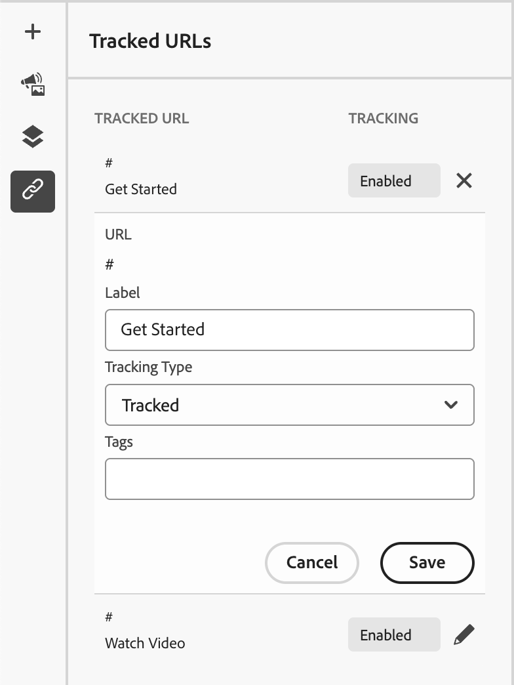

# 랜딩 페이지 디자인

[랜딩 페이지를 만들고](./landing-pages-create-publish.md#create-landing-page) 나면 시각적 디자인 공간을 사용하여 페이지의 구조적 구성 요소와 콘텐츠 구성 요소를 작성합니다.

## 구조 및 콘텐츠 추가 {#structure-content-landing-page}

{{$include /help/_includes/content-design-components-prime.md}}

### 사용자 정의 CSS 추가 {#add-custom-css}

랜딩 페이지 디자인 공간 내에 사용자 지정 CSS를 직접 추가할 수 있습니다. 사용자 지정 CSS를 사용하여 콘텐츠의 모양을 보다 유연하게 제어하고, 고급 및 특정 스타일을 적용할 수 있습니다. 이미지, 단추 및 텍스트와 같은 구성 요소를 포함하기 전에 이 최상위 수준의 스타일을 추가하는 것이 좋습니다.

캔버스에 콘텐츠 구성 요소가 하나 이상 있는 경우 왼쪽 탐색 트리에서 **[!UICONTROL 본문]** 구성 요소를 선택하여 사용자 지정 CSS 편집기에 액세스합니다.

{width="800" zoomable="yes"}

단계, 구문 규칙 및 문제 해결은 [콘텐츠에 대한 사용자 지정 CSS 추가](./design-custom-css.md)를 참조하십시오.

### 에셋 추가 {#add-assets}

시각적 디자인 공간에서 왼쪽 탐색 막대의 _Assets_( ) 아이콘을 선택하여 [!DNL Journey Optimizer B2B Prime] 자산 라이브러리에서 이미지 자산을 찾아 선택합니다.

이미지 에셋을 선택, 대체 또는 업로드하는 단계는 [콘텐츠 작성에 에셋 사용](./digital-asset-management.md#assets-authoring)을 참조하십시오.

### 양식 추가 {#add-forms}

{{$include /help/_includes/content-design-add-forms.md}}

### 레이어, 설정 및 스타일 탐색 {#navigate-layers-settings-styles}

{{$include /help/_includes/content-design-navigation.md}}

### 콘텐츠 개인화 {#personalize-content}

[!DNL Journey Optimizer B2B Prime]은(는) 개인화에 Handlebars 구문을 사용합니다. 토큰은 랜딩 페이지를 볼 때 각 방문자의 프로필 데이터에 있는 값으로 대체됩니다.

개인화를 추가하려면(_T):_

1. 텍스트 구성 요소를 선택하고 도구 모음에서 _개인화 추가_(  ) 아이콘을 클릭합니다.
1. 개인화 대화 상자에서 왼쪽의 스키마 트리를 탐색하고 속성을 선택합니다. 편집기에서 해당 Handlebars 표현식을 삽입합니다.
1. 필요한 경우 누락된 데이터를 처리하기 위해 대체 값을 추가합니다.
1. **[!UICONTROL 확인]** 또는 **[!UICONTROL 삽입]**&#x200B;을 클릭합니다. 표현식이 필드에 인라인으로 표시됩니다.

표현식 편집기 도구 및 구문에 대한 자세한 내용은 [Personalization 편집기](./personalization-expressions.md)를 참조하십시오.

### 연결된 URL 추적 편집 {#linked-url-tracking}

{{$include /help/_includes/content-design-links.md}}

{width="400"}

**[!UICONTROL 추적 형식]**&#x200B;을(를) 사용하여 링크 추적을 제어합니다.

* **[!UICONTROL 추적됨]** - 링크 URL에서 추적을 활성화합니다.
* **[!UICONTROL 사용 안 함]** - 링크 URL 추적을 활성화하지 않습니다.

### 작업 내용 저장 {#save-your-work}

언제든지 **[!UICONTROL 저장]**&#x200B;을 클릭하여 초안 랜딩 페이지를 저장합니다.

초안 페이지를 계속 편집할 수 있습니다. 페이지를 표시하고 이메일 또는 SMS 메시지에서 연결할 수 있도록 준비되면 페이지를 게시할 수 있습니다.

### 옵션 보기 {#view-options}

시각적 디자인 공간에서 사용할 수 있는 보기 및 콘텐츠 유효성 검사 옵션을 활용합니다.

* 사전 설정된 확대/축소 옵션에서 콘텐츠를 확대/축소합니다.

* 데스크탑, 모바일 또는 텍스트 전용/일반 텍스트에서 컨텐츠 보기를 전환합니다.
   * 여러 장치에서 콘텐츠를 미리 보려면 _보기_ 아이콘을 클릭하십시오.
   * 기본 제공 장치 중 하나를 선택하거나 사용자 지정 차원을 입력하여 콘텐츠를 미리 봅니다.

### 추가 옵션 {#more-options}

시각적 디자인 스페이스 상단의 _[!UICONTROL 자세히...]_ 메뉴에서 다음 작업을 수행할 수 있습니다.

{width="500"}

* **[!UICONTROL 랜딩 페이지 재설정]** - 시각적 디자인 캔버스를 빈 슬레이트로 지우고 페이지 콘텐츠 작성을 다시 시작하려면 이 옵션을 클릭하십시오.
* **[!UICONTROL 디자인 변경]** - _[!UICONTROL 기본 랜딩 페이지 만들기]_ 홈 페이지로 돌아가기. 여기에서 다른 템플릿을 선택하여 디자인 프로세스를 다시 시작하거나 빈 캔버스에서 페이지를 처음부터 디자인하도록 선택할 수 있습니다.
* **[!UICONTROL HTML 내보내기]** - zip 파일로 패키지된 HTML 형식의 로컬 시스템에 시각적 캔버스의 콘텐츠를 다운로드합니다.
