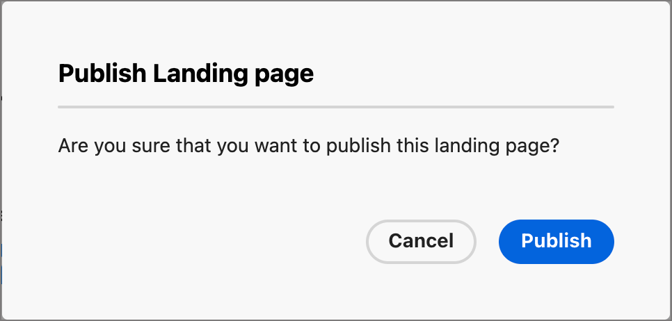

# 랜딩 페이지 만들기 및 게시

마케터는 여정에 통합할 페이지를 정의하고 게시할 수 있습니다. 새 랜딩 페이지를 추가할 때 기본 페이지와 하위 페이지를 구성하고, 콘텐츠를 디자인하고, 테스트하고, 게시합니다.

>[!BEGINSHADEBOX]

## 랜딩 페이지 사전 요구 사항 {#landing-page-prerequisites}

마케터가 랜딩 페이지를 만들어 여정을 지원하려면 먼저 다음 구성 및 에셋이 있어야 합니다.

* [랜딩 페이지 하위 도메인](../admin/configuration-presets-landing-pages.md#lp-subdomains) - 랜딩 페이지 호스팅 전용 하위 도메인을 설정합니다.
* [랜딩 페이지 사전 설정](../admin/configuration-presets-landing-pages.md#lp-presets) - 사전 설정은 랜딩 페이지에 적용되는 하위 도메인 및 기타 설정을 정의합니다.
* [양식](./forms.md)(데이터 캡처 사용 사례의 경우) - 양식을 랜딩 페이지에 포함하고 데이터를 Experience Platform에 제출하려는 경우 필요합니다.

>[!ENDSHADEBOX]

## 랜딩 페이지 만들기 {#create-landing-page}

>[!CONTEXTUALHELP]
>id="ajo-b2b-prime_lp_create"
>title="랜딩 페이지 정의 및 구성"
>abstract="랜딩 페이지를 만들려면 사전 설정을 선택한 다음 기본 페이지와 하위 페이지를 구성하고 게시하기 전에 마지막으로 테스트해야 합니다."

여정 대상의 구성원이 특정 링크를 클릭할 때 정의된 웹 페이지로 이동하려면 [!DNL Journey Optimizer B2B Prime]에 랜딩 페이지를 만드십시오.

>[!IMPORTANT]
>
>첫 번째 랜딩 페이지를 만들기 전에 랜딩 페이지 설정을 완료합니다. 여기에는 랜딩 페이지를 호스팅하도록 하위 도메인을 구성하는 작업과 하위 도메인 및 기타 채널 설정을 지정하는 하나 이상의 사전 설정을 정의하는 작업이 포함됩니다. 랜딩 페이지를 만들 때 사전 설정을 선택합니다. 관리자 설정에 대해서는 [랜딩 페이지 구성](../admin/configuration-presets-landing-pages.md)을 참조하십시오.
>
>데이터 캡처 사용 사례의 경우 랜딩 페이지에 임베드하기 전에 [양식](./forms.md)을(를) 만드십시오.

랜딩 페이지를 만들려면(_T):_

1. 왼쪽 탐색으로 이동하여 **[!UICONTROL 콘텐츠 관리]** > **[!UICONTROL 랜딩 페이지]**&#x200B;를 선택합니다.

1. 랜딩 페이지 목록에서 **[!UICONTROL 랜딩 페이지 만들기]**&#x200B;를 클릭합니다.

1. **[!UICONTROL 제목]**(필수) 및 **[!UICONTROL 설명]**(선택 사항)을 입력하십시오.

   제목 및 설명 기준:

   * **제목** — 최대 100자. 고유해야 합니다(대/소문자 구분 안 함).
   * **설명** — 최대 300자.
   * Alpha, 숫자 및 특수 문자가 허용됩니다.
   * 예약된 문자가 **_허용되지 않음_**: `\ / : * ? " < > |`

   {width="600"}

1. **[!UICONTROL 사전 설정]**&#x200B;을 선택하세요.

   관리자 [랜딩 페이지에 사용되는 하위 도메인 및 기타 설정을 정의하는 랜딩 페이지 사전 설정을 만듭니다](../admin/configuration-presets-landing-pages.md#lp-presets). 사전 설정을 선택한 다음 **[!UICONTROL 사전 설정 보기]**&#x200B;를 클릭하여 설정을 검토하고 랜딩 페이지 요구 사항과 일치하는지 확인하십시오.

1. **[!UICONTROL 만들기]**&#x200B;를 클릭합니다.

   기본 페이지와 해당 속성이 표시됩니다. [기본 페이지 설정을 구성](#configure-primary-page)하는 방법에 대해 알아봅니다.

   {width="700" zoomable="yes"}

1. 하위 페이지(예: 감사 또는 오류 페이지)를 추가하려면 **+** 아이콘을 클릭합니다.

   랜딩 페이지당 최대 2개의 하위 페이지를 추가할 수 있습니다.

기본 페이지와 하위 페이지를 구성하고 디자인한 후, 게시하기 전에 [랜딩 페이지를 테스트](#test-landing-page)합니다.

>[!CAUTION]
>
>페이지가 게시되었더라도 정의된 URL을 복사하여 웹 브라우저에 붙여넣으면 랜딩 페이지에 액세스할 수 없습니다. [랜딩 페이지 테스트](#test-landing-page)에 설명된 대로 미리 보기 기능을 사용하여 페이지를 테스트합니다.

## 기본 페이지 구성 {#configure-primary-page}

>[!CONTEXTUALHELP]
>id="ajo-b2b-prime_lp_primary_page"
>title="기본 페이지 설정 정의"
>abstract="수신자가 이메일 또는 웹 사이트에서 랜딩 페이지 링크를 클릭하면 즉시 표시될 기본 페이지를 정의합니다."

>[!CONTEXTUALHELP]
>id="ajo-b2b-prime_lp_access_settings"
>title="랜딩 페이지 URL 정의"
>abstract="이 섹션에서는 고유 랜딩 페이지 URL을 정의합니다. URL의 첫 번째 부분의 경우 선택한 사전 설정의 일부로 랜딩 페이지 하위 도메인을 이전에 설정해 두었어야 합니다."

기본 페이지는 수신자가 랜딩 페이지 링크를 클릭할 때(예: 이메일 또는 웹 사이트에서) 즉시 표시되는 페이지입니다.

기본 페이지 설정을 정의하려면(_T):_

1. 필요에 따라 **[!UICONTROL 페이지 이름]**&#x200B;을 변경합니다. 기본적으로 _기본 페이지_&#x200B;입니다.

1. 페이지 URL의 끝 부분을 정의합니다.

   선택한 사전 설정에 따라 URL의 첫 번째 부분이 결정됩니다. 관리자는 [랜딩 페이지 하위 도메인](../admin/configuration-presets-landing-pages.md#lp-subdomains)을 사전 설정의 일부로 구성합니다.

   >[!CAUTION]
   >
   >랜딩 페이지 URL은 고유해야 합니다.
   >
   >페이지가 게시되었더라도 이 URL을 복사하여 웹 브라우저에 붙여넣으면 랜딩 페이지에 액세스할 수 없습니다. [랜딩 페이지 테스트](#test-landing-page)에 설명된 대로 미리 보기 기능을 사용하여 테스트합니다.

1. 익명 랜딩 페이지를 원하는 경우 **[!UICONTROL 식별된 사용자 필요]** 옵션을 비활성화하십시오.

1. _달력_( ) 아이콘을 클릭하여 **[!UICONTROL 페이지 만료]**&#x200B;를 설정합니다.

   만료 날짜를 선택한 후 페이지 만료 시 작업을 선택합니다.

   * **[!UICONTROL 리디렉션 URL]** - 리디렉션으로 사용할 페이지의 URL을 입력합니다.

     {width="400"}

   * **[!UICONTROL 브라우저 오류]** - 페이지 대신 표시할 오류 텍스트를 입력하십시오.

     {width="400"}

## 콘텐츠 디자인 유형 선택 {#choose-design-type}

페이지에 대한 _[!UICONTROL 컨텐츠]_&#x200B;를 추가하려면 **[!UICONTROL Designer 열기]**&#x200B;를 클릭합니다. 디자인 프로세스는 시작할 방법을 선택하는 것으로 시작됩니다.

* [처음부터 디자인](#design-from-scratch)
* [HTML 가져오기](#import-html)

{width="800" zoomable="yes"}

랜딩 페이지 디자인을 시작하기 위한 기본 방법을 선택한 후 시각적 디자인 도구를 사용하여 [페이지 콘텐츠를 완료](./landing-page-design.md)합니다.

### 처음부터 디자인 {#design-from-scratch}

시각적 콘텐츠 디자인 공간을 사용하여 랜딩 페이지의 구조와 콘텐츠를 정의합니다. 간단한 드래그 앤 드롭 작업으로 구조 구성 요소를 추가 및 이동하여 페이지 콘텐츠의 레이아웃 및 구성을 초 이내에 디자인할 수 있습니다.

1. 디자인 홈 페이지에서 **[!UICONTROL 처음부터 디자인]** 옵션을 선택합니다.

1. 페이지에 [구조 및 콘텐츠 추가](./landing-page-design.md#structure-content-landing-page).

1. [연결된 URL 추적을 검토하고 편집합니다](./landing-page-design.md#linked-url-tracking).

1. [랜딩 페이지를 테스트합니다](#test-landing-page).

내용이 만족스러우면 **[!UICONTROL 저장]**&#x200B;을 클릭하세요.

### HTML 가져오기 {#import-html}

<!-- originally  from   /help/_includes/content-design-import.md but copied and revised to omit the part about Marketo Engage assets and AEM assets -->

가져온 콘텐츠는 다음과 같을 수 있습니다.

* 통합 스타일시트가 있는 HTML 파일
* HTML 파일, 스타일 시트(.css) 및 이미지가 포함된 .zip 파일

  >[!NOTE]
  >
  >.zip 파일 구조에는 제한 사항이 없습니다. 그러나 참조는 상대적이어야 하며 .zip 폴더의 트리 구조와 일치해야 합니다. 이미지는 항상 [자산 저장소](./digital-asset-management.md)에 업로드됩니다.

HTML 콘텐츠가 포함된 파일을 가져오려면(_T):_

1. 디자인 홈 페이지에서 **[!UICONTROL HTML 가져오기]** 옵션을 선택합니다.

1. HTML 콘텐츠가 포함된 HTML 또는 .zip 파일을 드래그 앤 드롭하고 **[!UICONTROL 가져오기]**&#x200B;를 클릭합니다.

{width="500"}

>[!NOTE]
>
>`<table>` 태그를 HTML 파일의 첫 번째 레이어로 사용하면 맨 위 레이어 태그의 배경 및 너비 설정을 포함하여 스타일이 손실될 수 있습니다.

필요에 따라 시각적 디자인 도구를 사용하여 가져온 콘텐츠를 개인화할 수 있습니다.

## 경고 확인 {#check-alerts}

랜딩 페이지 콘텐츠를 디자인할 때 주요 설정이 누락된 경우 오른쪽 상단에 경고가 표시됩니다.

{width="250"}

이 단추가 표시되지 않으면 발견된 문제가 없습니다.

경고에는 두 가지 유형이 있습니다.

* 권장 사항 및 모범 사례를 참조하는 **_경고_**:

   * `Placeholder links are present in the landing page body`: 자리 표시자를 올바른 링크로 바꾸는 것을 잊지 마십시오.

   * `Text version of HTML is empty`: 페이지 본문의 텍스트 버전을 정의해야 합니다. 텍스트 버전은 HTML 콘텐츠를 표시할 수 없을 때 사용됩니다.

   * `Empty link is present in page body`: 페이지의 모든 링크가 올바른지 확인하십시오.

* **_오류_**&#x200B;로 인해 여정을 테스트하거나 활성화할 수 없습니다. 예를 들면 다음과 같습니다.

   * `The landing page content is empty`: 페이지 컨텐츠는 필수입니다.

## 랜딩 페이지 테스트 {#test-landing-page}

>[!CONTEXTUALHELP]
>id="ajo-b2b-prime_preview_lp_profiles"
>title="랜딩 페이지 미리보기 및 테스트"
>abstract="랜딩 페이지 설정 및 콘텐츠가 정의된 후 테스트 프로필을 사용하여 페이지를 미리보기할 수 있습니다."

랜딩 페이지 설정 및 콘텐츠가 정의되면 테스트 프로필을 사용하여 페이지를 미리 볼 수 있습니다. [개인 맞춤화된 콘텐츠](./landing-page-design.md#personalize-content)를 삽입한 경우 테스트 프로필 데이터를 사용하여 랜딩 페이지에 이 콘텐츠가 어떻게 표시되는지 확인할 수 있습니다.

>[!PREREQUISITES]
>
>랜딩 페이지를 미리 보고 테스트하려면 **[!UICONTROL 메시지 게시]** 권한과 테스트 프로필을 포함하는 정의된 데이터 세트가 있어야 합니다.

1. 테스트 프로필 선택을 열려면 **[!UICONTROL 미리 보기 및 테스트]**&#x200B;를 클릭하십시오.

   >[!NOTE]
   >
   >시각적 디자인 영역에 있는 경우 **[!UICONTROL 콘텐츠 시뮬레이션]**&#x200B;을 사용할 수도 있습니다.

1. _[!UICONTROL 시뮬레이션]_ 화면에서 테스트 프로필을 선택합니다.

   {width="700" zoomable="yes"}

   필요한 프로필이 목록에 없으면 **[!UICONTROL 테스트 프로필 관리]**&#x200B;를 클릭하여 알려진 테스트 프로필 전자 메일 주소를 사용하고 목록에 추가하십시오.

   +++테스트 프로필 추가

   **[!UICONTROL ID 네임스페이스]**&#x200B;의 경우 _Select_ 아이콘( )을 클릭하고 프로필을 테스트하는 데 사용할 `Email` 네임스페이스를 선택하십시오.

   {width="700" zoomable="yes"}

   **[!UICONTROL ID 값]** 필드에 테스트 프로필을 식별할 전자 메일 주소를 입력하고 **[!UICONTROL 프로필 추가]**&#x200B;를 클릭합니다. 이 작업을 반복하여 여러 프로필을 추가할 수 있습니다.

   {width="700" zoomable="yes"}

   왼쪽 상단의 뒤로 화살표를 클릭하여 _[!UICONTROL 시뮬레이션]_ 페이지로 돌아갑니다.

   +++

1. **[!UICONTROL 미리 보기 열기]**&#x200B;를 선택하여 랜딩 페이지를 테스트합니다.

   랜딩 페이지 미리보기가 새 탭에서 열립니다. 선택한 테스트 프로필 데이터가 개인화된 요소를 대체합니다.

   {width="600"}

1. 다른 테스트 프로필을 선택하여 랜딩 페이지의 각 변형에 대한 렌더링을 미리 봅니다.

## 페이지 게시 {#publish-landing-page}

>[!PREREQUISITES]
>
>랜딩 페이지를 게시하려면 **[!UICONTROL 메시지 게시]** 권한이 있어야 합니다. 게시하기 전에 [모든 경고를 확인 및 해결](#check-alerts)하세요.

초안 페이지가 기준에 부합하고 여정 메시지에서 연결할 수 있도록 하려면 오른쪽 상단의 **[!UICONTROL 게시]**&#x200B;를 클릭합니다. 확인 대화 상자에서 **[!UICONTROL 게시]**&#x200B;를 다시 클릭하여 확인합니다.

{width="250"}

랜딩 페이지가 게시되면 랜딩 페이지 목록에 **_[!UICONTROL 게시됨]_** 상태로 표시됩니다. 즉, 라이브가 되어 여정을 통해 전송된 이메일 또는 SMS 메시지에 사용할 준비가 되었습니다.

URL을 복사하여 웹 브라우저에 붙여넣으면 게시된 랜딩 페이지에 액세스할 수 없습니다. [미리 보기 함수](#test-landing-page)를 사용하여 언제든지 테스트할 수 있습니다.
