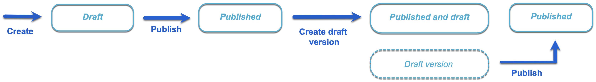
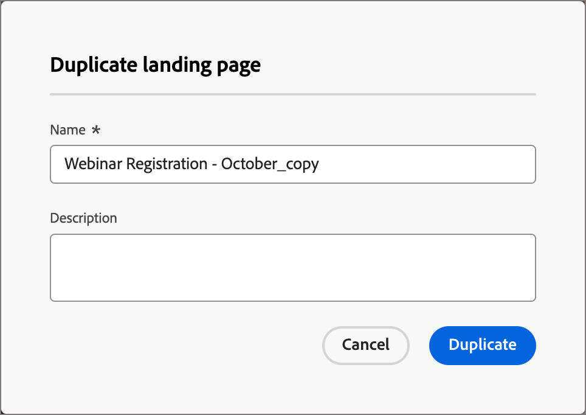

# 랜딩 페이지

랜딩 페이지는 연락처와 고객이 이메일, SMS 메시지 또는 디지털 위치에서 연결된 항목을 클릭한 후 직접 연락할 수 있는 독립 실행형 웹 페이지입니다. 이러한 페이지를 여정에 통합하여 잠재 고객과 고객이 웹에서 메시지를 보고 여정에서 진행되는 과정을 확인할 수 있습니다.

랜딩 페이지의 일반적인 사용 사례:

* 마케팅 커뮤니케이션 또는 특정 서비스에 대한 옵트인 또는 옵트아웃을 제공합니다. 이메일이나 다른 커뮤니케이션에서 타겟팅된 목록에 대한 링크를 사용하십시오.
* 통신을 보내기 전에 동의를 수집하고 옵트인 또는 옵트아웃 시 확인 이메일을 보냅니다.
* 랜딩 페이지의 양식을 사용하여 프로필 데이터(점진적 프로파일링, 환경 설정, 등록 및 유사한 시나리오)를 캡처하거나 업데이트합니다.
* 여정 오케스트레이션에 맞게 디자인된 캠페인 관련 정보를 대상자에게 안내합니다.
* [!DNL Journey Optimizer B2B Prime] 외부에서 외부 페이지를 만들지 않고 전용 웹 양식으로 사용자를 리디렉션합니다.

## 랜딩 페이지 워크플로 {#workflow}

여정 대상의 구성원이 특정 링크를 클릭할 때 정의된 웹 페이지로 안내하려면 [!DNL Journey Optimizer B2B Prime]에 랜딩 페이지를 만드십시오.

1. [페이지 만들기](./landing-pages-create-publish.md#create-landing-page) - 사전 설정을 선택하고 기본 페이지를 설정한 다음 필요한 하위 페이지를 추가합니다.
1. [랜딩 페이지 콘텐츠 디자인](./landing-page-design.md) - 드래그 앤 드롭 시각적 디자인 구성 요소를 사용하여 페이지 콘텐츠를 빌드합니다.
1. [랜딩 페이지를 테스트합니다](./landing-pages-create-publish.md#test-landing-page) - 페이지를 미리 보고 양식 동작을 테스트합니다.
1. [랜딩 페이지 게시](./landing-pages-create-publish.md#publish-landing-page) - 페이지를 라이브로 사용하고 연결할 수 있도록 게시합니다.
1. [여정의 페이지에 연결](#link-to-landing-page) - 수신자가 연결할 수 있도록 랜딩 페이지 URL을 전자 메일, SMS 또는 여정 작업에 추가합니다.

예를 들어 랜딩 페이지를 만들고 디자인하여 사용자를 온라인 정보로 안내할 수 있습니다. 페이지에는 커뮤니케이션 수신을 옵트인하거나 옵트아웃할 수 있는 양식이 포함될 수 있습니다. 또는 뉴스레터와 같은 반복되는 커뮤니케이션에 가입할 수 있는 기회가 될 수 있습니다.

## 랜딩 페이지 액세스 및 관리 {#access-manage-landing-pages}

[!DNL Journey Optimizer B2B Prime]의 랜딩 페이지에 액세스하려면 왼쪽 탐색으로 이동하여 **[!UICONTROL 콘텐츠 관리]** > **[!UICONTROL 랜딩 페이지]**&#x200B;를 클릭하십시오. 이 작업은 인스턴스에서 만든 모든 랜딩 페이지 목록을 표시합니다.

{width="800" zoomable="yes"}

목록은 _[!UICONTROL 수정됨]_ 열에 따라 정렬되며 가장 최근에 업데이트된 항목이 맨 위에 있습니다. 오름차순과 내림차순 간을 변경하려면 열 제목을 클릭합니다.

### 랜딩 페이지 목록 필터링 {#filter-list}

이름별로 랜딩 페이지를 검색하려면 검색 막대에 일치 항목 텍스트 문자열을 입력합니다. _필터_ 아이콘( )을 클릭하여 사용 가능한 필터 옵션을 표시하고 설정을 변경하여 지정된 조건에 따라 표시된 항목을 필터링합니다.

{width="800" zoomable="yes"}

<!-- 
This is going away? ### Customize the column display

Customize the columns that you want to display in the table by clicking the _Customize table_ icon (  ) at the top right. 

In the dialog, select the columns to display and click **[!UICONTROL Apply]**.

{width="300"} 
-->

### 랜딩 페이지 상태 및 라이프사이클 {#landing-page-status}

랜딩 페이지 상태는 이메일 및 SMS 콘텐츠에서 연결에 대한 가용성과 이에 대해 수행할 수 있는 변경 사항을 결정합니다.

| 상태 | 설명 |
| -------------------- | ----------- |
| 초안 | 랜딩 페이지를 만들 때 초안 상태입니다. 이 상태는 시각적 콘텐츠를 정의하거나 편집할 때 호스팅되는 페이지로 게시할 때까지 이 상태로 유지됩니다. 사용 가능한 작업:  <ul><li>이름 또는 설명 편집</li><li>링크 URL 편집</li><li>시각적 디자인 공간에서 편집</li><li>게시</li><li>복제</li><li>삭제</li></ul> |
| 게시일 | 랜딩 페이지를 게시하면 [!DNL Journey Optimizer B2B Prime] 인스턴스에서 호스팅되며 이메일 또는 SMS 메시지 콘텐츠에서 연결할 수 있습니다. 사용 가능한 작업:  <ul><li>이름 또는 설명 편집</li><li>링크 URL 편집</li><li>이메일 또는 SMS 메시지 콘텐츠에 링크 추가</li><li>초안 버전 만들기</li><li>복제</li><li>삭제</li></ul> |
| 초안과 함께 게시됨 | 게시된 랜딩 페이지에서 초안을 만들면 게시된 버전이 유지되고 시각적 디자인 공간에서 초안 콘텐츠를 수정할 수 있습니다. 초안 버전을 게시하면 현재 게시된 버전이 대체되고 호스팅된 페이지에서 콘텐츠가 업데이트됩니다. 사용 가능한 작업:  <ul><li>이름 또는 설명 편집</li><li>링크 URL 편집</li><li>이메일 또는 SMS 메시지 콘텐츠에 링크 추가</li><li>시각적 디자인 공간에서 초안 버전 편집</li><li>초안 버전 게시</li><li>복제</li><li>삭제(두 버전 모두 삭제)</li><li>초안 삭제(게시된 상태로 돌아가기)</li></ul> |

{zoomable="yes"}

## 랜딩 페이지 편집 {#edit-landing-page}

랜딩 페이지에 대한 편집 내용은 현재 상태에 따라 다릅니다.

* 랜딩 페이지가 **_초안_** 상태일 때 랜딩 페이지의 세부 정보, URL 및 시각적 콘텐츠를 편집할 수 있습니다.
* 랜딩 페이지가 **_게시됨_** 상태일 때 설명을 편집할 수 있지만 이름은 편집할 수 없습니다. 시각적 콘텐츠를 변경하려면 페이지의 초안 버전을 만들어야 합니다.
* 랜딩 페이지가 **_초안으로 게시됨_** 상태일 때 세부 정보 편집은 설명으로 제한됩니다. 초안 버전의 시각적 콘텐츠를 편집할 수도 있습니다.

>[!BEGINTABS]

>[!TAB 초안]

1. _[!UICONTROL 랜딩 페이지]_ 목록 페이지에서 랜딩 페이지 이름을 클릭하여 엽니다.

   오른쪽에 랜딩 페이지 세부 정보가 있는 시각적 콘텐츠의 미리보기가 표시됩니다.

1. 이름, 설명 등 세부 사항을 수정합니다.

   {width="700" zoomable="yes"}

1. 시각적 디자인 공간에서 콘텐츠를 변경하려면 **[!UICONTROL 랜딩 페이지 편집]**&#x200B;을 클릭하세요.

   필요에 따라 시각적 디자인 도구를 사용합니다.

   * [구조 및 콘텐츠 추가](./landing-page-design.md#structure-content-landing-page)
   * [에셋 추가](./landing-page-design.md#add-assets)
   * [레이어, 설정 및 스타일 탐색](./landing-page-design.md#navigate-layers-settings-styles)
   * [콘텐츠 개인화](./landing-page-design.md#personalize-content)
   * [연결된 URL 추적 편집](./landing-page-design.md#linked-url-tracking)

1. 랜딩 페이지 세부 정보로 돌아가려면 **[!UICONTROL 저장]** 또는 **[!UICONTROL 저장 및 닫기]**&#x200B;를 클릭하십시오.

1. 페이지가 조건에 맞는 경우 표시할 수 있도록 하려면 **[!UICONTROL 게시]**&#x200B;를 클릭합니다.

>[!TAB 게시됨]

1. _[!UICONTROL 랜딩 페이지]_ 목록 페이지에서 페이지 이름을 클릭하여 엽니다.

   오른쪽에 랜딩 페이지 세부 정보가 있는 시각적 콘텐츠의 미리보기가 표시됩니다.

1. 필요한 경우 설명을 수정합니다.

   게시된 랜딩 페이지의 경우 다른 모든 세부 사항을 변경할 수 없습니다.

1. 콘텐츠를 업데이트하려면 오른쪽의 **[!UICONTROL 랜딩 페이지 편집]**&#x200B;을 클릭하세요.

   대화 상자에서 **[!UICONTROL 초안 버전 만들기]**&#x200B;를 클릭하여 시각적 디자인 공간에서 초안 버전을 엽니다.

   필요에 따라 시각적 디자인 도구를 사용합니다.

   * [구조 및 콘텐츠 추가](./landing-page-design.md#structure-content-landing-page)
   * [에셋 추가](./landing-page-design.md#add-assets)
   * [레이어, 설정 및 스타일 탐색](./landing-page-design.md#navigate-layers-settings-styles)
   * [콘텐츠 개인화](./landing-page-design.md#personalize-content)
   * [연결된 URL 추적 편집](./landing-page-design.md#linked-url-tracking)

1. 랜딩 페이지 세부 정보로 돌아가려면 **[!UICONTROL 저장]** 또는 **[!UICONTROL 저장 및 닫기]**&#x200B;를 클릭하십시오.

1. 초안 랜딩 페이지가 조건을 충족하고 게시된 페이지에서 변경 사항을 사용할 수 있게 하려면 **[!UICONTROL 게시]**&#x200B;를 클릭합니다.

   초안 버전을 게시하면 현재 게시된 버전이 대체되고 페이지 URL에 대한 콘텐츠가 업데이트됩니다.

>[!TAB 초안으로 게시됨]

랜딩 페이지를 열면 초안 버전이 표시됩니다. 미리보기 공간 맨 위에 있는 탭을 사용하여 게시된 버전과 초안 버전 간에 디스플레이를 전환할 수 있습니다. 초안 작업 및 세부 정보가 오른쪽에 표시됩니다.

{width="700" zoomable="yes"}

콘텐츠 업데이트(_T):_

1. 오른쪽 상단의 **[!UICONTROL 랜딩 페이지 편집]**&#x200B;을 클릭합니다. 필요에 따라 시각적 디자인 도구를 사용합니다.

   * [구조 및 콘텐츠 추가](./landing-page-design.md#structure-content-landing-page)
   * [에셋 추가](./landing-page-design.md#add-assets)
   * [레이어, 설정 및 스타일 탐색](./landing-page-design.md#navigate-layers-settings-styles)
   * [콘텐츠 개인화](./landing-page-design.md#personalize-content)
   * [연결된 URL 추적 편집](./landing-page-design.md#linked-url-tracking)

1. 랜딩 페이지 세부 정보로 돌아가려면 **[!UICONTROL 저장]** 또는 **[!UICONTROL 저장 및 닫기]**&#x200B;를 클릭하십시오.

1. 초안 페이지가 조건을 충족하고 변경 사항을 사용할 수 있게 하려면 **[!UICONTROL 게시]**&#x200B;를 클릭합니다.

   초안 버전을 게시하면 현재 게시된 버전이 대체되고 호스팅된 페이지에서 콘텐츠가 업데이트됩니다.

>[!ENDTABS]

## 랜딩 페이지 복제 {#duplicate-landing-page}

다음 방법 중 하나를 사용하여 랜딩 페이지를 복제할 수 있습니다.

* _[!UICONTROL 랜딩 페이지]_ 목록 페이지에서 _자세히_ 아이콘(**...**)을 클릭합니다. 랜딩 페이지 이름 옆에 있는 **[!UICONTROL 복제]**&#x200B;를 선택합니다.
* 랜딩 페이지 세부 정보 페이지의 오른쪽 상단에서 **[!UICONTROL 을(를) 클릭합니다. 추가]**&#x200B;하고 **[!UICONTROL 복제]**&#x200B;를 선택하세요.

{width="600" zoomable="yes"}

대화 상자에서 유용한 이름(고유)과 설명(선택 사항)을 입력합니다. 작업을 완료하려면 **[!UICONTROL 복제]**&#x200B;를 클릭하십시오.

{width="350"}

그러면 복제된(새) 페이지가 _랜딩 페이지_ 목록에 나타납니다.

## 랜딩 페이지 삭제 {#delete-landing-page}

다음 방법 중 하나를 사용하여 랜딩 페이지를 삭제할 수 있습니다.

* _[!UICONTROL 랜딩 페이지]_ 목록 페이지에서 _자세히_ 아이콘(**...**)을 클릭합니다. 랜딩 페이지 이름 옆에 **[!UICONTROL 삭제]**&#x200B;를 선택합니다.
* 랜딩 페이지 세부 정보 페이지의 오른쪽 상단에서 **[!UICONTROL 을(를) 클릭합니다. 자세히]**. **[!UICONTROL 삭제]**&#x200B;를 선택하세요.

이 작업을 수행하면 확인 대화 상자가 열립니다. **[!UICONTROL 취소]**&#x200B;를 클릭하여 프로세스를 중단하거나 **[!UICONTROL 삭제]**&#x200B;를 클릭하여 삭제를 확인할 수 있습니다.

{width="400"}

## 랜딩 페이지 링크 {#link-to-landing-page}

이메일, 조각 및 페이지 콘텐츠를 생성하는 마케터 또는 크리에이티브로서 [!DNL Journey Optimizer B2B Prime] 인스턴스에 만들어진 게시된(라이브) 랜딩 페이지에 대한 링크를 포함할 수 있습니다.

1. 조각, 이메일, 랜딩 페이지 또는 템플릿에 대한 시각적 디자인 공간에서 작업할 때 링크의 텍스트 일부, 버튼 구성 요소 또는 이미지 구성 요소를 선택합니다.

   **[!UICONTROL 링크]** 옵션이 오른쪽 패널에 표시됩니다.

1. **[!UICONTROL Type]** 옵션에 대해 **[!UICONTROL 랜딩 페이지]**&#x200B;을(를) 선택하십시오.

   {width="700" zoomable="yes"}

1. **[!UICONTROL 랜딩 페이지]** 옵션의 경우 _페이지 선택_ 아이콘()을 클릭합니다.

1. 랜딩 페이지 선택 대화 상자에서 **[!UICONTROL 랜딩 페이지 소스]**&#x200B;를 **[!UICONTROL Journey Optimizer B2B edition]**(으)로 설정하고 게시된 페이지 목록에서 랜딩 페이지에 대한 확인란을 선택한 다음 **[!UICONTROL 선택]**&#x200B;을 클릭합니다.

   {width="600" zoomable="yes"}

1. **[!UICONTROL Target]** 옵션의 경우 링크 대상 동작을 선택하십시오.

   * **[!UICONTROL 없음]** - 브라우저 기본 동작을 사용하여 링크를 엽니다.
   * **[!UICONTROL Blank]** - 새 창 또는 탭에서 링크를 엽니다.
   * **[!UICONTROL 자체]** - 같은 프레임에서 링크를 엽니다.
   * **[!UICONTROL 상위]** - 상위 프레임에서 링크를 엽니다.
   * **[!UICONTROL 위쪽]** - 창의 전체 본문에서 링크를 엽니다.

1. (텍스트 링크만 해당) 연결된 텍스트에 밑줄을 적용하려면 **[!UICONTROL 밑줄 링크]** 확인란을 선택합니다.

   오른쪽 패널에서 **[!UICONTROL 스타일]** 탭을 선택하여 링크 색상을 포함하여 링크 텍스트에 대한 추가 스타일을 설정할 수 있습니다.
