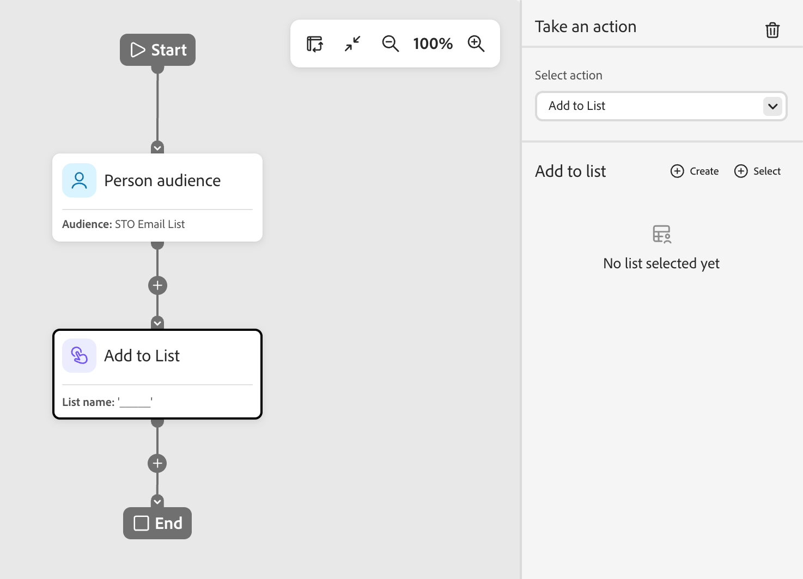

# 작업 노드 수행

개인 여정에서 노드 경로의 모든 사용자에게 변경 사항을 적용하려면 사용자에 대한 작업을 사용하십시오.

## 작업 및 제한 {#actions}

| 액션 | 제한 |
| ------ | ----------- |
| **[!UICONTROL 대상에 활성화]** | <li>정적 목록 선택 또는 만들기 <li>목록에 활성화된 대상이 없으면 하나 이상의 대상에 목록을 활성화합니다 |
| **[!UICONTROL 여정에 사용자 추가]** | <li>예약된 또는 라이브 여정 선택 <li>대상 여정의 대상 기준이 적용되지 않습니다 |
| **[!UICONTROL 목록에 추가]** | <li>새 정적 목록 만들기 또는 기존 정적 목록 선택 |
| **[!UICONTROL Marketo 목록에 추가]** | <li>Marketo Engage에서 정적 목록 선택 |
| **[!UICONTROL 데이터 값 변경]** | <li>개인 속성 선택 <li>새 값 설정 |
| **[!UICONTROL 프로그램 데이터 변경]** | <li>프로그램 속성 선택 <li>새 값 설정 |
| **[!UICONTROL 프로그램 상태 변경]** | <li>프로그램 선택<li>새 상태 선택 |
| **[!UICONTROL 목록에서 제거]** | <li>정적 목록 선택 <li>현재 구성원이 아닌 경우 사용자를 건너뜁니다. |
| **[!UICONTROL Marketo 목록에서 제거]** | <li>Marketo Engage에서 정적 목록 선택 <li>현재 구성원이 아닌 경우 사용자를 건너뜁니다. |
| **[!UICONTROL 여정에서 사용자 제거]** | <li>라이브 여정 선택 <li>현재 대상 여정의 멤버가 아닌 경우 사용자를 건너뜁니다. |
| **[!UICONTROL Marketo 캠페인 요청]** | <li>Marketo Engage 캠페인 선택 |
| **[!UICONTROL 전자 메일 보내기]** | <li>AI 개인화된 이메일 만들기, 편집 또는 사용 <li>전송 시간 최적화(선택 사항) |
| **[!UICONTROL WhatsApp 보내기]** | <li>WhatsApp 메시지 선택 |

## 작업 노드 추가 {#add-an-action-node}

1. 여정 캔버스로 이동합니다.

1. 경로에서 더하기(**+**) 아이콘을 클릭하고 **[!UICONTROL 작업 수행]**&#x200B;을 선택합니다.

   {width="200"}

1. 오른쪽의 노드 속성에서 목록에서 작업을 선택하고 작업에 대한 값을 설정합니다.

+++대상에 활성화

이 작업을 사용하여 정적 목록에 사용자를 추가하고 여정에서 직접 대상에 해당 목록을 활성화할 수 있습니다. 기존 정적 목록을 사용하거나 여정에 특별히 정적 목록을 만들 수 있습니다.

>[!PREREQUISITES]
>
>_대상에 활성화_ 여정 노드를 설정하기 전에 [!DNL Journey Optimizer B2B Prime] 샌드박스에 대해 하나 이상의 [구성된 대상](../audiences/destinations.md)이 있어야 합니다.

{width="450"}

**[!UICONTROL 목록에 추가]**&#x200B;에서 다음 옵션 중 하나를 선택하십시오.

* **[!UICONTROL 만들기]** — 새 정적 목록을 만들고 사용자를 추가합니다. 이 목록은 **[!UICONTROL 사람 목록]**&#x200B;에서 즉시 사용할 수 있습니다.

  목록에 대한 상위 프로그램을 선택하고 **[!UICONTROL 이름]**(필수) 및 **[!UICONTROL 설명]**(선택 사항)을 입력하십시오. 노드의 새 목록을 추가하려면 **[!UICONTROL 만들기]**&#x200B;를 클릭하십시오.

  {width="375"}

* **[!UICONTROL 선택]** — 노드에 연결된 사용자를 추가할 기존 정적 목록을 선택합니다.

  기존 정적 목록의 확인란을 선택하고 **[!UICONTROL 저장]**&#x200B;을 클릭합니다.

  {width="700" zoomable="yes"}

노드에 도달하는 모든 사용자가 선택한 정적 목록에 추가되지만 목록이 대상에 활성화될 때까지 작업이 완료되지 않습니다.

* 선택한 목록이 이미 활성화된 경우 해당 대상이 **[!UICONTROL 대상]** 아래에 표시되고 작업이 준비됩니다.
* 그렇지 않으면 _대상이 하나 이상 필요합니다_ 메시지가 나타납니다. **[!UICONTROL 대상에 목록 활성화]**&#x200B;를 클릭하고 대상을 선택한 다음 **[!UICONTROL 저장]**&#x200B;을 클릭합니다. 확인 대화 상자에서 **[!UICONTROL 활성화]**&#x200B;를 클릭합니다.

{width="600" zoomable="yes"}

활성화가 완료되면 대상이 **[!UICONTROL 대상]** 아래에 표시되고 작업이 준비됩니다. 필요한 경우 추가 대상에 대해 목록을 활성화할 수 있습니다.

노드에 도달하는 모든 사람은 선택한 대상에 활성화되는 선택한 정적 목록에 추가되므로 해당 대상 대상자에 추가되고, 결과적으로 대상자가 피딩하는 모든 캠페인에 추가됩니다.

+++

+++[!UICONTROL 여정에 사용자 추가]

이 작업을 사용하여 다른 예약 또는 라이브 여정에 사용자를 추가합니다. 이 작업을 통해 추가된 직원은 대상 여정의 대상에 즉시 추가됩니다. 대상 여정의 대상 기준은 적용되지 않습니다.

{width="450"}

+++

+++[!UICONTROL 목록에 추가]

이 작업을 사용하여 Journey Optimizer B2B Prime의 정적 목록에 사용자를 추가합니다.

{width="450"}

다음 옵션 중 하나를 선택합니다.

* **[!UICONTROL 만들기]** — 새 정적 목록 자산을 만들고 사용자를 추가합니다. 이 목록은 Journey Optimizer B2B Prime의 다른 에셋에서 즉시 사용할 수 있습니다.
* **[!UICONTROL 선택]** — 노드에 연결된 사용자를 추가할 기존 정적 목록 자산을 선택합니다.

+++

+++[!UICONTROL Marketo 목록에 추가]

이 작업을 사용하여 Marketo Engage의 정적 목록에 사용자를 추가합니다.

{width="450"}

+++

+++[!UICONTROL 데이터 값 변경]

이 작업을 사용하여 개인 레코드의 속성 값을 업데이트합니다. 속성을 선택하고 새 값을 설정합니다.

>[!TIP]
>
>특성 값을 지우려면 값을 `NULL`(으)로 설정합니다.

{width="450"}

+++

+++[!UICONTROL 프로그램 데이터 변경]

이 작업을 사용하여 프로그램 속성 값을 업데이트합니다. 프로그램 속성을 선택하고 새 값을 설정합니다.

{width="450"}

+++

+++[!UICONTROL 프로그램 상태 변경]

이 작업을 사용하여 Marketo Engage 프로그램의 개인 상태를 변경할 수 있습니다. 프로그램을 선택한 다음 새 상태를 선택합니다.

{width="450"}

+++

+++[!UICONTROL 목록에서 제거]

이 작업을 사용하여 Journey Optimizer B2B Prime의 정적 목록에서 사람을 제거합니다. 현재 사용자가 목록의 멤버가 아닌 경우 해당 사용자에 대해 작업을 건너뜁니다.

{width="450"}

+++

+++[!UICONTROL Marketo 목록에서 제거]

이 작업을 사용하여 Marketo Engage의 정적 목록에서 사람을 제거합니다. 현재 사용자가 목록의 멤버가 아닌 경우 해당 사용자에 대해 작업을 건너뜁니다.

{width="450"}

+++

+++[!UICONTROL 여정에서 사용자 제거]

다른 라이브 사용자 여정에서 사용자를 제거하려면 이 작업을 사용하십시오. 대상자는 즉시 대상 여정에서 제거되며 더 이상 조치가 취해지지 않습니다. 현재 사용자가 대상 여정의 구성원이 아닌 경우 해당 사용자에 대해 작업을 건너뜁니다.

{width="450"}

+++

+++[!UICONTROL Marketo 캠페인 요청]

이 작업을 사용하여 연결된 Marketo Engage 인스턴스의 요청 캠페인에 사용자를 추가합니다. 요청할 Marketo Engage 캠페인을 선택합니다.

{width="450"}

+++

+++[!UICONTROL 전자 메일 보내기]

이 작업을 사용하여 옵트인 사용자에게 이메일을 보냅니다. 구독 취소되거나, 차단 목록에 등록되거나, 이메일이 일시 중단되거나, 마케팅이 일시 중단된 사람은 이 작업을 건너뜁니다.

{width="450"}

이메일을 만들거나 기존 이메일을 편집하거나 AI가 개인화한 이메일을 사용할 수 있습니다. 전자 메일 만들기 및 편집에 대한 자세한 내용은 [전자 메일 채널](./email-channel.md)을 참조하세요.

[전송 시간 최적화](./email-send-time-optimization.md)를 사용하여 각 프로필이 참여할 가능성이 가장 높은 시기를 예측하여 이메일 게재 시기를 개인화할 수 있습니다.

+++

+++[!UICONTROL WhatsApp 보내기]

이 작업을 사용하여 WhatsApp 메시지를 보냅니다. 시각적 디자인 공간에서 WhatsApp 메시지를 만들고, 개인화하고, 미리 볼 수 있습니다([WhatsApp 작성](../content/whatsapp-authoring.md) 참조).

{width="450"}

+++
