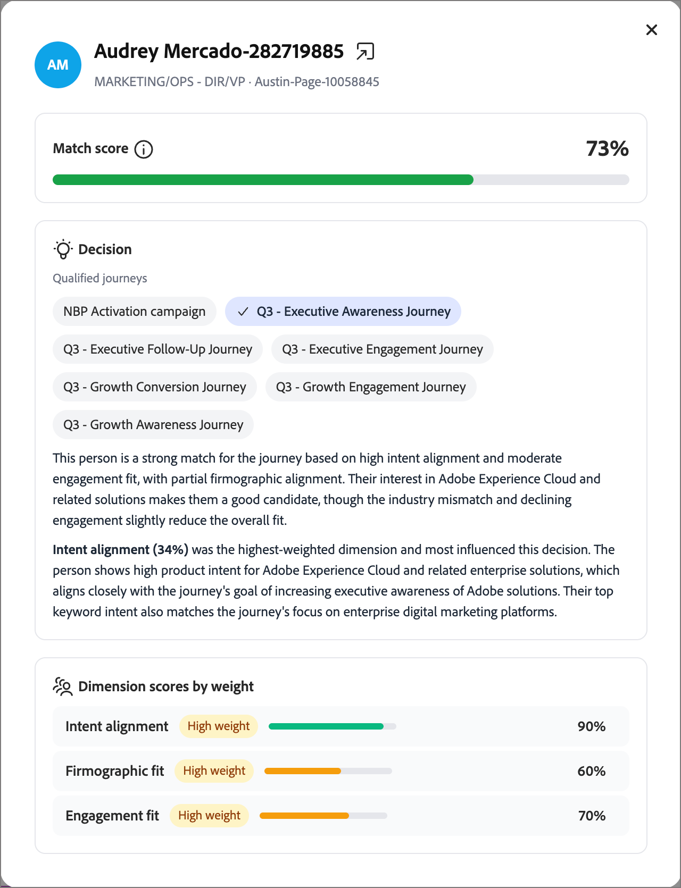

# 여정 트래픽 제어

여정 트래픽 제어(JTC)는 대상이 겹칠 때 개인에게 최상의 여정을 우선시합니다. 한 사람이 여러 JTC를 지원하는 여정에 참가할 수 있는 자격을 얻으면 AI 모델이 각 후보에 대해 이를 평가하고 다른 후보에 배치하지 않고 가장 적합한 여정에 추가합니다.

>[!NOTE]
>
>여정 트래픽 제어는 [!DNL Journey Optimizer B2B Ultimate]과(와) [!DNL Journey Optimizer B2B Prime] 모두에 대해 동일한 방식으로 작동합니다. 기능과 로직은 동일합니다. 계층 간에 사소한 UI 차이점만 있습니다. 이 페이지의 정보는 [!DNL Journey Optimizer B2B Prime] 환경을 반영합니다.

개인이 여정을 완료한 후 자격이 남아 있는 나머지 여정에 대해 다시 평가됩니다. 그런 다음 JTC가 가장 적합한 다음 여정 등에 추가합니다. 이렇게 하면 동일한 사람이 여러 겹치는 여정에 동시에 할당되는 것을 방지하고 각 연락처가 가장 관련성이 높은 경험을 먼저 받도록 할 수 있습니다.

>[!NOTE]
>
>현재 한 사람은 한 번에 하나의 JTC가 선택한 여정에 배치할 수 있습니다. 개인이 두 개 이상의 여정에 동시에 등록될 수 있도록 하는 관리자 구성 옵션이 향후 릴리스에 예정되어 있습니다.

## 채점 차원 {#scoring-dimensions}

이 모델은 7개의 채점 차원에 대한 각 개인 여정 조합을 평가합니다. 각 차원에 대해 독립적으로 점수를 매긴 다음 구성한 가중치에 따라 결합하여 해당 사용자와 여정에 대한 최종 일치 확률을 생성합니다. 가장 일치하는 여정을 선택합니다.

| 차원 | 평가 항목 |
|---|---|
| 의도 정렬 | 행동 의도 신호: 키워드 검색, 제품 페이지 방문, 콘텐츠 다운로드, 이메일 열기/클릭스루 및 가격 책정 페이지 활동. |
| 대상자 맞춤 | 여정에 대한 [대상 대상](./person-audience-node.md)과(와) 일치하는 사용자. |
| 성격 발작 | 사용자의 역할/[사용자](../audiences/personas.md)와 여정 간의 정렬. |
| 내선 맞춤 | 회사 수준 속성(예: 업계, 규모 및 매출). |
| 인구 통계학적 일치 | 사용자 수준 인구 통계 속성. |
| 사이코그래프 정렬 | 태도/환경 설정 기반 정렬. |
| 참여 맞춤 | 사용자의 [참여](../audiences/engagement-scores.md)의 최신성 및 깊이입니다. |

개인에게 데이터가 없는 차원은 자동으로 생략되므로 누락된 속성에 대해 점수부여가 적용되지 않습니다.

>[!IMPORTANT]
>
>의미 있는 작업을 수행하려면 적어도 두 개의 여정에 JTC가 활성화되어 있어야 합니다. 중재할 경쟁 여정이 없기 때문에 단일 여정에서 활성화하면 효과가 없습니다. 둘 이상의 여정이 JTC를 사용할 수 있는 경우에만 모델이 충돌 해결을 시작합니다.

## 필요 조건 {#prerequisites}

여정 트래픽 제어에서 결과를 얻으려면 다음 사항에 유의하십시오.

* **보고 시 게시된 JTC 사용 여정이 필요합니다.** 여정 트래픽 제어가 활성화된 여정이 하나 이상 게시될 때까지 _[!UICONTROL 보고]_ 탭에 데이터가 표시되지 않습니다.
* **시뮬레이션을 수행하려면 인스턴스에 게시된 여정이 하나 이상 있어야 합니다.** 시뮬레이션은 이미 실시간 여정에 있는 [프로필](../audiences/people-lists.md)을 평가하므로, 프로필의 출판을 위해서는 인스턴스에 게시된 여정이 하나 이상 있어야 합니다. 시뮬레이션 자체는 JTC를 활성화할 필요가 없습니다([_점수 시뮬레이션_](#simulate-scoring) 참조).

## 시작하기 {#get-started}

왼쪽 탐색에서 **[!UICONTROL 여정 트래픽 제어]**&#x200B;를 선택합니다. 표시된 페이지에는 두 개의 탭이 있습니다.

* **[!UICONTROL 보고]** — 트래픽 제어 실행 결과를 확인합니다(JTC가 라이브 여정에서 실행된 후에만 채워짐).
* **[!UICONTROL 구성]** — 채점 차원을 조정하고, 결과를 시뮬레이트하고, 참여하는 여정을 선택합니다.

>[!IMPORTANT]
>
>여정 트래픽 제어를 사용한 적이 없는 새로운 고객의 경우 _[!UICONTROL 보고]_ 탭이 비어 있습니다. 보고는 트래픽 제어가 적용되어 실행 중인 여정만 반영합니다. _[!UICONTROL 구성]_ 탭에서 시작합니다.

## 구성 탭 {#configuration-tab}

_[!UICONTROL 구성]_ 탭에는 **[!UICONTROL 차원 점수 조정]** 및 **[!UICONTROL 여정 선택]**&#x200B;의 두 섹션이 있습니다.

### 차원 점수 조정 {#adjust-dimension-scoring}

이 섹션에서는 7개 차원 각각이 최종 일치 점수에 기여하는 정도를 설정합니다. 각 차원은 **[!UICONTROL 해제]**, **[!UICONTROL 낮음]**, **[!UICONTROL Medium]** 또는 **[!UICONTROL 높음]** 중요도로 설정할 수 있습니다. 각 카드에 표시된 백분율은 모든 선택 항목을 조합한 후 해당 차원의 표준화된 기여도입니다(7개의 가중치는 항상 총 100%). 한 차원을 높이면 다른 차원이 자동으로 다시 표준화되어 합계가 100%에 머무릅니다.

모든 차원을 짝수 가중치로 되돌리려면 **[!UICONTROL 같음으로 재설정]**&#x200B;을 클릭합니다.

{width="800" zoomable="yes"}

### 점수 시뮬레이션 {#simulate-scoring}

프로덕션에 가중치를 커밋하기 전에 트래픽 제어가 이러한 변경 사항과 함께 작동하는 방식을 시뮬레이션할 수 있습니다. 시뮬레이션은 여정 트래픽 제어를 활성화할 필요가 없습니다. 라이브 여정에 이미 있는 프로필을 평가하고 트래픽 제어 논리를 적용하므로 선택한 가중치에 대해 결과가 적합한지 판단할 수 있습니다.

1. 시뮬레이션할 프로필 수를 선택합니다.

1. **[!UICONTROL 점수 시뮬레이션]**&#x200B;을 클릭합니다.

결과 헤더에 다음 실행이 요약됩니다.

* **평가된 프로필** — 채점된 프로필 수와 전체 여정 수입니다.
* **평균 충돌/프로필** — 프로필당 경쟁 여정의 평균 수입니다.
* **평균 일치 점수** — 선택한 여정의 평균 신뢰도입니다.

{width="700" zoomable="yes"}

요약 아래에 평가된 각 프로필은 선택한 여정, 주요 근거, 의도 신호 및 일치 점수를 보여주는 카드로 표시됩니다. 세부 사항 보기를 열 프로필 선택:

* **일치 점수** — 차원별로 색상으로 구분된 분류와 함께 전체적으로 일치합니다.
* **결정** — 이 사람이 자격이 있는 여정, 선택된 항목 및 그 이유입니다.
* **무게별 Dimension 점수** - 의사 결정을 유도한 차원별 점수로서 기본 신호를 표시하도록 확장 가능합니다.

{width="450" zoomable="yes"}

결과에 만족하면 다음을 수행할 수 있습니다.

* 차원 가중치를 조정하고 **[!UICONTROL 다시 실행]**&#x200B;을 클릭하여 시뮬레이션을 다시 실행하십시오.

* 가중치를 커밋하려면 **[!UICONTROL 프로덕션에 적용]**&#x200B;을 클릭하십시오.

  새 트래픽 제어 결정은 새 설정을 즉시 사용합니다. 이전 결정은 영향을 받지 않습니다. 테스트한 가중치는 기본 _[!UICONTROL 구성]_ 탭에 표시되며 라이브 환경에서 평가하는 모든 여정 트래픽 제어에 사용됩니다.

가중치를 적용하지 않고 페이지를 나갈 수도 있습니다.

<!--

This section does not appear in the staging environment

### Select journeys {#select-journeys}

The _[!UICONTROL Select journeys]_ section is where you choose which journeys participate in traffic control.

>[!IMPORTANT]
>
>Only draft journeys are available for selection. Traffic control cannot be enabled for a journey that is already live. When JTC is enabled for a journey and then that journey is published, it cannot be disabled.

-->

## 여정에 대한 트래픽 제어 활성화 {#enable-traffic-control-journey}

두 개 이상의 여정이 여정 트래픽 제어를 활성화하고 게시하는 경우:

* 이러한 여정 중 하나 이상에 대한 자격이 있는 사람은 프로필과 여정 메타데이터를 기반으로 평가됩니다.
* 한 사람이 한 번에 여러 JTC 지원 여정을 받을 수 있는 경우(예: 5개), 모델은 어느 것이 해당 순간에 가장 좋은 여정인지 결정하고 해당 사람을 해당 여정 하나에만 등록합니다. 그들은 다른 사람들에게서 떨어져있다.
* 해당 사용자는 완료될 때까지 해당 여정을 계속 진행합니다.
* 완료 시 해당 여정은 여전히 자격이 있는 나머지 여정에 대해 다시 평가되고, 자격을 갖춘 이 남지 않을 때까지 반복하여 다음 모범 사례에 추가됩니다.

### 초안 여정에 JTC 활성화 {#enable-traffic-control-draft-journey}

여정 트래픽 제어는 _초안_ 상태일 때 개별 여정에서 직접 활성화할 수 있습니다. <!-- This is the same setting surfaced from the admin/configuration flow — enabling it in either place keeps the two in sync. -->

1. 왼쪽 탐색에서 **[!UICONTROL 마케팅 관리]**&#x200B;를 확장합니다.

1. **[!UICONTROL 마케팅]** 리소스 목록의 오른쪽에서 **[!UICONTROL 개인 여정]**&#x200B;을(를) 선택합니다.

1. 초안 개인 여정 이름을 클릭하여 엽니다.

1. **[!UICONTROL 클릭... 오른쪽 상단에서]**&#x200B;을(를) 더 보고 **[!UICONTROL 트래픽 제어 설정 여정]**&#x200B;을(를) 선택하십시오.

   {width="700" zoomable="yes"}

1. 대화 상자에서 **[!UICONTROL 여정 트래픽 제어 사용]** 옵션을 활성화합니다.

   설정 대화 상자는 동작을 설명합니다. 활성화하면 여정이 후보가 되고, 모델은 여러 활성 여정에 대한 자격이 있는 사람에게 가장 적합한 여정을 평가하고 권장합니다.

   {width="380"}

1. **[!UICONTROL 저장]**&#x200B;을 클릭합니다.

>[!IMPORTANT]
>
>여정이 _초안_ 상태에 있는 동안 언제든지 토글을 변경할 수 있습니다. <!-- If it was already enabled from the admin section (or previously enabled by someone else), the toggle appears on. --> JTC가 활성화된 여정을 게시하면 트래픽 제어가 해당 여정의 항목을 평가하므로 더 이상 설정을 비활성화할 수 없습니다.

### 여정 설명 최적화 {#optimize-journey-description}

트래픽 제어 에이전트는 여정의 노드, 대상 이름 및 유사한 구조적 신호와 같은 여정의 메타데이터를 효과적으로 사용하여 결정을 알릴 수 있습니다. 그러나 여정의 목적과 목표를 명확하게 설명하는 풍부하고 설명적인 여정 설명으로부터 많은 이점을 얻을 수 있습니다.

강력한 설명은 한 사람이 해당 여정에 속하는지 여부와 경쟁 관계에 있는지에 대해 더 잘 알고 있는 결정을 내려야 하는 상황을 모델에 제공합니다. 이는 여정이 매우 기본적일 때 가장 중요합니다. 예를 들어, 노드가 적은 여정은 제한된 컨텍스트를 제공하므로 목표 및 타겟 대상에 대한 명확한 설명은 모델이 올바르게 선택하는 데 도움이 됩니다.

>[!TIP]
>
>여정 설명을 내부 설명서뿐만 아니라 의사 결정 모델에 대한 입력으로 처리합니다. 여정의 목적(달성하고자 하는 목적), 목표 및 그 목적을 달성할 대상을 설명합니다. 설명이 명시적일수록 한 사람이 여러 겹치는 여정, 특히 노드가 거의 없는 경량 여정에 대한 자격을 얻을 때 더 정확하게 트래픽 제어를 중재할 수 있습니다.

## 보고 탭 {#reporting-tab}

실행이 완료된 둘 이상의 여정에 대해 트래픽 제어를 사용하도록 설정하면 _[!UICONTROL 보고]_ 탭에 결과가 표시됩니다. **[!UICONTROL 실행별]** 및 **[!UICONTROL 여정별]** 보기가 있습니다.

### 실행별 {#by-run}

_[!UICONTROL 실행별]_ 보기는 모든 트래픽 제어 실행을 나열합니다. 각 실행에 대해 시간, 트리거(예약됨 또는 수동), 평가된 활성 여정, 평가된 사람, 트래픽 제어 결정, 처리 시간 및 상태를 볼 수 있습니다. 실행을 선택하여 해당 실행에 대해 평가된 여정 목록과 함께 이러한 주요 지표가 있는 세부 정보 패널을 엽니다.

{width="700" zoomable="yes"}

### 여정 {#by-journey}

_여정_ 보기를 사용하여 트래픽 제어가 지정된 여정에 미치는 영향을 검사하십시오. 이 표에서는 평가된 사람, 이 여정에 등록된 사람, 다른 여정으로 이동한 사람 및 이미 활성 상태인 여정 수를 보여 줍니다.

{width="700" zoomable="yes"}

<!--
Selecting a journey opens a detail panel:

* **Summary** — Total people evaluated, broken down into _Enrolled in this journey_, _Moved to other journeys_, and _Already active_.
* **Competing journeys** — Every journey that had people competing with this one, and how many were enrolled in each.
* **People evaluated** — The individual people, each with an outcome (_Enrolled_, _Moved_, or _Already active_), competing journeys, and match score.

>[!TIP]
>
>The sum of enrolled people across all competing journeys always equals the _Moved to other journeys_ count in the summary. _Already active_ means the person was already in the journey when the evaluation occurred.

Selecting an individual person shows the same detail view as in simulation: the match score, the decision (competing journeys and which journey was selected and why), and the full dimension breakdown behind the selection.
-->
