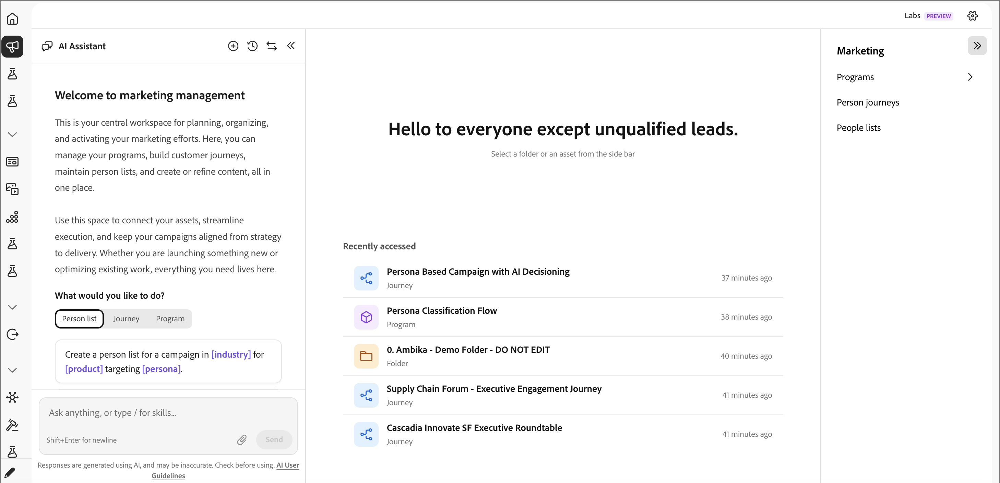

# 마케팅 관리

왼쪽 탐색에서 _마케팅 관리_ 아이콘(메가폰)을 선택하여 마케팅 계획, 구성 및 활성화를 위한 중앙 작업 영역을 엽니다. 여기에서 [프로그램](./programs.md)을 관리하고, [여정](./person-journeys.md)을 빌드하고, [사람 목록](../audiences/people-lists.md)을 유지 관리하고, [컨텐츠](../content/digital-asset-management.md)를 만들 수 있습니다. 모두 한 곳에서 가능합니다.

마케팅 관리에서는 3개 영역 레이아웃, 즉 왼쪽에 채팅 패널, 중앙에 작업 공간 및 오른쪽에 프로그램 트리를 사용합니다.

{width="800" zoomable="yes"}

## 채팅 패널 {#chat-panel}

채팅 패널이 귀하의 작업과 함께 실행되므로 [AI Assistant](../agents/chat-interface.md)에게 컨텍스트 내에서 작업을 수행하도록 요청할 수 있습니다. 패널 헤더에는 다음 컨트롤이 포함되어 있습니다.

| 컨트롤 | 설명 |
|---------|-------------|
| **새 대화** | 새로운 대화를 시작하세요. |
| **대화 기록** | 지난 대화를 검색하고 다시 엽니다. |
| **패널 교체** | 채팅 패널을 다른 쪽으로 전환합니다. |
| **축소** | 작업 영역 공간을 최대화하려면 패널을 숨깁니다. |

입력한 내용은 _무엇이든 묻거나 기술을 입력하십시오..._ 작업 영역에서 에셋을 선택한 경우 입력한 내용이 컨텍스트 인식(예: _에셋 이름 &quot;[에셋 이름]&quot;에 대해 묻기..._)이 되므로 현재 보고 있는 내용에 바로 질문이 적용됩니다.

## 작업 영역 {#workspace}

중앙 작업 영역은 에셋을 보고 편집할 수 있도록 여는 위치입니다.

아무 것도 선택하지 않으면 작업 영역에 시작 상태가 표시됩니다. **다시 시작합니다. 수익이 생성되지 않습니다.** — 프로그램 트리에서 폴더 또는 자산을 선택하라는 메시지가 표시됩니다.

- **최근에 액세스함** — [여정](./person-journeys.md), [프로그램](./programs.md) 및 가장 최근에 작업한 폴더 목록이며, 각 폴더에는 상대적 타임스탬프가 있습니다. 행을 클릭하여 다시 엽니다.
- **자산 보기** — 프로그램 트리에서 항목을 선택하면 작업 영역에서 세부 정보가 열립니다.
- **인벤토리 페이지** — 폴더 또는 프로그램을 선택하면 해당 콘텐츠의 인벤토리 테이블([프로그램](./programs.md), [여정](./person-journeys.md), [사람 목록](../audiences/people-lists.md), 전자 메일 등)이 표시됩니다. 인벤토리 테이블은 열 크기 조정, 열 표시/숨기기, 정렬 및 검색을 지원합니다. 예를 들어 사람 목록을 선택하면 구성원 인벤토리가 열립니다.

## 프로그램 트리 {#program-tree}

오른쪽 패널에는 마케팅 관련 에셋의 탐색 트리가 표시됩니다. 다음과 같은 기능을 사용할 수 있는 도구를 제공합니다.

- 맨 위에 있는 **프로그램 만들기** 단추([프로그램](./programs.md) 참조).
- 이름별로 자산을 찾는 **검색** 상자입니다.
- _마케팅 활동/기본_&#x200B;에 루트가 있는 계층 구조 폴더 트리로서, 폴더, [프로그램](./programs.md) 및 [여정](./person-journeys.md)을(를) 포함합니다. 드릴인할 폴더를 확장하십시오. 각 행의 **..** 메뉴는 자산별 작업을 표시합니다.

프로그램 트리에서 항목을 선택하여 중앙 작업 영역에서 세부 정보를 엽니다.
