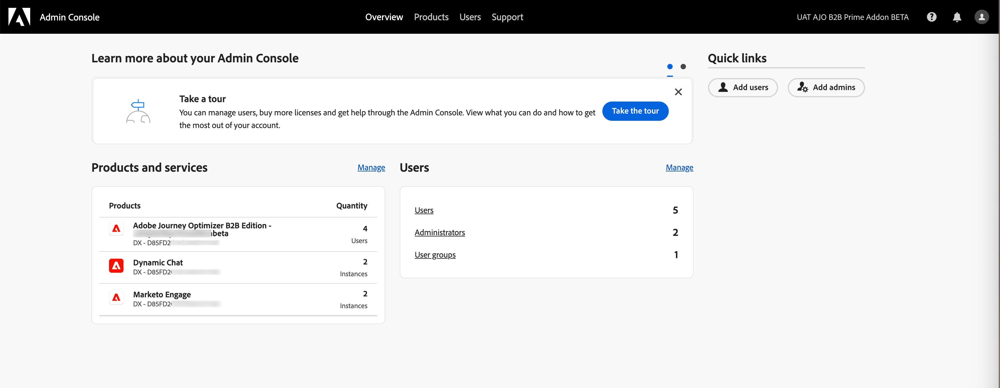
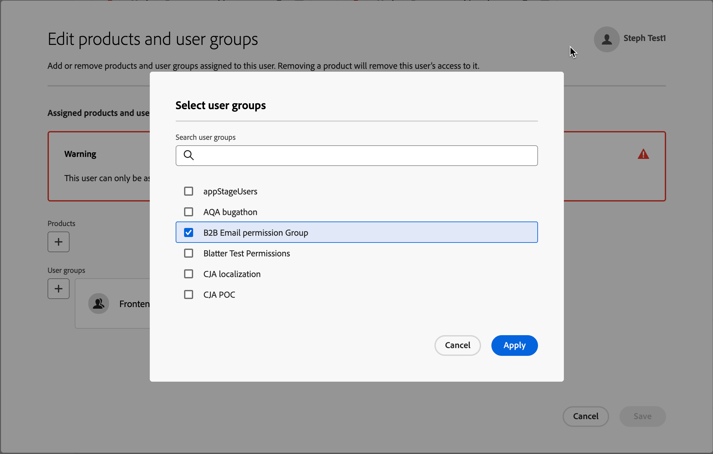
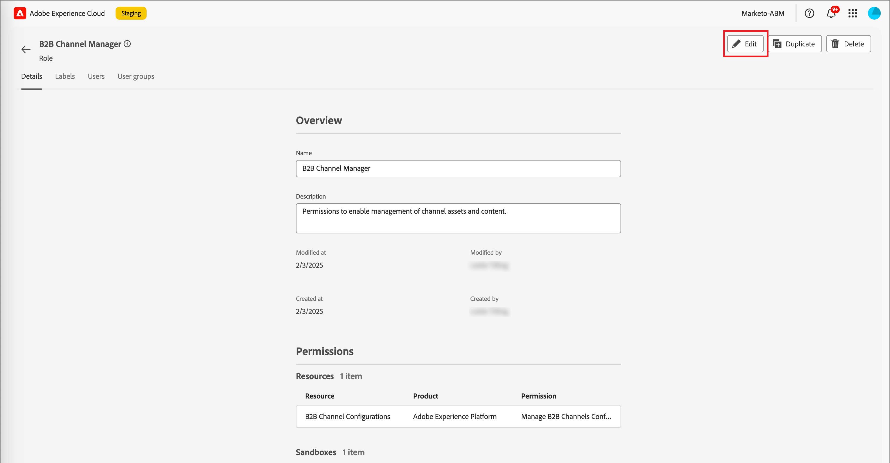

# 사용자 액세스 및 권한

프로비저닝이 완료되고 샌드박스가 바인딩되면 다음 단계를 완료하여 팀과 사용자에게 Adobe Journey Optimizer B2B edition 액세스를 제공합니다.

1. Admin Console에서 [Adobe Journey Optimizer B2B edition 제품 프로필 만들기](#create-profile)(1회/초기 설정만 해당).
1. Admin Console에서 [사용자 그룹 추가](#add-user-group).
1. Adobe Experience Platform 권한에서 Journey Optimizer B2B edition 권한을 사용하여 [기본 제공 역할을 편집](#edit-role-permissions) 또는 [사용자 지정 역할을 만들기](#create-a-custom-role)합니다.
1. Adobe Experience Platform의 역할에 [사용자 추가](#add-users-to-a-role) 또는 [그룹](#add-user-groups-to-a-role).

## 제품 프로필 구성 {#config-profile}

관리자는 Adobe 제품 라이선스와 사용자를 관리하고 관리하는 중앙 위치인 Adobe Admin Console에서 이러한 작업을 완료할 수 있습니다. Admin Console에서는 다양한 개별 솔루션 내부가 아닌 단일 위치에서 사용자를 만들고 관리할 수 있습니다. 기능 및 기능에 대한 자세한 내용은 [Admin Console 개요](https://helpx.adobe.com/kr/enterprise/using/admin-console.html) 페이지를 참조하세요.

### Admin Console 액세스 {#admin-console}

Admin Console을 사용하여 팀 내의 사용자를 관리하려면 먼저 Admin Console에 액세스하고 적절한 권한을 보유할 수 있는지 확인해야 합니다.

1. 시스템 관리자는 온보딩 프로세스의 일부로 Adobe에서 여러 개의 이메일을 수신해야 합니다.

   액세스 권한이 부여된 조직 이름에 대한 정보를 제공하는 시작 이메일을 찾습니다.

1. 시작 이메일의 **[!UICONTROL 시작하기]** 링크를 클릭하여 Admin Console으로 이동합니다.

   이메일을 찾을 수 없는 경우 [https://adminconsole.adobe.com](https://adminconsole.adobe.com)에서 Admin Console으로 직접 브라우저를 엽니다.

1. Adobe ID을 사용하여 로그인합니다.

   로그인에 성공하면 Adobe Admin Console의 _개요_ 페이지가 표시됩니다.

1. 여러 조직에 대한 액세스 권한이 있는 경우 올바른 조직에 로그인했는지 확인하십시오.

   조직을 변경하려면 오른쪽 상단에서 조직 이름을 클릭하고 액세스가 필요한 조직을 선택합니다.

1. 시스템 관리자인지 확인하려면 _[!UICONTROL 사용자]_ 카드에서 **[!UICONTROL 관리자]**&#x200B;를 선택하십시오.

   {width="800" zoomable="yes"}

1. Adobe ID 이메일, 사용자 이름, 이름 또는 성을 입력하여 검색합니다.

   * 액세스가 올바르게 구성된 경우 검색은 레코드를 반환합니다.

   * **[!UICONTROL 관리자 역할]** 열의 값에 `System`이(가) 표시되면 사용자(또는 표시된 사용자)가 시스템 관리자임을 알 수 있습니다.

### Adobe Journey Optimizer B2B edition 제품 프로필 만들기 {#create-profile}

사용자에게 Adobe 솔루션에 대한 액세스 권한을 부여할 때 반드시 전체 액세스 권한을 부여할 필요는 없습니다. 제품 프로필을 사용하면 각 솔루션이 고유한 사용자 권한 집합을 가질 수 있습니다. Admin Console을 사용하여 제품 프로필을 할당합니다.

사용자 자격에 제품 프로필을 사용하는 방법에 대한 자세한 내용은 Admin Console 설명서에서 [_기업 사용자에 대한 제품 프로필 관리_](https://helpx.adobe.com/kr/enterprise/using/manage-product-profiles.html){target="_blank"}를 참조하십시오.

{width="30"} 시스템 관리자 또는 Adobe Journey Optimizer B2B edition 제품 관리자는 [https://adminconsole.adobe.com](https://adminconsole.adobe.com)에서 다음 단계를 수행할 수 있습니다.

1. **[!UICONTROL 제품]** 탭을 선택합니다.

1. 프로필을 추가할 Adobe Journey Optimizer B2B edition 인스턴스를 열고 **[!UICONTROL 새 프로필]**&#x200B;을 클릭합니다.

   {width="600" zoomable="yes"}

1. _B2B 사용자_&#x200B;와 같은 제품 프로필 이름을 입력하십시오.

1. **[!UICONTROL 다음]**&#x200B;을 클릭한 다음 **[!UICONTROL 저장]**&#x200B;을 클릭합니다.

### 사용자 그룹 추가 {#add-user-group}

사용자 그룹은 공유 사용 권한 집합이 부여된 사용자 컬렉션입니다. 사용자 그룹의 사용자를 추가하거나 제거할 수 있습니다. 그룹 내의 사용자가 변경되는 동안 그룹 권한은 동일하게 유지됩니다.

사용자 그룹을 사용하여 권한을 관리하는 방법에 대한 자세한 내용은 Admin Console 설명서에서 [사용자 그룹 관리](https://helpx.adobe.com/kr/enterprise/using/user-groups.html){target="_blank"}를 참조하십시오.

{width="30"} 시스템 관리자는 [https://adminconsole.adobe.com](https://adminconsole.adobe.com)에서 다음 단계를 수행할 수 있습니다.

1. **[!UICONTROL 사용자]** 탭을 선택합니다.

1. 왼쪽 탐색에서 **[!UICONTROL 사용자 그룹]**&#x200B;을 선택합니다.

1. 오른쪽 상단의 **[!UICONTROL 새 사용자 그룹]**&#x200B;을 클릭합니다.

1. _B2B 여정 사용자_&#x200B;와 같은 사용자 그룹의 이름을 입력하고 **[!UICONTROL 저장]**&#x200B;을 클릭합니다.

   {width="600" zoomable="yes"}

### 제품 프로필 할당 {#assign-profile}

{width="30"} 제품 관리자는 [https://adminconsole.adobe.com](https://adminconsole.adobe.com)에서 다음 단계를 수행할 수 있습니다.

1. 생성한 사용자 그룹을 클릭합니다.

1. **[!UICONTROL 할당된 제품 프로필]** 탭을 선택하고 **[!UICONTROL 프로필 할당]**&#x200B;을 클릭합니다.

1. **+**&#x200B;을(를) 클릭하고 다음 제품의 각 인스턴스를 추가합니다.

   * [!UICONTROL Adobe Journey Optimizer B2B edition - 사용자 프로필]
   * [!UICONTROL Adobe Experience Platform - AEP-Default-All-Users]
   * [!UICONTROL Adobe Experience Platform 데이터 수집 - 기본 데이터 수집 모든 액세스]
   * [!UICONTROL Adobe Experience Platform - 기본 프로덕션 모든 액세스]

   {width="600" zoomable="yes"}

1. **[!UICONTROL 저장]**&#x200B;을 클릭합니다.

### 새 그룹에 사용자 추가 {#add-users}

사용자 관리에 대한 자세한 내용은 Admin Console 설명서에서 [_Adobe Admin Console 사용자_](https://helpx.adobe.com/kr/enterprise/using/users.html){target="_blank"}를 참조하십시오.

{width="30"} 시스템 관리자 또는 제품 관리자는 [https://adminconsole.adobe.com](https://adminconsole.adobe.com)에서 다음 단계를 수행할 수 있습니다. 제품 관리자는 해당 조직에 이미 존재하는 사용자만 추가할 수 있습니다.

1. 사용자가 아직 조직의 멤버가 아닌 경우 각 사용자를 추가합니다.

   * _[!UICONTROL 빠른 링크]_&#x200B;에서 **[!UICONTROL 사용자 추가]**&#x200B;를 클릭합니다.

   * 사용자의 전자 메일 주소를 입력하고 **[!UICONTROL 새 사용자로 추가]**&#x200B;를 클릭합니다.

     {width="600" zoomable="yes"}

   * 이름과 성을 입력한 다음 **[!UICONTROL 저장]**&#x200B;을 클릭합니다.

1. 그룹에 각 사용자를 추가합니다.

   * 사용자 이름을 클릭합니다.

   * 사용자 세부 정보 페이지에서 **[!UICONTROL 사용자 그룹]**(으)로 스크롤합니다.

   * 왼쪽의 _자세히_( **...**) 아이콘을 클릭하고 **[!UICONTROL 사용자 그룹 편집]**&#x200B;을 선택합니다.

   * **[!UICONTROL 사용자 그룹]** 아래의 _추가_( **+**) 아이콘을 클릭합니다.

     {width="600" zoomable="yes"}

   * 이전에 만든 사용자 그룹을 선택하고 **[!UICONTROL 적용]**&#x200B;을 클릭합니다.

   * 사용자 변경 내용을 보려면 **[!UICONTROL 저장]**&#x200B;을 클릭하세요.

## 제품 권한 할당 {#assign-product-permissions}

권한은 제품 프로필에 할당된 권한을 정의할 수 있는 단일 권한입니다. 각 권한은 [!DNL Journey Optimizer B2B Prime]의 기능을 나타내는 여정 또는 구매 그룹과 같은 기능으로 그룹화됩니다.

Adobe Experience Platform의 _권한_ 영역에서 관리자는 사용자 역할과 액세스 정책을 정의하여 제품 응용 프로그램 내의 기능 및 개체에 대한 액세스 권한을 관리할 수 있습니다. 이 앱에서는 역할을 만들고 관리하며, 이러한 역할에 대해 원하는 리소스 권한을 할당할 수 있습니다. 또한 권한을 사용하여 특정 역할과 연관된 샌드박스 및 사용자를 관리할 수 있습니다.

Experience Platform의 역할 권한에 대한 자세한 내용은 Experience Platform 설명서에서 [역할에 대한 권한 관리](https://experienceleague.adobe.com/ko/docs/experience-platform/access-control/abac/permissions-ui/permissions){target="_blank"}를 참조하십시오.

1. [experience.adobe.com](https://experience.adobe.com/)&#x200B;(으)로 이동합니다.

1. _[!UICONTROL 빠른 액세스]_ 패널에서 **[!UICONTROL 권한]**&#x200B;을 선택합니다.

   >[!NOTE]
   >
   >_[!UICONTROL 권한]_&#x200B;이 표시되지 않으면 **[!UICONTROL 모두 보기]**&#x200B;를 클릭하고 사용 가능한 응용 프로그램에서 선택해야 할 수 있습니다.

   {width="700" zoomable="yes"}

<!--

### B2B product permissions {#b2b-product-permissions}

The following permissions govern access to Journey Optimizer B2B Edition capabilities:

| Category | Description | Permissions |
| -------- | ----------- | ---------- |
| B2B Account Lists | Configure, manage, view, and publish permissions for B2B account lists. These permissions include actions such as add, remove, import, and delete accounts from account lists. | <li>Manage B2B Account Lists |
| B2B Admin Configurations | Configure, manage, and view permissions for B2B administrative configurations. These permissions include digital asset management connections, asset repositories, and events. | <li>Manage B2B Admin Configurations |
| B2B Assets | Configure, manage, and view permissions for B2B assets. These permissions include emails, SMS, landing pages, fragments, templates, and images. | <li>Manage B2B Assets <li>Manage B2B Templates <li>Manage B2B Fragments <li>Manage B2B Emails |
| B2B Buying Groups | Configure, manage, and view permissions for B2B buying groups. These permissions include solution interests, roles templates, and buying group status. | <li>Manage B2B Buying Groups <li>Manage B2B Solution Interests <li>Manage B2B Role Templates <li>Manage B2B Stages <li>View B2B Buying Groups |
| B2B Channel Configurations | Configure, manage, and view permissions for B2B channel configurations. These permissions include settings for communication limits, API credentials, and security settings. | <li>Manage B2B Channels Configurations |
| B2B Dashboards | Configure and view permissions for B2B dashboards. These permissions include account engagement, buying group stages, surging accounts, and contact coverage. | <li>View B2B Engagement Dashboard |
| B2B Journeys | Configure, manage, view, and publish permissions for B2B journeys. These permissions include account and person actions, event listeners, and split paths. | <li>Manage B2B Account Journeys |
| Journey Optimizer Rules | Access and configure frequency rules (communication limits). These permissions should be limited to product administrators. | <li>View Frequency Rules <li>Manage Frequency Rules |

### B2B built-in roles {#b2b-built-in-roles}

When your organization has the Journey Optimizer B2B Edition product provisioned, Experience Platform includes a set of built-in (default) roles that you can use to manage access to the product capabilities:

| Role | Permissions |
| ---- | ----------- |
| B2B Journey Manager | <li>Manage B2B Journeys <li>Manage B2B Buying Groups <li>Manage B2B Account Lists <li>View B2B Engagement Dashboard <li>View B2B Insights Dashboard |
| B2B Channel Manager | <li>Manage B2B Assets <li>Manage B2B Templates <li>Manage B2B Fragments |
| B2B System Administrator | <li>Manage B2B Channels Configurations <li>Manage B2B Admin Configurations |
| B2B Sales User | <li>View B2B Engagement Dashboard <li>View B2B Buying Groups <li>Access In-CRM Insights |

-->

### 역할 권한 편집 {#edit-role-permissions}

기본 제공 또는 사용자 지정 역할의 경우 언제든지 권한을 추가하거나 삭제할 것을 결정할 수 있습니다. 기본 또는 사용자 정의 역할을 수정하는 경우 해당 역할에 할당된 모든 사용자에게 영향을 줍니다.

다음 예에서는 B2B 채널 관리자 역할에 할당된 사용자의 B2B 여정 리소스와 관련된 권한을 추가하려고 합니다. 이 변경 사항을 통해 해당 역할의 사용자는 계정 여정을 관리할 수도 있습니다.

>[!NOTE]
>
>Admin Console 시스템 관리자는 다음 단계를 수행할 수 있습니다.

:_역할에 대한 권한을 변경하려면(_T)

1. 왼쪽 탐색에서 **[!UICONTROL 역할]**&#x200B;을(를) 선택합니다.

1. **_B2B 채널 관리자_** 역할 이름을 클릭합니다.

1. 세부 정보 페이지에서 오른쪽 상단의 **[!UICONTROL 편집]**&#x200B;을 클릭합니다.

   {width="700" zoomable="yes"}

   역할 편집기에서 _[!UICONTROL 리소스]_ 메뉴에 Experience Cloud - Platform 기반 응용 프로그램 제품에 적용되는 리소스 목록이 표시됩니다.

   검색 도구에 _B2B_&#x200B;을(를) 입력하여 B2B 제품 권한 목록을 필터링할 수 있습니다.

1. B2B 여정 리소스에 대한 _추가_ 아이콘(**+**)을 클릭합니다.

   {width="700" zoomable="yes"}

1. _[!UICONTROL B2B 여정]_ 권한 카드에서 **[!UICONTROL B2B 계정 여정 관리]**&#x200B;를 선택합니다.

1. **[!UICONTROL 저장]**&#x200B;을 클릭합니다.

   <!-- {width="700" zoomable="yes"} -->

1. 세부 정보 페이지로 돌아가려면 **[!UICONTROL 닫기]**&#x200B;를 클릭하십시오.

### 역할에 사용자 추가 {#add-users-to-a-role}

{width="30"} 시스템 관리자 또는 AEP 제품 관리자는 다음 단계를 수행할 수 있습니다.

1. 역할 세부 정보를 열고 **[!UICONTROL 사용자]** 탭을 선택합니다.

   이 탭에는 역할에 할당된 모든 사용자 목록이 표시됩니다.

1. **[!UICONTROL 사용자 추가]**&#x200B;를 클릭합니다.

   {width="700" zoomable="yes"}

1. _[!UICONTROL 사용자 추가]_ 대화 상자에서 역할에 추가할 사용자를 찾아 선택합니다.

   * 검색 도구를 사용하여 사용자 목록을 필터링할 수 있습니다.

   * 각 사용자에 대한 확인란을 선택합니다.

   {width="600" zoomable="yes"}

1. 추가할 모든 사용자를 선택한 경우 **[!UICONTROL 저장]**&#x200B;을 클릭합니다.

### 역할에 사용자 그룹 추가 {#add-user-groups-to-a-role}

사용자 관리에 대한 자세한 내용은 Admin Console 설명서에서 [_Adobe Admin Console 사용자_](https://helpx.adobe.com/kr/enterprise/using/users.html){target="_blank"}를 참조하십시오.

{width="30"} 시스템 관리자 또는 AEP 제품 관리자는 다음 단계를 수행할 수 있습니다.

1. 역할 세부 정보를 열고 **[!UICONTROL 사용자 그룹]** 탭을 선택합니다.

   이 탭에는 역할에 할당된 모든 사용자 그룹 목록이 표시됩니다.

1. **[!UICONTROL 그룹 추가]**&#x200B;를 클릭합니다.

   {width="700" zoomable="yes"}

1. _[!UICONTROL 그룹 추가]_ 대화 상자에서 역할에 추가할 그룹을 찾아 선택합니다.

   * 검색 도구를 사용하여 사용자 그룹 목록을 필터링할 수 있습니다.

   * 각 사용자 그룹에 대한 확인란을 선택합니다.

   {width="600" zoomable="yes"}

1. 추가할 모든 그룹을 선택한 경우 **[!UICONTROL 저장]**&#x200B;을 클릭합니다.

### 사용자 정의 역할 만들기 {#create-a-custom-role}

{width="30"} 시스템 관리자 또는 AEP 제품 관리자는 다음 단계를 수행할 수 있습니다.

1. 왼쪽 탐색에서 **[!UICONTROL 역할]**&#x200B;을(를) 선택하고 **[!UICONTROL 역할 만들기]**&#x200B;를 선택합니다.

1. _[!UICONTROL 새 역할 만들기]_ 대화 상자에서 _B2B 마케터_&#x200B;와 같은 역할 이름과 설명(선택 사항)을 입력합니다.

1. **[!UICONTROL 확인]**&#x200B;을 클릭합니다.

1. 샌드박스를 선택합니다.

   {width="700" zoomable="yes"}

1. B2B 제품 권한 추가:

   <!-- To determine which product capabilities that you want for the role, refer to the list of [B2B product permissions](#b2b-product-permissions). -->

   왼쪽의 _[!UICONTROL 리소스]_ 목록에서 B2B 항목을 찾은 다음 _추가_(**+**) 아이콘을 클릭하여 역할에 사용할 각 특성을 추가합니다.

   검색 도구에 _B2B_&#x200B;을(를) 입력하여 B2B 제품 권한 목록을 필터링할 수 있습니다.

   {width="700" zoomable="yes"}

1. 오른쪽 상단의 **[!UICONTROL 저장]**&#x200B;을 클릭합니다.

1. 역할 세부 정보로 이동하여 **[!UICONTROL 사용자 그룹]** 탭을 선택합니다.

1. **[!UICONTROL 그룹 추가]**&#x200B;를 클릭합니다.

   {width="700" zoomable="yes"}

1. 이전에 Admin Console에서 만든 사용자 그룹 옆의 확인란을 선택합니다.

1. **[!UICONTROL 저장]**&#x200B;을 클릭합니다.

사용자 정의 역할이 구성되었으며 할당된 그룹의 사용자가 이제 선택한 Journey Optimizer B2B edition 기능에 액세스할 수 있습니다.
