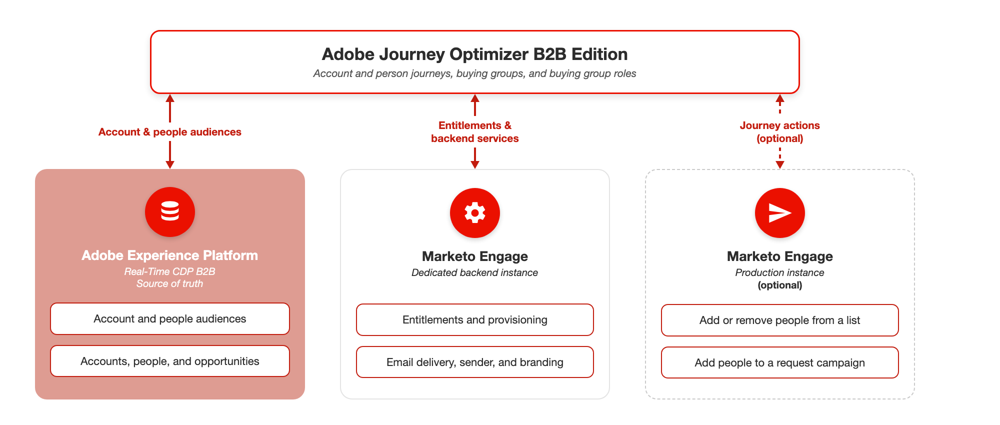

# Adobe Journey Optimizer B2B Edition 개요

Adobe Journey Optimizer B2B edition을 사용하면 내장된 생성 AI 및 업계 선두의 자동화를 사용하여 개인 및 계정 여정을 통합 관리하여 마케팅 자격을 갖춘 구매 그룹을 사용하여 특정 오퍼링에 대한 수요를 극대화할 수 있습니다.

## 구매 그룹과 계정 여정

계정 여정을 Marketo Engage 및 Adobe Journey Optimizer standard의 여정 기능과 비교할 때 중요한 차이점은 계정 여정이 사람이 아닌 여정을 통해 계정을 이동한다는 것입니다. 일반적으로 계정에 연결된 사람은 개인적인 행동이 아닌 계정의 여정 진행 상태에 따라 비선형적으로 진행됩니다. 예를 들어 계정이 구매 여정 초기 단계에 있는 경우 전송되는 정보는 일반적으로 일반적인 솔루션 기능에 대한 것입니다. 구매 프로세스가 진행됨에 따라 콘텐츠는 특정 오퍼 또는 판매 종료에 맞춰진 다른 항목에 더 많이 타겟팅됩니다. 솔루션을 구입하면 정보가 다시 변경되어 사용 방법 안내서, 모범 사례, 예정된 이벤트에 대한 정보 또는 추가 업셀링에 대한 콘텐츠를 제공합니다. 개인이 초기 단계 콘텐츠와 상호 작용하지 않았더라도 계정 또는 구매 그룹 내 다른 사람의 작업을 기반으로 현재 단계로 진행할 수 있습니다.

## 고차원의 아키텍처

Adobe Journey Optimizer B2B edition은 Real-Time CDP B2B를 포함하여 Adobe Experience Platform을 기반으로 합니다. Journey Optimizer B2B edition 및 Marketo Engage은 각각 고유한 데이터 저장소가 있는 별도의 시스템에서 실행됩니다. Experience Platform은 계정, 사용자 및 기회에 대한 신뢰할 수 있는 기본 데이터 저장소입니다. Journey Optimizer B2B edition은 계정 여정, 구매 그룹 및 구매 그룹 역할을 소유합니다.

전용 Marketo Engage 인스턴스는 각 Journey Optimizer B2B edition 구독을 지원합니다. 이 인스턴스는 계정 여정, 대상자 또는 구매 그룹을 저장하지 않습니다. 대신 이메일 게재, 발신자 구성 및 브랜딩 도메인과 같은 자격 및 백엔드 서비스를 제공합니다.

여정 작업을 지원하기 위해 프로덕션 인스턴스를 포함하여 하나 이상의 기존 Marketo Engage 인스턴스를 연결할 수도 있습니다. 여정 작업을 사용하면 마케터가 Journey Optimizer B2B edition의 계정 기반 여정과 Marketo Engage의 리드 기반 캠페인(예: 목록 또는 요청 캠페인에 사용자 추가)을 조정할 수 있습니다. [Marketo Engage 인스턴스 연결에 대해 자세히 알아보세요](./admin/marketo-actions-connect.md).

{zoomable="yes"}

>[!NOTE]
>
>라이선스 자격 및 해당 [제품 설명](https://helpx.adobe.com/kr/legal/product-descriptions/adobe-journey-optimizer-b2b.html){target="_blank"}에서 성능 보호 및 정적 제한 사항을 확인하십시오.

### 구독 모델

전용 Marketo Engage 인스턴스와 쌍을 이루는 Experience Platform 샌드박스는 Journey Optimizer B2B edition 구독을 정의합니다. 이 전용 인스턴스는 프로덕션 Marketo Engage 인스턴스와 별개이며 계정 여정 데이터를 저장하는 대신 자격 및 백엔드 서비스를 지원하기 위해 존재합니다. [설정에 대해 자세히 알아보세요](./setup-ultimate.md).

Experience Platform은 연결된 Marketo Engage 인스턴스 및 CRM 시스템의 데이터를 통합적으로 볼 수 있도록 합니다. 이러한 통합 데이터를 사용하여 여정을 작성하고 실행합니다.

### 여정 작업

Journey Optimizer B2B edition은 계정 여정을 생성, 저장 및 실행합니다. 계정 여정은 Marketo Engage에 표시되지 않으며 Journey Optimizer B2B edition에서만 사용할 수 있습니다.

여정은 항상 잠재 고객 또는 계정과 해당 직원의 여정 자격을 부여하는 대상자로 시작합니다. 표준 Experience Platform 대상 선택기를 사용하여 이 대상을 선택합니다. 마케터는 여정 기준, 사람 기준 또는 구매 그룹 기준을 사용하여 경로를 분할하여 계정을 구현합니다. 각 경로에서 작업이 통신을 보내거나 이벤트가 발생할 때까지 기다립니다.

계정 여정을 만든 후 게시하여 여정을 라이브로 만듭니다. 자격 부여 계정은 24시간 이내에 게시된 여정을 입력합니다.

### 데이터 흐름

Journey Optimizer B2B edition은 Adobe Real-Time CDP B2B edition 대상으로 작동합니다. Real-Time CDP 계정 세그멘테이션을 사용하여 계정 및 직원에게 여정 자격을 부여하는 계정 대상자 및 사람 대상자를 만들고 평가합니다. 여정을 게시하면 Journey Optimizer B2B edition이 Experience Platform에서 자격을 갖춘 대상을 활성화합니다.

구매 그룹, 구매 그룹 역할 및 구매 그룹 점수가 생성되어 Journey Optimizer B2B edition에 저장됩니다. [그룹 구매에 대해 자세히 알아보세요](./buying-groups/buying-groups-overview.md).
