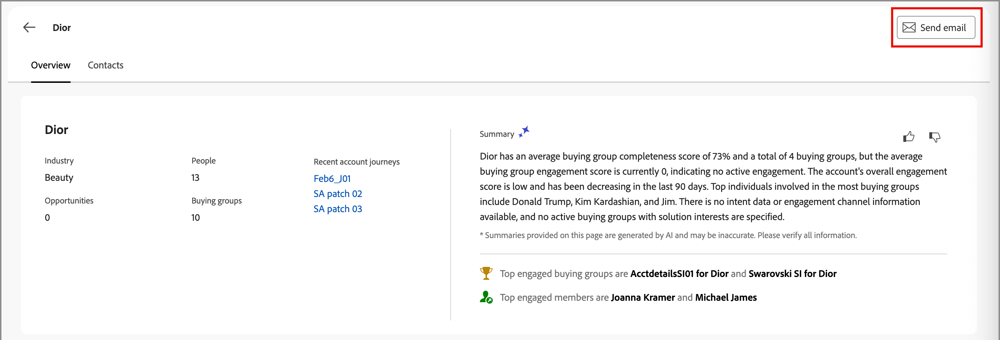

# 계정 세부 정보

Journey Optimizer B2B edition의 아무 곳에서나 계정 이름을 클릭하면 _계정 세부 정보_ 페이지가 표시됩니다. 이 페이지는 생성 AI 요약을 포함하여 계정에 대한 유용한 정보를 제공합니다. 계정과 연결된 연락처에 대해 실행할 수 있는 [작업](#account-actions)도 있습니다.

{width="700" zoomable="yes"}

**[!UICONTROL 개요]** 탭을 사용하여 계정에 대한 정보를 검토하고 **[!UICONTROL 연락처]** 탭을 사용하여 계정 연락처 목록에 액세스합니다.

## [!UICONTROL 개요] 탭

계정 세부 정보 페이지는 세 개의 기본 섹션으로 구성됩니다.

### 계정 개요

{zoomable="yes"}

계정 개요 섹션에는 다음 계정 정보가 포함됩니다.

* 계정 이름
* 계정의 사용자 수
* 업종
* 기회 열기
* 계정이 현재 사용 중인 최근 계정 여정 세 개(여정 이름을 클릭하여 [여정 개요](../journeys/journeys-overview.md)를 여십시오.)
* 참여 상위 구매 그룹에 대한 정보가 포함된 계정의 생성 AI 요약입니다.

### 의도 데이터

Journey Optimizer B2B edition에서 의도 감지 모델은 계정 연락처 활동을 기반으로 충분히 높은 신뢰도로 관심 있는 솔루션/제품을 예측합니다. 거래처 접점의 의도는 상품에 관심이 있을 확률로 해석할 수 있다.

{{intent-data-note}}

{width="700" zoomable="yes"}

* 의도 수준
* 의도 신호 유형 - 키워드, 제품 및 솔루션

### 연락처 범위

{width="800" zoomable="yes"}

_[!UICONTROL 연락처 범위]_ 섹션에는 솔루션 관심사와 관련된 특정 역할을 가진 계정의 연락처 수가 표시됩니다. 역할 및 솔루션 관심사 할당은 구매 그룹 역할 템플릿을 기반으로 합니다. 셀을 눌러 다음 세부 정보를 표시합니다.

* 설명, 다음 형식입니다. _x명의 사용자에게 z 솔루션 관심 영역에 대한 y 역할이 있음_
* 열
* 이름
* 계정
* 직위
* 구매 그룹
* 개인 참여 점수
* 마지막 활동
* 세부 사항

다음 특성을 사용하여 데이터 표시를 필터링하려면 왼쪽 상단의 _필터_( ) 아이콘을 클릭하십시오.

* 솔루션 관심 분야
* 기간

### 연락처 중복

{width="800" zoomable="yes"}

_[!UICONTROL 연락처 겹치기]_ 섹션에는 여러 솔루션 관심 분야와 연결된 결과 둘 이상의 구매 그룹에 속하는 계정의 연락처가 표시됩니다. 이 정보는 다음 열이 있는 표 형식입니다.

* 이름
* 직위
* 계정
* 솔루션 관심 분야

연락처 이름 옆의 _정보_(  )을 클릭하여 다음 세부 정보가 포함된 표를 표시합니다.

* 구매 그룹([구매 그룹 세부 정보를 열려면 이름을 클릭하세요](../buying-groups/buying-group-details.md))
* 역할
* 솔루션 관심 분야
* 제품 의도([구성됨](../admin/intent-data.md)인 경우)
* 제품

다음 특성을 사용하여 데이터 표시를 필터링하려면 왼쪽 상단의 _필터_( ) 아이콘을 클릭하십시오.

* 솔루션 관심 분야
* 역할

## [!UICONTROL 연락처] 탭

**[!UICONTROL 연락처]** 탭을 선택하여 Experience Platform에 동기화되는 계정과 관련된 모든 사람 목록을 확인합니다. 나열된 각 연락처에는 이름, 이메일 주소 및 참여 점수가 포함됩니다.

{width="700" zoomable="yes"}

## 이메일 보내기

하나 이상의 선택한 연락처(한 번에 최대 50개)나 계정의 모든 연락처에 마케터가 승인한 이메일을 보낼 수 있습니다. 사용 가능한 이메일 목록은 연결된 Marketo Engage 인스턴스의 승인된 이메일로 제한됩니다.

>[!BEGINTABS]

>[!TAB 모든 계정 연락처]

1. _[!UICONTROL 개요]_ 탭에서 오른쪽 상단의 **[!UICONTROL 전자 메일 보내기]**&#x200B;를 클릭합니다.

   {width="700" zoomable="yes"}

1. _[!UICONTROL 전자 메일 보내기]_ 대화 상자에서 Marketo Engage 작업 영역을 선택한 다음 보낼 전자 메일의 확인란을 선택합니다.

   {width="700" zoomable="yes"}

1. **[!UICONTROL 보내기]**&#x200B;를 클릭합니다.

>[!TAB 선택한 연락처]

1. _[!UICONTROL 연락처]_ 탭에서 전자 메일을 받을 연락처의 확인란을 선택합니다.

1. 오른쪽 상단이나 하단의 선택 막대에서 **[!UICONTROL 전자 메일 보내기]**&#x200B;를 클릭합니다.

   {width="700" zoomable="yes"}

1. _[!UICONTROL 전자 메일 보내기]_ 대화 상자에서 Marketo Engage 작업 영역을 선택한 다음 보낼 전자 메일의 확인란을 선택합니다.

   {width="700" zoomable="yes"}

1. **[!UICONTROL 보내기]**&#x200B;를 클릭합니다.

>[!ENDTABS]
