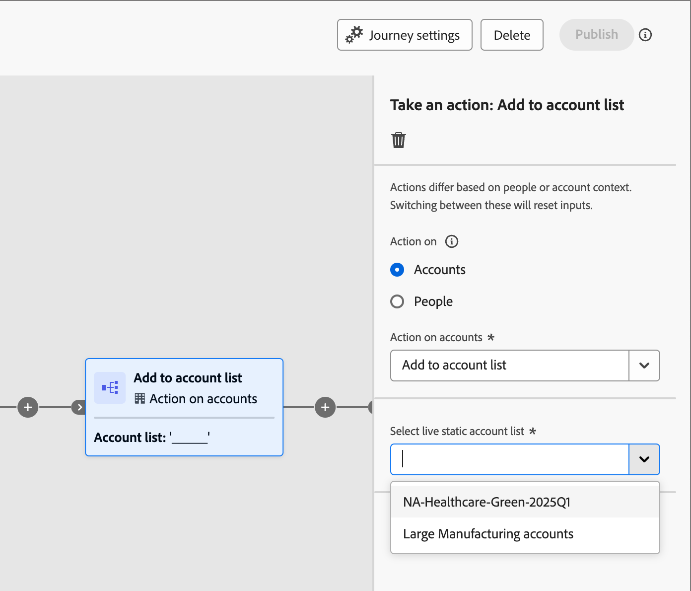

# 여정에서 계정 목록 사용

여러 가지 방법으로 라이브(게시된) 계정 목록을 계정 여정에 통합할 수 있습니다.

## 계정 대상자 노드

모든 계정 여정은 [_계정 대상자_ 노드](../journeys/account-audience-nodes.md)(으)로 시작합니다. 계정 목록을 사용하도록 이 노드를 설정하면 구성원 계정이 활성화(게시)될 때 해당 여정을 통해 이동합니다.

1. 시작 _계정 대상자_ 노드에 대해 **[!UICONTROL 계정 목록]** 옵션을 선택하십시오.

   {width="500"}

1. **[!UICONTROL 계정 목록 추가]**&#x200B;를 클릭합니다.

1. 계정 목록에 대한 확인란을 선택하고 **[!UICONTROL 저장]**&#x200B;을 클릭합니다.

   {width="600" zoomable="yes"}

## 작업 노드 - 계정에 추가

**_정적 계정 목록만_**

계정 여정 내에서 [a _작업 수행_ 노드](../journeys/action-nodes.md)을 사용하여 정적 계정 목록에 계정을 추가합니다.

예를 들어 이메일을 보내고 일부 계정이 응답으로 다양한 작업을 수행하는 여정 경로가 있습니다. 이 활동을 여정의 검증 포인트로 간주합니다. 자격 조건을 사용하면 자격 있는 계정에 대해 다른 플로우를 가진 다른 여정의 대상자로 사용되는 계정 목록에 해당 자격 조건을 추가할 수 있습니다.

>[!NOTE]
>
>노드가 실행될 때 계정이 이미 목록에 있는 경우 작업이 무시됩니다.

1. _&#x200B;**[!UICONTROL 계정]**&#x200B;에 대한_&#x200B;작업 옵션을 선택하십시오.

1. _[!UICONTROL 계정에 대한 작업]_&#x200B;의 경우 **[!UICONTROL 계정 목록에 추가]**&#x200B;를 선택하세요.

   {width="500"}

1. **[!UICONTROL 실시간 정적 계정 목록 선택]**&#x200B;의 경우 계정을 추가할 계정 목록을 선택하십시오.

   {width="500"}

## 작업 노드 - 계정에서 제거

**_정적 계정 목록만_**

계정 여정 내에서 [a _작업 수행_ 노드](../journeys/action-nodes.md)을 사용하여 정적 계정 목록에서 계정을 제거하십시오.

예를 들어 이메일을 보내고 일부 계정이 응답으로 다양한 작업을 수행하는 여정 경로가 있습니다. 이 활동을 여정의 검증 포인트로 간주합니다. 이 조건을 사용하면 계정 목록에서 제거할 수 있습니다. 이 목록은 자격 증명 커뮤니케이션이 중복되지 않도록 추가 이메일을 보내는 다른 여정의 대상자로 사용됩니다.

>[!NOTE]
>
>계정이 제거가 예약된 목록에 없으면 작업이 무시됩니다.

1. _&#x200B;**[!UICONTROL 계정]**&#x200B;에 대한_&#x200B;작업 옵션을 선택하십시오.

1. _[!UICONTROL 계정에 대한 작업]_&#x200B;의 경우 **[!UICONTROL 계정 목록에서 제거]**&#x200B;를 선택하세요.

   {width="500"}

1. **[!UICONTROL 실시간 정적 계정 목록 선택]**&#x200B;의 경우 계정을 제거할 계정 목록을 선택하십시오.

   {width="500"}
