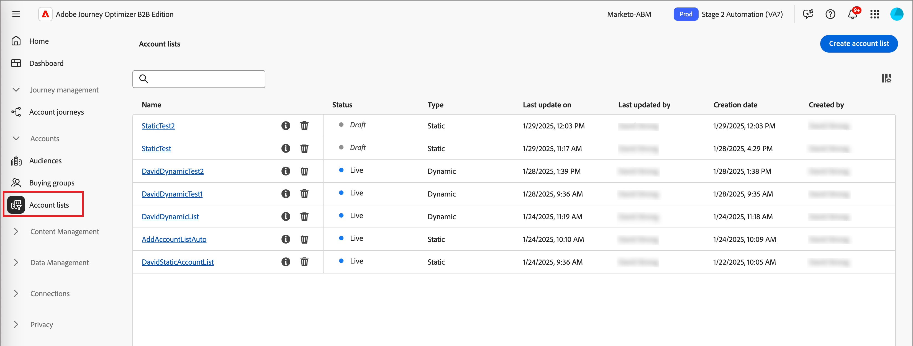

# 계정 목록

Journey Optimizer B2B edition에서 계정 목록은 마케터가 타깃팅된 여정 오케스트레이션에 사용할 수 있는 명명된 계정의 컬렉션입니다. 계정 목록은 업종, 위치 또는 회사 규모 등 정의된 기준에 따라 지정된 계정을 대상으로 할 수 있습니다. 계정 목록에는 두 가지 유형이 있습니다.

* **정적** - 정적 계정 목록이 있는 경우 계정을 추가할 때만 목록이 변경됩니다. 필터 세트를 적용하여 현재 계정 데이터를 기준으로 목록을 채워 수동으로 계정을 추가하거나 계정 여정을 통해 계정을 추가 및 제거할 수 있습니다.
* **동적** - 동적 계정 목록을 사용하여 목록을 자동으로 조정하기 위한 필터 집합을 정의합니다. 시스템은 이 필터 세트를 사용하여 계정 정보의 변경에 따라 계정을 추가하고 제거합니다. 이 목록 관리는 [실시간 고객 데이터 플랫폼의 대상 세분화](https://experienceleague.adobe.com/ko/docs/experience-platform/rtcdp/segmentation/b2b){target="_blank"}와 비슷합니다.

계정 목록이 _Live_(게시됨) 상태인 경우 [계정 여정 및 Marketo Engage 프로그램에서 사용](./account-lists-journeys.md)할 수 있습니다.

{width="30"} [비디오 개요 보기](#overview-video)

>[!NOTE]
>
>계정 목록은 Marketo Engage의 계정 데이터를 활용하여 계정 세그먼트와 목록을 만듭니다. 즉, Adobe Experience Platform의 계정 세그먼트가 Marketo Engage에 적극적으로 동기화되지 않는 경우 해당 Experience Platform 세그먼트의 계정을 Journey Optimizer B2B edition 계정 목록에서 사용할 수 없습니다. 그런 다음 Marketo Engage에 동기화된 Experience Platform 세그먼트의 계정의 사람만 개인 멤버십 수에 포함되고 이벤트가 트리거됩니다.

## 계정 목록 액세스 및 찾아보기

왼쪽 탐색에서 **[!UICONTROL 계정]**&#x200B;을 확장하고 **[!UICONTROL 계정 목록]**&#x200B;을 클릭합니다.

{width="800" zoomable="yes"}

표시된 _[!UICONTROL 계정 목록]_ 페이지에 다음 열이 포함되어 있습니다.

* [!UICONTROL 이름]&#x200B;(자세한 내용을 보려면 계정 목록 이름 클릭)
* [!UICONTROL 상태]
* [!UICONTROL 유형]
* [!UICONTROL 마지막으로 업데이트한 날짜]
* [!UICONTROL 마지막으로 업데이트한 사람]
* [!UICONTROL 만든 날짜]
* [!UICONTROL 생성자]

이 표에는 이름별로 검색하는 기능이 포함되어 있습니다. 현재 정렬 기능을 사용할 수 없습니다.

오른쪽 상단의 _열 설정_(  ) 아이콘을 클릭하고 확인란을 선택하거나 취소하여 표시된 테이블을 사용자 지정할 수 있습니다.

{width="300"}

계정 목록에 대한 설명을 보려면 이름 옆에 있는 _정보_( ) 아이콘을 클릭합니다.

## 계정 목록 만들기

계정 목록을 만들 때 필터 세트를 정의하여 목록을 생성합니다. 예를 들어, 이 데이터 소스를 사용하여 산업이 헬스케어이고 수익이 1억 달러가 넘는 계정 목록을 생성할 수 있습니다.

1. _[!UICONTROL 계정 목록]_ 페이지에서 오른쪽 상단의 **[!UICONTROL 계정 목록 만들기]**&#x200B;를 클릭합니다.

   {width="700" zoomable="yes"}

1. _[!UICONTROL 계정 목록 만들기]_ 대화 상자에서 고유한 **[!UICONTROL 이름]**(필수)과 **[!UICONTROL 설명]**(선택 사항)을 입력하십시오.

1. 계정 목록의 _[!UICONTROL Type]_, **[!UICONTROL Static]** 또는 **[!UICONTROL Dynamic]**&#x200B;을(를) 선택하십시오.

   {width="380"}

1. **[!UICONTROL 만들기]**&#x200B;를 클릭합니다.

   새 정적 계정 목록이 열리고 계정 목록이 비어 있습니다. 페이지에 _[!UICONTROL 필터별로 계정 추가]_ 패널이 있는 새 동적 계정 목록이 열립니다.

## 계정 목록에 계정 추가

정적 목록의 경우 계속 빈 계정 목록을 게시하고 계정 여정을 통해 계정을 추가할 수 있습니다. 필터 세트를 게시하기 전에 적용하여 계정을 수동으로 추가할 수도 있습니다.

동적 계정 목록의 경우 목록을 게시하기 전에 목록을 자동으로 관리하는 데 사용할 필터 세트를 추가해야 합니다.

>[!BEGINTABS]

>[!TAB 정적 계정 목록]

정적 계정 목록을 만든 후 필터 세트를 적용하여 목록을 채울 수 있습니다. 필터 집합을 적용하여 계정을 게시한 후 정적 계정 목록에 추가할 수도 있습니다(_Live_).

>[!NOTE]
>
>계정 목록이 비어 있는 것으로 시작하도록 하려면 필터를 선택하지 말고 계정 목록을 게시하십시오. 계정 여정 작업을 통해 구성원을 추가하려는 경우 빈 목록으로 시작하는 것이 유용합니다([작업 노드 사용 - 계정에 추가](#take-an-action-node---add-to-account) 참조).

1. **[!UICONTROL 계정 추가]**&#x200B;를 클릭하세요.

   {width="700" zoomable="yes"} 목록 채우기

   이 함수는 빈 목록 페이지 또는 오른쪽 상단에서 액세스할 수 있습니다.

1. _[!UICONTROL 필터별 계정 추가]_ 대화 상자에서 **[!UICONTROL 계정 필터]** 메뉴를 사용하여 필터 집합을 구성하는 데 사용할 특성 및 활동을 추가합니다.

   필터는 범주 폴더에 중첩됩니다. 각 폴더를 확장하고 사용 가능한 필터 목록을 스크롤할 수 있습니다. 또는 맨 위에 있는 _검색_ 도구를 사용하여 필요한 필터를 찾습니다.

   * 왼쪽 메뉴에서 필터를 필터 정의 공간으로 끌어서 놓습니다.
   * 일치 평가 정의를 완료합니다.
   * 포함할 각 필터에 대해 이러한 작업을 반복합니다.

     {width="700" zoomable="yes"} 채우기

   * 맨 위에 있는 **[!UICONTROL 필터 논리]**&#x200B;를 적용하여 조건을 미세 조정할 수 있습니다. 모든 속성 조건 또는 모든 조건을 일치시키도록 선택할 수 있습니다.

     {width="450"}

1. 필터 집합 및 논리가 완료되면 **[!UICONTROL 계정 채우기]**&#x200B;를 클릭하세요.

   계산 및 채울 계정 수(데이터베이스의 크기 및 선택한 필터 기준)에 따라 채우기 프로세스에 약간의 시간이 걸릴 수 있습니다. 계정이 목록에 채워지는 데 최대 2시간이 소요될 수 있습니다.

계속해서 목록을 게시하여 계정 여정에서 작업 추가 및 제거에 사용할 수 있도록 할 수 있습니다.

>[!TAB 동적 계정 목록]

동적 계정 목록을 만든 후에는 _Live_(게시됨)일 때 목록을 관리(계정 추가/제거)하는 데 사용되는 필터 집합을 정의합니다. 계정 여정을 통해 계정을 추가/제거할 수 없지만 게시된 동적 계정 목록은 시작 계정 대상자 노드에 사용할 수 있습니다.

1. **[!UICONTROL 필터 선택]**&#x200B;을 클릭합니다.

   {width="700" zoomable="yes"}

1. _[!UICONTROL 필터별 계정 추가]_ 대화 상자에서 **[!UICONTROL 계정 필터]** 메뉴를 사용하여 필터 집합을 구성하는 데 사용할 특성 및 특수 필터를 추가합니다.

   필터는 범주 폴더에 중첩됩니다. 각 폴더를 확장하고 사용 가능한 필터 목록을 스크롤할 수 있습니다. 또는 맨 위에 있는 _검색_ 도구를 사용하여 필요한 필터를 찾습니다.

   * 왼쪽 메뉴에서 필터를 필터 정의 공간으로 끌어서 놓습니다.
   * 일치 평가 정의를 완료합니다.
   * 포함할 각 필터에 대해 이러한 작업을 반복합니다.

     {width="700" zoomable="yes"} 채우기

   * 맨 위에 있는 **[!UICONTROL 필터 논리]**&#x200B;를 적용하여 조건을 미세 조정할 수 있습니다. 모든 속성 조건 또는 모든 조건을 일치시키도록 선택할 수 있습니다.

     {width="450"}

1. 필터 집합 및 논리가 완료되면 **[!UICONTROL 완료]**&#x200B;를 클릭하세요.

   필터 집합에 만족하면 [목록 게시](#publish-an-account-list)로 진행하여 계정 여정의 시작 [계정 대상 노드](#account-audience-node)에 사용할 수 있도록 할 수 있습니다.

   >[!NOTE]
   >
   >목록이 게시된 후에는 동적 계정 목록에 대한 필터를 업데이트할 수 없습니다.

   계산 및 채울 계정 수(데이터베이스의 크기 및 선택한 필터 기준)에 따라 채우기 프로세스에 약간의 시간이 걸릴 수 있습니다. 계정이 목록에 채워지는 데 최대 2시간이 소요될 수 있습니다.

>[!ENDTABS]

## 계정 목록 게시

필터 세트가 완료되는 즉시 계정 목록 게시를 진행할 수 있습니다.

>[!BEGINTABS]

>[!TAB 정적 계정 목록]

1. 오른쪽 상단의 **[!UICONTROL 게시]**&#x200B;를 클릭합니다.

   {width="700" zoomable="yes"}

1. _[!UICONTROL 정적 계정 목록 게시]_ 대화 상자에서 **[!UICONTROL 게시]**&#x200B;를 클릭하여 확인합니다.

   {width="400"}

정적 계정 목록의 상태가 _[!UICONTROL Live]_(으)로 변경되며 [계정 여정에서 사용](#account-list-usage-in-account-journeys)할 수 있습니다.

>[!TAB 동적 계정 목록]

필터 세트가 완료되는 즉시 동적 계정 목록 게시를 진행할 수 있습니다. 계정 목록이 라이브 상태이면 계정 대상자 여정 노드에서 선택할 수 있습니다.

1. 오른쪽 상단의 **[!UICONTROL 게시]**&#x200B;를 클릭합니다.

   {width="700" zoomable="yes"}

1. _[!UICONTROL 동적 계정 목록 게시]_ 대화 상자에서 **[!UICONTROL 게시]**&#x200B;를 클릭하여 확인합니다.

   {width="400"}

동적 계정 목록의 상태가 _[!UICONTROL Live]_(으)로 변경되며 [계정 여정에서 사용](#account-list-usage-in-account-journeys)할 수 있습니다.

>[!ENDTABS]

## 개요 비디오

>[!VIDEO](https://video.tv.adobe.com/v/3448636/?learn=on)
