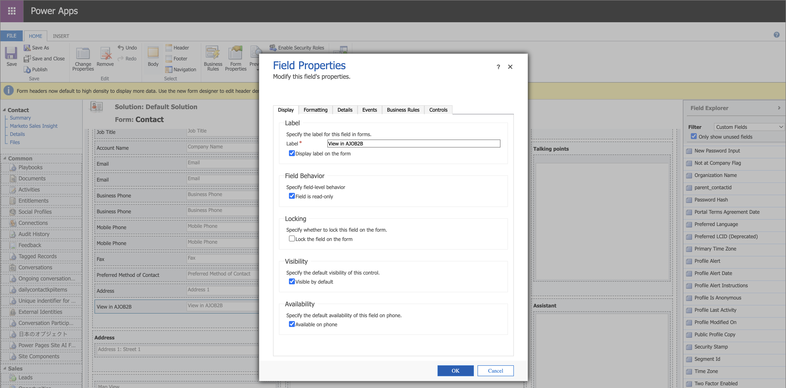

# CRM 내에서 세부 정보 페이지에 액세스

Adobe Journey Optimizer B2B edition을 사용하면 영업 및 계정 팀원이 Salesforce 또는 Microsoft Dynamics과 같은 고객 관계 관리(CRM) 도구에서 계정 및 구매 그룹 정보에 대한 세부 페이지에 직접 액세스할 수 있습니다. 이 통합을 통해 영업 담당자는 참여 내역, 의도 신호, AI가 생성한 권장 사항과 같은 실시간 계정 및 구매 그룹 인사이트에 빠르게 액세스할 수 있습니다. 이 기능을 통해 영업 팀은 신속한 지원, 보다 스마트한 우선 순위 지정 및 마케팅에 보다 효과적으로 대응할 수 있습니다.

영업 및 계정 팀원이 CRM에서 Journey Optimizer B2B edition의 [계정 세부 정보](account-details.md) 및 [개인 세부 정보](person-details.md) 페이지를 볼 수 있도록 하려면 Salesforce 또는 Dynamics 관리자가 계정, 연락처 또는 잠재 고객 보기에서 링크를 추가할 수 있습니다.

영업 팀 구성원이 CRM 인스턴스의 링크를 사용하는 경우 샌드박스는 _Prod_&#x200B;여야 하며 IMS 조직은 다음과 같은 순서가 지정된 논리에 따라 결정됩니다.

1. 사용자가 액세스한 가장 최근 조직
1. 목록의 첫 번째 항목(알파벳 정렬)
1. 환경 설정에서 선택한 조직

## Salesforce 링크

_응용 프로그램 사용자 지정_ 권한이 있는 Salesforce 관리자는 계정, 연락처 또는 잠재 고객 레이아웃에서 링크를 구성할 수 있습니다. 구성된 링크를 통해 Sales 사용자는 Adobe Journey Optimizer B2B edition의 해당 계정 세부 정보 또는 개인 세부 정보 페이지에 액세스할 수 있습니다.

Salesforce에서 사용자 지정 링크를 단추, 하이퍼링크 또는 연결된 아이콘으로 추가하고 팀의 환경 설정에 따라 사용자 지정합니다.

{width="800" zoomable="yes"}

Salesforce에서 사용자 지정 링크를 추가하는 방법에 대한 자세한 내용은 Salesforce 설명서의 [사용자 지정 단추 및 링크 정의](https://help.salesforce.com/s/articleView?id=platform.defining_custom_links.htm&type=5)를 참조하십시오.

링크에 대한 대상 URL을 정의할 때 계정, 연락처 또는 잠재 고객 레이아웃을 사용하여 Journey Optimizer B2B edition의 해당 세부 정보 페이지에 연결할 수 있습니다.

* **계정** - `https://experience.adobe.com/#/journey-optimizer-b2b/accounts/crm/account/[18-character ID of account]`

* **연락처** - `https://experience.adobe.com/#/journey-optimizer-b2b/accounts/crm/contact/[18-character ID of contact]`

* **리드** - `https://experience.adobe.com/#/journey-optimizer-b2b/accounts/crm/lead/[18-character ID of lead]`

`Account` 개체를 사용하여 `CASESAFEID(Account.Id)` 또는 `CASESAFEID(Id)`과(와) 같은 계정의 18자 ID를 가져옵니다.

**_예:_**

+++필드 링크

1. Salesforce에서 **[!UICONTROL 설정]** > **[!UICONTROL 개체 관리자]** > **[!UICONTROL 계정]**/**[!UICONTROL 연락처]**/**[!UICONTROL 리드]** > **[!UICONTROL 필드 및 관계]**(으)로 이동합니다.
1. 수식(텍스트) 필드를 만들려면 **[!UICONTROL 새로 만들기]**&#x200B;를 클릭하고 _계정_, _연락처_ 또는 _리드_ 레이아웃에 추가하십시오.

   수식의 경우 다음 예를 안내서로 사용하십시오.

   **_텍스트 하이퍼링크:_**

   * 계정 - `HYPERLINK("https://experience.adobe.com/#/journey-optimizer-b2b/accounts/crm/account/" & CASESAFEID(Id), "View in AJO B2B")`
   * 연락처 - `HYPERLINK("https://experience.adobe.com/#/journey-optimizer-b2b/accounts/crm/contact/" & CASESAFEID(Id), "View in AJO B2B")`
   * 잠재 고객 - `HYPERLINK("https://experience.adobe.com/#/journey-optimizer-b2b/accounts/crm/lead/" & CASESAFEID(Id), "View in AJO B2B")`

   **_Icon 하이퍼링크:_**

   * 계정 - `HYPERLINK("https://experience.adobe.com/#/journey-optimizer-b2b/accounts/crm/account/" & CASESAFEID(Id), IMAGE("https://cdn.experience.adobe.net/assets/HeroIcons.6620f5dc.svg#AdobeExperienceSubCloud", "View in AJO B2B", 24, 24))`
   * 연락처 - `HYPERLINK("https://experience.adobe.com/#/journey-optimizer-b2b/accounts/crm/contact/" & CASESAFEID(Id), IMAGE("https://cdn.experience.adobe.net/assets/HeroIcons.6620f5dc.svg#AdobeExperienceSubCloud", "View in AJO B2B", 24, 24))`
   * 연락처 - `HYPERLINK("https://experience.adobe.com/#/journey-optimizer-b2b/accounts/crm/lead/" & CASESAFEID(Id), IMAGE("https://cdn.experience.adobe.net/assets/HeroIcons.6620f5dc.svg#AdobeExperienceSubCloud", "View in AJO B2B", 24, 24))`

   {width="800" zoomable="yes"}

1. 페이지를 새로 고쳐 레이아웃 변경 내용을 표시합니다. **[!UICONTROL 프로필]**(으)로 이동하여 **[!UICONTROL 디스플레이 밀도]**&#x200B;에서 다른 옵션을 선택하십시오.

   {width="450" zoomable="yes"}

+++

+++세부 사항 페이지 링크

1. Salesforce에서 **[!UICONTROL 설정]** > **[!UICONTROL 개체 관리자]** > **[!UICONTROL 계정]**/**[!UICONTROL 연락처]**/**[!UICONTROL 리드]** > **[!UICONTROL 단추, 링크 및 작업]**(으)로 이동합니다.
1. 오른쪽 상단의 **[!UICONTROL 새 단추 또는 링크]**&#x200B;를 클릭하고 세부 정보 페이지 링크를 만듭니다.

   수식의 경우 다음 예를 안내서로 사용하십시오.

   * 계정 - `{!URLFOR("https://experience.adobe.com/#/journey-optimizer-b2b/accounts/crm/account/" & CASESAFEID(Account.Id), null)}`
   * 연락처 - `{!URLFOR("https://experience.adobe.com/#/journey-optimizer-b2b/accounts/crm/contact/" & CASESAFEID(Contact.Id), null)}`
   * 잠재 고객 - `{!URLFOR("https://experience.adobe.com/#/journey-optimizer-b2b/accounts/crm/lead/" & CASESAFEID(Lead.Id), null)}`

   {width="800" zoomable="yes"}

1. 왼쪽 탐색 영역에서 **[!UICONTROL 페이지 레이아웃]**(으)로 이동합니다.

1. **[!UICONTROL 사용자 지정 링크]**&#x200B;에서 링크를 드래그하여 레이아웃의 _사용자 지정 링크_ 섹션으로 놓습니다.

+++

+++세부 사항 페이지 단추

1. Salesforce에서 **[!UICONTROL 설정]** > **[!UICONTROL 개체 관리자]** > **[!UICONTROL 계정]**/**[!UICONTROL 연락처]**/**[!UICONTROL 리드]** > **[!UICONTROL 단추, 링크 및 작업]**(으)로 이동합니다.
1. 오른쪽 상단의 **[!UICONTROL 새 단추 또는 링크]**&#x200B;를 클릭하고 세부 정보 페이지 단추를 만듭니다.

   **[!UICONTROL 표시 형식]**&#x200B;에 대해 **[!UICONTROL 세부 정보 페이지 링크]**&#x200B;를 선택하세요.

   수식의 경우 다음 예를 안내서로 사용하십시오.

   * 계정 - `{!URLFOR("https://experience.adobe.com/#/journey-optimizer-b2b/accounts/crm/account/" & CASESAFEID(Account.Id), null)}`
   * 연락처 - `{!URLFOR("https://experience.adobe.com/#/journey-optimizer-b2b/accounts/crm/contact/" & CASESAFEID(Contact.Id), null)}`
   * 잠재 고객 - `{!URLFOR("https://experience.adobe.com/#/journey-optimizer-b2b/accounts/crm/lead/" & CASESAFEID(Lead.Id), null)}`

   {width="800" zoomable="yes"}

1. 왼쪽 탐색 영역에서 **[!UICONTROL 페이지 레이아웃]**(으)로 이동합니다.

1. **[!UICONTROL 모바일 및 번개 작업]**&#x200B;에서 단추를 드래그하여 레이아웃의 **[!UICONTROL Salesforce 모바일 및 번개 경험 작업]** 섹션에 놓습니다.

   {width="800" zoomable="yes"}

+++

## Microsoft Dynamics 링크

Dynamics 개발자는 Account, Contact 또는 Lead 엔티티를 확장하여 링크 필드를 추가할 수 있습니다. 구성된 링크를 통해 Sales 사용자는 Adobe Journey Optimizer B2B edition의 해당 계정 세부 정보 또는 개인 세부 정보 페이지에 액세스할 수 있습니다.

사용자 지정 링크를 단추, 하이퍼링크 또는 연결된 아이콘 링크로 추가하고 팀의 기본 설정에 따라 사용자 지정합니다.

{width="800" zoomable="yes"}

Power Apps를 사용하여 Dynamics 구성 요소와 같은 Microsoft 모델 기반 앱을 사용자 지정합니다. Power Apps를 사용하여 Dynamics에서 사용자 지정 링크를 추가하는 방법에 대한 자세한 내용은 [PowerApps 설명서](https://learn.microsoft.com/en-us/power-apps/maker/model-driven-apps/create-edit-web-resources)를 참조하십시오.

링크에 대한 대상 URL을 정의하면 계정, 연락처 또는 리드 보기를 사용하여 Journey Optimizer B2B edition의 해당 세부 정보 페이지에 연결할 수 있습니다.

* **계정** - `https://experience.adobe.com/#/journey-optimizer-b2b/accounts/crm/account/[Account ID]`

* **연락처** - `https://experience.adobe.com/#/journey-optimizer-b2b/accounts/crm/contact/[Contact ID]`

* **리드** - `https://experience.adobe.com/#/journey-optimizer-b2b/accounts/crm/lead/[Lead ID]`

**_예:_**

+++URL 필드

사용자 지정 링크를 URL 필드로 추가하려면 다음 작업 시퀀스를 따르십시오.

**1 - 솔루션 필드 구성**

1. **[!UICONTROL 고급 설정]** > **[!UICONTROL 시스템 사용자 지정]**(으)로 이동한 다음 **[!UICONTROL 솔루션]** 탭을 선택합니다.
1. **[!UICONTROL 엔터티]** > **[!UICONTROL 계정]**/**[!UICONTROL 연락처]**/**[!UICONTROL 리드]** > **[!UICONTROL 필드]**&#x200B;를 선택합니다.
1. **[!UICONTROL 새로 만들기]**&#x200B;를 클릭하고 새 필드를 구성합니다.

   {width="800" zoomable="yes"}

1. 필드 구성을 저장합니다.
1. _[!UICONTROL 솔루션]_ 탭에서 **[!UICONTROL 웹 리소스]**&#x200B;을(를) 선택합니다.
1. **[!UICONTROL 새로 만들기]**&#x200B;를 클릭하고 다음 Script(JScript) 웹 리소스를 구성합니다.

   ```js
   function setViewInAjoB2b(executionContext) {
    var url = "https://experience.adobe.com/#/journey-optimizer-b2b/accounts/crm";
   
    var formContext = executionContext.getFormContext();
   
    // Get the entity ID (GUID)
    var id = formContext.data.entity.getId();
   
    // Get the entity type (account, lead, contact)
    var type = formContext.data.entity.getEntityName().toLowerCase();
   
    if (id && type) {
        // Remove curly braces
        id = id.replace(/[{}]/g, "").toLowerCase();
   
        // Set the value in the custom field (Ensure this field exists on the form)
        formContext.getAttribute("new_viewinajob2b").setValue(url + "/" + type + "/" + id);
       }
   }
   ```

   {width="800" zoomable="yes"}

1. 페이지 맨 위에서 **[!UICONTROL 저장]**&#x200B;을 클릭한 다음 **[!UICONTROL 게시]**&#x200B;을 클릭합니다.

**2 - 양식 구성**

1. _솔루션_ 탭에서 **[!UICONTROL 엔터티]** > **[!UICONTROL 계정]**/**[!UICONTROL 연락처]**/**[!UICONTROL 리드]** > **[!UICONTROL Forms]** > **[!UICONTROL 계정]**/**[!UICONTROL 연락처]**/**[!UICONTROL 리드]**&#x200B;를 선택합니다.
1. 첫 번째 작업에서 만든 새 필드를 **[!UICONTROL 필드 탐색기]**&#x200B;에서 **[!UICONTROL 요약]** 섹션으로 끌어옵니다.

   {width="800" zoomable="yes"}

1. _요약_ 섹션에서 필드를 두 번 클릭하고 해당 속성을 구성하십시오.

   {width="800" zoomable="yes"}

   속성 구성이 완료되면 **[!UICONTROL 확인]**&#x200B;을 클릭합니다.

1. 페이지 상단의 리본에서 **[!UICONTROL 저장]**&#x200B;을 클릭한 다음 **[!UICONTROL 게시]**&#x200B;을 클릭합니다.

**3 - 양식 라이브러리에 JS 웹 리소스 추가**

1. 맨 위에 있는 _[!UICONTROL 홈]_ 탭에서 **[!UICONTROL 양식 속성]**&#x200B;을 클릭합니다.
1. **[!UICONTROL 추가를 클릭합니다]**.

   {width="500" zoomable="yes"}

1. 리소스를 찾아 선택한 다음 **[!UICONTROL 추가]**&#x200B;를 클릭합니다.

   {width="500" zoomable="yes"}

1. 추가된 리소스를 선택한 상태에서 **[!UICONTROL 이벤트 처리기]**&#x200B;에서 _[!UICONTROL 추가]_&#x200B;를 클릭합니다.
1. `setViewInAjoB2b` 함수를 **[!UICONTROL 이벤트 처리기]**&#x200B;에 추가합니다.
1. _[!UICONTROL 이벤트 처리기]_ 목록에서 함수를 선택한 상태에서 **[!UICONTROL 제어]**&#x200B;을(를) `Form`(으)로 설정하고 **[!UICONTROL 이벤트]**&#x200B;을(를) `OnLoad`(으)로 설정합니다.

   {width="500" zoomable="yes"}

1. **[!UICONTROL 확인]**&#x200B;을 클릭합니다.

1. 맨 위에 있는 _[!UICONTROL Home]_ 탭에서 **[!UICONTROL 저장]**&#x200B;을 클릭한 다음 **[!UICONTROL 게시]**&#x200B;를 클릭합니다.

**4 - 링크 확인**

링크를 확인하려면 Dynamics에서 계정, 연락처 또는 잠재 고객 보기를 확인하십시오.

{width="500" zoomable="yes"}

링크가 표시되지 않으면 Dynamics 홈 페이지의 **[!UICONTROL 고객]**&#x200B;의 계정, 연락처 또는 잠재 고객으로 이동해 보십시오. 그런 다음 특정 계정, 연락처 또는 잠재 고객 보기로 돌아갑니다. 로그아웃했다가 다시 로그인할 수도 있습니다.

+++

+++HTML 웹 리소스

사용자 지정 링크를 HTML 웹 리소스로 추가하려면 다음 작업 시퀀스를 따르십시오.

>[!NOTE]
>
>이 예제는 Dynamics에서 웹 페이지 웹 리소스를 사용하는 방식에 따라 다릅니다.

**1 - 솔루션 웹 리소스 구성**

1. **[!UICONTROL 고급 설정]** > **[!UICONTROL 시스템 사용자 지정]**(으)로 이동한 다음 **[!UICONTROL 솔루션]** 탭을 선택합니다.

1. _[!UICONTROL 솔루션]_ 탭에서 **[!UICONTROL 웹 리소스]**&#x200B;를 선택합니다.

1. **[!UICONTROL 새로 만들기]**&#x200B;를 클릭하고 다음 함수를 사용하여 다음 Script(JScript) 웹 리소스를 구성합니다.

   ```js
   function getFormContext(executionContext) {
       window.top["formContext"] = executionContext.getFormContext();
   }
   ```

   {width="800" zoomable="yes"}

1. 다른 웹 리소스를 만들고 다음 HTML을 사용하여 웹 페이지(HTML) 웹 리소스를 구성하려면 **[!UICONTROL 새로 만들기]**&#x200B;를 클릭하십시오.

   ```html
   <html>
   <head>
       <script>
       function onLoad(){
           // Adobe URL
           var url = "https://experience.adobe.com/#/journey-optimizer-b2b/accounts/crm";
   
           // Get the entity ID (GUID)
           var id = window.top.formContext.data.entity.getId();
   
           // Get the entity type (account, lead, contact)
           var type = window.top.formContext.data.entity.getEntityName().toLowerCase();
   
           if (id && type) {
               // Remove curly braces
               id = id.replace(/[{}]/g, "").toLowerCase();
               var url = url + "/" + type + "/" + id;
   
               // Find the hyperlink and set the href value
               var link = document.getElementById("link");
               link.href = url;
           }
       }
       </script>
   </head>
   <body onload="onLoad()" style="margin-left: 0;">
       <a id="link" style="text-decoration: none; font-family: sans-serif; font-size: 13px;" target="_blank">
           
           <span style="vertical-align: middle;">View in AJOB2B</span>
       </a>
   </body>
   </html>
   ```

1. 페이지 맨 위에서 **[!UICONTROL 저장]**&#x200B;을 클릭한 다음 **[!UICONTROL 게시]**&#x200B;을 클릭합니다.

**2 - 양식 라이브러리에 JS 웹 리소스 추가**

1. _솔루션_ 탭에서 **[!UICONTROL 엔터티]** > **[!UICONTROL 계정]**/**[!UICONTROL 연락처]**/**[!UICONTROL 리드]** > **[!UICONTROL Forms]** > **[!UICONTROL 계정]**/**[!UICONTROL 연락처]**/**[!UICONTROL 리드]**&#x200B;를 선택합니다.

1. 맨 위에 있는 _홈_ 탭에서 **[!UICONTROL 양식 속성]**&#x200B;을 클릭합니다.

1. **[!UICONTROL 추가를 클릭합니다]**.

1. 만든 JScript 웹 리소스(`new_getFormContext`)를 찾아 선택한 다음 **[!UICONTROL 추가]**&#x200B;를 클릭합니다.

   {width="500" zoomable="yes"}

1. 추가된 리소스를 선택한 상태에서 **[!UICONTROL 이벤트 처리기]**&#x200B;에서 _[!UICONTROL 추가]_&#x200B;를 클릭합니다.
1. `getFormContext` 함수를 **[!UICONTROL 이벤트 처리기]**&#x200B;에 추가합니다.
1. _[!UICONTROL 이벤트 처리기]_ 목록에서 함수를 선택한 상태에서 **[!UICONTROL 제어]**&#x200B;을(를) `Form`(으)로 설정하고 **[!UICONTROL 이벤트]**&#x200B;을(를) `OnLoad`(으)로 설정합니다.

   {width="500" zoomable="yes"}

1. **[!UICONTROL 확인]**&#x200B;을 클릭합니다.

1. 맨 위에 있는 _[!UICONTROL Home]_ 탭에서 **[!UICONTROL 저장]**&#x200B;을 클릭한 다음 **[!UICONTROL 게시]**&#x200B;를 클릭합니다.

**3 - 양식 구성**

1. 계정, 연락처 또는 잠재 고객 양식의 **[!UICONTROL HOME]** 탭에서 **[!UICONTROL Body]**(_Summary_ 섹션에서 연결된 리소스를 만들려면) 또는 **[!UICONTROL Header]**( 헤더 메뉴에서 만들려면)을(를) 선택합니다.

   {width="500" zoomable="yes"}

1. 맨 위에 있는 **[!UICONTROL 삽입]** 탭을 선택하고 **[!UICONTROL 웹 리소스]**&#x200B;를 클릭합니다.

1. 만든 웹 리소스를 삽입하고 속성을 구성합니다.

   {width="500" zoomable="yes"}

   웹 리소스 속성 및 형식에 대한 자세한 내용은 [Power Apps 설명서](https://learn.microsoft.com/en-us/power-apps/maker/model-driven-apps/web-resource-properties-legacy)를 참조하십시오.

1. **[!UICONTROL 확인]**&#x200B;을 클릭합니다.

   웹 리소스에 대한 본문/요약 배치를 선택한 경우 양식 레이아웃으로 표시됩니다.

   {width="800" zoomable="yes"}

1. 맨 위에 있는 _[!UICONTROL Home]_ 탭에서 **[!UICONTROL 저장]**&#x200B;을 클릭한 다음 **[!UICONTROL 게시]**&#x200B;를 클릭합니다.

**4 - 링크 확인**

링크를 확인하려면 Dynamics에서 계정, 연락처 또는 잠재 고객 보기를 확인하십시오.

{width="500" zoomable="yes"}

링크가 표시되지 않으면 Dynamics 홈 페이지의 **[!UICONTROL 고객]**&#x200B;의 계정, 연락처 또는 잠재 고객으로 이동해 보십시오. 그런 다음 특정 계정, 연락처 또는 잠재 고객 보기로 돌아갑니다. 로그아웃했다가 다시 로그인할 수도 있습니다.

+++
