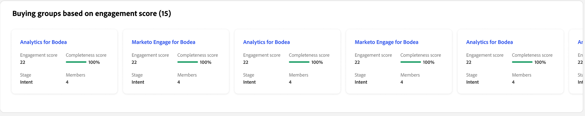

# 개인 세부 정보

Journey Optimizer B2B edition의 어디에서든 개인 이름을 클릭하면 개인 세부 정보 페이지가 표시됩니다. 이 페이지에는 강조 표시 및 의도 데이터(구성된 경우)의 생성 AI 요약을 포함하여 계정 또는 구매 그룹과 관련된 사람에 대한 유용한 정보가 포함되어 있습니다. <!-- There are also [actions](#person-actions) that you can execute for the person. -->

{width="800" zoomable="yes"}

[지능형 대시보드](../dashboards/intelligent-dashboard.md), [구매 그룹 세부 정보 페이지](../buying-groups/buying-group-details.md) 또는 [계정 세부 정보 페이지](./account-details.md)에 표시된 이름을 클릭하여 이 페이지에 액세스할 수 있습니다.

개인 세부 정보 페이지는 다음 네 개의 섹션으로 구성됩니다.

## 개인 개요

{zoomable="yes"}

페이지 맨 위에 있는 개인 개요 섹션에는 다음 정보가 포함됩니다.

* 이름
* 제목
* 이메일
* 전화번호
* 참여 점수
* 요약

## 활동

이 섹션에서는 사용자와 관련된 가장 최근 이메일, 웹, 양식 채우기 및 흥미로운 순간(최대 20개) 목록을 제공합니다. 항목은 날짜 및 시간과 함께 활동 유형으로 나열됩니다.

{width="700" zoomable="yes"}

## 참여 점수를 기반으로 한 구매 그룹

이 섹션에는 개인이 멤버인 구매 그룹이 포함되며 참여 점수에 따라 정렬됩니다. 각 카드에는 다음 구매 그룹 정보가 포함됩니다.

* 이름 - [구매 그룹 세부 정보](../buying-groups/buying-group-details.md)를 열려면 이름을 클릭하세요.
* 참여 점수
* 완성도 점수
* 단계
* 멤버

{width="700" zoomable="yes"}

## 의도 데이터

Journey Optimizer B2B edition에서 의도 감지 모델은 사람의 활동을 기반으로 충분히 높은 신뢰도로 관심 있는 솔루션/제품을 예측합니다. 태그된 콘텐츠와 함께 다른 계정 공동 멤버의 활동도 활용합니다. 사람의 의도는 상품에 대한 관심을 가질 확률로 해석할 수 있다.

{{intent-data-note}}

{width="700" zoomable="yes"}

* 의도 수준
* 의도 신호 유형 - 키워드, 제품 및 솔루션

<!-- ## Person actions -->
