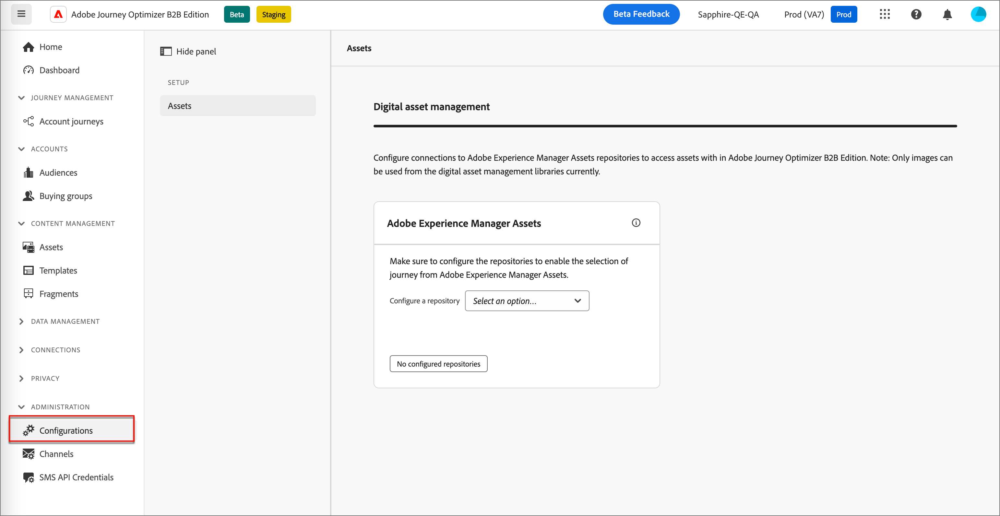
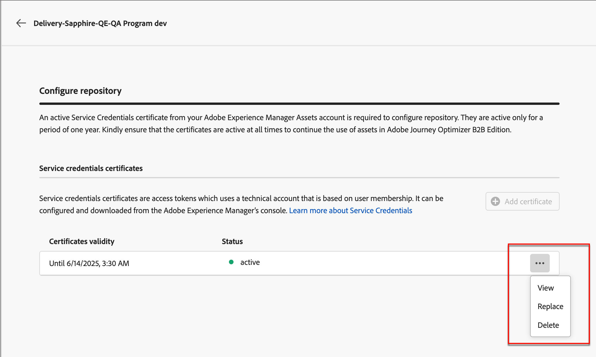

# Experience Manager 자산 저장소 구성

Adobe Journey Optimizer B2B edition은 Adobe Experience Manager Assets as a Cloud Service과 통합되므로 계정 여정 내에서 이메일과 같은 에셋을 사용하는 것 이상을 허용합니다. Experience Manager Assets과 정보를 교환하여 투명성을 보장합니다. 이 기능을 사용하려면 Adobe Experience Assets에 대한 연결을 구성하십시오.

Adobe Experience Manager Cloud Manager은 프로그램으로 구성되어 있으며 각 프로그램에는 여러 환경과 저장소가 있습니다([자세히 알아보기](https://experienceleague.adobe.com/en/docs/experience-manager-cloud-service/content/implementing/using-cloud-manager/programs/program-types){target="_blank"}). Adobe Journey Optimizer B2B edition에서 Adobe Experience Manager Assets을 구성할 때 디지털 에셋에 액세스하는 데 사용할 각 저장소에 대한 연결을 설정합니다.

{{aem-assets-licensing-note}}

## 사전 요구 사항

* AEM Headless Developer Console에서 원하는 환경에 대한 서비스 자격 증명을 생성합니다([자세히 알아보기](https://experienceleague.adobe.com/en/docs/experience-manager-learn/getting-started-with-aem-headless/authentication/service-credentials#generate-service-credentials){target="_blank"}).
* 연결에 필요한 인증서를 확보합니다. 가장 좋은 방법은 인증서가 만료되기 전에 최소 6개월 이상 남아 있는지 확인하는 것입니다. 인증서는 365일마다 만료됩니다.
* Adobe Journey Optimizer B2B edition은 한 번에 하나의 디지털 에셋 관리 소스에 대한 액세스를 지원합니다. 전환하기 전에 Adobe Experience Manager에서 필요한 자산을 사용할 수 있는지 확인하십시오.

>[!IMPORTANT]
>
>서비스 자격 증명은 유효하며 개인 키를 포함합니다. 이러한 자격 증명은 조직의 IT 및 보안 정책에 따라 저장, 관리 및 액세스해야 합니다.

## 저장소 연결 추가

1. 왼쪽 탐색에서 **[!UICONTROL 관리]** > **[!UICONTROL 구성]**&#x200B;을 선택합니다.

1. 중간 패널에서 **[!UICONTROL Assets]**&#x200B;을(를) 클릭합니다.

   {width="700" zoomable="yes"}

<!--   The default digital asset management option is configured as `Adobe Marketo Engage`.
-->
여기에서 각 AEM 환경 저장소에 대한 연결을 하나씩 구성할 수 있습니다.

1. _[!UICONTROL Adobe Experience Manager Assets]_ 상자에서 **[!UICONTROL 저장소 구성]** 옆에 있는 화살표를 클릭하고 저장소를 선택합니다.

   {width="500"}

1. **[!UICONTROL 인증서 추가]**&#x200B;를 클릭하고 대화 상자 도구를 사용하여 파일을 업로드합니다.

   .json 파일을 대화 상자로 드래그하거나 링크를 클릭하여 시스템에서 파일을 찾아 선택하여 업로드할 수 있습니다(파일이 올바른 JSON 유형인지 확인).

   {width="500"}

   업로드 후 맨 아래에 인증서가 표시됩니다.

   >[!NOTE]
   >
   >잘못된 파일이 사용되는 경우 대화 상자 하단에 오류가 표시됩니다.

   인증서를 완료하려면 **[!UICONTROL 추가]**&#x200B;를 클릭하십시오.

1. 뒤로(←) 화살표를 클릭하여 기본 구성 페이지로 돌아갑니다.

   구성된 저장소는 선택 패널 아래의 표에 표시됩니다. 3-4단계를 반복하여 다른 저장소를 추가할 수 있습니다.

   {width="600" zoomable="yes"}

저장소 구성을 마치면 팀원은 콘텐츠를 작성할 때 Adobe Experience Manager Assets을 선택할 수 있습니다.

>[!NOTE]
>
>Adobe Journey Optimizer B2B edition은 콘텐츠를 작성할 때 한 번에 하나의 디지털 에셋 관리 소스에 대한 액세스를 지원합니다. 

## 인증서 바꾸기

인증서는 생성일로부터 365일마다 만료됩니다. 만료되기 전에 교체하여 팀이 에셋에 계속 액세스할 수 있도록 합니다.

>[!NOTE]
>
>Adobe Journey Optimizer B2B edition은 Experience Manager assets와 통신하여 사용 정보를 제공합니다. 신뢰할 수 있는 사용 데이터를 동기화하고 데이터 불일치를 방지하기 위해 연결이 활성 상태를 유지해야 합니다. 관리자 사용자는 인앱 알림을 통해 만료 예정인 인증서에 대한 알림을 받게 됩니다. 또한 관리자 영역의 Assets 하위 섹션 - 디지털 에셋 관리에 대한 만료일을 확인할 수도 있습니다.

1. 디지털 자산 관리 페이지에서 구성된 저장소 목록을 찾습니다.

1. 인증서를 바꾸려면 원하는 저장소를 클릭합니다.

1. 인증서 파일의 줄임표(**...**) 아이콘을 클릭하여 해당 파일에 대한 작업 옵션을 표시합니다.

   {width="600" zoomable="yes"}

1. **[!UICONTROL 바꾸기]**&#x200B;를 선택하여 파일 업로드 대화 상자를 엽니다.

1. 대화 상자로 드래그하거나 링크를 사용하여 파일을 업로드합니다. 파일이 json 유형인지 확인합니다.

   {width="500"}

1. 업로드를 확인하려면 **[!UICONTROL 바꾸기]**&#x200B;를 클릭하세요.

## 인증서 보기

저장소 연결과 연결된 인증서 JSON 파일을 볼 수 있습니다.

1. 디지털 자산 관리 페이지에서 구성된 저장소 목록을 찾습니다.

1. 연결된 저장소를 클릭합니다.

1. 인증서 파일의 줄임표(**...**) 아이콘을 클릭하여 해당 파일에 대한 작업 옵션을 표시합니다.

1. **[!UICONTROL 보기]**&#x200B;를 선택하세요.

   {width="600"}

1. 저장소 구성 페이지로 돌아가려면 **[!UICONTROL 닫기]**&#x200B;를 클릭하십시오.

## 저장소 연결 삭제

저장소를 삭제하면 Journey Optimizer B2B edition 내의 Experience Manager Assets 환경에 대한 사용자 액세스 권한이 제거됩니다.

1. _[!UICONTROL 디지털 에셋 관리]_ 페이지에서 구성된 에셋 저장소 목록을 찾습니다.

1. 원하는 저장소 이름을 클릭하여 연결을 편집합니다.

1. 인증서 파일의 줄임표(**...**) 아이콘을 클릭하여 해당 파일에 대한 작업 옵션을 표시합니다.

1. **[!UICONTROL 삭제]**&#x200B;를 선택하세요.

1. 확인 대화 상자에서 **[!UICONTROL 삭제]**&#x200B;를 클릭합니다.
<!--

## Switch back to Adobe Marketo Engage Assets

Select Adobe Marketo Engage digital asset management in the Assets section.

After the confirmation, the Adobe Marketo Engage assets library is available for users.
-->
