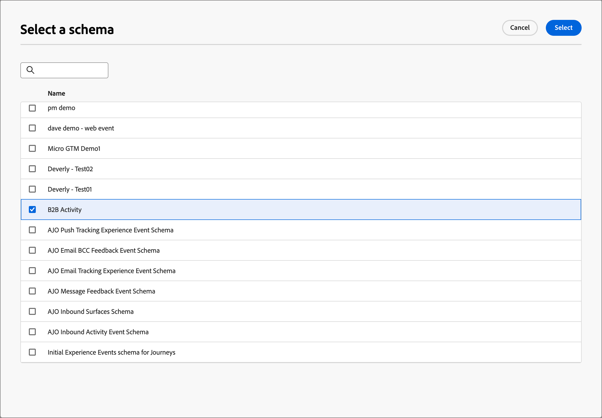
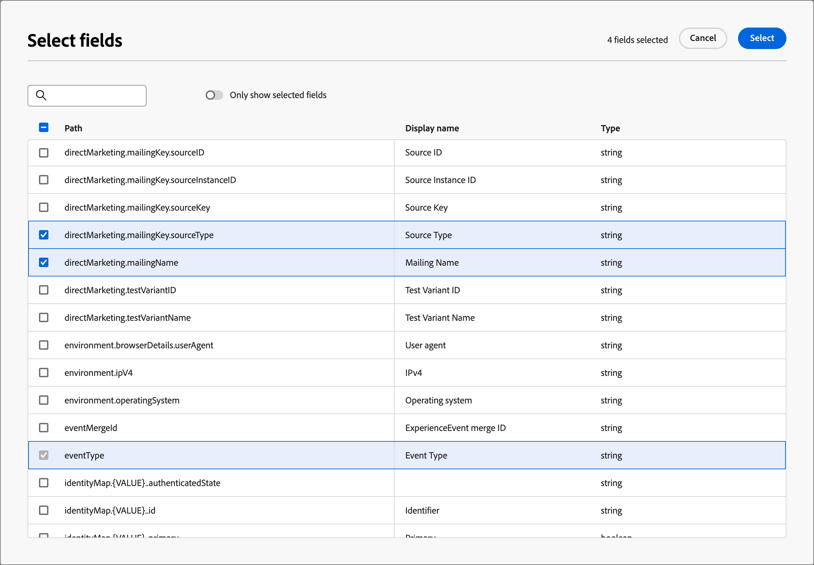

# Experience Platform 이벤트 정의 구성

관리자는 Adobe Experience Platform(AEP) 기반 이벤트 정의를 구성할 수 있으며, 이를 통해 마케터는 [AEP 경험 이벤트](https://experienceleague.adobe.com/ko/docs/experience-platform/xdm/classes/experienceevent){target="_blank"}에 반응하는 계정 여정을 만들 수 있습니다.

{width="30"} [비디오 개요 보기](#overview-video)

계정 여정에서 AEP 경험 이벤트 사용은 두 단계 프로세스입니다.

1. AEP 이벤트 정의를 만들고 게시합니다.

2. 계정 여정에서 _이벤트 수신_ 노드를 추가하고 [AEP 이벤트 정의를 사람 이벤트로 선택](../journeys/listen-for-event-nodes.md#listen-for-an-experience-event)합니다.

각 이벤트 정의에는 다음 Experience Platform 입력이 필요합니다.

* **_스키마_** - 경험 이벤트 데이터 구조를 정의하는 XDM 스키마. 경험 이벤트를 기반으로 해야 하며 프로필이 활성화되어 있어야 합니다.

  >[!NOTE]
  >
  >필요한 스키마가 정의되었는지 확인하려면 엔지니어링 팀과 조정하십시오. [XDM 스키마 만들기](https://experienceleague.adobe.com/ko/docs/experience-platform/xdm/schema/composition){target="_blank"}는 조직의 사용 사례 요구 사항을 기반으로 데이터 엔지니어가 수행하는 복잡한 프로세스입니다.

* **_이벤트 유형_** - XDM ExperienceEvent eventType(이벤트 정의당 최대 20개).

* **_필드_** - 스키마에 있는 XDM 필드(이벤트 정의당 최대 20개)

* **_이름_** - 이벤트 정의의 고유 이름입니다.

* **_설명_** - 이벤트 정의에 대한 설명입니다.

## 제한 사항 및 보호 기능

조직 목표를 충족하기 위해 이벤트 정의를 만들고 관리할 때는 다음 사항에 유의하십시오.

* Journey Optimizer B2B edition은 최대 50개의 이벤트 정의를 지원합니다.

* 계정 여정은 웹 AEP 또는 HTTP API와 같은 AEP 스트리밍 기능을 사용하여 수집되는 SDK Experience 이벤트를 수신할 수 있습니다.

* 하나의 AEP 이벤트 정의만 결합된 스키마와 이벤트 유형 집합을 사용할 수 있습니다. 스키마(예: `My Schema`)와 이벤트 유형(예: `Web Webpagedetails Page Views`)을 사용하여 이벤트 정의를 만들 때 다른 이벤트 정의에서는 `My Schema`과(와) `Web Webpagedetails Page Views`의 조합을 사용할 수 없습니다.

* 이벤트 정의는 두 개 이상의 계정 여정에서 사용할 수 있습니다.

* AEP Experience Event는 계정 여정 내에서 의사 결정 목적으로 사용할 수 있지만 유지되지 않습니다. 따라서 Journey Optimizer B2B edition 내에서 AEP 경험 이벤트에 대한 기록 레코드를 활용할 수 없습니다.

* _활동 날짜_ 및 _최소 횟수_&#x200B;에 대한 제약 조건은 지원되지 않습니다.

* 이벤트 정의가 게시된 후에는 스키마와 이름을 수정할 수 없습니다. 그러나 초안 버전을 만들고 다시 게시하여 이벤트 유형 및 필드를 추가할 수 있습니다.

* 게시된 여정에 사용된 이벤트 정의는 삭제할 수 없습니다.

## 이벤트 정의 액세스 및 관리

1. 왼쪽 탐색에서 **[!UICONTROL 관리]** > **[!UICONTROL 구성]**&#x200B;을 선택합니다.

1. 중간 패널에서 **[!UICONTROL 이벤트]**&#x200B;를 클릭하여 이벤트 정의 목록을 표시합니다.

   이 페이지에서 [만들기](#create-an-event-definition), [게시](#publish-an-event-defintion), [편집](#edit-an-event-definition) 및 [삭제](#delete-an-event-definition) 이벤트 정의를 사용할 수 있습니다.

   {width="800" zoomable="yes"}

   표는 _[!UICONTROL 수정됨]_ 열을 기준으로 정렬되며 맨 위에 가장 최근에 업데이트된 정의가 기본값으로 표시됩니다.<!-- Click the column title to change between ascending and descending.-->

1. 이벤트 정의에 대한 세부 정보에 액세스하려면 이름을 클릭합니다.

### 이벤트 정의 상태 및 라이프사이클

_[!UICONTROL 이벤트 정의]_ 목록에서 **[!UICONTROL 상태]** 열은 각 정의의 현재 상태를 나타냅니다. 상태는 계정 여정에서 사용할 수 있는 가용성과 이에 대해 수행할 수 있는 변경 사항을 결정합니다.

| 상태 | 설명 |
| -------------------- | ----------- |
| 초안 | 이벤트 정의를 생성하면 초안 상태가 됩니다. 계정 여정에 사용하기 위해 게시하기 전까지는 이 상태로 유지됩니다. 사용 가능한 작업:  <li>모든 세부 정보 편집<li>게시<li>삭제 |
| 게시일 | 이벤트 정의를 게시하면 계정 여정에서 사용할 수 있습니다. 세부 사항을 수정할 수 없습니다. 사용 가능한 작업:  <li>_이벤트 수신_ 여정 노드에서 사용 가능<li>초안 버전 만들기<li>삭제(사용하지 않는 경우) |
| 게시됨 (초안 포함) | 게시된 이벤트 정의에서 초안을 만들 때 게시된 버전은 계정 여정에서 사용할 수 있으며 초안 버전을 수정할 수 있습니다. 초안 버전을 게시하면 현재 게시된 버전이 대체되고 아직 실행되지 않은 계정 여정에 대해 이벤트 정의가 업데이트됩니다. 사용 가능한 작업:  <li>모든 세부 정보 편집<li>초안 버전 게시<li>초안 버전 삭제<li>삭제(사용하지 않는 경우) |

{zoomable="yes"}

### 이벤트 정의 목록 필터링

이름으로 이벤트 정의를 검색하려면 검색 막대에 일치 항목 텍스트 문자열을 입력합니다.

{width="700" zoomable="yes"}

## 이벤트 정의 만들기

1. 왼쪽 탐색에서 **[!UICONTROL 관리]** > **[!UICONTROL 구성]**&#x200B;을 선택합니다.

1. 중간 패널에서 **[!UICONTROL 이벤트]**&#x200B;를 클릭하여 이벤트 정의 목록을 표시합니다.

1. 오른쪽 상단의 **[!UICONTROL 이벤트 만들기]**&#x200B;를 클릭합니다.

1. **[!UICONTROL 이름]**(필수) 및 **[!UICONTROL 설명]**(선택 사항)을 입력하십시오.

   {width="600" zoomable="yes"}

1. 이벤트 정의에 사용할 **[!UICONTROL 스키마]**&#x200B;을(를) 설정하십시오.

   선택하는 스키마에 따라 정의에 추가할 수 있는 필드가 결정됩니다. 추가한 필드는 계정 여정에서 _이벤트 수신_ 노드에 대한 제약 조건으로 사용할 수 있습니다.

   * **[!UICONTROL 스키마 선택]**&#x200B;을 클릭합니다.
   * 대화 상자의 경험 이벤트 기반 스키마 목록에서 스키마를 선택합니다.
   * **[!UICONTROL 선택]**&#x200B;을 클릭합니다.

   {width="600" zoomable="yes"}

1. 이벤트 정의에 사용할 **[!UICONTROL 이벤트 유형]**&#x200B;을(를) 선택하십시오.

   선택한 [이벤트 유형](https://experienceleague.adobe.com/ko/docs/experience-platform/xdm/classes/experienceevent#eventType){target="_blank"}은(는) 계정 여정에서 _이벤트 수신_ 노드에 대한 제약 조건으로 사용할 수 있는 이벤트를 결정합니다.

   * **[!UICONTROL 이벤트 유형 선택]**&#x200B;을 클릭합니다.
   * 대화 상자에서 목록에서 이벤트 유형을 하나 이상 선택합니다(최대 20개).
   * **[!UICONTROL 선택]**&#x200B;을 클릭합니다.

   {width="600" zoomable="yes"}

1. 이벤트 정의에 사용할 **[!UICONTROL 필드]**&#x200B;을(를) 선택하십시오.

   선택한 필드는 계정 여정의 _이벤트 수신_ 노드에 대해 이벤트를 사용할 때 사용할 수 있는 제약 조건을 결정합니다.

   >[!NOTE]
   >
   >`eventType` 필드는 필수이며 자동으로 선택됩니다.

   * **[!UICONTROL 필드 선택]**&#x200B;을 클릭합니다.
   * 대화 상자에서 목록에서 필드를 하나 이상 선택합니다(최대 20개).
   * **[!UICONTROL 선택]**&#x200B;을 클릭합니다.

   {width="600" zoomable="yes"}

1. 스키마, 이벤트 유형 및 필드가 완료되면 **[!UICONTROL 만들기]**&#x200B;를 클릭합니다.

   만든 후에는 목록 페이지가 표시되고 새 이벤트가 _초안_ 상태로 목록의 맨 위에 있습니다.

   {width="700" zoomable="yes"}

## 이벤트 정의 게시

초안 이벤트 정의가 완료되어 필요에 맞게 수정된 경우 이를 게시할 수 있습니다. 그러면 게시된 이벤트 정의를 계정 여정에서 사용할 수 있습니다. 이벤트 정의가 게시된 후 변경해야 하는 경우 초안 버전을 만들 수 있습니다. 단, 스키마를 변경할 수 없으며 이벤트 유형 및 필드만 추가할 수 있습니다(삭제할 수 없음).

1. 왼쪽 탐색에서 **[!UICONTROL 관리]** > **[!UICONTROL 구성]**&#x200B;을 선택합니다.

1. 중간 패널에서 **[!UICONTROL 이벤트]**&#x200B;를 클릭하여 이벤트 정의 목록을 표시합니다.

1. _[!UICONTROL 이벤트 정의]_ 목록에서 초안 이벤트 정의의 이름을 클릭하여 세부 정보 페이지를 엽니다.

   {width="600" zoomable="yes"}

   필요한 경우 게시하기 전에 설정을 검토하십시오. 요구 사항에 맞지 않으면 [초안을 편집](#edit-an-event-definition)할 수 있습니다.

1. 오른쪽 상단의 **[!UICONTROL 게시]**&#x200B;를 클릭합니다.

1. 확인 대화 상자에서 **[!UICONTROL 게시]**&#x200B;를 클릭합니다.

   {width="300"}

   이벤트 정의의 상태가 _게시됨_(으)로 변경되며 이제 [계정 여정에서 사용할 수 있습니다](../journeys/listen-for-event-nodes.md#listen-for-an-experience-event).

   {width="700" zoomable="yes"}

## 이벤트 정의 편집

1. 왼쪽 탐색에서 **[!UICONTROL 관리]** > **[!UICONTROL 구성]**&#x200B;을 선택합니다.

1. 중간 패널에서 **[!UICONTROL 이벤트]**&#x200B;를 클릭하여 이벤트 정의 목록을 표시합니다.

   이벤트 정의에 대한 편집은 현재 상태에 따라 다릅니다.

   * 이벤트 정의가 _초안_ 상태인 경우 세부 정보를 편집할 수 있습니다.
   * 이벤트 정의가 _게시됨_ 상태일 때는 편집할 수 없습니다. 편집 가능한 초안 버전을 만든 다음 게시된 버전을 바꿀 수 있습니다.
   * 이벤트 정의가 _게시됨(초안 포함)_ 상태일 때 초안 버전을 변경(설명을 편집하고 이벤트 유형 및 필드를 추가)할 수 있습니다.

   {width="700" zoomable="yes"}

1. _[!UICONTROL 이벤트 정의]_ 목록 페이지에서 이벤트 정의 이름을 클릭하여 엽니다.

상태에 따라 다음 단계를 수행합니다.

>[!BEGINTABS]

>[!TAB 초안]

1. 필요에 따라 이벤트 정의 세부 정보를 변경합니다.

   {width="600" zoomable="yes"}

   [이벤트 정의 만들기](#create-an-event-definition)에 사용되는 지침을 따르십시오.

   변경 사항은 자동으로 초안에 저장됩니다.

1. 이벤트 정의가 조건을 충족하고 계정 여정에서 사용할 수 있도록 하려면 **[!UICONTROL 게시]**&#x200B;를 클릭합니다.

1. 확인 대화 상자에서 **[!UICONTROL 게시]**&#x200B;를 클릭합니다.

   이벤트 정의의 상태가 _게시됨_(으)로 변경되며, 이제 계정 여정에서 사용할 수 있습니다.

>[!TAB 게시됨]

1. 이벤트 정의를 업데이트하려면 오른쪽 상단의 **[!UICONTROL 초안 버전 만들기]**&#x200B;를 클릭하십시오.

   {width="600" zoomable="yes"}

1. 확인 대화 상자에서 **[!UICONTROL 초안 만들기]**&#x200B;를 클릭하여 초안 버전을 엽니다.

   {width="300"}

   이 작업은 초안 버전을 만들고 목록 페이지로 돌아갑니다. 이제 이벤트 정의가 _게시됨(초안 있음)_ 상태입니다.

1. 이벤트 정의 이름을 클릭하여 엽니다.

   _게시됨(초안 포함)_ 이벤트 정의의 경우 _[!UICONTROL 게시됨]_ 버전 탭이 기본값으로 선택됩니다.

1. **[!UICONTROL 초안]** 버전 탭을 선택합니다.

   {width="600" zoomable="yes"}

1. 필요에 따라 편집 가능한 세부 정보(**[!UICONTROL 설명]**, **[!UICONTROL 이벤트 유형]** 및 **[!UICONTROL 필드]**)를 변경합니다.

   [이벤트 정의 만들기](#create-an-event-definition)에 사용되는 지침을 따르십시오.

   변경 사항은 자동으로 초안에 저장됩니다.

1. 초안 이벤트 정의가 조건을 충족하고 계정 여정에서 사용할 현재 게시된 버전을 바꾸려면 **[!UICONTROL 초안 게시]**&#x200B;를 클릭합니다.

1. 확인 대화 상자에서 **[!UICONTROL 게시]**&#x200B;를 클릭합니다.

   {width="300"}

   초안 버전을 게시하면 현재 게시된 버전이 대체되고 이미 사용 중이지만 아직 실행되지 않은 계정 여정에 대해 이벤트 정의가 업데이트됩니다.

>[!TAB 게시됨(초안 포함)]

_게시됨(초안 포함)_ 이벤트 정의를 열면 _[!UICONTROL 게시됨]_ 버전 탭이 기본값으로 선택됩니다.

1. **[!UICONTROL 초안]** 버전 탭을 선택합니다.

   {width="600" zoomable="yes"}

1. 필요에 따라 편집 가능한 세부 정보(**[!UICONTROL 설명]**, **[!UICONTROL 이벤트 유형]** 및 **[!UICONTROL 필드]**)를 변경합니다.

   [이벤트 정의 만들기](#create-an-event-definition)에 사용되는 지침을 따르십시오.

   변경 사항은 자동으로 초안에 저장됩니다.

1. 초안 이벤트 정의가 조건을 충족하고 계정 여정에서 사용할 현재 게시된 버전을 바꾸려면 **[!UICONTROL 초안 게시]**&#x200B;를 클릭합니다.

1. 확인 대화 상자에서 **[!UICONTROL 게시]**&#x200B;를 클릭합니다.

   {width="300"}

   초안 버전을 게시하면 현재 게시된 버전이 대체되고 이미 사용 중이지만 아직 실행되지 않은 계정 여정에 대해 이벤트 정의가 업데이트됩니다.

>[!ENDTABS]

## 이벤트 정의 삭제

게시된 계정 여정에서 사용 중이 아닌 경우 이벤트 정의를 삭제할 수 있습니다.

>[!CAUTION]
>
>이 작업은 주의하여 사용하십시오. 이벤트 정의를 삭제하면 되돌릴 수 없습니다.

1. 왼쪽 탐색에서 **[!UICONTROL 관리]** > **[!UICONTROL 구성]**&#x200B;을 선택합니다.

1. 중간 패널에서 **[!UICONTROL 이벤트]**&#x200B;를 클릭하여 이벤트 정의 목록을 표시합니다.

1. 목록에서 이벤트 정의를 찾고 이름 오른쪽에 있는 _삭제_( ) 아이콘을 클릭합니다.

1. 확인 대화 상자에서 **[!UICONTROL 삭제]**&#x200B;를 클릭합니다.

   {width="300"}

## 개요 비디오

>[!VIDEO](https://video.tv.adobe.com/v/3448637/?learn=on)