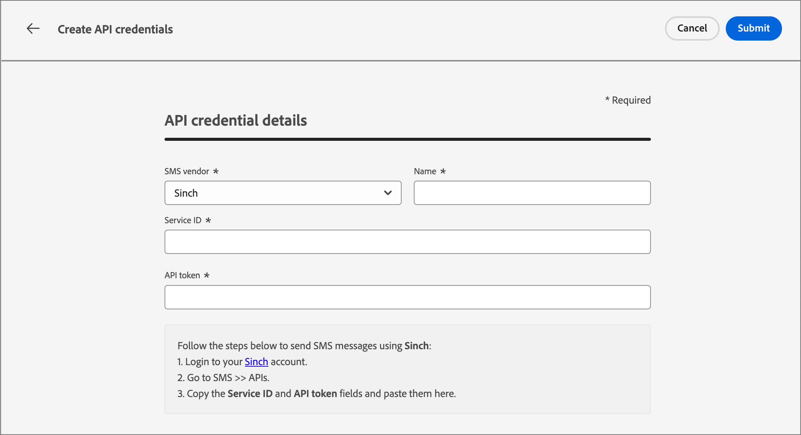

# SMS 구성

Adobe Journey Optimizer B2B edition은 SMS 서비스 공급자(또는 SMS 게이트웨이 공급자)를 통해 텍스트 메시지를 보냅니다. SMS 메시지를 만들기 전에 _관리자_ 설정에서 서비스 공급자를 구성하십시오.

## SMS 게이트웨이 서비스 공급자

Adobe Journey Optimizer B2B edition은 현재 텍스트 메시지 서비스를 독립적으로 제공하는 서드파티 공급자와 통합됩니다. 텍스트 메시지에 대해 지원되는 공급자는 Sinch, Twilio 및 Infobip입니다.

Adobe Journey Optimizer B2B edition에서 SMS 채널을 구성하기 전에 이러한 공급자 중 하나로 계정을 만들어 API 토큰 및 서비스 ID를 가져와야 합니다. Adobe Journey Optimizer B2B edition과 해당 공급자 간의 연결을 구성하는 데 이러한 자격 증명이 필요합니다.

>[!IMPORTANT]
>
>문자 메시지 서비스 사용은 해당 공급자의 추가 약관이 적용됩니다. 타사 솔루션인 Sinch, Twilio 및 Infobip은 통합을 통해 Adobe Journey Optimizer B2B edition 사용자가 사용할 수 있습니다. Adobe은 서드파티 제품을 제어하지 않으며 이에 대해 책임을 지지 않습니다. 문자 메시지 서비스(SMS)와 관련된 문제 또는 지원 요청은 공급자에게 문의하십시오.

## 기존 SMS API 구성 확인

>[!NOTE]
>
>설명된 설정은 SMS 관리자 권한이 있는 사용자만 액세스할 수 있습니다.

1. 왼쪽 탐색에서 **[!UICONTROL 관리자]** 섹션을 확장하고 **[!UICONTROL 채널]**&#x200B;을 클릭합니다.

   {width="800" zoomable="yes"}

1. 탐색 패널에서 **[!UICONTROL API 자격 증명]**&#x200B;을 선택합니다.

   이 페이지에는 인스턴스에 사용 가능한 API 구성이 나열됩니다.

1. 필요한 경우 _필터_ 아이콘()을 클릭하고 옵션을 선택하여 SMS 서비스 공급자나 작성자가 구성한 API 자격 증명 목록을 표시합니다.

   {width="600" zoomable="yes"}

## SMS 서비스 공급자에 대한 새 API 자격 증명 만들기

>[!BEGINTABS]

>[!TAB Sinch]

Adobe Journey Optimizer B2B edition을 사용하여 Sinch를 SMS 공급자로 구성하려면(_T):_

1. 왼쪽 탐색에서 **[!UICONTROL 관리자]** 섹션을 확장하고 **[!UICONTROL 구성]**&#x200B;을 클릭합니다.

1. **[!UICONTROL API 자격 증명]** 목록의 오른쪽 상단에서 _[!UICONTROL 새 API 자격 증명 만들기]_&#x200B;를 클릭합니다.

1. SMS API 자격 증명을 구성합니다.

   {width="500"}

   * **[!UICONTROL SMS 공급업체]** - SMS 공급자로 `Sinch`을(를) 선택합니다.

   * **[!UICONTROL 이름]** - API 자격 증명의 이름을 입력하십시오.

   * **[!UICONTROL 서비스 ID]** 및 **[!UICONTROL API 토큰]** - Sinch 계정의 API 페이지에 액세스합니다(SMS 탭에서 자격 증명을 찾을 수 있음).

   Sinch 계정의 이 정보를 찾는 방법에 대한 자세한 내용은 [Sinch 개발자 설명서](https://developers.sinch.com/docs/sms/getting-started)를 참조하십시오.

1. API 자격 증명의 구성 세부 정보가 완료되면 **[!UICONTROL 제출]**&#x200B;을 클릭합니다.

>[!TAB Twilio]

Adobe Journey Optimizer B2B edition을 사용하여 Twilio를 SMS 공급자로 구성하려면(_T):_

1. 왼쪽 탐색에서 **[!UICONTROL 관리자]** 섹션을 확장하고 **[!UICONTROL 구성]**&#x200B;을 클릭합니다.

1. **[!UICONTROL API 자격 증명]** 목록의 오른쪽 상단에서 _[!UICONTROL 새 API 자격 증명 만들기]_&#x200B;를 클릭합니다.

1. SMS API 자격 증명을 구성합니다.

   {width="500"}

   * **[!UICONTROL SMS 공급업체]** - SMS 공급자로 `Twilio`을(를) 선택합니다.

   * **[!UICONTROL 이름]** - API 자격 증명 정의의 이름을 입력하십시오.

   * **[!UICONTROL 계정 SID]** 및 **[!UICONTROL 인증 토큰]** - Twilio 콘솔 대시보드 페이지의 _계정 정보_ 창에 액세스하여 자격 증명을 찾습니다.

   Twilio 계정에 대한 이 정보를 찾는 방법에 대한 자세한 내용은 [Twilio 도움말 센터](https://help.twilio.com/articles/14726256820123-What-is-a-Twilio-Account-SID-and-where-can-I-find-it-)를 참조하십시오.

1. API 자격 증명의 구성 세부 정보가 완료되면 페이지 오른쪽 상단의 **[!UICONTROL 제출]**&#x200B;을 클릭합니다.

>[!TAB Infobip]

Adobe Journey Optimizer B2B edition을 사용하여 Infobip를 SMS 공급자로 구성하려면(_T):_

1. 왼쪽 탐색에서 **[!UICONTROL 관리자]** 섹션을 확장하고 **[!UICONTROL 구성]**&#x200B;을 클릭합니다.

1. **[!UICONTROL API 자격 증명]** 목록의 오른쪽 상단에서 _[!UICONTROL 새 API 자격 증명 만들기]_&#x200B;를 클릭합니다.

1. SMS API 자격 증명을 구성합니다.

   {width="500"}

   * **[!UICONTROL SMS 공급업체]** - SMS 공급자로 `Infobip`을(를) 선택합니다.

   * **[!UICONTROL 이름]** - API 자격 증명 정의의 이름을 입력하십시오.

   * **[!UICONTROL API 기본 URL]** 및 **[!UICONTROL API 키]** - 웹 인터페이스 홈 페이지 또는 Infobip 계정의 API 키 관리 페이지에 액세스하여 자격 증명을 찾을 수 있습니다.

   Infobip 계정에 대한 이 정보를 찾는 방법에 대한 자세한 내용은 [Infobip 설명서](https://www.infobip.com/docs/api/_blank)를 참조하세요.

1. API 자격 증명의 구성 세부 정보가 완료되면 페이지 오른쪽 상단의 **[!UICONTROL 제출]**&#x200B;을 클릭합니다.

>[!ENDTABS]

_[!UICONTROL 제출]_&#x200B;을 클릭하면 자격 증명이 즉시 확인 및 저장되며, _[!UICONTROL API 자격 증명]_ 목록 페이지로 리디렉션됩니다. 제출된 자격 증명이 유효하지 않은 경우 목록 페이지에 오류 메시지가 표시됩니다. 이 경우 구성을 취소하거나 업데이트한 후 다시 제출하도록 선택할 수 있습니다.
