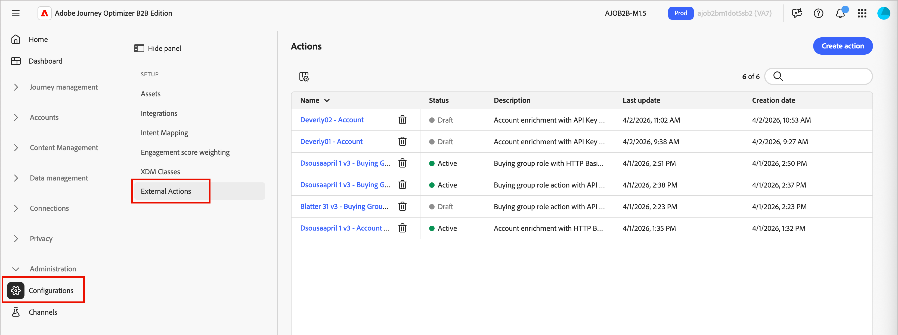
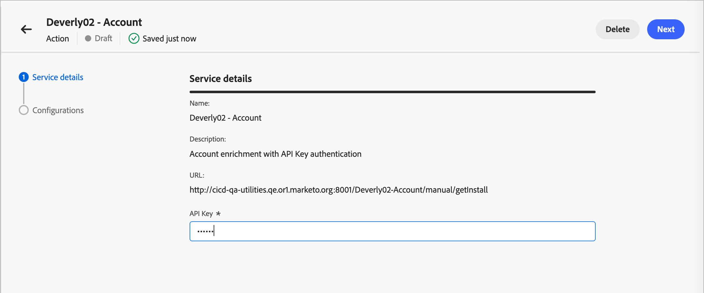
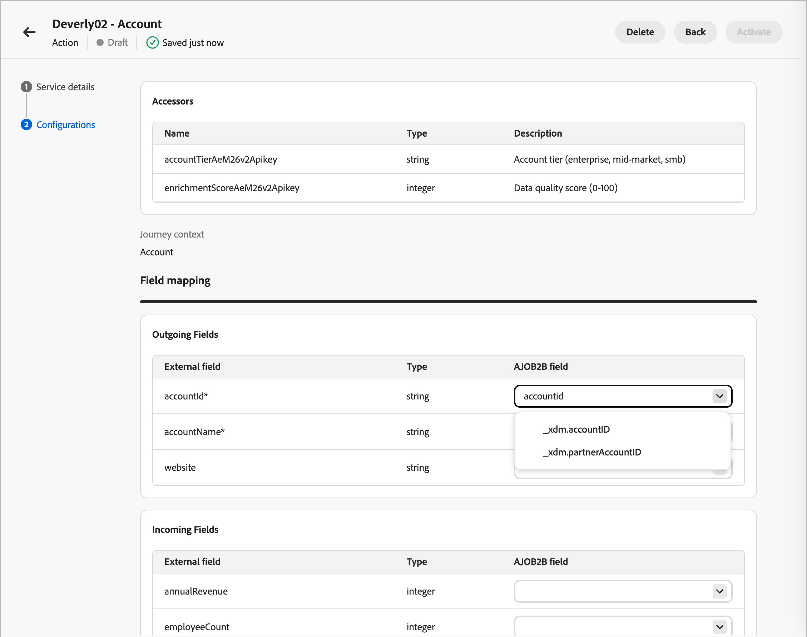
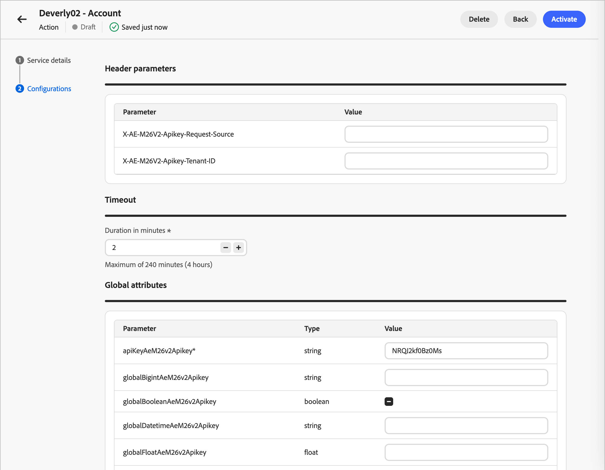

# 외부 작업 구성

외부 작업을 사용하면 Journey Optimizer B2B edition의 계정 여정이 여정 캔버스에서 직접 외부 시스템과 연결할 수 있습니다. 계정 대상이 외부 작업 노드에 도달하면 시스템에서 구성된 외부 서비스에 대한 비동기 아웃바운드 호출을 수행하여 계정, 사용자 또는 둘 다에 대한 대상 속성 데이터를 전달합니다. 외부 서비스는 데이터를 처리하고 콜백을 사용하여 응답하며, 여정 실행을 안내하는 데 사용할 수 있는 대상 데이터와 메타데이터를 반환합니다.

이 기능은 다음 두 가지 여정 노드 유형을 지원합니다.

* **외부 작업** - 외부 서비스를 호출하고 하나의 송신 경로를 따라 계속합니다. CRM 레코드 업데이트 또는 다운스트림 알림 트리거와 같은 _실행 후 삭제_ 통합에 이상적입니다.
* **외부 분할 경로** - 외부 서비스를 호출하고 응답을 평가하여 여러 정의된 경로 중 하나를 따라 계정을 라우팅합니다.

>[!NOTE]
>
>외부 작업 서비스는 계정 여정에 대해서만 지원됩니다. 이러한 노드 유형은 개인 여정에 사용할 수 없습니다.

## 구현 개요

외부 작업을 설정하려면 세 가지 역할에 대해 순서대로 조정해야 합니다.

| | 역할 | 작업 |
| ---- | ---- | ---- |
| 1 | Developer | [외부 서비스 구현 및 게시](#implement-service) |
| 2 | 관리자 | [Journey Optimizer B2B edition에서 작업 구성](#configure-action) |
| 3 | 마케터 | [계정 여정에 외부 노드 추가](#add-journey-node) |

## 외부 서비스 구현 {#implement-service}

개발자는 [Adobe Journey Optimizer B2B edition 외부 작업 서비스 공급자 인터페이스](https://developer.adobe.com/journey-optimizer-b2b-apis/)를 준수하는 공개 웹 서비스를 만들고 게시해야 합니다.

>[!NOTE]
>
>콜백 함수에는 전달자 토큰이 필요합니다. IMS 조직에 대해 Adobe Developer Console에서 [OAuth 서버 간 자격 증명](https://developer.adobe.com/developer-console/docs/guides/authentication/ServerToServerAuthentication/implementation)을(를) 설정하여 이를 검색하십시오.

서비스가 활성 상태가 되면 OpenAPI 사양에 대한 URL을 제공하고 작업을 구성하는 제품 관리자에게 인증 자격 증명을 제공합니다.

## 작업 구성 {#configure-action}

마케터가 여정에서 작업을 사용하려면 먼저 작업을 구성하고 활성화해야 합니다. 작업이 _초안_ 상태에서 만들어지며 변경 사항이 자동으로 저장됩니다. 활성화하기 전까지는 초안으로 유지됩니다.

>[!PREREQUISITES]
>
>구성을 추가하기 전에 개발자로부터 OpenAPI 사양 및 인증 자격 증명에 대한 URL을 얻습니다.
>
>외부 작업을 정의하고 활성화하려면 _[!UICONTROL B2B 관리 구성 관리]_ [제품 권한](./user-management.md#b2b-product-permissions)이 있어야 합니다.

1. **[!UICONTROL 관리]** > **[!UICONTROL 구성]**(으)로 이동합니다.

1. 중간 패널에서 **[!UICONTROL 외부 작업]**&#x200B;을 클릭합니다.

   {width="800" zoomable="yes"}

1. 오른쪽 상단의 **[!UICONTROL 작업 만들기]**&#x200B;를 클릭합니다.

1. 외부 서비스에 대한 OpenAPI 사양의 URL을 입력하고 **[!UICONTROL 만들기]**&#x200B;를 클릭합니다.

   {width="500"}

   이 단계를 수행하려면 외부 서비스가 활성화되어 있어야 하며 연결 가능해야 합니다. 유효성 검사 오류가 있는 경우 대화 상자에 오류를 설명하는 메시지와 해결 방법이 표시됩니다. 자세한 내용은 [_문제 해결_](#troubleshooting)&#x200B;을 참조하세요.

1. URL이 정상적으로 확인되면 **[!UICONTROL 서비스 세부 정보]**&#x200B;를 검토하십시오.

   서비스 세부 사항은 작업을 만들 때 OpenAPI 사양과 직접 읽습니다. 생성 후에는 구성에서 이러한 속성을 변경할 수 없습니다.

   | 속성 | 설명 | OpenAPI 사양 속성 |
   | -------- | ----------- | --------------------- |
   | [!UICONTROL 이름] | 작업 이름 | `info.title` |
   | [!UICONTROL 설명] | 작업에 대한 설명 | `info.description` |
   | [!UICONTROL URL] | 외부 서비스를 정의하는 OpenAPI 사양의 URL | `servers.url` |

1. 외부 서비스(`components.securitySchemes`)에 대한 **[!UICONTROL 인증]** 자격 증명을 입력하십시오.

   >[!NOTE]
   >
   >표시되는 자격 증명 필드는 외부 서비스에 정의된 인증 메커니즘에 따라 다릅니다. 지원되는 유형은 API 키, OAuth2 및 HTTP 기본 인증입니다.

   {width="600" zoomable="yes"}

   구성된 작업이 _초안_ 또는 _활성_ 상태일 때 필요에 따라 자격 증명을 변경할 수 있습니다.

1. **[!UICONTROL 다음]**&#x200B;을 클릭합니다.

1. 작업이 외부 서비스와 데이터를 교환하는 방법을 정의하려면 **[!UICONTROL 구성]** 속성을 설정하십시오.

   >[!NOTE]
   >
   >_정적_(으)로 표시된 속성은 구성 시 업데이트할 수 없으며 서비스 정의를 기반으로 합니다.

   * **[!UICONTROL 작업 유형]**(_정적_) - 지원되는 여정 노드 유형:

      * [!UICONTROL 외부 작업]&#x200B;(`enableSplitPath` = false)
      * [!UICONTROL 외부 작업 분할 경로]&#x200B;(`enableSplitPath` = true)

     작업 구성을 만든 후에는 작업 유형을 변경할 수 없습니다.

   * **[!UICONTROL 접근자]**(_정적_) - (외부 작업 분할 경로만 해당) 외부 분할 경로 노드에서 경로 조건으로 사용할 수 있도록 외부 서비스에서 반환하는 변수입니다. (`invocationPayloadDef.accessorsMetadata`)

   * **[!UICONTROL 여정 컨텍스트]**(_정적_) - 요청에서 보낸 대상 데이터의 범위(`supportedEntityType`):

      * [!UICONTROL 계정] - 계정만 보냅니다.

      * [!UICONTROL 사람] - 사람만 보냅니다.

      * [!UICONTROL 계정의 사용자] - 계정 및 계정 관련 사용자를 보냅니다.

   * **[!UICONTROL 보내는 필드]** - 테이블의 각 필드를 [XDM 필드](../admin/xdm-field-management.md)에 매핑합니다. 이러한 필드는 요청 본문에서 외부 서비스로 전송됩니다. 서비스 정의 속성: `invocationPayloadDef.accountFields`, `invocationPayloadDef.fields`.

     {width="600" zoomable="yes"}

   * **[!UICONTROL 들어오는 필드]** - 테이블의 각 필드를 [업데이트할 수 있는 XDM 필드](../admin/xdm-field-management.md#updatable-fields)에 매핑합니다. 이러한 필드는 외부 서비스 응답에서 채워집니다. 서비스 정의 속성: `callbackPayloadDef.accountFields`, `callbackPayloadDef.fields`. 생성 후 업데이트할 수 있습니다.

   * **[!UICONTROL 헤더 매개 변수]** - 각 행에 대한 값을 입력하여 요청에서 HTTP 헤더로 전달합니다. 서비스 정의 속성: `invocationPayloadDef.headers`.

   * **[!UICONTROL 시간 초과]** - 요청이 실패한 것으로 간주되기 전에 외부 서비스에서 콜백을 호출할 때까지 기다리는 시간(분)을 입력합니다. 서비스 정의 속성: `timeout`.

   * **[!UICONTROL 전역 특성]** - 요청 본문에 정적 필드로 포함할 각 행의 값을 입력하십시오. 서비스 정의 속성: `invocationPayloadDef.globalAttributes`.

     {width="600" zoomable="yes"}

1. 목록으로 돌아가서 작업을 _초안_ 상태로 유지하려면 _뒤로 화살표_&#x200B;를 클릭하십시오.

   또는 **[!UICONTROL 활성화]**&#x200B;를 클릭하여 작업 구성을 _활성_ 상태로 변경합니다. 계정 여정에서 사용할 수 있도록 구성된 외부 작업이 활성화되어 있어야 합니다.

### 문제 해결 {#troubleshooting}

외부 서비스에 대한 OpenAPI 사양에 대한 URL을 입력하고 **[!UICONTROL 만들기]**&#x200B;를 클릭하면 시스템에서 서비스 유효성 검사를 수행합니다. 오류가 발생하면 대화 상자에 오류를 설명하는 메시지가 표시됩니다.

{width="600" zoomable="yes"}

>[!NOTE]
>
>다음 오류 중 대부분은 공개 웹 서비스를 만들고 게시한 개발자와 협력하여 해결해야 합니다.

#### 유효성 검사 오류 세부 정보

| 표시된 오류 | 왜 이런 일이 발생했는가 | 할 일 |
|---|---|---|
| `This URL is already used by another external action` | 이 사양 URL은 조직의 다른 작업에 이미 등록되었습니다. | 다른 사양 URL을 사용하거나 이미 사용 중인 기존 작업을 삭제합니다. |
| `An action with this name already exists` | 사양의 `info.title`은(는) 이미 있는 작업과 일치합니다. | 사양의 `info.title` 필드에 있는 제목을 고유하게 변경합니다. |
| `Duplicate operation ID found in the specification` | 세부 항목에 있는 두 개 이상의 작업이 동일한 `operationId`을(를) 공유합니다. | 모든 작업에 고유한 `operationId`을(를) 지정합니다. |
| `Field in the specification exceeds the maximum allowed length` | 사양의 텍스트 필드(예: 제목 또는 설명)가 너무 깁니다. | 플래그가 지정된 필드를 줄입니다. |
| `The entity type value is invalid` | 엔터티 형식에 대한 Adobe 전용 `x-` 확장에 인식할 수 없는 값이 있습니다. | 엔티티 유형을 지원되는 값으로 수정합니다. 올바른 옵션은 [개발자 설명서](https://developer.adobe.com/journey-optimizer-b2b-apis/)를 참조하세요. |
| `The provided document is not a valid OpenAPI specification` | 사양을 구조적으로 구문 분석할 수 없습니다. | OpenAPI 3.0 스키마에 대해 사양을 확인하고 문제를 수정합니다. |
| `Required OpenAPI field is missing` | 표준 OpenAPI 필수 필드가 없습니다(예: `info` 또는 `paths`). | 누락된 필드를 추가합니다. |
| `Required endpoint is missing from the specification` | Adobe Journey Optimizer B2B edition에 필요한 종단점이 사양에 정의되어 있지 않습니다. | 필요한 끝점을 추가합니다. 끝점이 필요한 [개발자 설명서](https://developer.adobe.com/journey-optimizer-b2b-apis/)를 참조하세요. |
| `Required extension field is missing` | 필수 Adobe `x-` 확장 필드가 사양에 없습니다. | 설명서에 설명된 대로 누락된 확장 필드를 추가합니다. |
| `Security schemes are missing from the specification` | 세부 항목에 `components`에 정의된 `securitySchemes`이(가) 없습니다. | 최소 하나 이상의 보안 체계를 정의합니다. |
| `Multiple authentication types are not supported` | 사양이 둘 이상의 인증 체계를 정의합니다. | 단일 인증 유형을 사용하도록 사양을 업데이트합니다. |
| `The authentication type is not supported` | 사용한 보안 구성표 유형(예: `oauth2` 또는 `openIdConnect`)은 지원되지 않습니다. | 지원되는 인증 유형으로 전환하십시오. 지원되는 옵션은 개발자 설명서 를 참조하십시오. |
| `The OpenAPI version is not supported` | 사양 수준에서 버전 불일치 | OpenAPI 3.0.x를 사용하도록 사양을 업데이트합니다. |
| `An unexpected error occurred` | 세부 항목에서 분류되지 않은 문제가 발견되었습니다. | 세부 항목에 특이한 사항이 있는지 확인하고 다시 시도하십시오. 오류가 지속되면 지원 센터에 문의하십시오. |

<!--
## Errors you'll see if something goes wrong with the request itself

This error appears below the URL field (not in the alert banner) and means there was a network problem or an unexpected server response — not a problem with your URL or spec.

| What you'll see | Why it happened | What to do |
|---|---|---|
| `Failed to create external action. Please try again.` | A network error occurred or the server returned an unexpected response | Check your connection and try again. If it keeps happening, contact support |
-->

## 여정에 외부 노드 추가 {#add-journey-node}

작업이 활성화되면 마케터는 계정 여정에 _[!UICONTROL 외부 작업]_ 또는 _[!UICONTROL 외부 분할 경로]_ 노드를 추가할 수 있습니다. 계정 여정 캔버스에서 이러한 노드를 추가하고 사용하는 방법에 대한 자세한 내용은 [외부 노드](../journeys/external-nodes.md)를 참조하십시오.
