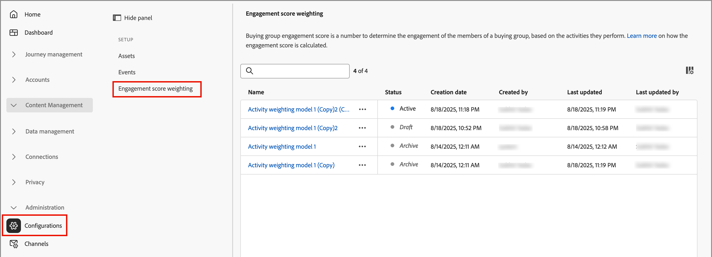

# 사용자 정의 참여 점수 가중치 구성

[구매 그룹 참여 점수](../buying-groups/engagement-scores.md)는 구매 그룹의 구성원에 대해 기록된 다양한 활동을 평가하여 참여 수준을 반영합니다. 사용자 지정 점수 가중치를 사용하면 마케팅 운영 팀은 활동 가중치를 조정하기 위한 자체 모델을 정의할 수 있는 유연성을 갖습니다. 사용자 지정 점수 책정 모델은 판매 프로세스에서 구매 의도를 가장 정확하게 나타내는 행동을 우선하여 파이프라인을 보다 정확하게 반영합니다.

관리자는 조직에 대해 여러 개의 참여 점수 모델을 정의할 수 있지만, 한 번에 하나의 모델만 활성화할 수 있습니다. 각 참여 점수 책정 활동에 적용되는 가중치에 따라 점수 모델을 정의합니다.

>[!PREREQUISITES]
>
>참여 점수 가중치 모델을 정의하고 활성화하려면 _[!UICONTROL B2B 관리 구성 관리]_ [제품 권한](./user-management.md#b2b-product-permissions)이 있어야 합니다.

## 참여 점수 가중치 모델에 액세스

활성, 초안 및 보관된 모델을 보려면 _[!UICONTROL 참여 점수 가중치]_ 목록을 여십시오.

1. 왼쪽 탐색에서 **[!UICONTROL 관리]** > **[!UICONTROL 구성]**&#x200B;을 선택합니다.

1. 채점 모델 목록을 표시하려면 중간 패널에서 **[!UICONTROL 참여 점수 가중치]**&#x200B;를 클릭하십시오.

   이 페이지에서 참여 점수 모델을 [생성(복제)](#create-an-engagement-score-model), [활성화](#activate-a-score-model) 및 [편집](#change-the-engagement-weighting-settings)할 수 있습니다.

   {width="800" zoomable="yes"}

   이 목록에는 가장 최근에 업데이트된 모델이 맨 위에 표시되며(_[!UICONTROL 마지막으로 업데이트됨]_&#x200B;별로 정렬됨), _[!UICONTROL 이름]_&#x200B;별로 검색하는 기능이 포함됩니다.

   오른쪽 상단의 _열 설정_(  ) 아이콘을 클릭하고 열 확인란을 선택하거나 선택을 취소하여 표시된 테이블을 사용자 지정할 수 있습니다.

   참여 점수 가중치 목록에 표시할 {width="300"}

1. 참여 점수 모델에 대한 세부 정보에 액세스하려면 이름을 클릭합니다.

### 기본 점수 모델

시스템은 _활동 가중치 모델 1_&#x200B;이라는 초기 참여 점수 모델을 만듭니다. 모델 상태 및 참여 활동은 [!DNL Journey Optimizer B2B Edition] 환경의 데이터 아키텍처에 따라 다릅니다.

* **간소화된 아키텍처**(Beta) - 귀하의 환경에서 [간소화된 아키텍처](../simplified-architecture.md)을(를) 사용하는 경우 참여 활동은 표준 및 사용자 지정 Experience Platform 이벤트를 기반으로 합니다. 모든 활동의 가중치는 기본적으로 0입니다.

  {width="600" zoomable="yes"}

* **표준 아키텍처** - 사용자 환경에서 표준 아키텍처를 사용하는 경우 연결된 [!DNL Marketo Engage] 인스턴스가 참여 활동 데이터의 원본입니다. 기본 모델은 사용자 정의 버전을 만들고 활성화할 때까지 활성화됩니다.

  {width="600" zoomable="yes"}

사용자 지정 모델을 활성화하면 활성 모델이 _보관됨_ 상태로 변경됩니다. 기본 참여 점수 모델로 되돌리기로 결정한 경우 원래 기본 모델을 복제한 다음 활성화하거나 다른 사용자 정의 모델의 시작점으로 사용할 수 있습니다.

### 초안 모델 삭제

나중에 활성화하지 않기로 결정한 경우 초안 참여 점수 모델을 삭제할 수 있습니다. 목록에서 초안 점수 모델 이름 옆에 있는 _추가 메뉴_(***...***) 아이콘을 클릭하고 **[!UICONTROL 삭제]**&#x200B;를 선택합니다.

{width="350"}

확인 대화 상자에서 **[!UICONTROL 삭제]**&#x200B;를 클릭합니다.

## 사용자 정의 참여 점수 모델 만들기

사용자 정의 참여 점수 모델을 만들려면 기본 모델이나 이미 만들어진 다른 사용자 정의 모델을 복제하십시오. 현재 _활성_ 모델, _초안_ 모델 또는 _보관_ 모델을 복제할 수 있습니다. 그런 다음 필요에 따라 중복 모델을 편집합니다.

1. 모델 이름을 클릭하여 모델 세부 정보 페이지를 열고 오른쪽 상단에서 **[!UICONTROL 복제]**&#x200B;를 클릭합니다.

   {width="600" zoomable="yes"}

   목록의 점수 모델 이름 옆에 있는 _추가 메뉴_(***...***) 아이콘을 클릭하고 **[!UICONTROL 복제]**&#x200B;를 선택할 수도 있습니다.

   {width="325"}

1. _복제_ 대화 상자에서 복제된 모델의 고유한 이름을 입력하고 **[!UICONTROL 복제]**&#x200B;을 클릭합니다.

   {width="500"}

   복제된 모델이 _초안_ 상태로 목록에 표시됩니다. 이름을 클릭하여 점수 모델 세부 정보를 열고 변경합니다.

### 참여 가중치 설정 변경

가중치 설정은 모델의 각 활동에 지정할 수 있는 밴드를 정의합니다. 참여를 평가하기 위한 조직의 전략을 반영하도록 밴드를 변경할 수 있습니다. 예를 들어 일반 활동에 더 높은 값을 할당하려면 _보통_ 가중치 대역을 65의 값으로 조정할 수 있습니다. 또는 _보통_&#x200B;과(와) _중요_ 사이의 활동을 캡처하도록 디자인된 가중치 밴드를 추가할 수 있습니다. 이 경우 밴드를 추가하고 _중요_(으)로 레이블을 지정하고 가중치 밴드 값 75을 할당할 수 있습니다.

1. 점수 모델 세부 정보 페이지에서 맨 위에 있는 **[!UICONTROL 참여 가중치 설정]**&#x200B;을 클릭합니다.

   {width="600" zoomable="yes"}

1. 각 가중치 밴드에 대해 필요에 따라 이름 또는 값을 조정합니다.

   * _[!UICONTROL 가중치 대역]_ 필드에서 이름을 변경합니다.
   * 새 값을 입력합니다. **&plus;** 또는 **−**&#x200B;을(를) 클릭하여 값을 늘리거나 줄일 수도 있습니다.

   {width="500"}

1. 필요한 경우 다른 가중치 대역을 추가합니다.

   목록 맨 아래에 있는 **[!UICONTROL + 가중치 밴드 추가]**&#x200B;를 클릭합니다. 이렇게 하면 목록 맨 아래에 빈 가중치 밴드가 삽입됩니다.

   이름을 입력하고 밴드의 값을 설정합니다. 고유한 이름과 값을 사용해야 합니다.

1. 가중치 대역을 제거하려면 가중치 대역 행의 _삭제_(  ) 아이콘을 클릭하십시오.

1. 변경 사항이 완료되면 **[!UICONTROL 저장]**&#x200B;을 클릭하세요.

### 활동 가중치 변경

각 점수 모델에는 지원되는 참여 점수 활동의 전체 목록이 포함되어 있습니다.

+++간소화된 아키텍처를 위한 활동

간소화된 아키텍처에 대한 기본 모델에는 Experience Platform 추적 활동이 포함됩니다. 각 활동에는 가중치를 할당할 때까지 영(0) 가중치(사용되지 않음)가 있습니다. 또한 모든 활동의 최대 일일 빈도는 20이며, 변경할 수 없습니다.

<table style="table-layout: fixed; width: 100%; border: 0;">
<tbody>
<tr style="border: 0;">
<td>
<ul><li>Advertising 클릭 수 </li><li>Advertising 완료 </li><li>Advertising 전환 </li><li>Advertising Federated </li><li>Advertising 1사분위수 </li><li>Advertising 노출 횟수 </li><li>Advertising 미드포인트 </li><li>Advertising 시작 </li><li>Advertising 3사분위수 </li><li>Advertising 재생 시간 </li><li>애플리케이션 닫기 </li><li>애플리케이션 실행 </li><li>참여 캠페인 케이던스 변경 </li><li>Commerce 백오피스 대변 메모 발행됨 </li><li>Commerce 백오피스 주문 취소됨 </li><li>Commerce 백오피스 주문 접수됨 </li><li>Commerce Backoffice OrderItems 배송 </li><li>Commerce 백오피스 선적 완료됨 </li><li>Commerce 체크아웃 </li><li>Commerce 제품 목록(장바구니) 추가 </li><li>Commerce 제품 목록(장바구니) 오픈 수 </li><li>Commerce 제품 목록(장바구니) 제거 </li><li>Commerce 제품 목록(장바구니) 재오픈 수 </li><li>Commerce 제품 목록(장바구니) 보기 </li><li>Commerce 제품 보기 </li><li>Commerce 구매 </li><li>Commerce 나중을 위해 저장 </li><li>의사 결정 제안 취소 </li><li>의사 결정 제안 표시 </li><li>의사 결정 제안 상호 작용 </li></ul>
</td>
<td>
<ul><li>의사 결정 제안 전송 </li><li>의사 결정 제안 트리거 </li><li>게재 피드백 </li><li>다이렉트 마케팅 이메일 반송됨 </li><li>가볍게 반송된 다이렉트 마케팅 이메일 </li><li>다이렉트 마케팅 이메일 클릭됨 </li><li>다이렉트 마케팅 이메일 전달됨 </li><li>다이렉트 마케팅 이메일 열림 </li><li>다이렉트 마케팅 이메일 전송됨 </li><li>다이렉트 마케팅 이메일 구독 취소됨 </li><li>인앱 메시지가 기각되었습니다. </li><li>인앱 메시지가 표시되었습니다. </li><li>인앱 메시지가 와(과) 상호 작용함 </li><li>Campaign에 리드 작업 추가 </li><li>리드 작업 호출 Webhook </li><li>잠재 고객 공정 변경 캠페인 스트림 </li><li>가망 고객 작업 가망 고객 전환 </li><li>리드 작업 즐거운 순간 </li><li>가망 고객 공정 가망 고객 병합 </li><li>잠재 고객 운영 신규 잠재 고객 </li><li>잠재 고객 운영 수익 단계 변경됨 </li><li>잠재 고객 운영 점수 변경됨 </li><li>캠페인 진행률의 가망 고객 작업 상태 변경됨 </li></ul>
</td>
<td>
<ul><li>리드 작업 목록에 추가 </li><li>리드 작업 목록에서 제거 </li><li>위치 종료 </li><li>Media adBreakComplete </li><li>미디어 adBreakStart </li><li>Media adComplete </li><li>Media adSkip </li><li>Media adStart </li><li>미디어 bitrateChange </li><li>미디어 bufferStart </li><li>미디어 chapterComplete </li><li>미디어 chapterSkip </li><li>미디어 chapterStart </li><li>미디어 사용자 지정 추적 </li><li>미디어에서 다운로드한 콘텐츠 </li><li>미디어 오류 </li><li>Media pauseStart </li><li>미디어 Ping </li><li>미디어 재생 </li><li>미디어 sessionComplete </li><li>미디어 세션 종료 </li><li>미디어 sessionStart </li><li>미디어 상태 업데이트 </li><li>메시지 피드백 </li><li>메시지 렌더링 데이터 </li><li>메시지 추적 </li><li>영업 기회에 영업 기회 이벤트 추가 </li><li>영업 기회 이벤트 영업 기회 업데이트됨 </li><li>영업 기회 이벤트 영업 기회에서 제거 </li><li>푸시 추적 응용 프로그램 열림 </li><li>푸시 추적 사용자 지정 작업 </li><li>웹 양식 작성됨 </li><li>웹 웹 인터랙션 링크 클릭 수 </li><li>웹 웹 페이지 세부 정보 페이지 보기 수</li></ul>
</td>
</tbody>
</table>

+++

+++표준 아키텍처를 위한 활동

표준 아키텍처의 기본 모델에는 기본 가중치가 연결된 [!DNL Marketo Engage]개의 추적된 활동이 포함됩니다. 이 모델을 복제할 때 필요에 따라 가중치를 변경할 수 있습니다. 최대 일별 빈도는 변경할 수 없습니다.

{{engagement-activities-me}}

+++

목록의 각 활동에 대해 각 활동 발생에 지정할 값을 설정합니다. **[!UICONTROL 가중치]** 필드에서 아래쪽 화살표를 클릭하고 참여 가중치 설정에 정의된 가중치 대역을 선택합니다.

{width="600" zoomable="yes"}

참여 점수 계산에서 활동을 사용하지 않으려면 가중치를 영(0) 값으로 설정합니다.

변경 사항은 자동으로 저장됩니다.

## 점수 모델 활성화

초안 점수 모델을 활성화하면 현재 활성화된 모델이 바뀝니다. 현재 활성 모델이 자동으로 보관됩니다.

1. 초안 점수 모델을 열어 세부 정보 페이지를 조회합니다.

1. **[!UICONTROL 활성화]**&#x200B;를 클릭합니다.

1. 확인 대화 상자에서 **[!UICONTROL 활성화]**&#x200B;를 클릭합니다.

   {width="400"}
