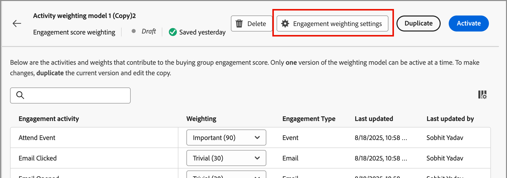

# 사용자 정의 참여 점수 가중치 구성

구매 그룹 참여 점수는 구매 그룹의 구성원에 대해 기록된 다양한 활동을 평가하여 참여 수준을 반영합니다. 사용자 정의 점수 가중치를 사용하면 마케팅 운영 팀은 참여에 가장 의미 있는 활동에 가중치를 적용하기 위한 자체 모델을 유연하게 정의할 수 있습니다. 사용자 지정 점수 책정 모델은 판매 프로세스에서 구매 의도를 가장 정확하게 나타내는 행동을 우선하여 파이프라인을 보다 정확하게 반영합니다.

관리자는 조직에 대해 여러 개의 참여 점수 모델을 정의할 수 있지만, 한 번에 하나의 모델만 활성화할 수 있습니다. 각 참여 점수 책정 활동에 적용되는 가중치에 따라 점수 모델을 정의합니다.

## 참여 점수 가중치 모델에 액세스

1. 왼쪽 탐색에서 **[!UICONTROL 관리]** > **[!UICONTROL 구성]**&#x200B;을 선택합니다.

1. 채점 모델 목록을 표시하려면 중간 패널에서 **[!UICONTROL 참여 점수 가중치]**&#x200B;를 클릭하십시오.

   이 페이지에서 참여 점수 모델을 [생성(복제)](#create-an-engagement-score-model), [활성화](#activate-a-score-model) 및 [편집](#change-the-engagement-weighting-settings)할 수 있습니다.

   {width="800" zoomable="yes"}

   표에는 가장 최근에 업데이트된 모델이 맨 위에 표시되며(_[!UICONTROL 마지막으로 업데이트됨]_&#x200B;별로 정렬됨), _[!UICONTROL 이름]_&#x200B;별로 검색하는 기능이 포함되어 있습니다. 오른쪽 상단의 _열 설정_(  ) 아이콘을 클릭하고 열 확인란을 선택하거나 선택을 취소하여 표시된 테이블을 사용자 지정할 수 있습니다.

참여 점수 가중치 목록에 표시할 {width="300"}

1. 참여 점수 모델에 대한 세부 정보에 액세스하려면 이름을 클릭합니다.

### 기본 점수 모델

시스템은 _활동 가중치 모델 1_(이)라는 이름의 초기 참여 점수 모델을 만듭니다. 이 모델은 사용자 지정 모델을 만들고 활성화하기 전까지 활성 모델입니다. 사용자 지정 모델을 활성화하면 기본 모델이 _보관됨_ 상태로 변경됩니다. 기본 참여 점수 모델로 되돌리거나 다른 사용자 정의 모델의 시작점으로 사용하려는 경우 이를 복제할 수 있습니다.

{width="600" zoomable="yes"}

### 초안 모델 삭제

나중에 활성화하지 않기로 결정한 경우 초안 참여 점수 모델을 삭제할 수 있습니다. 목록에서 초안 점수 모델 이름 옆에 있는 _추가 메뉴_(***...***) 아이콘을 클릭하고 **[!UICONTROL 삭제]**&#x200B;를 선택합니다.

{width="350"}

확인 대화 상자에서 **[!UICONTROL 삭제]**&#x200B;를 클릭합니다.

## 사용자 정의 참여 점수 모델 만들기

사용자 정의 참여 점수 모델을 만들려면 기본 모델이나 이미 만들어진 다른 사용자 정의 모델을 복제하십시오. 현재 _활성_ 모델, _초안_ 모델 또는 _보관_ 모델을 복제할 수 있습니다. 그런 다음 필요에 따라 중복 모델을 편집합니다.

1. 모델 이름을 클릭하여 모델 세부 정보 페이지를 열고 오른쪽 상단에서 **[!UICONTROL 복제]**&#x200B;를 클릭합니다.

   {width="600" zoomable="yes"}

   목록의 점수 모델 이름 옆에 있는 _추가 메뉴_(***...***) 아이콘을 클릭하고 **[!UICONTROL 복제]**&#x200B;를 선택할 수도 있습니다.

   {width="325"}

1. _복제_ 대화 상자에서 복제된 모델의 고유한 이름을 입력하고 **[!UICONTROL 복제]**&#x200B;을 클릭합니다.

   {width="500"}

   복제된 모델이 _초안_ 상태로 목록에 표시됩니다. 이름을 클릭하여 점수 모델 세부 정보를 열고 변경합니다.

### 참여 가중치 설정 변경

가중치 설정은 모델의 각 활동에 지정할 수 있는 밴드를 정의합니다. 참여를 평가하기 위한 조직의 전략을 반영하도록 밴드를 변경할 수 있습니다. 예를 들어 일반 활동에 더 높은 값을 할당하려면 _보통_ 가중치 대역을 65의 값으로 조정할 수 있습니다. 또는 _보통_&#x200B;과(와) _중요_ 사이의 활동을 캡처하도록 디자인된 가중치 밴드를 추가할 수 있습니다. 이 경우 밴드를 추가하고 _중요_(으)로 레이블을 지정하고 가중치 밴드 값 75을 할당할 수 있습니다.

1. 점수 모델 세부 정보 페이지에서 맨 위에 있는 **[!UICONTROL 참여 가중치 설정]**&#x200B;을 클릭합니다.

   {width="600" zoomable="yes"}

1. 각 가중치 밴드에 대해 필요에 따라 이름 또는 값을 조정합니다.

   * _[!UICONTROL 가중치 대역]_ 필드에서 이름을 변경합니다.
   * 새 값을 입력합니다. **&amp;plus;** 또는 **−**&#x200B;을(를) 클릭하여 값을 늘리거나 줄일 수도 있습니다.

   {width="500"}

1. 필요한 경우 다른 가중치 대역을 추가합니다.

   목록 맨 아래에 있는 **[!UICONTROL + 가중치 밴드 추가]**&#x200B;를 클릭합니다. 이렇게 하면 목록 맨 아래에 빈 가중치 밴드가 삽입됩니다.

   이름을 입력하고 밴드의 값을 설정합니다. 고유한 이름과 값을 사용해야 합니다.

1. 필요한 경우 가중치 대역을 제거하고 가중치 대역 행에 대한 _삭제_( ) 아이콘을 클릭합니다.

1. 변경 사항이 완료되면 **[!UICONTROL 저장]**&#x200B;을 클릭하세요.

### 활동 가중치 변경

각 점수 모델에는 지원되는 참여 점수 활동의 전체 목록이 포함되어 있습니다.

{{engagement-activities}}

목록의 각 활동에 대해 각 활동 발생에 지정할 값을 설정합니다. **[!UICONTROL 가중치]** 필드에서 아래쪽 화살표를 클릭하고 참여 가중치 설정에 정의된 가중치 대역을 선택합니다.

{width="500"}

참여 점수 계산에서 활동을 사용하지 않으려면 가중치를 영(0) 값으로 설정합니다.

변경 사항은 자동으로 저장됩니다.

## 점수 모델 활성화

초안 점수 모델을 활성화하면 현재 활성화된 모델이 바뀝니다. 현재 활성 모델이 자동으로 보관됩니다.

1. 초안 점수 모델을 열어 세부 정보 페이지를 조회합니다.

1. **[!UICONTROL 활성화]**&#x200B;를 클릭합니다.

1. 확인 대화 상자에서 **[!UICONTROL 활성화]**&#x200B;를 클릭합니다.

   {width="400"}
