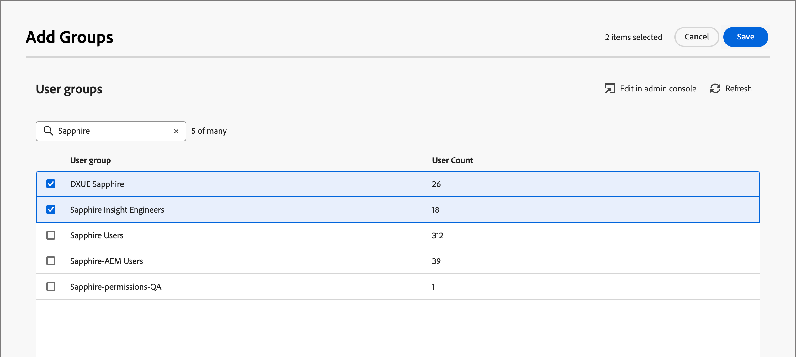

# 사용자 관리

프로비저닝이 완료되고 샌드박스가 바인딩되면 다음 단계를 완료하여 팀과 사용자에게 Adobe Journey Optimizer B2B edition 액세스를 제공합니다.

1. Admin Console에서 [Marketo Engage 제품 프로필을 만듭니다](#marketo-engage-profile)(새 Marketo Engage 인스턴스만 해당).
1. Admin Console에서 [사용자 그룹 만들기](#create-user-group).
<!-- 1. [Edit built-in roles](#edit-roles) or [create a custom role](#create-a-custom-role) with Journey Optimizer B2B Edition permissions. 
1. [Add users](#add-users) or [groups](#add-user-groups-to-a-role) to roles. -->

관리자는 Adobe 제품 라이선스와 사용자를 관리하고 관리하는 중앙 위치인 Adobe Admin Console에서 이러한 작업을 완료할 수 있습니다. Admin Console에서는 다양한 개별 솔루션 내부가 아닌 단일 위치에서 사용자를 만들고 관리할 수 있습니다. 기능 및 기능에 대한 자세한 내용은 [Admin Console 개요](https://helpx.adobe.com/kr/enterprise/using/admin-console.html) 페이지를 참조하세요.

## Admin Console 액세스

Admin Console을 사용하여 팀 내의 사용자를 관리하려면 먼저 Admin Console에 액세스하고 적절한 권한을 보유할 수 있는지 확인해야 합니다.

1. 시스템 관리자는 온보딩 프로세스의 일부로 Adobe에서 여러 개의 이메일을 수신해야 합니다.

   액세스 권한이 부여된 조직 이름에 대한 정보를 제공하는 시작 이메일을 찾습니다.

1. 시작 이메일의 **[!UICONTROL 시작하기]** 링크를 클릭하여 Admin Console으로 이동합니다.

   이메일을 찾을 수 없는 경우 [https://adminconsole.adobe.com](https://adminconsole.adobe.com)에서 Admin Console으로 직접 브라우저를 엽니다.

1. Adobe ID을 사용하여 로그인합니다.

   로그인에 성공하면 Adobe Admin Console의 _개요_ 페이지가 표시됩니다.

1. 여러 조직에 대한 액세스 권한이 있는 경우 올바른 조직에 로그인했는지 확인하십시오.

   조직을 변경하려면 오른쪽 상단에서 조직 이름을 클릭하고 액세스가 필요한 조직을 선택합니다.

1. 시스템 관리자인지 확인하려면 _[!UICONTROL 사용자]_ 카드에서 **[!UICONTROL 관리자]**&#x200B;를 선택하십시오.

   {width="700" zoomable="yes"}

1. Adobe ID 이메일, 사용자 이름, 이름 또는 성을 입력하여 검색합니다.

   * 액세스가 올바르게 구성된 경우 검색은 레코드를 반환합니다.

   * **[!UICONTROL 관리자 역할]** 열의 값에 `System`이(가) 표시되면 사용자(또는 표시된 사용자)가 시스템 관리자임을 알 수 있습니다.

## Marketo Engage 제품 프로필 만들기 {#marketo-engage-profile}

사용자에게 Adobe 솔루션에 대한 액세스 권한을 부여할 때 반드시 전체 액세스 권한을 부여할 필요는 없습니다. 제품 프로필을 사용하면 각 솔루션이 고유한 사용자 권한 집합을 가질 수 있습니다. Admin Console을 사용하여 제품 프로필을 할당합니다.

사용자 자격에 제품 프로필을 사용하는 방법에 대한 자세한 내용은 Admin Console 설명서에서 [기업 사용자를 위한 제품 프로필 관리](https://helpx.adobe.com/kr/enterprise/using/manage-product-profiles.html){target="_blank"}를 참조하십시오.
<!--
>[!BEGINSHADEBOX]

When you add a user to the Marketo Engage product profile, they are subsequently added to the _Standard User_ role within the Default workspace of the Marketo Engage subscription. This role grants them all _Standard User_ permissions for Marketo Engage in that workspace. Currently, all Journey Optimizer B2B Edition users are required to be Marketo Engage users. A Marketo Engage administrator can restrict access by updating the permissions for the _Standard User_ role or by moving the user to a different Marketo Engage user role with more restrictive permissions.

For more information about managing these permissions within Marketo Engage, see [Managing User Roles and Permissions](https://experienceleague.adobe.com/ko/docs/marketo/using/product-docs/administration/users-and-roles/managing-user-roles-and-permissions){target="_blank"} in the Marketo Engage documentation.

>[!ENDSHADEBOX]-->

{width="30"} 시스템 관리자 또는 Marketo Engage 제품 관리자는 다음 단계를 수행할 수 있습니다.

1. [https://adminconsole.adobe.com](https://adminconsole.adobe.com)에 로그인합니다.

1. **[!UICONTROL 제품]** 탭을 선택합니다.

1. 프로필을 추가할 Marketo Engage 인스턴스를 열고 **[!UICONTROL 새 프로필]**&#x200B;을 클릭합니다.

   {width="700" zoomable="yes"}

1. 제품 프로필 이름(예: _표준 사용자_)을 입력하십시오.

1. **다음**&#x200B;을 클릭한 다음 **저장**&#x200B;을 클릭합니다.

## 사용자 그룹 만들기 {#create-user-group}

사용자 그룹은 공유 권한 집합이 부여된 사용자 컬렉션입니다. 사용자 그룹의 사용자를 추가하거나 제거할 수 있습니다. 그룹 내의 사용자가 변경되는 동안 그룹 권한은 동일하게 유지됩니다.

사용자 그룹을 사용하여 권한을 관리하는 방법에 대한 자세한 내용은 Admin Console 설명서에서 [사용자 그룹 관리](https://helpx.adobe.com/kr/enterprise/using/user-groups.html){target="_blank"}를 참조하십시오.

{width="30"} 시스템 관리자는 다음 단계를 수행할 수 있습니다.

1. [https://adminconsole.adobe.com](https://adminconsole.adobe.com)에 로그인합니다.

1. **[!UICONTROL 사용자]** 탭을 선택합니다.

1. 왼쪽 탐색에서 **[!UICONTROL 사용자 그룹]**&#x200B;을 선택합니다.

1. 오른쪽 상단의 **[!UICONTROL 새 사용자 그룹]**&#x200B;을 클릭합니다.

1. _표준 사용자_&#x200B;와 같은 사용자 그룹의 이름을 입력하고 **[!UICONTROL 저장]**&#x200B;을 클릭합니다.

1. 방금 만든 사용자 그룹을 클릭합니다.

1. **[!UICONTROL 할당된 제품 프로필]** 탭을 선택하고 **[!UICONTROL 프로필 할당]**&#x200B;을 클릭합니다.

1. **+**&#x200B;을(를) 클릭하고 다음 제품의 각 인스턴스를 추가합니다.

   * [!UICONTROL Marketo Engage]
   * [!UICONTROL Adobe Experience Platform - AEP-Default-All-Users]
   * [!UICONTROL Adobe Experience Platform 데이터 수집]
   * [!UICONTROL 데이터 수집 모든 액세스]

   {width="700" zoomable="yes"}

1. **[!UICONTROL 저장]**&#x200B;을 클릭합니다.

## 그룹에 사용자 추가

사용자 관리에 대한 자세한 내용은 Admin Console 설명서에서 [Admin Console 사용자](https://helpx.adobe.com/kr/enterprise/using/user-groups.html)를 참조하십시오.

{width="30"} 시스템 관리자 또는 제품 관리자는 다음 단계를 수행할 수 있습니다. 제품 관리자는 해당 조직에 이미 존재하는 사용자만 추가할 수 있습니다.

1. [https://adminconsole.adobe.com](https://adminconsole.adobe.com)&#x200B;(으)로 이동합니다.

1. _[!UICONTROL 빠른 링크]_&#x200B;에서 **[!UICONTROL 사용자 추가]**&#x200B;를 클릭합니다.

1. 각 사용자 추가:

   * 사용자의 이메일 주소, 이름 및 성을 입력합니다.

     {width="600" zoomable="yes"}

   * **[!UICONTROL 사용자 그룹]**&#x200B;의 경우 **+**&#x200B;을(를) 클릭합니다.

   * 이전에 생성한 사용자 그룹을 선택합니다.

   * **[!UICONTROL 적용]**&#x200B;을 클릭합니다.

1. **[!UICONTROL 저장]**&#x200B;을 클릭합니다.

<!-- ## Edit roles for product permissions {#edit-roles}

Permissions are unitary rights that allow you to define the authorizations assigned to a product profile. Each permission is gathered under a capability, such as journeys or buying groups, which represents the different functionalities or objects in Journey Optimizer B2B Edition.

The _Permissions_ area of Adobe Experience Platform is where administrators can define user roles and access policies to manage access permissions for features and objects within a product application. In this app, you can create and manage roles, as well as assign the desired resource permissions for these roles. Permissions also allow you to manage the sandboxes and users associated with a specific role.

For more information about role permissions in Experience Platform, see [Manage permissions for a role](https://experienceleague.adobe.com/ko/docs/experience-platform/access-control/abac/permissions-ui/permissions){target="_blank"} in the Experience Platform documentation.

### B2B product permissions

The following permissions govern access to Journey Optimizer B2B Edition capabilities:

| Category | Description | Permissions |
| -------- | ----------- | ---------- |
| B2B Account Lists | Configure, manage, view, and publish permissions for B2B account lists. These permissions include actions such as add, remove, import, and delete accounts from account lists. | <li>Manage B2B Account Lists |
| B2B Admin Configurations | Configure, manage, and view permissions for B2B administrative configurations. These permissions include digital asset management connections, asset repositories, and events. | <li>Manage B2B Admin Configurations |
| B2B Assets | Configure, manage, and view permissions for B2B assets. These permissions include emails, SMS, landing pages, fragments, templates, and images. | <li>Manage B2B Assets <li>Manage B2B Templates <li>Manage B2B Fragments|
| B2B Buying Groups | Configure, manage, and view permissions for B2B buying groups. These permissions include solution interests, roles templates, and buying group status. | <li>Manage B2B Buying Groups |
| B2B Channel Configurations | Configure, manage, and view permissions for B2B channel configurations. These permissions include settings for communication limits, API credentials, and security settings. | <li>Manage B2B Channels Configurations |
| B2B Dashboards |Configure and view permissions for B2B dashboards. These permissions include account engagement, buying group stages, surging accounts, and contact coverage. | <li>Manage B2B Dashboards |
| B2B Journeys | Configure manage, view, and publish permissions for B2B journeys. These permissions include account and person actions, event listeners, and split paths | <li>Manage B2B Journeys |

### B2B built-in roles

When your organization has the Journey Optimizer B2B Edition product provisioned, Experience Platform includes a set of built-in (default) roles that you can use to manage access to the product capabilities:

| Role | Permissions |
| ---- | ----------- |
| B2B Journey Manager | <li>Manage B2B Journeys <li>Manage B2B Buying Groups <li>Manage B2B Account Lists <li>View B2B Engagement Dashboard <li>View B2B Insights Dashboard |
| B2B Channel Manager | <li>Manage B2B Assets <li>Manage B2B Templates <li>Manage B2B Fragments |
| B2B System Administrator | <li>Manage B2B Channels Configurations <li>Manage B2B Admin Configurations |
| B2B Sales User | <li>View B2B Engagement Dashboard |

### Edit role permissions

For built-in or custom roles, you can decide at any time to add or delete permissions. If you modify a default or custom role, it impacts every user assigned to the role.

In the following example, you want to add permissions related to the B2B Journeys resource for users assigned to the B2B Channel Manager role. This change enables users for that role to manage account journeys also.

>[!NOTE]
>
>An Admin Console system administrator can perform these steps.

_To change the permissions for a role:_

1. Go to [experience.adobe.com](https://experience.adobe.com/).

1. In the _[!UICONTROL Quick access]_ panel, select **[!UICONTROL Permissions]**.

   >[!NOTE]
   >
   >If you don't see _[!UICONTROL Permissions]_, you may need to click **[!UICONTROL View all]** and select it from the available applications.

   {width="700" zoomable="yes"}

1. Select **[!UICONTROL Roles]** in the left navigation.

1. Click the **_B2B Channel Manager_** role name.

1. In the details page, click **[!UICONTROL Edit]** at the top right.

   {width="700" zoomable="yes"}

   In the role editor, the _[!UICONTROL Resources]_ menu displays the list of resources that apply to the Experience Cloud - Platform powered applications products.

   You can enter _B2B_ in the search tool to filter the list for the B2B product permissions. 
   
1. Click the _Add_ icon (**+**) for the B2B Journeys resource.

   {width="700" zoomable="yes"}

1. In the _[!UICONTROL B2B Journeys]_ permissions card, select **[!UICONTROL Manage B2B Account Journeys]**.

1. Click **[!UICONTROL Save]**.

   {width="700" zoomable="yes"}

1. Click **[!UICONTROL Close]** to return to the details page.

### Add users to a role

{width="30"} A system administrator or AEP product administrator can perform the following steps. 

1. Open the role details and select the **[!UICONTROL Users]** tab.

   This tab displays a list of all users assigned to the role.

1. Click **[!UICONTROL Add users]**.

   {width="700" zoomable="yes"}

1. In the _[!UICONTROL Add users]_ dialog, locate and select the users that you want to add to the role.

   * You can use the Search tool to filter the list of users. 

   * Select the checkbox for each user.

   {width="600" zoomable="yes"}

1. Click **[!UICONTROL Save]** when you have selected all the users that you want to add.

### Add user groups to a role

For information about user management, see [Admin Console users](https://helpx.adobe.com/kr/enterprise/using/user-groups.html) in the Admin Console documentation.

{width="30"} A system administrator or AEP product administrator can perform the following steps. 

1. Open the role details and select the **[!UICONTROL User groups]** tab.

   This tab displays a list of all user groups assigned to the role. 

1. Click **[!UICONTROL Add Groups]**.

   {width="700" zoomable="yes"}

1. In the _[!UICONTROL Add groups]_ dialog, locate and select the groups that you want to add to the role.

   * You can use the Search tool to filter the list of user groups. 

   * Select the checkbox for each user group.

   {width="600" zoomable="yes"}

1. Click **[!UICONTROL Save]** when you have selected all the users that you want to add.

## Create a custom role

{width="30"} A system administrator or AEP product administrator can perform the following steps. 

1. Select **[!UICONTROL Roles]** in the left navigation and select **[!UICONTROL Create role]**.

1. In the _[!UICONTROL Create new role]_ dialog, enter a name for the role, such as _B2B Marketers_, and a description (optional).

1. Click **[!UICONTROL Confirm]**.

1. Select your sandboxes.

   {width="700" zoomable="yes"}

1. Add the profile permissions:

   * In the _[!UICONTROL Resources]_ list on the left, locate the **[!UICONTROL Profile Management]** item and click the _Add_ (**+**) icon to add the attribute.

   * For the attribute, add the following permissions:
      * [!UICONTROL View segments]
      * [!UICONTROL Manage segments]
      * [!UICONTROL View profiles]
      * [!UICONTROL Manage profiles]
      * [!UICONTROL View B2B profile]
      * [!UICONTROL Manage B2B profile]

   {width="700" zoomable="yes"}

1. Add B2B product permissions:

   Refer to the list of [B2B product permissions](#b2b-product-permissions) to determine which product capabilities that you want for the role.

   In the _[!UICONTROL Resources]_ list on the left, locate the **[!UICONTROL B2B]** items and click the _Add_ (**+**) icon to add each attribute that you want to enable for the role.

   You can enter _B2B_ in the search tool to filter the list for the B2B product permissions.

1. Click **[!UICONTROL Save]** at the top right.

1. Go to the role details and select the **[!UICONTROL User groups]** tab.

1. Click **[!UICONTROL Add Groups]**.

   {width="700" zoomable="yes"}

1. Select the checkbox next to the user group that you created previously in the Admin Console.

1. Click **[!UICONTROL Save]**.
-->