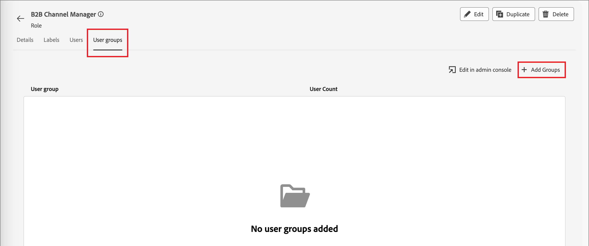

# 사용자 관리

프로비저닝이 완료되고 샌드박스가 바인딩되면 다음 단계를 완료하여 팀과 사용자에게 Adobe Journey Optimizer B2B edition 액세스를 제공합니다.

1. Admin Console에서 [Marketo Engage 제품 프로필을 만듭니다](#marketo-engage-profile)(새 Marketo Engage 인스턴스만 해당).
1. Admin Console에서 [사용자 그룹을 만듭니다](#create-user-group).
1. Journey Optimizer B2B edition 권한을 사용하여 [기본 제공 역할을 편집](#edit-roles) 또는 [사용자 지정 역할을 만들기](#create-a-custom-role)합니다.
1. 역할에 [사용자 추가](#add-users) 또는 [그룹](#add-user-groups-to-a-role).

관리자는 Adobe 제품 라이선스 및 사용자를 관리하고 관리하는 중앙 위치인 Adobe Admin Console에서 이러한 작업을 완료할 수 있습니다. Admin Console에서 다양한 개별 솔루션 내부가 아닌 단일 위치에서 사용자를 만들고 관리할 수 있습니다. 기능 및 기능에 대한 자세한 내용은 [Admin Console 개요](https://helpx.adobe.com/enterprise/using/admin-console.html) 페이지를 참조하세요.

## Admin Console 액세스

Admin Console을 사용하여 Admin Console 내의 사용자를 관리하려면 먼저 팀에 액세스하고 적절한 권한을 보유할 수 있어야 합니다.

1. 시스템 관리자는 온보딩 프로세스의 일부로 Adobe에서 여러 개의 이메일을 수신해야 합니다.

   액세스 권한이 부여된 조직 이름에 대한 정보를 제공하는 시작 이메일을 찾습니다.

1. 시작 이메일의 **[!UICONTROL 시작하기]** 링크를 클릭하여 Admin Console으로 이동합니다.

   전자 메일을 찾을 수 없는 경우 Admin Console에 대한 브라우저를 [https://adminconsole.adobe.com](https://adminconsole.adobe.com)에서 직접 여십시오.

1. Adobe ID을 사용하여 로그인합니다.

   로그인에 성공하면 Adobe Admin Console의 _개요_ 페이지가 표시됩니다.

1. 여러 조직에 대한 액세스 권한이 있는 경우 올바른 조직에 로그인했는지 확인하십시오.

   조직을 변경하려면 오른쪽 상단에서 조직 이름을 클릭하고 액세스가 필요한 조직을 선택합니다.

1. 시스템 관리자인지 확인하려면 _[!UICONTROL 사용자]_ 카드에서 **[!UICONTROL 관리자]**&#x200B;를 선택하십시오.

   {width="700" zoomable="yes"}

1. Adobe ID 이메일, 사용자 이름, 이름 또는 성을 입력하여 검색합니다.

   * 액세스가 올바르게 구성된 경우 검색은 레코드를 반환합니다.

   * **[!UICONTROL 관리자 역할]** 열의 값에 `System`이(가) 표시되면 사용자(또는 표시된 사용자)가 시스템 관리자임을 알 수 있습니다.

## Marketo Engage 제품 프로필 만들기 {#marketo-engage-profile}

사용자에게 Adobe 솔루션에 대한 액세스 권한을 부여할 때 반드시 전체 액세스 권한을 부여할 필요는 없습니다. 제품 프로필을 사용하면 각 솔루션이 고유한 사용자 권한 집합을 가질 수 있습니다. Admin Console을 사용하여 제품 프로필을 할당합니다.

사용자 자격에 제품 프로필을 사용하는 방법에 대한 자세한 내용은 Admin Console 설명서에서 [기업 사용자에 대한 제품 프로필 관리](https://helpx.adobe.com/enterprise/using/manage-product-profiles.html){target="_blank"}를 참조하십시오.
<!--
>[!BEGINSHADEBOX]

When you add a user to the Marketo Engage product profile, they are subsequently added to the _Standard User_ role within the Default workspace of the Marketo Engage subscription. This role grants them all _Standard User_ permissions for Marketo Engage in that workspace. Currently, all Journey Optimizer B2B Edition users are required to be Marketo Engage users. A Marketo Engage administrator can restrict access by updating the permissions for the _Standard User_ role or by moving the user to a different Marketo Engage user role with more restrictive permissions.

For more information about managing these permissions within Marketo Engage, see [Managing User Roles and Permissions](https://experienceleague.adobe.com/en/docs/marketo/using/product-docs/administration/users-and-roles/managing-user-roles-and-permissions){target="_blank"} in the Marketo Engage documentation.

>[!ENDSHADEBOX]-->

>[!NOTE]
>
>Admin Console 시스템 관리자 또는 Marketo Engage 제품 관리자가 이러한 단계를 수행할 수 있습니다.

1. [https://adminconsole.adobe.com](https://adminconsole.adobe.com)에 로그인합니다.

1. **[!UICONTROL 제품]** 탭을 선택합니다.

1. 프로필을 추가할 Marketo Engage 인스턴스를 열고 **[!UICONTROL 새 프로필]**&#x200B;을 클릭합니다.

   {width="700" zoomable="yes"}

1. 제품 프로필 이름(예: _표준 사용자_)을 입력하십시오.

1. **다음**&#x200B;을 클릭한 다음 **저장**&#x200B;을 클릭합니다.

## 사용자 그룹 만들기 {#create-user-group}

사용자 그룹은 공유 권한 집합이 부여된 사용자 컬렉션입니다. 사용자 그룹의 사용자를 추가하거나 제거할 수 있습니다. 그룹 내의 사용자가 변경되는 동안 그룹 권한은 동일하게 유지됩니다.

사용자 그룹을 사용하여 권한을 관리하는 방법에 대한 자세한 내용은 Admin Console 설명서에서 [사용자 그룹 관리](https://helpx.adobe.com/kr/enterprise/using/user-groups.html){target="_blank"}를 참조하십시오.

>[!NOTE]
>
>Admin Console 시스템 관리자는 다음 단계를 수행할 수 있습니다.

1. [https://adminconsole.adobe.com](https://adminconsole.adobe.com)에 로그인합니다.

1. **[!UICONTROL 사용자]** 탭을 선택합니다.

1. 왼쪽 탐색에서 **[!UICONTROL 사용자 그룹]**&#x200B;을 선택합니다.

1. 오른쪽 상단의 **[!UICONTROL 새 사용자 그룹]**&#x200B;을 클릭합니다.

1. _표준 사용자_&#x200B;와 같은 사용자 그룹의 이름을 입력하고 **[!UICONTROL 저장]**&#x200B;을 클릭합니다.

1. 방금 만든 사용자 그룹을 클릭합니다.

1. **[!UICONTROL 할당된 제품 프로필]** 탭을 선택하고 **[!UICONTROL 프로필 할당]**&#x200B;을 클릭합니다.

1. **+**&#x200B;을(를) 클릭하고 다음 제품의 각 인스턴스를 추가합니다.

   * [!UICONTROL Marketo Engage]
   * [!UICONTROL Adobe Experience Platform - AEP-Default-All-Users]
   * [!UICONTROL Adobe Experience Platform 데이터 수집]
   * [!UICONTROL 데이터 수집 모든 액세스]

   {width="700" zoomable="yes"}

1. **[!UICONTROL 저장]**&#x200B;을 클릭합니다.

## 그룹에 사용자 추가

>[!NOTE]
>
>Admin Console 시스템 관리자는 다음 단계를 수행할 수 있습니다.

Admin Console 관리에 대한 자세한 내용은 사용자 설명서의 [Admin Console 사용자](https://helpx.adobe.com/kr/enterprise/using/user-groups.html)를 참조하십시오.

1. [https://adminconsole.adobe.com](https://adminconsole.adobe.com)(으)로 이동합니다.

1. _[!UICONTROL 빠른 링크]_&#x200B;에서 **[!UICONTROL 사용자 추가]**&#x200B;를 클릭합니다.

1. 각 사용자 추가:

   * 사용자의 이메일 주소, 이름 및 성을 입력합니다.

     {width="600" zoomable="yes"}

   * **[!UICONTROL 사용자 그룹]**&#x200B;의 경우 **+**&#x200B;을(를) 클릭합니다.

   * 이전에 생성한 사용자 그룹을 선택합니다.

   * **[!UICONTROL 적용]**&#x200B;을 클릭합니다.

1. **[!UICONTROL 저장]**&#x200B;을 클릭합니다.

## 제품 권한에 대한 역할 편집 {#edit-roles}

권한은 제품 프로필에 할당된 권한을 정의할 수 있는 단일 권한입니다. 각 권한은 Journey Optimizer B2B edition의 다양한 기능 또는 개체를 나타내는 여정 또는 구매 그룹과 같은 기능 아래에 수집됩니다.

Adobe Experience Platform의 _권한_ 영역에서 관리자는 사용자 역할과 액세스 정책을 정의하여 제품 응용 프로그램 내의 기능 및 개체에 대한 액세스 권한을 관리할 수 있습니다. 이 앱에서는 역할을 만들고 관리하며, 이러한 역할에 대해 원하는 리소스 권한을 할당할 수 있습니다. 또한 권한을 사용하여 특정 역할과 연관된 샌드박스 및 사용자를 관리할 수 있습니다.

Experience Platform의 역할 권한에 대한 자세한 내용은 Experience Platform 설명서의 [역할에 대한 권한 관리](https://experienceleague.adobe.com/en/docs/experience-platform/access-control/abac/permissions-ui/permissions){target="_blank"}를 참조하십시오.

### B2B 제품 권한

Journey Optimizer B2B edition 기능에 대한 액세스를 제어하는 권한은 다음과 같습니다.

| 카테고리 | 설명 | 권한 |
| -------- | ----------- | ---------- |
| B2B 계정 목록 | B2B 계정 목록에 대한 권한을 구성, 관리, 보기 및 게시합니다. 이러한 권한에는 계정 목록에서 계정 추가, 제거, 가져오기 및 삭제와 같은 작업이 포함됩니다. | <li>B2B 계정 목록 관리 |
| B2B 관리 구성 | B2B 관리 구성에 대한 권한을 구성, 관리 및 봅니다. 이러한 권한에는 디지털 자산 관리 연결, 자산 저장소 및 이벤트가 포함됩니다. | <li>B2B 관리 구성 관리 |
| B2B Assets | B2B 자산에 대한 권한을 구성, 관리 및 봅니다. 이러한 권한에는 이메일, SMS, 랜딩 페이지, 조각, 템플릿 및 이미지가 포함됩니다. | <li>B2B Assets 관리 <li>B2B 템플릿 관리 <li>B2B 조각 관리 |
| B2B 구매 그룹 | B2B 구매 그룹에 대한 권한을 구성, 관리 및 봅니다. 이러한 권한에는 솔루션 관심 분야, 역할 템플릿 및 구매 그룹 상태가 포함됩니다. | <li>B2B 구매 그룹 관리 |
| B2B 채널 구성 | B2B 채널 구성에 대한 권한을 구성, 관리 및 봅니다. 이러한 권한에는 통신 제한, API 자격 증명 및 보안 설정에 대한 설정이 포함됩니다. | <li>B2B 채널 구성 관리 |
| B2B 대시보드 | B2B 대시보드에 대한 권한을 구성하고 봅니다. 이러한 권한에는 계정 참여, 구매 그룹 단계, 급증하는 계정 및 연락처 적용 범위가 포함됩니다. | <li>B2B 대시보드 관리 |
| B2B 여정 | B2B 여정에 대한 관리, 보기 및 게시 권한을 구성합니다. 이러한 권한에는 계정 및 사용자 작업, 이벤트 리스너 및 분할 경로가 포함됩니다 | <li>B2B 여정 관리 |

### B2B 기본 제공 역할

조직에 Journey Optimizer B2B edition 제품이 프로비저닝되면 Experience Platform은 제품 기능에 대한 액세스를 관리하는 데 사용할 수 있는 기본 제공(기본) 역할 세트를 포함합니다.

| 역할 | 권한 |
| ---- | ----------- |
| B2B 여정 관리자 | <li>B2B 여정 관리 <li>B2B 구매 그룹 관리 <li>B2B 계정 목록 관리 <li>B2B 지능형 대시보드 보기 <li>B2B 통찰력 대시보드 보기 |
| B2B 채널 관리자 | <li>B2B Assets 관리 <li>B2B 템플릿 관리 <li>B2B 조각 관리 |
| B2B 시스템 관리자 | <li>B2B 채널 구성 관리 <li>B2B 관리 구성 관리 |
| B2B 영업 사용자 | <li>지능형 대시보드 보기 |

### 역할 권한 편집

기본 제공 또는 사용자 지정 역할의 경우 언제든지 권한을 추가하거나 삭제할 것을 결정할 수 있습니다. 기본 또는 사용자 정의 역할을 수정하는 경우 해당 역할에 할당된 모든 사용자에게 영향을 줍니다.

다음 예에서는 B2B 채널 관리자 역할에 할당된 사용자의 B2B 여정 리소스와 관련된 권한을 추가하려고 합니다. 이 변경 사항을 통해 해당 역할의 사용자는 계정 여정을 관리할 수도 있습니다.

>[!NOTE]
>
>Admin Console 시스템 관리자는 다음 단계를 수행할 수 있습니다.

_역할에 대한 권한을 변경하려면:_

1. [experience.adobe.com](https://experience.adobe.com/)(으)로 이동합니다.

1. _[!UICONTROL 빠른 액세스]_ 패널에서 **[!UICONTROL 권한]**&#x200B;을 선택합니다.

   >[!NOTE]
   >
   >_[!UICONTROL 권한]_&#x200B;이 표시되지 않으면 **[!UICONTROL 모두 보기]**&#x200B;를 클릭하고 사용 가능한 응용 프로그램에서 선택해야 할 수 있습니다.

   {width="700" zoomable="yes"}

1. 왼쪽 탐색에서 **[!UICONTROL 역할]**&#x200B;을(를) 선택합니다.

1. **_B2B 채널 관리자_** 역할 이름을 클릭합니다.

1. 세부 정보 페이지에서 오른쪽 상단의 **[!UICONTROL 편집]**&#x200B;을 클릭합니다.

   {width="700" zoomable="yes"}

   Experience Cloud 편집기에서 _[!UICONTROL 리소스]_ 메뉴에 역할에 적용되는 리소스 목록이 표시됩니다. 이 목록은 플랫폼 기반 응용 프로그램 제품입니다.

   검색 도구에 _B2B_&#x200B;을(를) 입력하여 B2B 제품 권한 목록을 필터링할 수 있습니다.

1. B2B 여정 리소스에 대한 _추가_ 아이콘(**+**)을 클릭합니다.

   {width="700" zoomable="yes"}

1. _[!UICONTROL B2B 여정]_ 권한 카드에서 **[!UICONTROL B2B 계정 여정 관리]**&#x200B;를 선택합니다.

1. **[!UICONTROL 저장]**&#x200B;을 클릭합니다.

   {width="700" zoomable="yes"}

1. 세부 정보 페이지로 돌아가려면 **[!UICONTROL 닫기]**&#x200B;를 클릭하십시오.

### 역할에 사용자 추가

>[!NOTE]
>
>Admin Console 시스템 관리자는 다음 단계를 수행할 수 있습니다.

1. 역할 세부 정보를 열고 **[!UICONTROL 사용자]** 탭을 선택합니다.

   이 탭에는 역할에 할당된 모든 사용자 목록이 표시됩니다.

1. **[!UICONTROL 사용자 추가]**&#x200B;를 클릭합니다.

   {width="700" zoomable="yes"}

1. _[!UICONTROL 사용자 추가]_ 대화 상자에서 역할에 추가할 사용자를 찾아 선택합니다.

   * 검색 도구를 사용하여 사용자 목록을 필터링할 수 있습니다.

   * 각 사용자에 대한 확인란을 선택합니다.

   {width="600" zoomable="yes"}

1. 추가할 모든 사용자를 선택한 경우 **[!UICONTROL 저장]**&#x200B;을 클릭합니다.

### 역할에 사용자 그룹 추가

>[!NOTE]
>
>Admin Console 시스템 관리자는 다음 단계를 수행할 수 있습니다.

Admin Console 관리에 대한 자세한 내용은 사용자 설명서의 [Admin Console 사용자](https://helpx.adobe.com/kr/enterprise/using/user-groups.html)를 참조하십시오.

1. 역할 세부 정보를 열고 **[!UICONTROL 사용자 그룹]** 탭을 선택합니다.

   이 탭에는 역할에 할당된 모든 사용자 그룹 목록이 표시됩니다.

1. **[!UICONTROL 그룹 추가]**&#x200B;를 클릭합니다.

   {width="700" zoomable="yes"}

1. _[!UICONTROL 그룹 추가]_ 대화 상자에서 역할에 추가할 그룹을 찾아 선택합니다.

   * 검색 도구를 사용하여 사용자 그룹 목록을 필터링할 수 있습니다.

   * 각 사용자 그룹에 대한 확인란을 선택합니다.

   {width="600" zoomable="yes"}

1. 추가할 모든 사용자를 선택한 경우 **[!UICONTROL 저장]**&#x200B;을 클릭합니다.

## 사용자 정의 역할 만들기

>[!NOTE]
>
>Admin Console 시스템 관리자는 다음 단계를 수행할 수 있습니다.

1. 왼쪽 탐색에서 **[!UICONTROL 역할]**&#x200B;을(를) 선택하고 **[!UICONTROL 역할 만들기]**&#x200B;를 선택합니다.

1. _[!UICONTROL 새 역할 만들기]_ 대화 상자에서 _B2B 마케터_&#x200B;와 같은 역할 이름과 설명(선택 사항)을 입력합니다.

1. **[!UICONTROL 확인]**&#x200B;을 클릭합니다.

1. 샌드박스를 선택합니다.

   {width="700" zoomable="yes"}

1. 프로필 권한 추가:

   * 왼쪽의 _[!UICONTROL 리소스]_ 목록에서 **[!UICONTROL 프로필 관리]** 항목을 찾은 다음 _추가_(**+**) 아이콘을 클릭하여 특성을 추가합니다.

   * 속성에 대해 다음 권한을 추가합니다.
      * [!UICONTROL 세그먼트 보기]
      * [!UICONTROL 세그먼트 관리]
      * [!UICONTROL 프로필 보기]
      * [!UICONTROL 프로필 관리]
      * [!UICONTROL B2B 프로필 보기]
      * [!UICONTROL B2B 프로필 관리]

   {width="700" zoomable="yes"}

1. B2B 제품 권한 추가:

   역할에 대해 원하는 제품 기능을 확인하려면 [B2B 제품 권한](#b2b-product-permissions) 목록을 참조하세요.

   왼쪽의 _[!UICONTROL 리소스]_ 목록에서 **[!UICONTROL B2B]** 항목을 찾은 다음 _추가_(**+**) 아이콘을 클릭하여 역할에 사용할 각 특성을 추가합니다.

   검색 도구에 _B2B_&#x200B;을(를) 입력하여 B2B 제품 권한 목록을 필터링할 수 있습니다.

1. 오른쪽 상단의 **[!UICONTROL 저장]**&#x200B;을 클릭합니다.

1. 역할 세부 정보로 이동하여 **[!UICONTROL 사용자 그룹]** 탭을 선택합니다.

1. **[!UICONTROL 그룹 추가]**&#x200B;를 클릭합니다.

   {width="700" zoomable="yes"}

1. Admin Console에서 이전에 생성한 사용자 그룹 옆의 확인란을 선택합니다.

1. **[!UICONTROL 저장]**&#x200B;을 클릭합니다.
