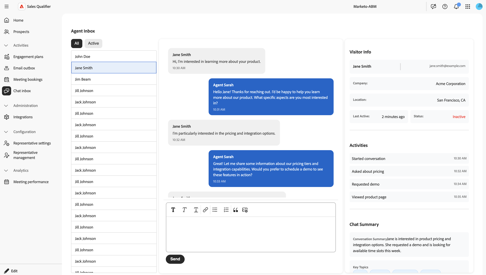

# 영업 구분자

Sales Qualifier는 Adobe Journey Optimizer B2B edition에서 사용할 수 있는 AI 기반의 애플리케이션입니다. Account Qualification Agent을 구현하고 BDR(비즈니스 개발 담당자)을 위한 워크플로를 간소화하도록 설계되었습니다. Sales Qualifier 는 채널 전반에서 잠재 고객 검증, 지원, 구매자 참여 워크플로우를 자동화합니다. 엔터프라이즈 B2B 기업의 수동 BDR 로드를 줄이고 파이프라인 속도를 가속화합니다.

BDR은 브라우저 및 이메일 플러그인을 사용하여 CRM 또는 Outlook 내에서 직접 비즈니스 인텔리전스에 액세스할 수 있습니다. 다음 비디오에서는 Sales Qualifier와 Account Qualification Agent에 대해 간략하게 소개합니다.

>[!VIDEO](https://video.tv.adobe.com/v/3476568?captions=kor)

## 애플리케이션 홈

Sales Qualifier가 [!UICONTROL Journey Optimizer B2B edition]에 포함되어 있지만 Adobe Experience Platform 내의 별도 앱입니다.

{width="800" zoomable="yes"}

### Account Qualification 에이전트

Account Qualification Agent(AQA)는 Sales Qualifier의 핵심입니다. AQA는 AI를 사용하여 계정을 읽고 다음 단계를 위해 준비된 계정을 결정합니다. 조직이 CRM을 연결했을 때 리서치, 이메일 드래프팅 및 CRM 정보에 기반한 컨텍스트를 지원합니다.

<!--
## Edit the left navigation bar

At the bottom left of the application, click the _Edit_ (  ) icon to control which elements are visible in the left navigation. You can also drag and drop them to reorder as you want.
-->

### 기본 에이전트 사용

Adobe AI 에이전트는 _자연어 쿼리_&#x200B;를 사용합니다. 즉, 사용자와 통화할 때 텍스트 프롬프트에서 사용하는 언어와 동일한 언어를 사용합니다. 자세할수록 좋은 결과를 얻을 수 있습니다.

자연어를 사용하여 에이전트에게 다음 작업을 요청할 수 있습니다.

* `Tell me the latest financial results of Bodea`
* `Tell me more about hiring at TechNova`
* `Tell me about the new AI features in Bodea LumaSecure4`

프롬프트를 세분화하여 필요한 결과를 얻음으로써 아웃바운드 워크플로우를 반복합니다. 예:

* _소득 통화 또는 보고서와 같은 컨텍스트에서 후속 전자 메일 그림 초안을 작성합니다._ 최대 120단어. 제목란: 주요 테마를 통합한 매혹적인 내용 소개: 컨텍스트 소스의 직접 견적으로 시작합니다. 신체: 통증 지점에 연결하고 제안을 가치있게 하라. CTA: 자세히 살펴보기 위해 짧은 통화를 제안합니다._

* _이 전자 메일의 목표는 대화를 시작하고 신뢰도를 높이는 것입니다._ 협의적이고 공감 가능한 톤이 있는 120단어로 이메일을 작성하십시오. 지나치게 친숙한 또는 판매 방식을 피하고 &quot;잘 지내길 바란다&quot;, &quot;체크인만 할 것&quot; 또는 &quot;제발&quot;이라는 문구를 사용하지 마십시오.

### 제품 액세스 및 사용자 그룹

Sales Qualifier 기능에 대한 액세스는 Adobe Admin Console의 두 사용자 그룹을 통해 관리됩니다. 사용자가 애플리케이션에 액세스하려면 제품 관리자가 온보딩 중에 그룹을 설정해야 합니다.

#### 영업 구분자 사용자

Sales Qualifier 응용 프로그램에 액세스하려면 사용자가 `Sales Qualifier` 사용자 그룹의 구성원이어야 합니다.

1. Adobe Admin Console에서 `Sales Qualifier`(이)라는 사용자 그룹을 만듭니다.
1. **기본 프로덕션 모든 액세스** AEP 프로필을 그룹에 할당합니다.
1. Sales Qualifier에 액세스해야 하는 사용자를 추가합니다.

#### 영업 구분자 관리자

[CRM 연결](#integrations-and-crm), [기술 센터](#knowledge-center) 및 글로벌 전자 메일 옵트아웃 설정을 구성하는 관리자 또한 `Sales Qualifier Admins` 사용자 그룹의 구성원이어야 합니다.

1. Adobe Admin Console에서 `Sales Qualifier Admins`(이)라는 사용자 그룹을 만듭니다.
1. `Sales Qualifier` 및 `Sales Qualifier Admins` 그룹 모두에 관리자를 추가합니다.

두 그룹의 구성원 자격을 사용하면 왼쪽 탐색 메뉴의 **[!UICONTROL 관리]**&#x200B;에서 **[!UICONTROL 관리 설정]**&#x200B;을 볼 수 있습니다. 표준 사용자는 구성된 필드, 필터 및 플레이북을 사용할 수 있으며, 구성된 옵트아웃 바닥글이 아웃바운드 이메일에 적용됩니다. 이러한 설정은 변경할 수 없습니다.

>[!NOTE]
>
>사용자 그룹 이름은 이전 단계에 표시된 대로 정확히 일치해야 합니다.

## 잠재 고객

액세스할 수 있는 잠재 고객 목록을 보려면 왼쪽 탐색에서 **[!UICONTROL 잠재 고객]**&#x200B;을 선택하십시오. 이 목록은 잠재 고객 상태 및 마지막 활동과 같은 정보에 대한 빠른 검토를 제공합니다.

{width="800" zoomable="yes"}

### 잠재 고객 목록 작성

잠재 고객 목록은 두 개 이상의 소스에서 가져온 사람을 결합합니다.

* **CRM 원본 잠재 고객** - CRM을 연결하면 연결된 사용자가 소유한 잠재 고객을 자동으로 가져옵니다. [통합 및 CRM](#integrations-and-crm)을 참조하세요.
* **가져온 잠재 고객** - CSV 파일에서 잠재 고객 목록을 가져옵니다.
* **잠재 고객을 수동으로 추가** - 앱에서 개별 사용자를 직접 추가합니다.

CRM에서 제공되지 않는 잠재 고객을 추가하려면:

1. **[!UICONTROL 잠재 고객]** 페이지에서 **[!UICONTROL 잠재 고객 추가]**&#x200B;를 선택합니다.
1. **[!UICONTROL CSV 가져오기]** 또는 **[!UICONTROL 수동으로 추가]**&#x200B;를 선택하십시오.

   * CSV 가져오기의 경우 파일을 업로드하고 해당 열을 잠재 고객 필드에 매핑합니다.
   * 개인을 수동으로 추가하려면 양식에 해당 상세내역을 입력합니다.

1. **[!UICONTROL 저장]**&#x200B;을 선택합니다.

### 잠재 고객 필터링 및 찾기

목록의 범위를 좁히려면 _필터_  아이콘을 선택하십시오. 다음을 기준으로 필터링할 수 있습니다.

* 잠재 고객 상태
* 참여 점수
* 마케팅에 의해 플래그가 지정된 흥미로운 순간
* 별점 및 불꽃점
* 연계된 거래

관리자는 매핑된 CRM 필드를 필터로 사용할 수도 있습니다. **[!UICONTROL 관리자 설정]**&#x200B;에서는 담당자가 잠재 고객을 찾는 데 사용하는 필드에 대해 **[!UICONTROL 필터링 가능]**&#x200B;이 켜집니다. [CRM 필드 매핑](#map-crm-fields-inbound-mapping)을 참조하세요.

### 잠재 고객 세부 정보 검토

잠재 고객을 선택하여 프로필을 엽니다. 연락하기 전에 중요한 신호를 검토하십시오.

* **활동 목록** - 가장 관련성이 높은 최근 동작을 강조 표시하는 맨 위에 **AI 활동 요약**&#x200B;이 있는 잠재 고객의 활동 시간 목록입니다.
* **타임라인 보기** - 채널 전반의 시각적 참여 타임라인입니다.
* **본 콘텐츠** - 잠재 고객이 활동에서 직접 본 실제 콘텐츠(예: 웹 페이지 또는 에셋)를 엽니다.

## 계정

판매한 계정으로 작업하려면 왼쪽 탐색에서 **[!UICONTROL 계정]**&#x200B;을(를) 선택하십시오. Sales Qualifier 는 고객 수준에서 지원 활동의 우선 순위를 지정할 수 있도록 초기 단계 세부 정보, 파이프라인 및 서비스를 하나로 통합합니다.

계정 개요에는 매출, 업계, 회사 규모 및 본사와 같은 핵심 사항이 요약되어 있습니다. 이러한 세부 정보와 함께 각 계정은 다음과 같이 표시됩니다.

* **열린 기회** - 연결된 CRM에서 가져온 계정과 연결된 열린 기회이므로, 지원 범위를 활성 파이프라인과 맞출 수 있습니다.
* **가장 많이 참여한 구성원** - 구매 그룹 내에서 우선 순위를 지정할 사용자를 알 수 있도록 가장 최근에 참여한 계정의 연락처입니다.
* **CRM 입력** - 연결된 CRM에서 표시되는 계정 필드, 기회 및 소유자 정보입니다. 이 데이터가 매핑되는 방법은 [통합 및 CRM](#integrations-and-crm)을 참조하십시오.

### 계정 심층 분석

자세히 알아보려면 계정을 여십시오. Account Qualification Agent(AQA)는 계정의 위치를 빠르게 이해하고 다음 작업을 결정할 수 있도록 조직의 판매 전략과 가장 관련이 있는 신호의 우선 순위를 지정합니다.

## 아웃바운드 워크플로

>[!NOTE]
>
>제품 관리자가 만든 아웃바운드 워크플로는 조직의 모든 사용자와 공유됩니다.

_아웃바운드 워크플로_&#x200B;은(는) Sales Qualifier가 목표 기반 케이던스를 실행하는 데 사용하는 구조입니다. 전달 목표 및 타겟팅 기준을 정의하면 AI가 멀티 터치 케이던스를 제안하고 각 잠재 고객에 대해 개인화된 이메일 콘텐츠를 작성합니다. 등록이 케이던스를 활성화하기 전에 각 이메일을 검토하고 승인하여 구성된 창 동안에만 메시지를 전송합니다.

아웃바운드 워크플로우는 다음 네 가지 요소를 연결합니다.

* **목표** - 지원(예: 검색 호출 예약 또는 이벤트 등록 유도)에서 원하는 결과입니다.
* **타깃팅 필터** - 적격한 잠재 고객을 결정하는 조건입니다.
* **터치포인트의 케이던스** - 예약된 날에 각각 순서가 지정된 단계 시퀀스입니다. 접점은 **이메일**, **전화** 또는 **LinkedInInMails**&#x200B;일 수 있습니다.
* **개인화된 이메일 콘텐츠** - 각 이메일 접점에 대해 AI 초안 콘텐츠는 잠재 고객 프로필, 계정 컨텍스트, 참여 내역 및 최근 뉴스를 사용합니다.

목표는 모든 것을 다운스트림으로 유도합니다. AI는 이 목표를 사용하여 타겟팅 필터를 제안하고, 케이던스를 디자인하고, 터치포인트 프롬프트를 초안하고, 생성된 모든 이메일에 대한 개인화를 구성합니다.

{width="800" zoomable="yes"}

### 주요 개념

| 개념 | 설명 |
| --- | --- |
| **워크플로** | 목표, 타겟팅 필터, 케이던스 및 설정에 의해 정의된 재사용 가능한 아웃바운드 활동. |
| **목표** | 지원 활동이 달성해야 하는 작업. |
| **접점** | 등록을 기준으로 예약된 케이던스(이메일, 전화 또는 LinkedInMail)의 한 단계. |
| **접점 프롬프트** | 톤, 길이, 포커스 및 call to action 등 잠재 고객에 대한 이메일 본문 및 주제를 생성할 때 AI가 따르는 지침입니다. |
| **케이던스** | 터치포인트의 전체 시퀀스: 몇 개, 어떤 순서로, 어떤 날에. |
| **필터 타깃팅** | 워크플로를 잠재 고객의 하위 집합으로 제한하는 조건입니다. |
| **초안** | 검토 준비되었지만 아직 승인되지 않은 생성된 이메일입니다. |
| **이유** | 주어진 이메일을 어떻게 작성했는지(어떤 신호와 데이터 소스를 사용했는지)에 대한 AI의 설명. |
| **등록** | 잠재 고객의 초안을 승인하여 워크플로우의 전송 창 중에 전송할 케이던스를 활성화하고 이메일을 대기시킵니다. |

다음 섹션에서는 마법사의 워크플로우 만들기, 생성된 이메일 검토, 잠재 고객 승인 및 시간에 따른 워크플로우 관리와 같은 전체 라이프사이클에 대해 설명합니다.

### 아웃바운드 워크플로우 만들기

워크플로 만들기는 5단계 마법사입니다. **목표**, **타깃팅**, **터치포인트 생성**, **설정** 및 **잠재 고객 추가**. 각 단계는 마지막 단계를 기반으로 하며, 초기 목표는 후속 결정마다 모양을 지정합니다.

1. 왼쪽 탐색에서 **[!UICONTROL 아웃바운드 워크플로]**&#x200B;를 선택합니다.

1. **[!UICONTROL 찾아보기]** 탭에서 오른쪽 상단의 **[!UICONTROL + 워크플로 만들기]**&#x200B;를 클릭합니다.

#### 1단계: 목표 정의

목표는 가장 중요한 입력입니다. AI에 성공이 어떻게 보이는지 알려주고 타겟팅, 케이던스 및 이메일 생성을 앵커화합니다.

1. **[!UICONTROL 처음부터 시작]**&#x200B;을 선택하여 자신의 목표를 작성하거나 **[!UICONTROL 템플릿에서 시작]**&#x200B;을 선택하여 저장된 템플릿을 사용합니다.

   {width="700" zoomable="yes"}

1. **[!UICONTROL 권장 목표]** 중 하나를 시작점으로 선택하거나 자신의 목표를 입력하십시오.

1. **[!UICONTROL 다음: 타깃팅]**&#x200B;을 클릭합니다.

목표는 주제뿐만 아니라 **구체적인 결과**&#x200B;를 표시할 때 가장 잘 작동합니다. AI에 더 많은 기능을 제공하려면 `Promote campaign automation` 대신 `Book a 15-minute discovery call with marketing leaders evaluating campaign automation`과(와) 같은 목표를 사용하십시오.

#### 2단계: 타깃팅 필터 구성

타겟팅 필터는 적격한 잠재 고객을 정의합니다. 나중에 잠재 고객을 추가하면 이러한 필터와 일치하는 잠재 고객만 선택 목록에 나타납니다.

1. 아래쪽 화살표를 클릭하여 **[!UICONTROL 필터 추가]** 목록을 표시하고 적용할 필터를 선택합니다.

   {width="700" zoomable="yes"}

1. 필터에 대한 값을 설정합니다.

1. 대상 범위를 좁히려면 필터를 더 추가합니다.

   {width="600" zoomable="yes"}

1. **[!UICONTROL 다음: 터치포인트 생성]**&#x200B;을 클릭합니다.

#### 3단계: 터치포인트 생성 및 검토

타깃팅이 설정되면 AI가 **_케이던스_**&#x200B;을 빌드합니다. 목표 및 타깃팅을 분석하고 접점 시퀀스를 정의하고 각 단계별로 **_접점 프롬프트_**&#x200B;를 기록합니다. 특정 날짜에 각 터치포인트가 있는 여러 단계의 케이던스를 볼 수 있습니다. 케이던스는 이메일, 전화 및 LinkedInMail 단계를 혼합할 수 있습니다.

{width="700" zoomable="yes"}

프롬프트를 읽으려면 이메일 터치포인트를 확장합니다. 이 지침은 색조, 길이, 포커스 및 _call to action_&#x200B;을(를) 포함하여 각 잠재 고객의 전자 메일을 작성할 때 AI를 안내합니다.

**케이던스 다시 생성**

케이던스가 원하는 것이 아니면 **[!UICONTROL 다시 생성]**&#x200B;을 클릭하고 개선 지침을 입력하십시오. 예:

* `Make it 3 touchpoints across 2 weeks`
* `Lead with an executive briefing offer in the first email`
* `Add a nurture touch focused on a relevant case study`

AI는 사용자의 지침에 따라 전체 케이던스를 재작성합니다.

전체 케이던스를 다시 생성하지 않고 단일 이메일 터치포인트를 조정하려면 텍스트 영역에서 프롬프트 텍스트를 직접 편집합니다.

**프롬프트에서 플레이북 사용**

조직에서 [기술 센터](#knowledge-center)에 플레이북을 만든 경우 전자 메일을 작성할 때 AI가 이 플레이북에서 추출되도록 할 수 있습니다. 프롬프트에서 AI가 사용할 문서와 컨텍스트의 이름을 지정합니다(예: `Use the ABC positioning guide from the Knowledge Center and focus on the security value proposition`). 그런 다음 생성된 이메일은 해당 플레이북의 메시지를 반영합니다.

케이던스와 프롬프트가 오른쪽으로 표시되면 **[!UICONTROL 다음: 설정]**&#x200B;을 클릭합니다.

잠재 고객 생성 전에 접점 프롬프트를 구체화하는 것: 이러한 프롬프트는 나중에 AI가 모든 잠재 고객에게 사용하는 핵심 지침입니다. 여기에서 보낸 시간은 생성된 모든 이메일에서 확장됩니다.

#### 4단계: 워크플로 설정 구성

**설정** 단계는 워크플로 실행 방식을 제어합니다.

{width="700" zoomable="yes"}

1. **[!UICONTROL 워크플로 이름]**&#x200B;을 검토하고 더 명확한 레이블을 원하는 경우 변경하십시오.
1. **[!UICONTROL 워크플로당 최대 잠재 고객 수]**&#x200B;에서 워크플로가 한 번에 관리할 수 있는 잠재 고객 수의 상한을 확인합니다.
1. 아웃바운드 전자 메일의 전송이 허용되는 시간에 대해 **[!UICONTROL 전송 창]**&#x200B;을(를) 설정합니다.
1. 주말에 해당하는 터치포인트를 다음 영업일로 이동하려면 **[!UICONTROL 주말 건너뛰기]**&#x200B;를 켭니다.
1. 잠재 고객이 모임을 예약하면 후속 터치포인트를 자동으로 중지하려면 **[!UICONTROL 모임 예약 일시 중지]**&#x200B;를 켭니다.
1. **[!UICONTROL 시간대]**&#x200B;가 대상자와 일치하는지 확인하십시오.
1. **[!UICONTROL 잠재 고객 저장 및 추가]**&#x200B;를 클릭합니다.

옵트아웃 바닥글은 관리자에 의해 전역적으로 구성되며 워크플로우 설정과 독립적으로 아웃바운드 이메일에 적용됩니다. [전역 옵트아웃 동기화](#global-opt-out-sync)를 참조하십시오.

#### 5단계: 잠재 고객 추가 및 이메일 생성 시작

저장하면 2단계 타겟팅에 의해 이미 필터링된 잠재 고객 선택 보기가 열립니다.

{width="700" zoomable="yes"}

1. 목록을 검토합니다.

   행에는 일반적으로 잠재 고객 이름, 계정, 이메일, 직함, 참여 상태 및 잠재 고객 상태가 포함됩니다.

1. 목록을 확장하거나 좁혀야 하는 경우 여기에서 필터를 조정합니다.
1. 확인란을 사용하여 잠재 고객을 선택합니다.
1. **[!UICONTROL 다음: 터치포인트를 검토]**&#x200B;하여 **잠재 고객별** 이메일 생성을 시작합니다.

AI는 케이던스에서 **각 이메일 터치포인트**&#x200B;에 대해 선택한 모든 잠재 고객에 대해 개인화된 이메일을 생성합니다. Phone 및 LinkedIn InMail 터치포인트는 예약된 단계로 케이던스에 유지됩니다. 생성은 백그라운드에서 실행할 수 있습니다. 다른 작업이 완료되는 동안 작업을 계속하려면 **[!UICONTROL 준비되면 알림]**&#x200B;을 사용하세요.

각 잠재 고객에 대해 AI는 각 터치포인트 프롬프트를 잠재 고객별 데이터(사람, 계정, 참여 내역, 최근 뉴스)와 결합하여 주제 라인과 본문을 생성합니다.

### 생성된 이메일 검토 및 세분화

생성이 완료되면 워크플로 세부 사항 보기에 초안을 검토할 배너가 표시됩니다. 검토해야 하며 승인할 때까지 아무 것도 전송되지 않습니다.

{width="700" zoomable="yes"}

1. 워크플로 세부 사항 보기의 배너에서 **[!UICONTROL 초안 검토]**&#x200B;를 클릭합니다.
1. **[!UICONTROL 터치포인트 검토]** 단계에는 두 개의 탭이 있습니다.
   * **[!UICONTROL 검토 준비됨]** - 생성을 완료한 전자 메일
   * **[!UICONTROL 생성]** - 전자 메일이 아직 작성 중입니다.
1. 왼쪽의 Prospect 목록에서 이름을 클릭하여 오른쪽에 있는 Prospect 의 터치포인트를 로드합니다.
1. 터치포인트에서 V자(**>**)를 사용하여 전체 제목 줄과 본문을 확장하고 읽습니다.

#### AI 추론 읽기

생성된 각 이메일에 대해 **[!UICONTROL 추론]**&#x200B;은(는) AI가 콘텐츠와 call to action을 형성하는 신호, 특성 및 소스를 포함하여 해당 메시지를 만드는 방법을 설명합니다. 승인하기 전에 이 정보를 검토하고 개인화를 확인하십시오.

{width="600" zoomable="yes"}

#### 직접 이메일 편집

간단한 편집(단어, 어조, 한 문장)의 경우:

1. 확장된 터치포인트에서 _편집_ 아이콘을 클릭하여 편집기를 엽니다.
1. 제목 줄 또는 본문을 편집합니다.
1. **[!UICONTROL 저장]**&#x200B;을 클릭합니다.

#### AI로 이메일 세분화

더 큰 변경(메시지 재구성, 시프트 강조 또는 프레임 변경)의 경우 **[!UICONTROL AI로 생성]**&#x200B;을 사용하십시오. AI 에이전트는 개인화 컨텍스트를 유지하면서 이메일을 재작성합니다.

1. 전자 메일 편집기에서 **[!UICONTROL AI로 생성]**&#x200B;을 클릭합니다.

   {width="600" zoomable="yes"}

1. 명확한 지침을 입력합니다. 예를 들면 다음과 같습니다.
   * `Make it shorter and more direct. Keep it under 100 words.`
   * `Focus more on the prospect's role and how the solution helps them specifically.`
   * `Change the call-to-action to suggest a 15-minute introductory call instead.`
1. 개정을 검토하고 필요한 경우 수동으로 조정합니다.
1. **[!UICONTROL 저장]**&#x200B;을 클릭합니다.

>[!TIP]
>
>직접 편집하면 문장과 어조가 바뀝니다. _[!UICONTROL AI로 생성]_&#x200B;을 사용하여 전자 메일을 처음부터 다시 작성하십시오.

### 잠재 고객 승인 및 등록

승인이 잠재 고객에 대한 케이던스를 활성화합니다. 잠재 고객이 승인되고 등록될 때까지 시스템에서 이메일을 보내지 않습니다.

1. 왼쪽 잠재 고객 목록에서 검토한 이메일이 있고 전송할 준비가 된 잠재 고객을 선택합니다.
1. **[!UICONTROL 잠재 고객 승인 및 등록]**(오른쪽 하단)을 클릭합니다.

{width="700" zoomable="yes"}

구성된 **시간대**&#x200B;의 워크플로우 **전송 창** 중에 등록을 기준으로 각 터치포인트의 예약된 날짜에 승인된 이메일을 보냅니다. 승인하지 않은 잠재 고객은 실행할 때까지 **[!UICONTROL 검토 준비됨]**&#x200B;에 남아 있습니다. 승인 후 워크플로는 정의한 케이던스에 따라 실행됩니다.

### 기존 워크플로우 관리

_[!UICONTROL 아웃바운드 워크플로]_ 페이지에서 **[!UICONTROL 찾아보기]** 탭에 모든 워크플로가 나열됩니다. 각 카드에는 목표, 구성된 터치포인트 및 성능 지표가 표시됩니다. 이 보기를 사용하여 활성 워크플로를 모니터링하거나, 여전히 검토가 필요한 초안으로 돌아가거나, 워크플로를 열어 더 많은 잠재 고객을 추가하십시오.

### 아웃바운드 워크플로우 모범 사례

* **목표에 투자하십시오.** 다운스트림 타겟팅, 케이던스 및 이메일은 모두 목표에 다시 추적됩니다. 결과 중심의 구체적인 목표가 모호한 목표를 능가한다.
* **잠재 고객별 생성 전에 접점 프롬프트를 완료합니다.** 일괄 생성 후에는 일반적으로 한 번에 한 개의 가망 고객이 변경됩니다.
* **이유를 품질 검사로 사용합니다.** 잘못된 신호가 강조되거나 명백한 신호가 누락된 경우 이메일을 편집하거나 터치포인트 프롬프트를 다시 방문하여 케이던스를 다시 생성합니다.
* **변경 내용에 편집 도구를 일치시킵니다.** 단어 및 색조에 대한 직접 편집; 재구성 또는 재구성을 위해 **[!UICONTROL AI로 생성]**.
* **검토한 내용만 승인하십시오.** 등록 전에 터치포인트를 확장하고 콘텐츠를 읽고 필요한 위치를 구체화합니다.

### 전역 옵트아웃 동기화

관리자는 모든 아웃바운드 전자 메일에 사전 승인된 [!DNL Marketo] 버전을 사용하는 간단한 터치 구독 취소 바닥글을 추가할 수 있습니다. 잠재 고객이 옵트아웃 링크를 선택하면 Sales Qualifier 는 추가 이메일에서 잠재 고객을 영구적으로 억제하고 옵트아웃 상태를 연결된 CRM에 다시 동기화합니다. [전역 전자 메일 옵트아웃 구성](#configure-global-email-opt-out)을 참조하세요.

## 이메일 보낼 편지함

전자 메일 보낼 편지함 패널에 보낸 모든 자동화된 전자 메일이 나열됩니다.

<!--
## Meeting bookings

This panel displays all meetings set up through automation.

## Chat inbox

This panel displays all your chat threads.



You can interact with clients, and see summaries for the contact and the thread so that you can quickly know where you are in the thread.

-->

## 작업

Sales Qualifier의 _작업_ 영역에서는 BDR(비즈니스 개발 담당자)이 아웃바운드 워크플로 작업을 관리하고 처리할 수 있는 전용 공간을 제공합니다. 아웃바운드 워크플로 엔진은 BDR이 각 잠재 고객과 수행해야 하는 특정 작업(전화 통화, LinkedInMails 및 이메일 검토 등)을 나타내는 작업을 자동으로 생성합니다.

작업 관리 경험이 할 일 목록이 아닌 **처리 큐**&#x200B;입니다. 작업을 열고, 작업을 수행하고, 완료로 표시하고, 페이지를 떠나지 않고 다음 작업으로 이동할 수 있습니다.

전체 작업 페이지를 열려면 왼쪽 탐색 막대에서 **[!UICONTROL 작업]**&#x200B;을 선택하십시오. 이 페이지는 작업을 하나씩 처리하기 위한 기본 작업 영역입니다.

{width="800" zoomable="yes"}

<!--
**Homepage feed** - The homepage displays a running feed of your most urgent tasks, with overdue items at the top followed by today's tasks. Each item in the feed has an "Open" button that takes you directly to that task in the Tasks page with the detail panel already loaded.
-->

### 작업 유형

모든 작업은 아웃바운드 워크플로 단계에 연결됩니다. 세 가지 유형이 있습니다.

**전화 통화** — 케이던스가 전화 통화 단계에 도달하면 만들어집니다. 작업 패널에는 에이전트가 생성한 피치 포인트와 호출 노트를 캡처하기 위한 인라인 노트 필드가 표시됩니다.

**LinkedInMail** — 케이던스가 LinkedInMail 단계에 도달할 때 만들어집니다. 작업 패널에는 제품 외부에서 복사하고 보낼 수 있는 AI가 생성한 제목란과 메시지 본문이 표시됩니다.

**전자 메일 검토** — 시스템이 워크플로에 등록된 잠재 고객에 대해 개인화된 전자 메일 생성을 완료하면 만들어집니다. 해당 잠재 고객에 대한 아웃바운드가 시작되기 전에 이메일을 검토하고 승인합니다. 각 잠재 고객은 별도의 이메일 검토 작업을 받습니다. 워크플로에 10개의 잠재 고객을 등록하면 생성이 완료될 때 최대 10개의 이메일 검토 작업이 표시됩니다.

### 작업 관리

작업 페이지는 두 개의 패널로 분할됩니다.

* **왼쪽 — 작업 목록:** 선택한 보기 및 정렬 설정에 따라 정렬 및 필터링된 작업 대기열입니다.
* **오른쪽 — 작업 작업 패널:** 잠재 고객 정보, 워크플로 컨텍스트, 작업별 콘텐츠 및 작업 제어를 포함하여 선택한 작업에 대한 세부 정보.

왼쪽 패널에서 작업을 선택하면 페이지에서 이동하지 않고 세부 정보가 오른쪽 패널에 로드됩니다.

#### 대기열 컨트롤

작업 패널에는 작업 큐를 순서대로 이동하는 **다음** 및 **이전** 컨트롤이 포함되어 있습니다. 큐는 목록에 적용하는 모든 정렬 및 필터 설정을 따릅니다. 기한 별로 정렬된 지연 전화 통화 작업을 처리하는 경우 _다음_ 및 _이전_&#x200B;이 정확히 해당 집합에서 이동합니다.

작업 완료를 표시하면 패널이 자동으로 대기열의 다음 작업으로 진행됩니다.

#### 참고

전화 통화 및 LinkedIn InMail 작업의 경우 작업 패널에서 인라인 메모 필드를 사용할 수 있습니다. 현재 작업을 완료로 표시하기 전에 다른 작업으로 이동할 때 메모가 손실되지 않도록 클릭 시 메모가 자동으로 저장됩니다.

#### 작업 작업

다음 작업을 사용하여 작업을 관리합니다.

* **[!UICONTROL 완료 표시]** - 기본 작업입니다. 작업을 실행(호출, InMail 전송 또는 이메일 검토 및 승인)한 후 이 작업을 사용합니다. 완료 시 작업이 **완료됨**(으)로 기록되고 큐가 자동으로 진행됩니다.

* **[!UICONTROL 터치포인트 건너뛰기]** - 작업 패널의 오버플로 메뉴에서 사용할 수 있습니다. 이 단계를 완료할 수 없지만 잠재 고객이 워크플로우에서 유효한 타겟으로 남아 있는 경우 이 옵션을 사용합니다.
  * 전망은 케이던스의 다음 단계로 나아간다. 향후 작업이 여전히 일정에 따라 생성됩니다.
  * 이유를 선택하세요. *연락처 정보가 잘못됨*, *시기가 잘못됨*, *관련이 없는 콘텐츠* 또는 *기타*(자유 텍스트 필드 사용).
  * 작업 상태가 **건너뜀**(으)로 설정되고 이유 및 타임스탬프와 함께 기록됩니다.
  * 워크플로우의 마지막 단계였던 경우 잠재 고객의 워크플로우 실행이 종료됩니다. 작업이 여전히 건너뜀(제거되지 않음)으로 기록되었습니다.

* **[!UICONTROL 워크플로에서 제거]** - 작업 패널의 오버플로 메뉴에서 사용할 수 있습니다. 잠재 고객이 더 이상 이 워크플로우에 속하지 않을 때 사용하십시오.

  워크플로우에서 잠재 고객을 제거하는 경우:
  * 이 워크플로 내에서 해당 잠재 고객에 대한 보류 중인 모든 작업 및 향후 작업이 취소되었습니다.
  * 잠재 고객의 등록 상태가 **BDR에서 제거됨**(으)로 변경됩니다.
  * 이유를 선택하세요. *왼쪽 회사*, *중복*, *맞지 않음*, *이미 전환됨* 또는 *기타*(텍스트 필드 사용).
  * 확인 대화 상자가 나타납니다. *&quot;이 작업은 [워크플로 이름]에서 [잠재 고객]에 대한 나머지 접점을 모두 취소합니다. 계속하시겠습니까?&quot;*
  * 작업 상태가 **제거됨**(으)로 설정되어 있습니다. 취소된 모든 형제 작업은 **제거됨**(으)로도 표시됩니다.

>[!NOTE]
>
>건너뛰기 및 제거 이유 데이터는 채널 건너뛰기 비율, 워크플로우 제거 비율 및 주요 이유를 포함하여 분석에 알립니다. 이를 통해 워크플로우 품질을 향상시키고 시간에 따른 성능 분석을 알릴 수 있습니다.

**자동 건너뛰기**

정체된 LinkedIn In Mail 및 전화 통화 작업은 이틀 동안 완료되지 않은 상태로 있으면 자동으로 건너뜁니다. 자동 건너뛰기는 실행을 중지하지 않고 케이던스를 통해 잠재 고객을 계속 이동하고 이메일 타임라인에는 영향을 주지 않습니다. 예약된 이메일 터치포인트는 계획대로 계속 전송됩니다.

### 작업 상태

각 작업은 다음 상태로 이동합니다.

| 상태 | 설명 |
|---|---|
| **보류 중** | 생성되었지만 이전 워크플로우 단계가 아직 완료되지 않았습니다. 작업 목록에 표시되지 않습니다. |
| **예정** | 이전 단계가 완료되지만 기한은 미래입니다. 가시적이고 실행 가능 — 적절한 시기에 완료할 수 있습니다. |
| **열기** | 오늘까지입니다. 가시적이고 실행 가능합니다. |
| **기한 초과** | 기한이 지났고 아직 완료되지 않았습니다. 가시적, 실행 가능 및 시각적 플래그 지정. |
| **완료** | 작업을 실행하고 완료로 표시했습니다. |
| **건너뜀** | 이 터치포인트를 건너뛰었습니다. 잠재 고객은 워크플로에서 발전합니다. |
| **제거됨** | 워크플로우에서 잠재 고객을 제거했습니다. 모든 형제 작업이 취소되었습니다. |
| **취소됨** | 워크플로우 변경 또는 잠재 고객 제거로 인해 시스템이 취소되었습니다. |

### 목록 보기

작업 목록 상단의 탭을 사용하여 보기 간에 전환할 수 있습니다.

* **오늘** *(기본값)* — 오늘로 예정된 작업이 완료되지 않았습니다.

* **기한 초과** — 기한이 지난 작업이 아직 열려 있습니다. 먼저 이러한 작업을 해결하십시오.

* **예정** — 이전 워크플로 단계가 이미 완료된 향후 기한의 작업입니다. 이러한 작업은 조기에 표시되므로 적절한 시점(예: 잠재 고객과 통화 중인 경우)에 미리 계획하거나 더 빨리 수행할 수 있습니다. 계획된 납기가 표시되므로 계획된 타이밍을 알 수 있습니다.

* **완료됨** — 완료, 건너뛰기 또는 제거된 작업의 레코드입니다. 검토 및 감사 목적으로 유용합니다.

### 필터링 및 검색

작업 목록을 필터링하는 방법에는 여러 가지가 있습니다.

* 다중 선택 목록을 사용하여 작업 유형별로 필터링합니다. 여러 유형을 선택하면 선택한 유형 중 *any*&#x200B;과(와) 일치하는 작업이 표시됩니다(예: 전화 통화 **또는** 이메일 검토).

* 작업 상태별로 필터링합니다. 여러 상태를 선택하면 선택한 상태와 일치하는 작업이 표시됩니다.

* **AND** 논리를 사용하여 그룹 간에 필터링합니다. 예를 들어 `Type = Phone Call and Status = Overdue`은(는) 지연 호출 작업만 표시합니다.

검색 창을 사용하여 잠재 고객 이름, 회사 이름 또는 참여 이름별로 작업을 찾습니다. 검색은 모든 활성 필터와 함께 적용됩니다. 텍스트 일치만 — 부분 일치와 정확히 일치하며 유사 검색이 없습니다.

### 정렬

**정렬 기준** 컨트롤을 사용하여 작업 목록의 순서를 선택하십시오. 정렬은 다음 및 이전 이 대기열을 이동하는 순서를 결정합니다.

| 정렬 옵션 | 비헤이비어 |
|---|---|
| **기한(오름차순)** *(기본값)* | 가장 오래된 기한이 먼저 시작됨. 기한이 지난 작업이 오늘 작업 앞에 나타납니다. |
| **기한(내림차순)** | 가장 늦은 기한 먼저. |
| **만든 날짜(최신)** | 가장 최근에 생성된 작업부터 시작합니다. |
| **만든 날짜(가장 오래된 날짜)** | 가장 오래된 작업이 먼저 생성되었습니다. |
| **작업 유형** | 유형별로 순서대로 그룹화: 전화 통화 → LinkedInMail → 이메일 검토. 각 그룹 내에서 기한 오름차순으로 정렬됩니다. |

### 기한 초과 작업

작업이 완료되지 않은 경우 기한 다음 날 기한이 만료됩니다. 기한 초과 작업:

* **기한 초과** 보기와 홈 페이지 피드의 맨 위에 나타납니다.
* 작업 목록에 &quot;기한 초과&quot; 배지로 시각적으로 플래그가 지정됩니다.
* 완전히 실행 가능한 상태로 유지 — 작업을 완료하거나, 건너뛰거나, 제거할 수 있습니다.

### 예정된 작업

예정된 작업은 다음 단계 기한일이 아직 미래인 경우에도 잠재 고객이 워크플로 단계를 완료하는 즉시 생성됩니다. 이러한 가시성은 파이프라인으로 초기 insight을 제공하므로 기회가 발생할 때 미리 계획을 수립하거나 조기에 조치할 수 있습니다.

예정된 작업은 예약된 기한을 표시하므로 언제 처리되어야 하는지 항상 알 수 있습니다. 예정된 작업을 조기에 완료하는 것이 완전히 지원됩니다. 워크플로 엔진은 실제 완료 날짜를 기록하고 잠재 고객을 정상적으로 진행합니다.

### 작업 완료

작업 완료는 작업 페이지로 제한되지 않습니다.

**참여 잠재 고객 보기:** 참여 잠재 고객의 페이지에 대한 터치포인트 미리 보기에는 콘텐츠 미리 보기 및 선택적 메모 필드와 함께 _완료 표시_ 작업이 포함됩니다. 여기에서 작업을 완료하면 작업 페이지의 상태가 즉시 업데이트됩니다. 이 보기는 자동 이동 비헤이비어를 트리거하지 않습니다. 큐 처리 표면이 아닌 보기 및 동작 표면입니다.

**Salesforce(CRM 플러그인):** Salesforce의 Sales Qualifier 플러그인은 아웃바운드 워크플로 카드 내에 작업 상태(예정, 보류, 완료, 기한 초과, 건너뜀)를 표시합니다. 현재 버전에서는 CRM 카드가 **읽기 전용**&#x200B;입니다. 작업 상태를 볼 수 있지만 Sales Qualifier 내에서 작업을 완료해야 합니다.

### 빈 상태

* **작업이 없는 오늘:** _오늘 메시지가 표시됩니다_. 예정된 작업이 있는 경우 프롬프트가 _예정된 작업이 [N]개 있습니다. 예정된 작업을 봅니다._.
* **기한이 지난 작업이 있습니다.** 기한이 지난 작업을 먼저 해결하라는 메시지가 표시됩니다.

## 회의 예약

Sales Qualifier는 참여 대화를 아웃바운드 흐름을 벗어나지 않고 예약된 회의로 변환합니다. 달력에 연결하면 Sales Qualifier는 잠재 고객이 귀하와의 시간을 예약하는 데 사용하는 개인 예약 링크를 생성합니다.

* **예약 링크** - [프로필 설정](#profile-settings)에서 일정 연결 및 사용 가능 여부를 구성합니다. 예약 링크를 이메일 서명에 추가하여 아웃바운드 이메일에 표시할 수 있습니다.
* **케이던스에 자동 삽입** - Sales Qualifier는 케이던스의 적절한 지점에 예약 링크를 삽입하므로 가장 관련성이 있을 때 만날 초대가 표시됩니다. 배치를 수동으로 재정의할 수 있습니다.
* **예약 일시 중지** - 잠재 고객이 모임을 예약하면 **[!UICONTROL 모임 예약 일시 중지]**&#x200B;에서 추가 후속 작업을 자동으로 중지합니다. [워크플로 설정 구성](#step-4-configure-workflow-settings)을 참조하세요.

[성과](#performance) 섹션에서 예약 결과를 추적합니다.

## 기술 자료 센터

_[!UICONTROL 지식 센터]_&#x200B;에서 Account Qualification Agent(AQA)에 고유한 영업 자료에 액세스할 수 있으므로 Sales Qualifier는 조직의 판매 방식을 반영하는 연구, 자격 통찰력 및 지원 서비스를 생성할 수 있습니다. 플레이북을 빌드하고 관리하는 것은 관리자의 작업입니다.

{width="700" zoomable="yes"}

### 판매 자료 업로드

1. 왼쪽 탐색에서 **[!UICONTROL 관리]**&#x200B;를 확장하고 **[!UICONTROL 관리 설정]**&#x200B;을 선택합니다.
1. **[!UICONTROL 통합]**&#x200B;에서 **[!UICONTROL 기술 센터]**&#x200B;를 선택하십시오.
1. Sales Qualifier가 회사 및 초안 전자 메일을 조사하는 데 사용하는 **[!UICONTROL 회사 이름]** 및 **[!UICONTROL 회사 URL]**&#x200B;을(를) 설정합니다.
1. PDF, PPTX 또는 DOCX 포맷으로 영업 전략, 이상적인 고객 프로필(ICP), 포지셔닝 가이드 및 기타 영업 자료를 업로드합니다.

업로드된 각 문서의 처리 상태(예: **[!UICONTROL 준비]** 및 마지막으로 업데이트된 시간)가 표시됩니다.

### 플레이북 만들기

문서를 업로드한 후 **[!UICONTROL 플레이북 빌드]**&#x200B;를 선택하여 플레이북으로 만듭니다.

>[!NOTE]
>
>플레이북은 사용할 준비가 되기 전에 처리하는 데 약 24시간이 소요됩니다.

플레이북이 준비되면 다음과 같은 지원을 제공합니다.

* **아웃바운드 전자 메일 프롬프트** - 프롬프트에서 문서 및 컨텍스트의 이름을 지정하여 전자 메일을 생성할 때 플레이북을 참조합니다. [터치포인트 생성 및 검토](#step-3-generate-and-review-touchpoints)를 참조하세요.
* **대화형 영업 도우미** - 플레이북에서 가져오려면 도우미를 참조 센터에서 지정합니다. [Conversational Sales Assistant](#conversational-sales-assistant)를 참조하십시오.

## 대화형 영업 지원

Conversational Sales Assistant는 자연어로 질문하고 영업 상황에 맞는 답변을 얻을 수 있는 채팅 경험입니다. 조수는 다음 사항을 파악합니다.

* [기술 센터](#knowledge-center) 플레이북을 포함한 내부 기술 자료
* 연결된 CRM의 CRM 신호
* [!DNL Marketo] 활동 및 참여 데이터
* 웹 리서치

도우미를 사용하여 모임 전에 계정 위치를 지정하는 등 전달을 준비합니다. 작성한 플레이북에서 가져오려면 지식 센터의 도우미를 질문에 지정합니다. 예: `From the Knowledge Center, help me position our security solution for ABC Corp ahead of tomorrow's call.`

## 성능

**[!UICONTROL 성능]** 섹션에는 아웃바운드의 작동 방식이 표시되어 작동 중인 항목과 조정할 위치를 확인할 수 있습니다.

### 이메일 성과

아웃바운드 이메일의 볼륨 및 효과를 검토하십시오.

* 이메일 전송됨
* 열람률
* 클릭률
* 응답률

Sales Qualifier는 부재 중 회신 및 바운스를 해당 상태로 식별하므로 잠재 고객 참여와 구분할 수 있습니다.

### 모임 예약 성과

회의 예약 상태 카드에 예약된 회의가 있는 위치가 요약됩니다. 검토할 모임 및 상태에 집중할 카드를 필터링합니다.

## 통합 및 CRM

통합을 통해 Sales Qualifier 는 CRM에 연결되므로 Account Qualification Agent(AQA) 및 아웃바운드 워크플로우는 Salesforce 또는 Microsoft Dynamics 365의 잠재 고객, 계정, 연락처, 활동 및 소유자에 대한 일관된 보기를 공유할 수 있습니다. Sales Qualifier는 CRM 판매 데이터 및 활동을 읽어 통찰력을 강화하고, 기록된 전달 활동 및 옵트아웃 상태를 다시 작성할 수 있습니다. 이 연결을 통해 CRM 레코드를 수정하지 않습니다.

CRM 연결, 인바운드 필드 매핑 및 활동 동기화는 관리자가 **[!UICONTROL 관리]** > **[!UICONTROL 관리 설정]** > **[!UICONTROL CRM 연결]**&#x200B;에서 구성합니다. 표준 사용자는 구성된 CRM 데이터 및 필터를 사용하지만 이러한 설정을 변경할 수 없습니다.

### CRM MCP 및 포함된 플러그인

Sales Qualifier 는 CRM과 다양한 방식으로 작동합니다.

* **CRM MCP를 통해 CRM 데이터 쿼리** - Account Qualification Agent은 CRM MCP를 통해 실시간 CRM 데이터를 쿼리하므로 응답과 인사이트가 레코드의 현재 상태를 반영합니다.
* **포함된 플러그인** - 포함된 CRM 플러그인은 CRM에서 바로 새로운 에이전트 데이터와 함께 [!DNL Marketo Sales Insights]&#x200B;(MSI) 핵심 인사이트를 표시합니다. 플러그인에서 한 번의 클릭으로 Sales Qualifier에 Prospect 를 추가합니다.
* **Activity sync-back** - 관리자가 **[!UICONTROL Activity sync]**&#x200B;를 사용하도록 설정하면, Outreach 활동이 CRM에 다시 동기화되어 담당자가 이미 사용하는 도구에서 Sales Qualifier 활동을 볼 수 있습니다.

>[!IMPORTANT]
>
>**[!UICONTROL 관리자 설정]**&#x200B;에 액세스하려면 `Sales Qualifier` 및 `Sales Qualifier Admins` 사용자 그룹 모두의 구성원이 필요합니다.

### CRM 액세스 범위

Sales Qualifier 는 필요한 CRM 엔터티를 읽고 정의된 데이터 세트만 다시 쓸 수 있습니다. 일반적으로 읽히는 개체에는 사용자, 연락처, 소유자 매핑, 리드, 계정, 기회 및 활동이 포함됩니다. 다시 쓰기는 로그된 전달 활동 및 옵트아웃 상태로 제한됩니다. CRM 관리자는 Salesforce 또는 Dynamics에서 API 액세스를 준비합니다. 그런 다음 Sales Qualifier를 연결하고 인바운드 필드를 매핑한 다음 앱에서 활동을 동기화할지 여부를 선택합니다.

>[!NOTE]
>
>다음에 나오는 자격 증명 단계에는 CRM 개체에 대한 읽기 액세스가 설명되어 있습니다. 활동 동기화 또는 옵트아웃 다시 쓰기를 활성화한 경우 CRM 관리자와 함께 CRM 구성에 필요한 해당 쓰기 액세스 권한을 부여합니다.

### CRM에서 자격 증명 준비

Sales Qualifier를 연결하기 전에 CRM 관리자와 협력합니다. 다음은 각 시스템에서 일반적으로 만들어지는 내용을 요약한 것입니다.

#### Microsoft Dynamics 365(Dataverse / Power Platform)

1. Azure Active Directory에서 응용 프로그램(**[!UICONTROL 앱 등록]**)을 등록합니다.

   **클라이언트 ID** 및 **테넌트 ID**&#x200B;을(를) 확인하고 **클라이언트 암호**&#x200B;를 만듭니다.

1. **[!UICONTROL Power Platform 관리 센터]**&#x200B;에서 환경을 열고 **[!UICONTROL 설정]** > **[!UICONTROL 사용자 + 권한]** > **[!UICONTROL 응용 프로그램 사용자]**(으)로 이동합니다.

1. 해당 Azure AD 앱에 연결된 애플리케이션 사용자를 만듭니다.

1. 리드, 연락처, 계정, 기회 및 활동과 같은 엔터티 Sales Qualifier 요구 사항에 대한 **읽기** 액세스 권한을 부여하는 보안 역할을 할당하십시오.

   이 앱에는 데이터를 읽을 수 있는 읽기 권한이 있는 보안 역할이 필요합니다.

**Dynamics에 연결할 때 제공할 정보:**

* 클라이언트 ID
* 클라이언트 암호
* 테넌트 ID
* Dynamics 인스턴스 URL(조직 URL)

#### Salesforce

Salesforce에서 조직의 보안 표준에 따라 ID 및 데이터에 대한 API 액세스를 허용하는 범위와 OAuth가 활성화된 외부 클라이언트 앱[&#128279;](https://help.salesforce.com/s/articleView?id=xcloud.create_a_local_external_client_app.htm&type=5)&#x200B;(또는 _연결된 앱_)을 만듭니다. 통합 사용자는 가망 고객, 계정, 담당자, 작업, 이벤트 및 기회와 같은 객체에 대한 읽기 액세스 권한을 보유해야 합니다. 관리 작업을 수행하려면 **[!UICONTROL 연결된 앱 관리]**(다른 권한 중)를 가진 사용자가 만든 후 소비자 키와 암호를 확인해야 합니다.

>[!PREREQUISITES]
>
>외부 클라이언트 앱을 만들려면 제품 관리자는 프로필 또는 권한 집합에서 다음을 활성화했는지 확인해야 합니다.
>
>* 응용 프로그램 사용자 지정
>* 설정 및 구성 보기
>* 모든 데이터 수정
>* 연결된 앱 관리(중요)
>
>   _연결된 앱 관리_&#x200B;를 사용할 수 없는 경우 외부 클라이언트 앱을 만든 후에는 클라이언트 ID와 클라이언트 암호를 볼 수 없습니다.

외부 클라이언트 앱을 만들 때 OAuth를 활성화하고 권한을 부여합니다. 다음 클라이언트 자격 증명도 활성화합니다.

* ID URL 서비스(ID, 프로필, 이메일, 주소, 전화)에 액세스
* API(API)를 통해 사용자 데이터 관리
* 고유 사용자 식별자(openid) 액세스

앱을 만든 후 클라이언트 자격 증명 흐름을 다시 활성화하고 연락처 이메일을 사용자 이름으로 사용합니다.  클라이언트 자격 증명이 활성화되면 _다음 계정으로 실행_&#x200B;하도록 사용자를 구성하십시오.

구성된 사용자가 다음 객체에 대한 읽기 액세스 권한을 보유하는지 확인합니다.

* 잠재 고객
* 계정
* 연락처
* 작업
* 이벤트
* 기회
* OpportunityContactRoles
* 영업 기회 라인 항목

**Sales Qualifier에서 Salesforce에 연결할 때 제공할 정보:**

* 클라이언트 ID(소비자 키)
* 클라이언트 암호(소비자 암호)
* 콜백 URL(연결된 앱에 구성된 대로)
* Salesforce 인스턴스 URL

>[!IMPORTANT]
>
>클라이언트 암호를 이메일로 보내지 마십시오. 조직의 승인된 보안 채널을 사용하여 Sales Qualifier에 자격 증명을 입력하는 사용자와 자격 증명을 공유할 수 있습니다.

### CRM에 연결

1. Sales Qualifier에 로그인하고 올바른 샌드박스 또는 환경이 선택되어 있는지 확인합니다.

1. 왼쪽 탐색에서 **[!UICONTROL 관리]**&#x200B;를 확장하고 **[!UICONTROL 관리 설정]**&#x200B;을 선택합니다.

1. **[!UICONTROL 통합]**&#x200B;에서 **[!UICONTROL CRM 연결]**&#x200B;을 선택하십시오.

   페이지에 Salesforce 및 Microsoft Dynamics 카드가 표시됩니다. 비활성 연결이 **[!UICONTROL 연결]**&#x200B;을 표시합니다. 구성된 연결에 **[!UICONTROL 연결됨]** 및 **[!UICONTROL 관리]** 작업이 표시됩니다.

   Salesforce 및 Dynamics 연결 카드를 사용한 {width="800" zoomable="yes"}

1. 사용하는 CRM에 대해 **[!UICONTROL 연결]**&#x200B;을 클릭합니다.

1. CRM 관리자의 클라이언트 ID, 암호, 테넌트 또는 콜백 값 및 **인스턴스 URL**&#x200B;을(를) 입력하십시오.

1. 연결에 성공하면 카드에 **[!UICONTROL 연결됨]**&#x200B;이 표시되는지 확인하십시오.

### 인스턴스 URL 지침

**인스턴스 URL**&#x200B;은(는) UI 전용 호스트 이름이 아니라 CRM이 API 및 통합 구성에 사용하는 환경 기반 URL이어야 합니다.

**Salesforce**

1. 로그인 후 브라우저 주소 표시줄(`{{mydomain}}` 값)에서 조직 _내 도메인_ 하위 도메인을 메모하세요.

1. Sales Qualifier의 경우 정식 양식 `https://{{mydomain}}.my.salesforce.com`을(를) 사용합니다.

   **not**&#x200B;에서 `lightning.force.com` URL을 인스턴스 URL로 사용하지 마십시오.

**Microsoft Dynamics 365**

1. 브라우저에서 CRM을 열고 주소 표시줄에서 기본 URL을 복사합니다.

   일반적으로 `https://{{org}}.crm.dynamics.com` 형식입니다.

### CRM 필드 매핑(인바운드 매핑)

CRM이 연결된 후 연결을 위해 **[!UICONTROL 관리]**&#x200B;를 선택하고 **[!UICONTROL 인바운드 매핑]**&#x200B;을 엽니다. 인바운드 매핑은 Sales Qualifier 가 애플리케이션에 가져오는 CRM 필드를 제어합니다.

1. 개체 그룹 **[!UICONTROL 연락처]**, **[!UICONTROL 잠재 고객]** 또는 **[!UICONTROL 계정]**&#x200B;을(를) 선택하십시오.
1. **[!UICONTROL 섹션 추가]**&#x200B;를 선택하고 섹션 이름과 선택적 설명을 입력하십시오.
1. 섹션에 CRM 필드를 추가합니다.

   각 필드 행에는 **[!UICONTROL 표시 이름]**, **[!UICONTROL 필드 이름]** 및 **[!UICONTROL 데이터 형식]**&#x200B;이 표시됩니다.

1. **[!UICONTROL 잠재 고객]** 목록에서 필터로 사용할 수 있는 각 필드에 대해 **[!UICONTROL 필터링 가능]**&#x200B;을 켭니다.
1. 매핑을 미리 보고 저장합니다.

매핑된 필드는 Sales Qualifier 의 해당 영역에 표시됩니다.

* 잠재 고객 및 연락처 필드는 잠재 고객의 **[!UICONTROL 개인]** 탭에 나타납니다.
* 계정 필드는 계정 보기에 나타납니다.
* 영업 기회 관련 필드는 계정 경험의 영업 기회 영역에 표시됩니다.

### 활동 동기화 구성(아웃바운드 매핑)

1. **[!UICONTROL CRM 연결]**&#x200B;에서 연결된 CRM에 대해 **[!UICONTROL 관리]**&#x200B;를 선택합니다.
1. **[!UICONTROL 아웃바운드 매핑]**&#x200B;을 엽니다.
1. **[!UICONTROL 활동 동기화]**&#x200B;를 켜서 Sales Qualifier Outreach 활동을 다시 CRM에 동기화합니다.

활동 동기화가 꺼져 있으면 Sales Qualifier 가 인바운드 CRM 데이터를 계속 사용할 수 있지만 CRM에 전달 활동을 다시 쓰지 않습니다.

### 글로벌 이메일 옵트아웃 구성

1. 왼쪽 탐색에서 **[!UICONTROL 관리]**&#x200B;를 확장하고 **[!UICONTROL 관리 설정]**&#x200B;을 선택합니다.
1. **[!UICONTROL 준수]**&#x200B;에서 **[!UICONTROL 전자 메일 설정]**&#x200B;을 선택하세요.
1. **[!UICONTROL 모든 전자 메일에 옵트아웃 링크 포함]**&#x200B;을 켜서 아웃바운드 전자 메일에 구독 취소 바닥글을 추가합니다.
1. **[!UICONTROL 옵트아웃 메시지 템플릿]**&#x200B;에 바닥글 텍스트를 입력하십시오. 클릭 가능한 구독 취소 링크가 나타날 `{{opt_out_link}}` 토큰을 포함합니다.
1. 설정을 저장합니다.

Prospect 가 링크를 선택하면 Sales Qualifier 가 추가 e- 메일을 보내지 못하게 됩니다. 옵트아웃 상태도 연결된 CRM에 다시 동기화됩니다.

### 참조: 샘플 API 매개 변수

CRM 팀은 이러한 예를 사용하여 읽기 액세스가 예상 리드 필드를 반환하는지 확인할 수 있습니다.

**동적(OData 스타일 발췌)**

```text
$select=fullname,_ownerid_value,leadid,emailaddress1,jobtitle,statuscode,createdon,modifiedon,statecode
$filter=_ownerid_value eq '<crmUserId>' [AND additional filters]
$expand=Lead_ActivityPointers(...),parentaccountid(...)
$orderby=modifiedon desc
```

**Salesforce(SOQL 발췌)**

```sql
SELECT Id, Salutation, FirstName, LastName, Name, Title, Company, Email,
  LeadSource, Status, OwnerId, LastModifiedDate, LastActivityDate, CreatedDate,
  (SELECT Id, Subject, ActivityDate, Status FROM Tasks ORDER BY ActivityDate DESC LIMIT 1),
  (SELECT Id, Subject, ActivityDateTime FROM Events ORDER BY ActivityDateTime DESC LIMIT 1)
FROM Lead
WHERE OwnerId = '<crmUserId>' AND IsDeleted = false
ORDER BY LastModifiedDate DESC
```

## 프로필 설정

프로필 설정은 개인 세부 정보, 이메일, 일정 및 채팅 가용성을 포함하여 자신에 대한 정보를 지정합니다.

### 이메일 설정

**[!UICONTROL 전자 메일 설정]** 탭에서 전자 메일 연결을 설정합니다.


* **[!UICONTROL 전자 메일 연결]** - **[!UICONTROL 연결]**&#x200B;을 클릭하고 Microsoft 로그인 절차를 따릅니다.

* **[!UICONTROL 전자 메일 서명]** - 자동 생성된 전자 메일에 사용되는 전자 메일 서명을 구성합니다. 잠재 고객이 귀하와 시간을 예약할 수 있도록 서명에 [모임 예약](#meeting-booking) 링크를 추가하십시오.

### 캘린더 구성

**[!UICONTROL 일정 구성]** 탭에서 표준 시간대 및 사용 가능 여부를 설정합니다.

<!-- 

-->

* **[!UICONTROL 일정 연결]** - **[!UICONTROL 연결]**&#x200B;을 클릭하고 Microsoft 로그인 절차에 따라 일정을 통합합니다.

* **[!UICONTROL 모임 확인 전자 메일]** - 클라이언트가 귀하와의 모임을 확인하면 확인 전자 메일이 회신으로 전송됩니다. 이 설정을 사용하여 이메일 제목과 본문을 정의합니다.

* **[!UICONTROL 기본 설정]** - 기본 모임 길이와 백투백 모임 사이의 시간을 설정합니다.

캘린더 연결을 끊는 경우:

* 활성 예약 링크가 사실상 비활성화되었습니다.
* 예약 페이지에 친숙한 일시적으로 사용할 수 없는 상태가 표시됩니다.
* 다시 연결하면 설정이 유지됩니다.

### 일정 가용성

Sales Qualifier 의 일정 가용성은 다음 두 가지 사항을 기반으로 합니다.

* 연결된 작업 일정(Outlook 또는 Gmail)
* _일정 설정_&#x200B;에서 구성된 가용성 + 타임슬롯 규칙입니다.

Sales Qualifier 는 전체 이벤트 컨텐츠가 아닌 연결된 달력에서 약속 있음/없음 상태를 읽고 구성된 규칙과 함께 이를 사용하여 잠재 고객이 볼 수 있는 예약 슬롯을 결정합니다.

다음을 구성할 수 있습니다.

* 요일별 작업 시간
* 하루에 여러 블록(예: 9:00-12:00 및 1:00-5:00)
* 표준 시간대
* 회의 기간
* 모임 전/후 버퍼
* 최소 알림
* 예약 창

<!-- 
### Chat settings

In the **[!UICONTROL Chat settings]** tab, set your Timezone Live chat availability.


## Representative management

The _[!UICONTROL Representative management]_ panel displays the defined representatives and their calendar status.

## Meeting performance

This panel presents analytics around your completed meetings.
-->

<!--
 SHPHR-24341 remove section
## Set up the Chrome plugin

The AI Assistant Chrome plugin is available on the [Google Store](https://chromewebstore.google.com/detail/ai-assistant/hancbabllcmckehonngbdkhilocpdfji?authuser=0&hl=en).

When the plugin is installed in Chrome, the Adobe logo appears on the middle right when you are on an integrated site:

* Adobe web applications
* Salesforce
* Outlook
* Microsoft Dynamics and web applications
* Google applications 
-->
