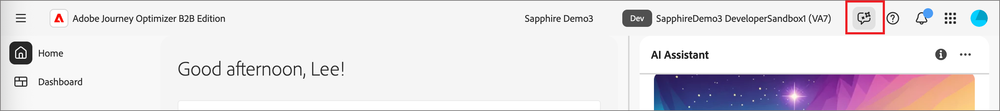

# AI Assistant 액세스 활성화

>[!IMPORTANT]
>
>권한 UI에서 조직이 AI Assistant에 액세스하려면 먼저 추가 법률 약관에 동의해야 한다는 팝업 메시지를 받는 경우 Adobe Systems 계정 계정 팀에 이러한 약관에 대한 지침을 문의하십시오.

다음 매개 변수는 Journey Optimizer B2B Edition의 AI Assistant에 대한 액세스를 제어합니다.

* **애플리케이션 액세스:** Adobe Systems Journey Optimizer B2B Edition에서 AI Assistant에 액세스할 수 있습니다.

* **권한:** 권한 UI](https://experienceleague.adobe.com/en/docs/experience-platform/access-control/abac/permissions-ui/permissions) 를 [사용하여 조직의 AI Assistant에 대한 액세스 권한을 부여하거나 취소합니다. AI Assistant를 사용하려면 지정된 사용자가 AI Assistant 활성화 및 **운영 Insights 보기 권한으로**&#x200B;구성된 역할에 속해야 합니다&#x200B;**.**

관리자는 다음 작업을 수행할 수 있습니다.

* **지정된 역할에 AI Assistant** 사용 권한을 추가하고 해당 역할에 사용자를 추가합니다. 이 권한 사용자 조직의 AI Assistant에 액세스할 수 있습니다.

* **지정된 역할에 보기 운영 Insights** 권한 추가하고 해당 역할에 사용자 추가합니다. 이 권한 덕분에 사용자 는 AI Assistant 운영 인사이트 기능을 사용할 수 있습니다.

{width="800" zoomable="yes"}

권한 UI를 사용하여 Journey Optimizer B2B Edition에서 AI Assistant를 사용할 수 있는 권한을 부여합니다. Experience Platform 및 기타 Experience Cloud 애플리케이션에서 AI Assistant에 액세스하는 방법에 대한 자세한 내용은 Adobe Experience Platform 설명서를](https://experienceleague.adobe.com/en/docs/experience-platform/ai-assistant/access) 참조하십시오[.

사용자 사용자에게 필요한 권한이 있는 경우 사용 중인 애플리케이션 상단 헤더에 있는 AI Assistant 아이콘을 선택하여 _AI Assistant_ 에 액세스할 수 있습니다.

{width="800" zoomable="yes"}

## AI Assistant 액세스 개요 동영상

다음 동영상을 시청하여 조직 및 사용자를 위해 AI Assistant에 대한 액세스를 구성하는 방법을 알아보세요.

>[!VIDEO](https://video.tv.adobe.com/v/3436470/?learn=on)

## 다음 단계

사용자가 AI Assistant에 액세스할 수 있게 되면 워크플로 중에 이 기능을 사용할 수 있습니다. 다음 설명서를 참조하십시오.

* [질문 안내](./question-guidance.md)
* [AI 어시스턴트 사용](./use-ai-assistant.md)
