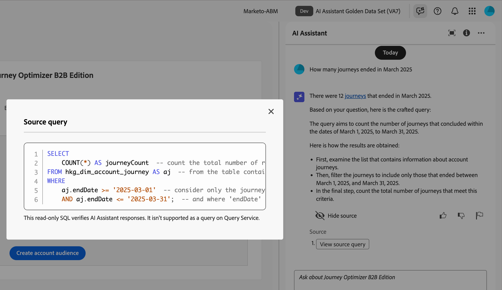

# Journey Optimizer B2B edition에서 AI Assistant 사용

Journey Optimizer B2B edition에서 AI Assistant는 제품 개념을 이해하고, 제품 기능을 빠르게 탐색 및 학습하며, 환경에 대한 운영 통찰력을 얻는 데 사용할 수 있는 사용자 인터페이스 기능입니다. Adobe Experience Cloud 전체의 여러 제품에서도 사용할 수 있습니다.

>[!IMPORTANT]
>
>AI Assistant를 사용하려면 Adobe Experience Cloud 생성 AI 사용 지침에 대한 동의가 필요합니다. 이 계약 및 사용 지침에 대한 자세한 내용은 [Adobe Experience Cloud Generative AI 사용 지침](https://www.adobe.com/kr/legal/licenses-terms/adobe-dx-gen-ai-user-guidelines.html)을 참조하세요.

AI Assistant에 액세스하려면 헤더에서 아이콘을 클릭합니다. AI Assistant가 오른쪽 패널에서 열립니다.

{width="420"}

AI Assistant 인터페이스가 나타나고 시작하기 위한 정보가 즉시 제공됩니다. _아이디어 시작_&#x200B;에 제공된 옵션을 사용하여 다음과 같은 질문과 명령에 답변할 수 있습니다.

* 어떤 여정이 게시되었습니까?
* 어떤 솔루션 관심사가 생성되었습니까?
* Journey Optimizer B2B edition의 주요 이점을 알려 주십시오.

Adobe Journey Optimizer B2B edition에서 AI Assistant는 다음과 같은 사용 사례를 지원합니다.

## 제품 지식 질문

제품 지식 질문은 Journey Optimizer B2B edition 개념 및 방법 정보에 대한 것입니다. 제품 지식 질문에 대한 몇 가지 예는 다음과 같습니다.

* SMS 공급자 계정을 설정하려면 어떻게 해야 합니까?
* 여정에서 이메일을 보내려면 어떻게 해야 합니까?
* 이메일 콘텐츠를 개인화하려면 어떻게 해야 합니까?

제품 질문을 하려면 패널 하단의 필드에 질문을 입력하고 Enter 키를 누릅니다. 예를 들어 여정에서 구매 그룹을 사용하는 방법을 배워야 하는 경우. 이 경우 _여정에서 구매 그룹을 어떻게 사용합니까?_ 질문을 제출하면 AI Assistant가 기술 자료를 쿼리하고 몇 초 안에 답변을 컴파일합니다.

{width="420"}

+++예제 답변 보기

{width="420"}

+++

## 운영 통찰력 질문

Operational insights 질문은 조직 샌드박스의 여정 개체에 대한 것입니다. 계정 대상자, 계정 여정, 솔루션 관심사 및 구매 그룹 템플릿과 같은 운영 객체에 대한 질문을 할 수 있습니다. Operational Insights 질문 또는 프롬프트의 몇 가지 예는 다음과 같습니다.

* Adobe Journey Optimizer B2B edition에는 라이브 여정이 몇 개 있습니까?
* 모든 예약된 여정 목록 제공
* 지난 7일 동안 얼마나 많은 여정이 생성되었습니까?

AI Assistant가 작동 인사이트에 대한 질문에 충분한 응답을 제공하려면 활성 샌드박스에 있어야 합니다.

>[!NOTE]
>
>AI Assistant Operational Insights 질문에서 지원하는 유일한 Adobe Journey Optimizer B2B edition 개체는 [operational insights 도메인 테이블](./ai-assistant-overview.md#operational-insights)에 나열되어 있습니다. 현재 속해 있는 샌드박스에 대한 데이터에만 액세스할 수 있습니다.

작동 인사이트 질문을 하려면 패널 하단의 필드에 입력한 다음 Enter 키를 누릅니다. 예를 들어 샌드박스의 대상에 대해 알고 싶은 경우. 이 경우 _대상이 몇 명인지 입력하십시오._.  AI Assistant는 샌드박스에 있는 대상자 카운트와 대답을 계산한 방법에 대한 설명을 제공합니다. 다음 예제 응답에서 AI Assistant는 UI의 대상에 액세스할 수 있는 링크를 제공하며 대상 수를 식별하는 데 걸린 단계를 간략하게 설명합니다.

대상 수에 대한 {width="420"}

_크기별 상위 5개 목록_&#x200B;과 같은 아티팩트 목록을 요청하면 초기 조회를 따를 수 있습니다. AI Assistant가 쿼리의 상위 5개 항목과 해당 ID가 있는 테이블을 반환합니다. 테이블을 CSV 파일로 다운로드하려면 _다운로드_(  ) 아이콘을 클릭하십시오.

{width="420"}

AI Assistant에서 전체 테이블을 보려면 _최대화_( ) 아이콘을 클릭하십시오. 확장된 테이블 보기에서 **[!UICONTROL CSV 다운로드]**&#x200B;를 클릭하여 정보를 CSV 파일로 저장합니다.

{width="600" zoomable="yes"}

## 응답 확인

AI Assistant에는 응답을 확인하고 검증하는 데 사용할 수 있는 도구가 포함되어 있습니다.

### 제품 지식 소스

제품 질문에 대한 응답을 받은 후 **[!UICONTROL 소스 표시]**&#x200B;를 선택하여 AI Assistant 응답을 생성하는 데 사용되는 제품 지식 소스 인용구를 확인합니다.

AI Assistant는 초기 응답을 확증하는 설명서 링크를 제공합니다. 또한 연결된 설명서 소스를 참조하는 답변의 특정 부분을 나타내기 위해 응답에 각주를 추가합니다.

{width="420"}

### Operational insights 소스

Operational Insights 질문에 대한 응답을 받은 후 **[!UICONTROL 원본 표시]**&#x200B;를 클릭한 다음 **[!UICONTROL 원본 쿼리 보기]**&#x200B;를 선택하십시오.

AI Assistant에서 제공하는 SQL 쿼리를 사용하여 운영 통찰력 질문과 관련된 각 응답을 확인할 수 있습니다. 작동 인사이트 질문으로 쿼리하면 AI Assistant가 답을 계산하는 데 걸린 프로세스를 확인하는 데 사용할 수 있는 SQL 쿼리를 제공합니다. 이 원본 쿼리는 확인 목적으로만 사용되며 쿼리 서비스에서 지원되지 않습니다.

{width="550" zoomable="yes"}

## 피드백 제공

_Thumb up_ (  ) 또는 _Thumb down_ (  ) 아이콘을 사용하여 응답의 유용성과 품질을 평가하십시오. 경험에 따라 간단한 설문 조사 양식을 작성하고 **[!UICONTROL 제출]**&#x200B;을 클릭합니다. 제공하는 정보는 AI Assistant를 개선하는 데 사용됩니다.

응답에서 문제가 있는 것을 발견하면 _플래그_( ) 아이콘을 클릭합니다. 양식을 사용하여 문제를 설명하고 **[!UICONTROL 제출]**&#x200B;을 클릭하여 문제를 보고하십시오.

{width="420"}

+++양식 보기

>[!BEGINTABS]

>[!TAB 엄지 손가락 위로]

{width="600" zoomable="yes"}

>[!TAB 축소판]

{width="600" zoomable="yes"}

>[!TAB 플래그]

{width="600" zoomable="yes"}

>[!ENDTABS]

+++
