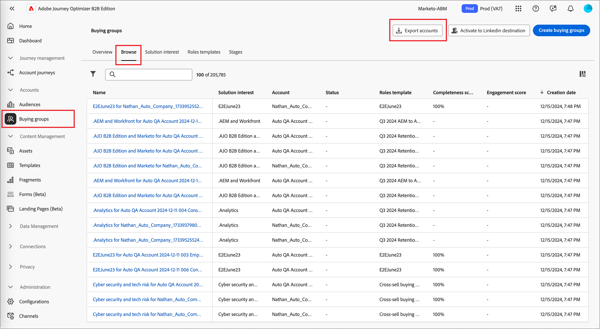

# 계정 목록 내보내기

_계정 목록 내보내기_ 기능을 사용하면 정의한 필터링에 따라 모든 계정이나 계정 세트를 내보낼 수 있습니다. 내보내기 프로세스에서는 CSV 파일이 생성되며 저장된 파일의 URL이 펄스 알림으로 전송됩니다. 필요한 경우 이 기능을 사용하여 계정을 서드파티 플랫폼으로 이동할 수 있습니다.

1. Journey Optimizer B2B 에디션의 왼쪽 탐색 영역에서 **[!UICONTROL 계정]** > **[!UICONTROL 구매 그룹]**&#x200B;으로 이동합니다.

1. **[!UICONTROL 찾아보기]** 탭을 선택합니다.

1. 오른쪽 상단에서 **[!UICONTROL 계정 내보내기]**&#x200B;를 클릭합니다.

   {width="800" zoomable="yes"}

1. 대화 상자에서 내보낼 계정 대상자의 매개변수를 정의합니다.

   {width="400"}

   **[!UICONTROL 참여 점수]**&#x200B;의 경우 `Between` 연산자와 백분율 범위가 포함됩니다. 예를 들어 5.1과 5는 모두 5와 6 _사이_&#x200B;입니다.

   빈 필터링 매개변수는 `Is Any`와 같이 처리됩니다.

1. **[!UICONTROL 계정 내보내기]**&#x200B;를 클릭하여 지정된 필터를 사용하여 CSV 파일을 생성합니다.

1. 내보내기가 완료되었다는 알림을 받으면 알림 링크를 클릭하여 CSV 파일에 액세스합니다.

   {width="425"}

   >[!NOTE]
   >
   >Adobe 사용자 계정 환경 설정에서 이메일 알림에 대한 알림 구독이 설정되어 있는 경우에는 이메일 알림이 전송될 수 있습니다.

   애플리케이션 페이지가 _구매 그룹_ 찾아보기 탭으로 리디렉션되며 파일을 시스템에 저장하라는 시스템 저장 파일 대화 상자가 표시됩니다. 데이터를 공유해야 하는 경우 팀의 파일 공유 시스템을 사용할 수 있습니다.
