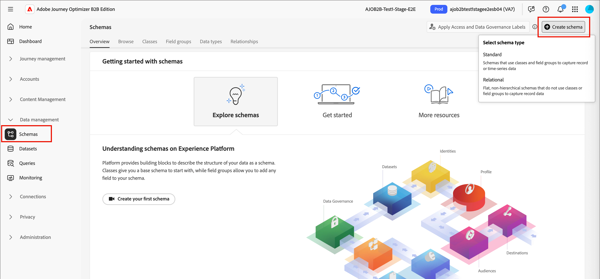

# 테스트 프로필 {#test-profiles}

Journey Optimizer B2B edition에서 랜딩 페이지 콘텐츠를 [미리 보고 테스트하려면](../content/landing-pages-create-publish.md#test-landing-page) 테스트 프로필이 필요합니다. 스키마를 만들고, 데이터 세트를 만들고, CSV 파일을 업로드하여 테스트 프로필 집합을 정의할 수 있습니다.

<!--
>[!NOTE]
>
>[!DNL Journey Optimizer B2B Edition] allows testing different variants of your content by previewing it and sending proofs using sample input data uploaded from a CSV or JSON file, or added manually. 
-->

테스트 프로필을 만드는 것은 [!DNL Adobe Experience Platform]에서 일반 프로필을 만드는 것과 비슷합니다. 자세한 내용은 [실시간 고객 프로필 설명서](https://experienceleague.adobe.com/docs/experience-platform/profile/home.html?lang=ko){target="_blank"}를 참조하세요.


## 스키마 만들기 {#create-schema}

프로필을 만들려면 먼저 [!DNL Journey Optimizer B2B Edition]에서 스키마를 만들어야 합니다.

1. 왼쪽 탐색에서 **[!UICONTROL 데이터 관리]**&#x200B;를 확장하고 **[!UICONTROL 스키마]**&#x200B;을 선택한 다음 오른쪽 상단에서 **[!UICONTROL 스키마 만들기]**&#x200B;를 클릭합니다.

   {width="800" zoomable="yes"}

1. 스키마 만들기 옵션으로 **[!UICONTROL 표준]**&#x200B;을(를) 선택하십시오.

1. 스키마 유형(예: **[!UICONTROL 수동]**)을 선택하고 **[!UICONTROL 선택]**&#x200B;을 클릭합니다.

   {width="500"}

1. 스키마 유형(예: **[!UICONTROL 개인 프로필]**)을 선택하고 **[!UICONTROL 다음]**&#x200B;을 클릭합니다.

   {width="700" zoomable="yes"}

1. 스키마의 이름(필수)과 설명(선택 사항)을 입력하고 **[!UICONTROL 마침]**&#x200B;을 클릭합니다.

   {width="700" zoomable="yes"}

   왼쪽에 _[!UICONTROL 컴포지션]_ 패널이 있는 스키마 구조가 표시됩니다.

1. **[!UICONTROL 필드 그룹]** 섹션에서 **[!UICONTROL 추가]**&#x200B;를 클릭하고 적절한 필드 그룹을 선택합니다.

   검색 도구를 사용하여 **[!UICONTROL 프로필 테스트 세부 정보]** 필드 그룹을 찾아 선택하십시오.

   {width="700" zoomable="yes"}

   완료되면 **[!UICONTROL 필드 그룹 추가]**&#x200B;를 클릭하면 필드 그룹 목록이 스키마 개요 화면에 표시됩니다.

   **[!UICONTROL 개인 연락처 정보]** 및 **[!UICONTROL 회사 연락처 정보]**&#x200B;와 같이 테스트 프로필에 사용할 필드 그룹을 추가하려면 이 단계를 반복합니다.

1. 필드 목록에서 기본 ID로 정의할 필드를 클릭합니다.

1. _[!UICONTROL 필드 속성]_ 오른쪽 창에서 **[!UICONTROL ID]** 및 **[!UICONTROL 기본 ID]** 옵션을 확인하고 네임스페이스를 선택하십시오.

   기본 ID를 전자 메일 주소로 설정하려면 **[!UICONTROL 전자 메일]** 네임스페이스를 선택하세요.

   {width="700" zoomable="yes"}

   **[!UICONTROL 적용]**&#x200B;을 클릭합니다.

1. 스키마를 선택하고 **[!UICONTROL 스키마 속성]** 창에서 **[!UICONTROL 프로필]** 옵션을 활성화하십시오.

   {width="700" zoomable="yes"}

1. **[!UICONTROL 저장]**&#x200B;을 클릭합니다.

스키마 만들기에 대한 자세한 내용은 [XDM 설명서](https://experienceleague.adobe.com/docs/experience-platform/xdm/ui/resources/schemas.html?lang=ko#prerequisites){target="_blank"}를 참조하세요.

>[!IMPORTANT]
>
>테스트 프로필 수집을 위한 데이터 세트를 만들거나 바꿀 때 스키마에 의도한 네임스페이스의 기본 ID 필드(`/personID`)에 적용되는 올바른 ID 설명자가 있는지 확인하십시오. ID 설명자가 없거나 잘못 구성된 경우 수집 프로세스가 성공적으로 완료되더라도 이 데이터 집합에 수집된 프로필은 테스트 프로필(`testProfile = true`)로 플래그가 지정되지 않을 수 있습니다.
>
>수집 후 테스트 프로필에 플래그가 올바르게 지정되지 않은 경우:
>
>1. 데이터 세트와 연결된 스키마를 검토합니다.
>1. 기본 ID 필드에 네임스페이스에 대한 올바른 ID 설명자가 있는지 확인합니다.
>1. 설명자가 누락된 경우 스키마를 업데이트하여 ID 설명자를 추가하고 데이터를 다시 수집합니다.

## 데이터 세트 만들기 {#create-dataset}

스키마를 만든 후 프로필을 가져오는 데 사용되는 데이터 세트를 만듭니다. 데이터 집합 만들기에 대한 자세한 내용은 [카탈로그 서비스 설명서](https://experienceleague.adobe.com/docs/experience-platform/catalog/datasets/user-guide.html?lang=ko#getting-started){target="_blank"}를 참조하세요.

1. 왼쪽 탐색 메뉴의 _[!UICONTROL 데이터 관리]_&#x200B;에서 **[!UICONTROL 데이터 세트]**&#x200B;를 선택합니다.

1. 오른쪽 상단에서 **[!UICONTROL 데이터 집합 만들기]**&#x200B;를 클릭합니다.

   {width="800" zoomable="yes"}

1. **[!UICONTROL 스키마에서 데이터 집합 만들기]**&#x200B;를 선택합니다.

   {width="500"}

1. 이전에 만든 스키마를 선택하고 **[!UICONTROL 다음]**&#x200B;을(를) 클릭합니다.

1. 이름을 선택하고 **[!UICONTROL 마침]**&#x200B;을 클릭하세요.

   {width="700" zoomable="yes"}

1. 오른쪽 패널에서 **[!UICONTROL 프로필]** 옵션을 활성화합니다.

## CSV 파일을 사용하여 테스트 프로필 만들기 {#create-test-profiles-csv}

[!DNL Adobe Experience Platform]에서 다른 프로필 필드가 포함된 CSV 파일을 데이터 집합에 업로드하여 프로필을 만들 수 있습니다. 이것이 가장 쉬운 방법입니다.

1. 스프레드시트 소프트웨어를 사용하여 간단한 CSV 파일을 만듭니다.

1. 각 필수 필드에 하나의 열을 추가합니다.

   기본 ID 필드(예: `personID`)와 `true`(으)로 설정된 `testProfile` 필드를 추가해야 합니다.

1. 프로필당 한 줄 및 각 필드에 대한 값을 추가합니다.

   {width="600" zoomable="yes"}

1. 스프레드시트를 csv 파일로 저장하여 쉼표가 구분 기호로 사용되도록 합니다.

1. [!DNL Adobe Experience Platform]에서 **[!UICONTROL 워크플로]**(으)로 이동합니다.

1. **[!UICONTROL XDM 스키마에 CSV 매핑]**&#x200B;을 선택하고 **[!UICONTROL 시작]**&#x200B;을 클릭합니다.

   {width="800" zoomable="yes"}

1. 가져오기에 사용할 데이터 집합을 선택하고 **[!UICONTROL 다음]**&#x200B;을(를) 클릭합니다.

   {width="700" zoomable="yes"}

1. **[!UICONTROL 파일 선택]**&#x200B;을 클릭하고 CSV 파일을 선택하거나 시스템에서 파일을 끌어서 놓습니다.

   파일 업로드가 완료되면 **[!UICONTROL 다음]**&#x200B;을(를) 클릭합니다.

   {width="700" zoomable="yes"}

1. 소스 csv 필드를 스키마 필드에 매핑한 다음 **[!UICONTROL 마침]**&#x200B;을 클릭합니다.

   소스 및 대상 필드를 표시하는 {width="700" zoomable="yes"}

   데이터 가져오기가 시작됩니다. 상태가 _처리 중_&#x200B;에서 _성공_(으)로 이동합니다.

1. 오른쪽 상단에서 **[!UICONTROL 데이터 집합 미리 보기]**&#x200B;를 클릭하고 데이터 집합에 추가된 테스트 프로필이 올바른지 확인하십시오.

   {width="700" zoomable="yes"}

   그런 다음 테스트 프로필을 사용하여 [랜딩 페이지 콘텐츠를 테스트](../content/landing-pages-create-publish.md#test-landing-page)할 수 있습니다.

>[!NOTE]
>
>CSV 데이터 가져오기에 대한 자세한 내용은 [데이터 수집 설명서](https://experienceleague.adobe.com/docs/experience-platform/ingestion/tutorials/map-a-csv-file.html?lang=ko#tutorials){target="_blank"}를 참조하세요.

<!--
## Create test profiles using API calls {#create-test-profiles-api}

You can also create test profiles via API calls. Learn more in [[!DNL Adobe Experience Platform] documentation](https://experienceleague.adobe.com/docs/experience-platform/profile/home.html?lang=ko){target="_blank"}.

You must use a Profile schema that contains the **[!UICONTROL Profile test details]** field group. The `testProfile` flag is part of this field group.
When creating a profile, make sure you pass the value: `testProfile = true`.

You can also update an existing profile to change its `testProfile` flag to `true`.

Here is an example of an API call to create a test profile:

```bash
curl -X POST \
'https://dcs.adobedc.net/collection/xxxxxxxxxxxxxx' \
-H 'Cache-Control: no-cache' \
-H 'Content-Type: application/json' \
-H 'Postman-Token: xxxxx' \
-H 'cache-control: no-cache' \
-H 'x-api-key: xxxxx' \
-H 'x-gw-ims-org-id: xxxxx' \
-d '{
"header": {
"msgType": "xdmEntityCreate",
"msgId": "xxxxx",
"msgVersion": "xxxxx",
"xactionid":"xxxxx",
"datasetId": "xxxxx",
"imsOrgId": "xxxxx",
"source": {
"name": "Postman"
},
"schemaRef": {
"id": "https://example.adobe.com/mobile/schemas/xxxxx",
"contentType": "application/vnd.adobe.xed-full+json;version=1"
}
},
"body": {
"xdmMeta": {
"schemaRef": {
"contentType": "application/vnd.adobe.xed-full+json;version=1"
}
},
"xdmEntity": {
"_id": "xxxxx",
"_mobile":{
"ECID": "xxxxx"
},
"testProfile":true
}
}
}'
```
-->
