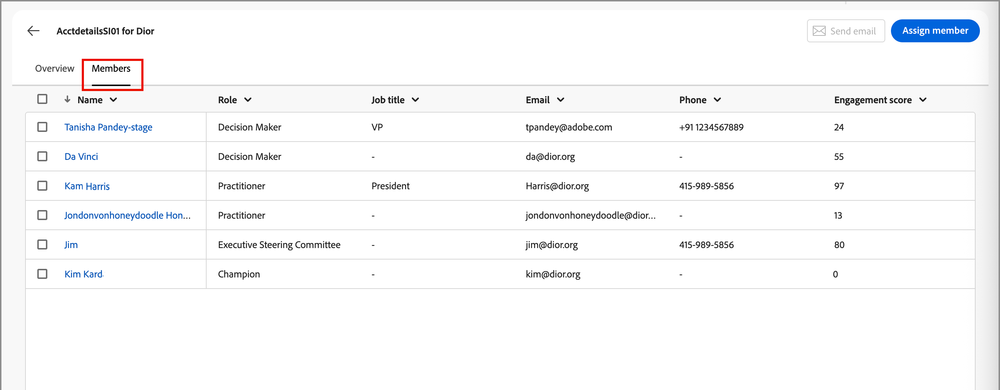

# 구매 그룹 세부 정보

Journey Optimizer B2B edition의 어디에서든 구매 그룹 이름을 클릭하면 구매 그룹 세부 사항이 표시됩니다. 이 개요는 생성 AI 요약을 포함하여 구매 그룹에 대한 유용한 정보를 제공합니다. 계정과 연결된 연락처에 대해 실행할 수 있는 [작업](#buying-group-actions)도 있습니다.

{width="800" zoomable="yes"}

계정에 대한 정보를 검토하려면 **[!UICONTROL 개요]** 탭을 사용하고, 구매 그룹 구성원 목록에 액세스하려면 **[!UICONTROL 구성원]** 탭을 사용하십시오.

## 개요 탭

개요 탭은 다음 세 가지 기본 섹션으로 구성됩니다.

### 구매 그룹 요약

{zoomable="yes"}

구매 그룹 요약 섹션에는 다음 구매 그룹 정보가 포함됩니다.

* 구매 그룹 이름
* 계정 이름([계정 세부 정보](../accounts/account-details.md)를 열려면 이름을 클릭하십시오.)
* 구매 그룹의 구성원 수
* 참여 점수
* 완성도 점수
* 현재 구매 그룹 단계
* 역할 템플릿([역할 템플릿](buying-groups-role-templates.md#access-and-browse-role-templates)을 열려면 이름을 클릭하십시오.)
* 마지막 수정/업데이트 날짜
* 구매 그룹의 생성 AI 요약

### 계정 개요

{zoomable="yes"}

계정 개요 섹션에는 다음 계정 정보가 포함됩니다.

* 계정 이름(계정 세부 정보를 열려면 이름을 클릭하십시오.)
* 계정의 사용자 수
* 업종
* 기회 열기
* 계정이 현재 사용 중인 최신 세 개의 계정 여정(이름을 클릭하여 여정 세부 정보를 엽니다.)
* 계정의 생성 AI 요약

### 의도 데이터

Journey Optimizer B2B edition에서 의도 감지 모델은 구매 그룹 구성원의 활동을 기반으로 충분히 높은 신뢰도로 관심 있는 솔루션/제품을 예측합니다. 집단 구성원의 구매 의도는 상품에 대한 관심을 가질 확률로 해석할 수 있다.

{{intent-data-note}}

{width="700" zoomable="yes"}

* 의도 수준
* 의도 신호 유형 - 키워드, 제품 및 솔루션

### 구매 그룹 멤버

{width="800" zoomable="yes"}

_[!UICONTROL 구매 그룹 구성원]_ 섹션에는 구매 그룹 구성원을 강조 표시하는 두 개의 행이 표시됩니다.

* **[!UICONTROL 의사 결정자]** - 개인 참여 점수를 기준으로 상위 3명의 의사 결정자
* **[!UICONTROL 가장 많이 참여한 구성원]** - 개인 참여 점수를 기준으로 가장 많이 참여한 다른 구성원

각 회원 카드에는 다음 세부 정보가 포함되어 있습니다.

* 이름
* 제목
* 역할
* 잠재 고객 참여 점수

다음 구성원 정보에 액세스하려면 **[!UICONTROL 세부 정보 보기]**&#x200B;를 클릭하십시오.

* 생성 AI 요약
* 마지막 “흥미로운 순간”
* 가장 최근 활동(2개)
* 잠재 고객이 멤버인 기타 구매 그룹(가장 최근에 추가된 구매 그룹을 기준으로 3개 구매 그룹으로 제한).
* 이메일 주소
* 전화번호

{width="600" zoomable="yes"}

## 구성원 탭

모든 구매 그룹 구성원 목록을 보려면 **[!UICONTROL 구성원]** 탭을 선택하십시오. 각 구성원 목록에는 이름, 역할, 직함, 이메일 주소, 전화번호 및 소스가 포함됩니다.

{width="700" zoomable="yes"}

_구성원_ 탭에서 실행할 수 있는 작업이 여러 개 있습니다.

### 새 구성원 할당

계정에는 하나 이상의 구매 그룹이 연결될 수 있으며 구매 그룹 구성원은 일반적으로 계정에서 연락처의 하위 집합입니다. 연관된 계정의 모든 연락처를 구매 그룹에 수동으로 추가할 수 있습니다.

1. 오른쪽 상단의 **[!UICONTROL 새 구성원 할당]**&#x200B;을 클릭합니다.

1. _[!UICONTROL 구성원 할당]_ 대화 상자에서 구매 그룹에 추가할 계정 리드를 선택하고 **[!UICONTROL 다음]**&#x200B;을 클릭합니다.

   {width="700" zoomable="yes"}

1. _[!UICONTROL 새 구성원 역할 편집]_ 대화 상자에서 새 구성원 각각에 할당할 역할을 선택합니다.

   {width="700" zoomable="yes"}

1. **[!UICONTROL 저장]**&#x200B;을 클릭합니다.

### 멤버 제거

구매 그룹에서 한 명 이상의 선택한 구성원(한 번에 최대 50명)을 제거할 수 있습니다.

1. 제거할 멤버의 확인란을 선택합니다.

1. 맨 아래에 있는 선택 표시줄에서 **[!UICONTROL 구성원 제거]**&#x200B;를 클릭합니다.

   {width="700" zoomable="yes"}

1. 확인 대화 상자에서 **[!UICONTROL 제거]**&#x200B;를 클릭합니다.

### 역할 편집

구매 그룹의 선택된 구성원(한 번에 최대 50명)에 대한 역할을 변경할 수 있습니다.

1. 역할을 변경할 멤버의 확인란을 선택합니다.

1. 맨 아래의 선택 표시줄에서 **[!UICONTROL 역할 편집]**&#x200B;을 클릭합니다.

   {width="700" zoomable="yes"}

1. _[!UICONTROL 구성원 역할 편집]_ 대화 상자에서 각 구성원에 할당할 역할을 선택합니다.

   {width="700" zoomable="yes"}

1. **[!UICONTROL 저장]**&#x200B;을 클릭합니다.

### 이메일 보내기

하나 이상의 구매 그룹 선택 구성원(한 번에 최대 50명)에게 마케터 승인 이메일을 보낼 수 있습니다. 사용 가능한 이메일 목록은 연결된 Marketo Engage 인스턴스의 승인된 이메일로 제한됩니다.

1. 이메일을 받을 구성원의 확인란을 선택합니다.

1. 오른쪽 상단이나 하단의 선택 막대에서 **[!UICONTROL 전자 메일 보내기]**&#x200B;를 클릭합니다.

   {width="700" zoomable="yes"}

1. _[!UICONTROL 전자 메일 보내기]_ 대화 상자에서 Marketo Engage 작업 영역을 선택한 다음 보낼 전자 메일의 확인란을 선택합니다.

   {width="700" zoomable="yes"}

1. **[!UICONTROL 보내기]**&#x200B;를 클릭합니다.
