# 구매 그룹 단계

구매 그룹 단계는 기회를 고객으로 전환함에 있어 구매 그룹의 진행 상황을 추적하기 위해 설계되었습니다. 이 기능을 사용하여 구매 그룹 진행률을 추적하고 구매 그룹 구성원에 대한 다음 최적 작업을 식별합니다.

단일 스테이징 모델 내에서 여러 스테이지를 정의하고 여러 스테이지와 각 스테이지 간의 전환 흐름을 정의합니다. 라이프사이클 진입을 위해 하나 이상의 단계가 지정됩니다. 이 모델에서는 A 단계에서 B, C 또는 D 단계로의 전환과 같이 한 단계에서 다른 단계로의 전환을 지정할 수 있는 비선형 진행도 가능합니다. 구매 또는 체결된 계약과 같이 하나의 단계가 성공 단계로 지정될 것을 요구한다. 다른 공급업체의 경쟁 솔루션 구입 또는 계약 거부와 같이 다른 단계가 실패 단계로 지정되는 것은 선택 사항입니다. 영업 기회를 완료하거나 기회를 고객으로 전환하는 관점에서 구매 그룹이 어떻게 진행되고 있는지 보여 주는 [지능형 대시보드](../dashboards/intelligent-dashboard.md)를 통해 이러한 단계를 모니터링합니다.

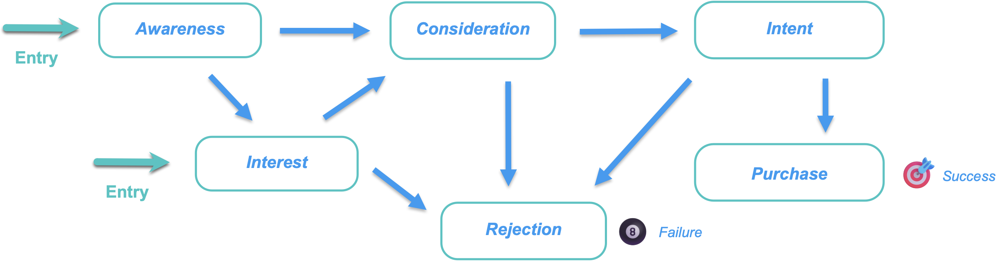{width="800" zoomable="yes"}

{width="30"} [비디오 개요 보기](#overview-video)

## 구매 그룹 단계 모델을 정의합니다.

다음과 같은 방법으로 구매 그룹 단계 모델을 생성하고 구성합니다.

* 라이프사이클 단계 추가
* 전환 흐름 정의
* 시작 및 대상 단계 지정

하나의 모델만 지원되므로 Journey Optimizer B2B edition에서 모델을 만들어 게시하기 전에 마케팅 및 영업 팀에서 조직에 대한 최적의 모델을 계획하는 것이 중요합니다.<!-- Initially, only one stage model can be created, but future releases will support multiple stage models, allowing users to select which model to use in a journey. -->

구매 그룹 단계 모델을 만들 때 자동으로 _초안_ 상태가 되며 삭제하거나 이름을 바꿀 수 없습니다. 단계를 정의하고 단계 간 전환 흐름을 구성할 때 이 상태는 유지됩니다. 모델이 게시됨(_Live_) 상태인 경우 변경할 수 없습니다.

### 모델 만들기

1. 왼쪽 탐색에서 **[!UICONTROL 계정]** > **[!UICONTROL 구매 그룹]**(으)로 이동합니다.

1. [구매 그룹] 페이지에서 **[!UICONTROL 단계]** 탭을 선택합니다.

   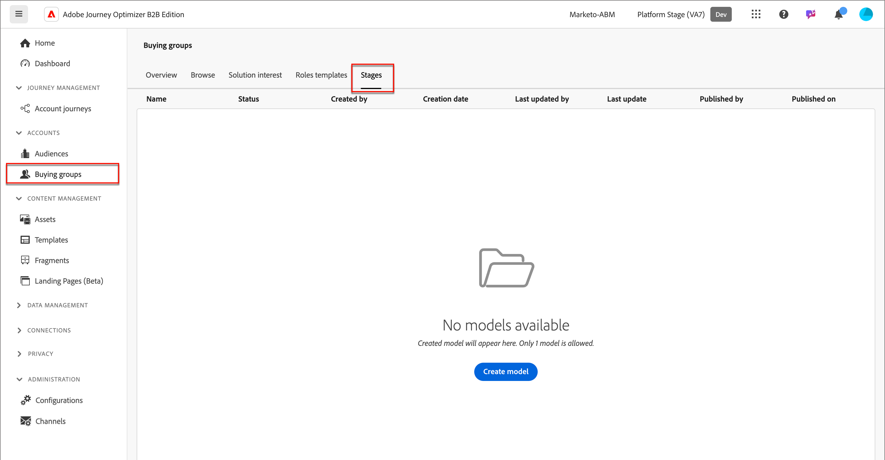{width="800" zoomable="yes"}

   이 _[!UICONTROL 단계]_ 탭은 모델을 만들 때까지 _empty_ 상태입니다.

1. 페이지 중앙에 있는 **[!UICONTROL 모델 만들기]**&#x200B;를 클릭합니다.

1. 대화 상자에서 모델의 **[!UICONTROL 이름]**(필수)과 **[!UICONTROL 설명]**(선택 사항)을 입력합니다.

   {width="700" zoomable="yes"}

   이 대화 상자에서 _[!UICONTROL 취소]_&#x200B;를 클릭하면 _empty_ 상태로 _[!UICONTROL 단계]_ 탭으로 돌아갑니다.

1. **[!UICONTROL 만들기]**&#x200B;를 클릭합니다.

### 단계 정의

모델을 생성하면 작업공간에서 열리고 모델의 단계를 생성하라는 메시지가 표시됩니다.

1. **[!UICONTROL 단계 편집]**&#x200B;을 클릭합니다.

   {width="700" zoomable="yes"}

1. **[!UICONTROL 이름]**(필수) 및 **[!UICONTROL 설명]**(선택 사항)을 입력하여 첫 번째 단계를 정의하십시오.

   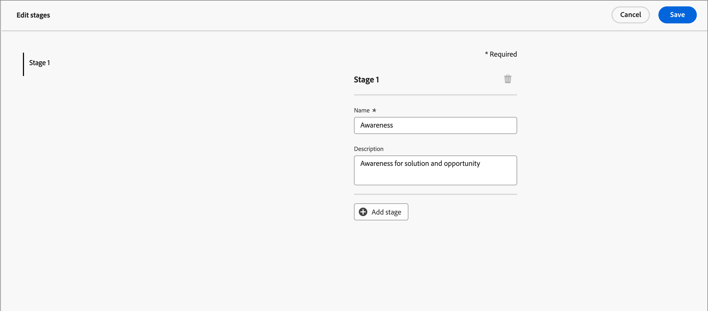{width="700" zoomable="yes"}

   단계는 특정 순서로 추가할 필요가 없지만 모델 세부 사항 페이지에 단계가 어떻게 나열되는지 결정합니다. 변환 규칙을 정의할 때 시작 단계와 단계 간의 흐름을 지정합니다.

1. **[!UICONTROL 단계 추가]**&#x200B;를 클릭하고 2단계를 반복하여 다른 단계를 정의합니다.

   모델에 필요한 단계가 있을 때까지 이 단계를 반복합니다.

   모델에 대해 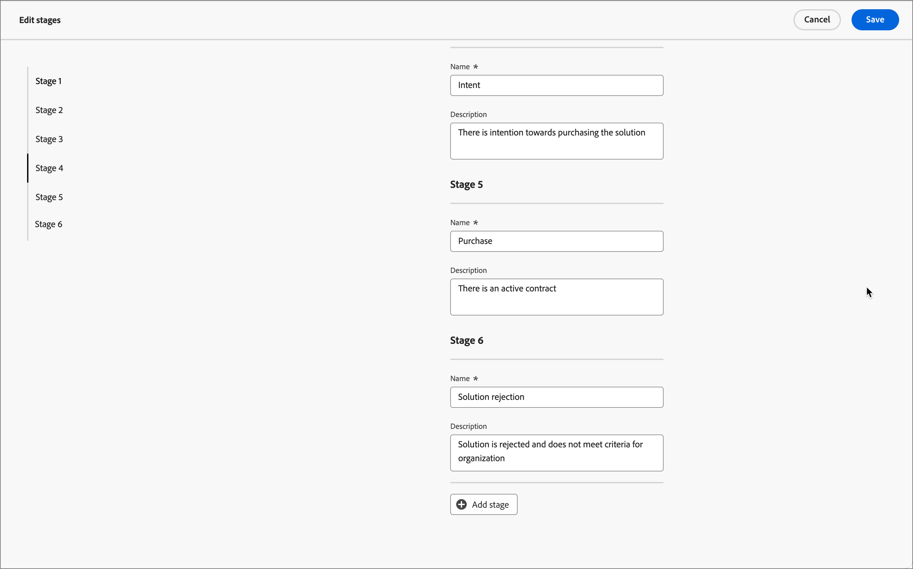{width="700" zoomable="yes"}

1. 정의한 단계에 만족하면 **[!UICONTROL 저장]**&#x200B;을 클릭합니다.

   >[!IMPORTANT]
   >
   >**구매 그룹 단계가 저장되면 삭제할 수 없습니다.** 그러나 모델이 _초안_ 상태에 있는 한 모든 단계의 이름과 설명을 변경할 수 있습니다.

### 워크플로우 및 전환 규칙 구성

단계를 저장하면 모델 작업공간으로 돌아갑니다. _[!UICONTROL 허용된]_ 전송 대상 열이 비어 있습니다. 이는 모델 단계에 대한 전환 규칙이 아직 정의되지 않았음을 나타냅니다.

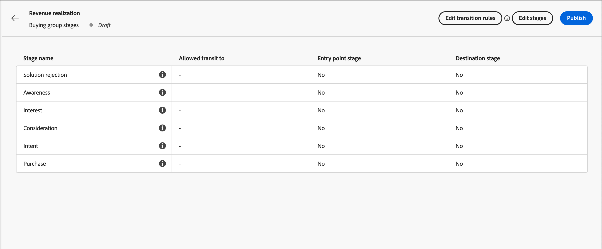{width="700" zoomable="yes"}

전환 규칙은 구매 그룹이 한 단계에서 다른 단계로 이동할 수 있는 방법을 결정합니다. 예를 들어, 진입단계에서 중간단계로, 중간단계에서 다른 여러 단계로 이동할 수 있다. 진입단계는 구매집단이 공백 상태에서 진입할 수 있는 초기 단계로, 목적지 단계는 성공 또는 실패 단계로 분류된다.

1. 오른쪽 상단의 **[!UICONTROL 전환 규칙 편집]**&#x200B;을 클릭합니다.

   This action opens the _[!UICONTROL Edit stage rules]_ dialog, where you define the logic for the flow.

   As you set the options, there are some built-in guardrails and messaging to help you avoid making logic errors in the flow. You can click _[!UICONTROL Cancel]_ to close the dialog and return to the _[!UICONTROL Stages]_ tab page without any changes.

1. In the _[!UICONTROL Select stage]_ section, designate starting and ending stages for the flow:

   * **[!UICONTROL Entry point stage]** (required) - Designate one or more entry stages for the buying group opportunity.

   * **[!UICONTROL Success stage]** (required) - Designate the stage that indicates that the buying group opportunity is successful (destination).

   * **[!UICONTROL Failure stage]** (optional) - Designate one or more stages that indicate the buying group opportunity has reached a point of failure (destination).

   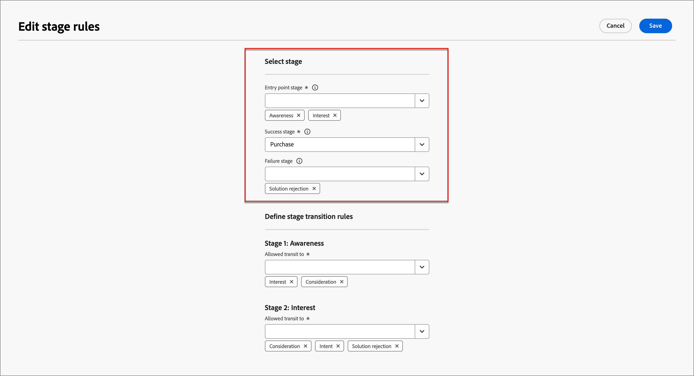{width="700" zoomable="yes"}

1. For each non-destination stage, define one or more stages that come next in the flow (transition).

   All non-destination stages must have at least one **[!UICONTROL Allowed transit to]** stage selected. Otherwise, the model logic is not valid and accounts can get _stuck_ at that stage with no way to progress to success or failure.

   {width="700" zoomable="yes"}

   You can optionally specify a transition from a failure stage. For example, you might designate a stage named _No response_ as a failure stage. But also designate a stage named _Resurgence_ as a possible transition to identify cases where a dormant account is reactivated.

1. **[!UICONTROL 저장]**&#x200B;을 클릭합니다.

   With the return to the model details page, the stages are listed in a table with the allowed transitions, and the destination and entry properties.

| 열 | 설명 |
| ------ | ---------- |
| **[!UICONTROL Stage name]** | Name of the stage. Click the information icon to view the description for the stage. |
| **[!UICONTROL Allowed transit to]** | Lists the stages that are valid for a _move to_ action within the model. |
| **[!UICONTROL Entry point stage]** | Indicates if the stage is valid as an entry point stage ([!UICONTROL Yes] or [!UICONTROL No]). |
| **[!UICONTROL 대상]** | Indicates if the stage is designated as a destination stage ([!UICONTROL Success] or [!UICONTROL Failure]). |

{width="700" zoomable="yes"}

## 초안 모델 편집

구매 그룹 단계 모델이 _초안_ 상태에 있는 한 단계 및 전환 규칙을 편집할 수 있습니다.

초안 모델을 보려면(_T):_

1. 왼쪽 탐색에서 **[!UICONTROL 계정]** > **[!UICONTROL 구매 그룹]**(으)로 이동합니다.

1. _구매 그룹_ 페이지에서 **[!UICONTROL 단계]** 탭을 선택합니다.

1. 모델 이름을 클릭하여 모델 세부 정보를 엽니다.

### 모델의 단계 변경

1. **[!UICONTROL 단계 편집]**&#x200B;을 클릭합니다.

   _[!UICONTROL 단계 편집]_ 대화 상자에서 새 단계를 추가하거나 기존 단계의 이름 및 설명을 변경할 수 있습니다.

   * 필요에 따라 모든 단계의 **[!UICONTROL 이름]** 또는 **[!UICONTROL 설명]**&#x200B;을 변경합니다.

   * 필요한 경우 맨 아래로 스크롤하고 **[!UICONTROL 단계 추가]**&#x200B;를 클릭하여 모델의 새 단계를 정의합니다.

1. 정의한 단계에 만족하면 **[!UICONTROL 저장]**&#x200B;을 클릭합니다.

   _[!UICONTROL 취소]_&#x200B;를 클릭하여 대화 상자를 닫고 변경 없이 모델 세부 정보 페이지로 돌아갈 수도 있습니다.

### 모델의 전환 규칙 편집

1. **[!UICONTROL 전환 규칙 편집]**&#x200B;을 클릭합니다.

1. _단계 규칙 편집_ 대화 상자에서 필요에 따라 흐름 옵션을 변경합니다.

   이러한 옵션과 이러한 옵션이 모델 흐름에 미치는 영향에 대한 자세한 내용은 [워크플로 및 전환 규칙 구성](#configure-the-workflow-and-transition-rules)을 참조하십시오.

1. 정의된 전환 규칙에 만족하면 **[!UICONTROL 저장]**&#x200B;을 클릭합니다.

   _[!UICONTROL 취소]_&#x200B;를 클릭하여 대화 상자를 닫고 변경 없이 모델 세부 정보 페이지로 돌아갈 수도 있습니다.

## 구매 그룹 단계 모델 게시

유효성 검사 오류가 없는 경우 모델을 게시할 수 있습니다. 게시되면 _Live_ 상태로 변경되며 계정 여정에서 구매 그룹 단계를 진행하는 데 사용할 수 있습니다.

>[!IMPORTANT]
>
>**모델이 게시된 후에는 업데이트하거나 삭제할 수 없습니다.** 모델을 게시하기 전에 있는 것이 올바른지 확인하십시오.

1. 정의된 단계 및 전환을 주의 깊게 검토하십시오.

   개정이 필요한 경우 모델 단계를 편집합니다.

1. **[!UICONTROL 게시]**&#x200B;를 클릭합니다.

1. 확인 대화 상자에서 **[!UICONTROL 게시]**&#x200B;를 클릭합니다.

   모델 세부 정보 페이지로 돌아가면 모델이 _[!UICONTROL Live]_(으)로 지정됩니다. 왼쪽 상단의 _뒤로_ 화살표를 클릭하여 _[!UICONTROL 단계]_ 탭 페이지로 돌아갑니다.

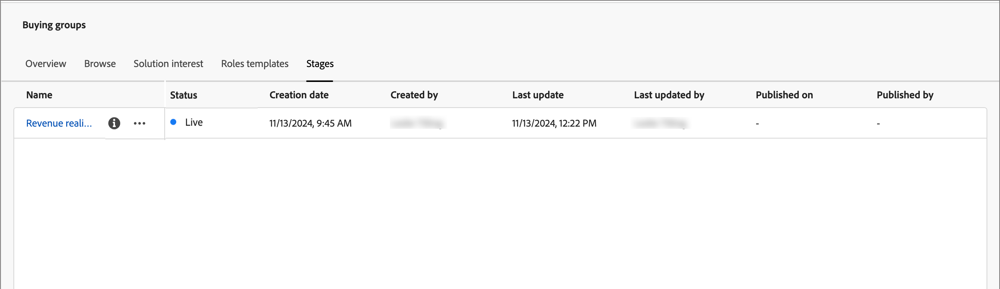{width="700" zoomable="yes"}
<!--
 list these later when the Published columns are working correctly

Columns - Name, Status, Created by, Created date, Last updated by, Last update, Published by, Published on.
Name - Name of the stage model, hyperlinked. Clicking on it will navigate to the stage inventory page. 
Info icon beside the name - display the description on click.
Status - Live, Draft. If a draft stage model is Published, then its status is updated to Live. 
-->

## 구매 그룹 단계 모델을 삭제합니다.

구매 그룹 단계 모델이 초안 또는 게시된 상태일 때 삭제할 수 있습니다. 게시된(진행 중) 경우 솔루션 관심 분야와 연관되지 않은 경우에만 삭제할 수 있습니다.

1. 왼쪽 탐색에서 **[!UICONTROL 계정]** > **[!UICONTROL 구매 그룹]**(으)로 이동합니다.

1. _구매 그룹_ 페이지에서 **[!UICONTROL 단계]** 탭을 선택합니다.

1. _자세히_ 메뉴 아이콘(**...**)을 클릭합니다. 단계 모델 이름 옆에 있는 **[!UICONTROL 삭제]**&#x200B;를 선택합니다.

   {width="700"}

1. 대화 상자에서 **[!UICONTROL 삭제]**&#x200B;를 클릭하여 확인합니다.

## 계정 여정에서 모델 사용

구매 단계 모델이 _Live_ 상태(게시됨)이면 구매 그룹 진행률을 추적하는 데 사용할 솔루션 관심 항목에 모델을 추가하십시오. 계정 여정에 계정을 지정된 단계로 전환하는 작업을 포함하고 계정이 여정을 통해 이동하는 방식을 결정하는 이벤트로 단계 전환을 추가할 수 있습니다.

### 솔루션 관심 연계

구매 그룹 단계 모델을 연결하려는 각 기존 솔루션 관심사에 대해 솔루션 관심사 세부 정보를 열고 모델을 추가합니다. [관심 있는 솔루션을 만들](./solution-interests.md#create-a-solution-interest)때 속성에 모델을 추가할 수도 있습니다.

1. _[!UICONTROL 솔루션 관심]_ 탭을 선택합니다.

1. 다음 방법 중 하나를 사용하여 솔루션 관심사를 열고 편집할 솔루션 관심사에 대한 속성을 엽니다.

   * 솔루션 관심사 이름을 클릭합니다.
   * 줄임표(**...**)를 클릭합니다. 옆에 있는 **[!UICONTROL 편집]**&#x200B;을 선택하세요.

   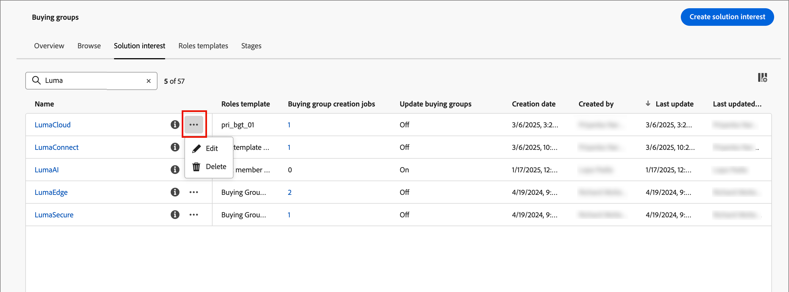{width="500" zoomable="no"}

1. 구매 그룹 단계 진행률(선택 사항)을 사용하려면 **[!UICONTROL 구매 그룹 단계 모델]**&#x200B;을 선택하세요.

   {width="700" zoomable="yes"}

1. 필요한 경우 **[!UICONTROL 기존 구매 그룹 업데이트]** 설정을 변경하십시오.

   이 옵션이 활성화되면 솔루션 관심사와 쌍을 이루는 모든 기존 구매 그룹이 24시간 동기화 주기를 통해 업데이트됩니다.

1. **[!UICONTROL 저장]**&#x200B;을 클릭합니다.

### 경로 분할

[분할 경로 노드](../journeys/journey-nodes.md#split-paths)를 사용하면 구매 그룹 단계에 따라 계정 수준 또는 사용자 수준에서 필터링할 수 있습니다. 예를 들어 구매 그룹 구성원을 사용하여 경로를 분할할 때 구매 그룹 단계를 경로 조건으로 추가합니다.

>[!BEGINTABS]

>[!TAB 계정 수준]

1. 편집기에서 계정 여정을 엽니다.

1. 경로에서 더하기(**+**) 아이콘을 클릭하고 **[!UICONTROL 경로 분할]**&#x200B;을 선택합니다.

   {width="300"}

1. 오른쪽의 노드 속성에서 분할을 위해 **[!UICONTROL 계정]**&#x200B;을(를) 선택합니다.

1. _[!UICONTROL 경로 1]_&#x200B;에 적용할 수 있는 조건을 정의하려면 **[!UICONTROL 조건 적용]**&#x200B;을 클릭하십시오.

   {width="500"}

1. 조건 편집기에서 구매 그룹 필터를 추가하여 분할 경로를 정의합니다.

   * 왼쪽의 맨 아래에 있는 **[!UICONTROL 특수 필터]**&#x200B;를 확장하고 **[!UICONTROL 구매 그룹 있음]** 특성을 필터 작업 영역으로 끌어서 놓습니다.

   * **[!UICONTROL 솔루션 관심 분야]**&#x200B;를 구매 그룹 단계 모델과 연결된 솔루션 관심 분야로 설정하십시오.

   * **[!UICONTROL 제한 추가]**&#x200B;를 클릭하고 **[!UICONTROL 그룹 단계 구매]**&#x200B;를 선택합니다.

     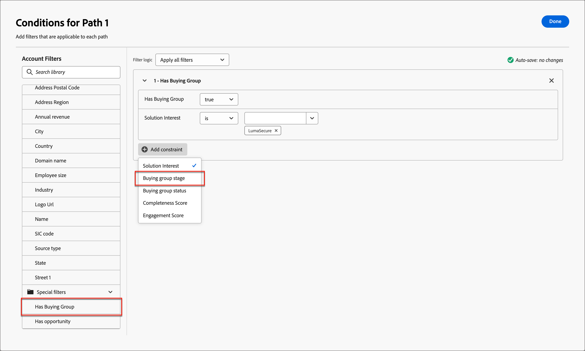{width="700" zoomable="yes"}

   * **[!UICONTROL 완료]**&#x200B;를 클릭합니다.

   분할 경로는 오른쪽의 노드 속성에 정의됩니다.

   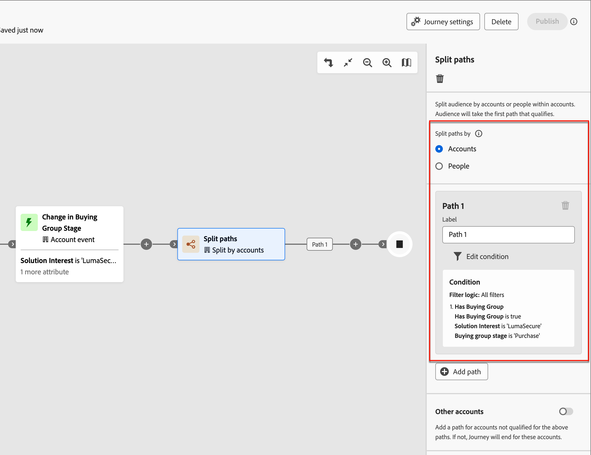{width="600" zoomable="yes"}

1. 분할된 노드에 대한 다른 여정을 계속 정의하고 경로를 저장합니다.

>[!TAB 사람 수준]

1. 편집기에서 계정 여정을 엽니다.

1. 경로에서 더하기(**+**) 아이콘을 클릭하고 **[!UICONTROL 경로 분할]**&#x200B;을 선택합니다.

   {width="300"}

1. 오른쪽의 노드 속성에서 분할을 위해 **[!UICONTROL 사람]**&#x200B;을(를) 선택합니다.

   Leave the default for _[!UICONTROL Attribute used for conditions]_ as **[!UICONTROL People attributes only]**.

1. _[!UICONTROL 경로 1]_&#x200B;에 적용할 수 있는 조건을 정의하려면 **[!UICONTROL 조건 적용]**&#x200B;을 클릭하십시오.

   {width="500"}

1. 조건 편집기에서 구매 그룹 필터를 추가하여 분할 경로를 정의합니다.

   * On the left, expand the **[!UICONTROL Special filters]** at the bottom and drag the **[!UICONTROL Member of Buying Group]** attribute onto the filter workspace.

   * **[!UICONTROL 솔루션 관심 분야]**&#x200B;를 구매 그룹 단계 모델과 연결된 솔루션 관심 분야로 설정하십시오.

   * **[!UICONTROL 제한 추가]**&#x200B;를 클릭하고 **[!UICONTROL 그룹 단계 구매]**&#x200B;를 선택합니다.

     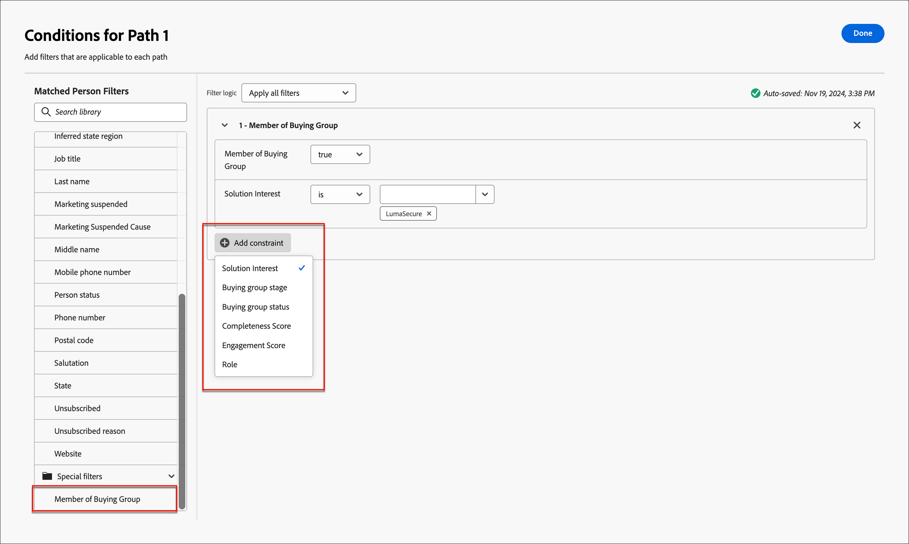{width="700" zoomable="yes"}

   * **[!UICONTROL 완료]**&#x200B;를 클릭합니다.

   분할 경로는 오른쪽의 노드 속성에 정의됩니다.

   {width="600" zoomable="yes"}

1. 분할된 노드에 대한 다른 여정을 계속 정의하고 경로를 저장합니다.

>[!ENDTABS]

### Update buying group stage account action

Using an [account action node](../journeys/journey-nodes.md#add-an-account-action), you can update the buying group stage. Defining this node involves selecting the solution interest and defining the new stage for the buying group.

>[!NOTE]
>
>If the new stage is not a valid transition (as defined in the model), the action is not applied to the account.

1. 편집기에서 계정 여정을 엽니다.

1. Click the plus ( **+** ) icon on a path and choose **[!UICONTROL Take an action]**.

   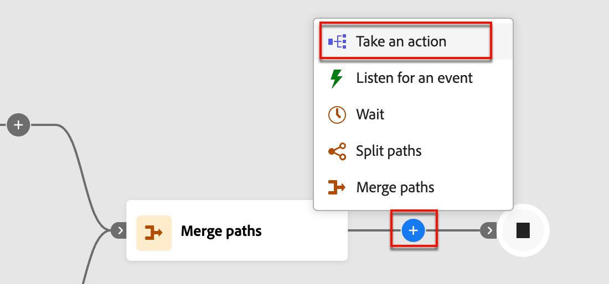{width="400"}

1. In the node properties on the right, choose **[!UICONTROL Accounts]** for the action.

1. Define the action to update the buying group stage.

   * For **[!UICONTROL Action on accounts]**, select **[!UICONTROL Update Buying Group Stage]**.

   * For **[!UICONTROL Select solution interest]**, select one that is associated with the buying group stages model.

   * For **[!UICONTROL New stage]**, select the stage to transition the account.

   The action is defined in the node properties on the right.

   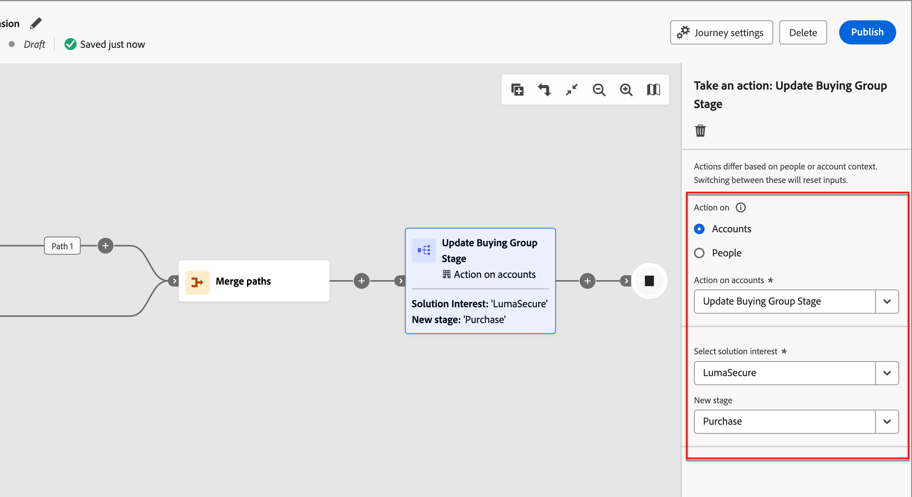{width="600" zoomable="yes"}

1. 다른 변경 내용을 계속 적용하고 여정을 저장합니다.

### 계정 이벤트

구매 그룹 단계 변경 발생을 사용하여 계정을 여정의 다음 단계로 이동합니다. 이 노드를 정의하는 작업에는 이벤트 트리거를 충족하는 솔루션 관심 및 추가 제약 조건이 선택됩니다.

1. 편집기에서 계정 여정을 엽니다.

1. 경로에서 더하기(**+**) 아이콘을 클릭하고 **[!UICONTROL 이벤트 수신]**&#x200B;을 선택합니다.

   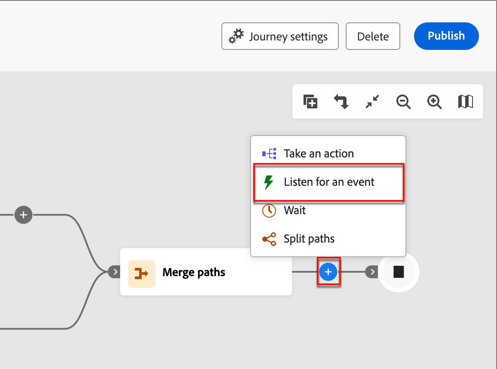{width="400"}

1. 오른쪽의 노드 속성에서 이벤트 유형으로 **[!UICONTROL 계정]**&#x200B;을(를) 선택합니다.

1. **[!UICONTROL 계정 이벤트 선택]**&#x200B;에 대해 **[!UICONTROL 구매 그룹 단계 변경]**&#x200B;을 선택하세요.

1. **[!UICONTROL 이벤트 편집]**&#x200B;을 클릭하고 이벤트에 대한 세부 정보를 정의하십시오.

   * **[!UICONTROL 솔루션 관심 분야]**&#x200B;의 경우 구매 그룹 단계 모델과 연결된 솔루션 관심 분야에 대한 조건을 맞추십시오.

   * **[!UICONTROL 제약 조건 추가]**&#x200B;를 클릭하고 이벤트를 트리거하는 데 사용할 구매 그룹 단계 변경 내용을 선택합니다.

     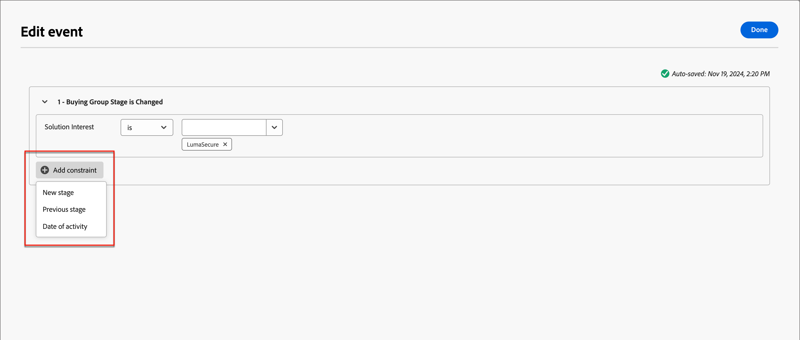{width="700" zoomable="yes"}

   * **[!UICONTROL 완료]**&#x200B;를 클릭합니다.

   이벤트는 오른쪽의 노드 속성에 정의됩니다.

   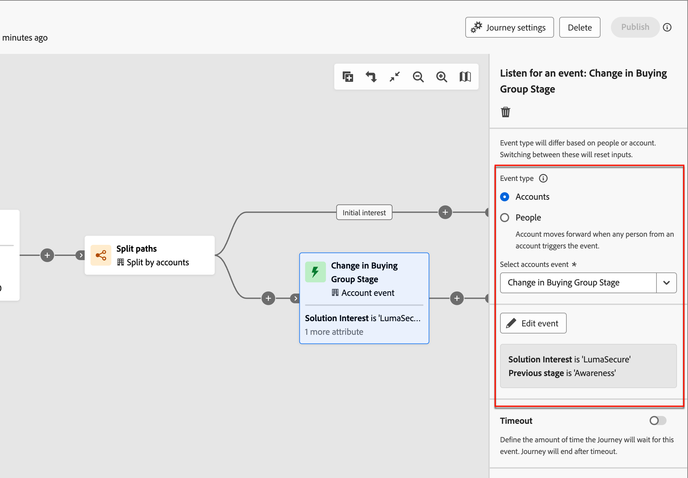{width="700" zoomable="yes"}

1. 다른 변경 내용을 계속 적용하고 여정을 저장합니다.

## 개요 비디오

>[!VIDEO](https://video.tv.adobe.com/v/3448634/?learn=on)
