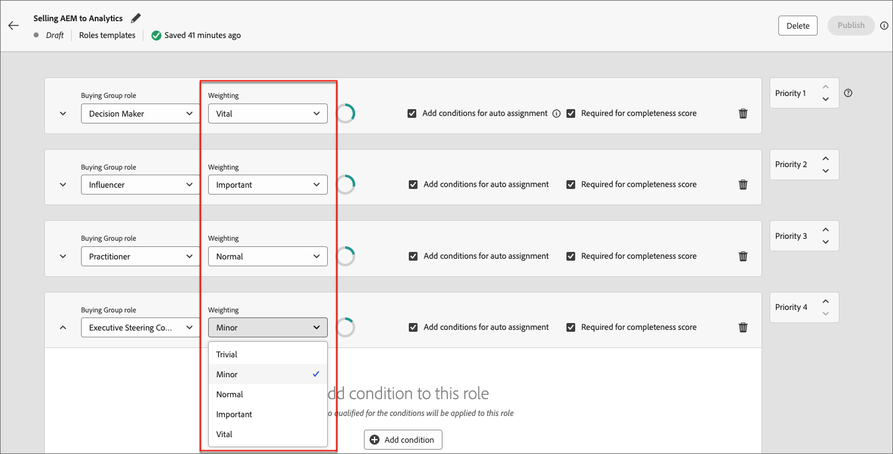

# 구매 그룹

B2B 판매 및 마케팅 활동의 경우 계정은 모든 전략의 핵심입니다. 각 계정에는 계정과 관련된 사용자 그룹이 있으며, 이러한 사용자는 계정의 직원 또는 계정과 함께 작업하는 계약자일 수 있습니다. 계정은 계층적이며, 서로 다른 제품이 계층의 서로 다른 수준에서 판매될 수 있습니다. 예를 들어, Adobe Experience Platform은 기업 수준에서 최상위 계정으로 판매될 수 있고, Adobe Photoshop은 조직 내의 부서 또는 부서(예: 대규모 법인 내의 디자인 부서)를 나타내는 계정으로 판매될 수 있습니다.

{width="800"}

계정 내에 _구매 그룹_&#x200B;을 구성하는 사람들의 하위 집합이 있을 수 있습니다. 이들은 궁극적으로 구매 결정을 내리는 사람들이므로 마케터의 특별한 주의가 필요하며 계정과 연결된 다른 사람들과 다른 정보를 제공해야 할 수 있습니다. 구매 그룹은 다른 제품 라인 또는 제품에 대해 다른 사용자 그룹을 구성할 수 있습니다. 예를 들어, 사이버 보안 제품의 경우 일반적으로 CIO(Chief Information Officer) 또는 CIO(Chief Security Officer)와 법무 부서의 담당자가 구매 승인을 수행해야 하지만 버그 추적 제품에는 일반적으로 엔지니어링 담당 부사장과 IT Director이 구매 그룹의 구성원으로 있을 수 있습니다.

{width="30"} [비디오 보기](#overview-video)

## 주요 구성 요소

Journey Optimizer B2B edition에서 영업 팀이 판매를 담당하는 솔루션을 기반으로 대상 계정 목록에 대해 누락된 구성원을 식별하는 구매 그룹을 설정하여 마케팅 효과를 높일 수 있습니다. 사용자 및 마케팅 팀이 구매 그룹을 만들기 전에 주요 구성 요소가 정의되어 있는지 확인하십시오. 이러한 구성 요소는 비즈니스 목표 및 목표를 달성하는 데 매우 중요합니다.

| 구성 요소 | 목적 |
| --------- | ------- |
| 솔루션 관심도 | 이 구성 요소는 다음에 대한 답을 제공합니다. <ul><li>마케팅 조직으로서 무엇을 판매하고 있습니까?</li><li>판매하려는 제품 또는 제품 컬렉션은 무엇입니까?</li></ul>  **_예:_** 새 제품 X를 기존 고객에게 교차 판매 |
| 계정 대상자 | 이 구성 요소는 다음에 대한 답을 제공합니다. <ul><li>누구를 판매하고 있습니까?</li><li>타겟팅하는 계정 목록은 무엇입니까?</li></ul> **_예:_** 제품 Y의 계정 중 1백만 이상의 매출을 가진 계정으로 정의되었습니다. |
| 그룹 역할 템플릿 구매 중 | 이 구성 요소는 다음에 대한 답을 제공합니다. <ul><li>어떤 역할을 타깃팅하고 있습니까?</li><li>그룹 역할 구매에 누가 할당되었는지 확인하는 데 어떤 규칙 세트를 사용합니까?</li></ul>  **_예:_** CMO 제목을 가진 사람을 의사 결정자 역할에 할당 |
| 구매 그룹 단계 | (선택 사항) 이 구성 요소는 구매 그룹이 성공 또는 실패를 추적하는 방법에 대한 답변을 제공합니다. |

## 구매 그룹 워크플로우

1. 구매 그룹을 생성합니다.

   옵션:
   * [솔루션 관심 분야](./solution-interests.md) 및 [역할 템플릿](./buying-groups-role-templates.md) 사용
   * 서드파티 가져오기 사용
   * AI/ML에서 생성

1. 실종된 사람을 식별합니다.

   필터를 사용하여 구매 그룹을 분석합니다.

   **_예:_** 의사 결정자 역할이 누락되었으며 완성도 점수가 50 미만입니다.

1. 구매 그룹 정의를 완료합니다.
<!--
   * Acquire missing people
   * Send to LinkedIn Destination
   * Enrich with Zoominfo -->

1. 연결된 솔루션 관심사를 통해 계정 여정에서 를 사용합니다.

## 구매 그룹 및 구성 요소 보기

왼쪽 탐색에서 **[!UICONTROL 계정]**&#x200B;을 확장하고 **[!UICONTROL 구매 그룹]**&#x200B;을 클릭합니다.

_[!UICONTROL 구매 그룹]_ 페이지는 탭으로 구성되어 있습니다.

| 탭 | 설명 |
| --- | ----------- |
| [!UICONTROL 개요] | 이 탭은 기본값이며 [구매 그룹 대시보드](../dashboards/buying-groups-dashboard.md)를 표시합니다. |
| [!UICONTROL 찾아보기] | 이 탭은 다음 활동을 지원합니다. <ul><li>기존 구매 그룹 목록을 봅니다. </li><li>구매 그룹 이름으로 검색합니다. </li><li>솔루션 관심사로 필터링합니다. </li><li>구매 그룹 세부 정보로 드릴인합니다. </li><li>구매 그룹을 생성합니다. 구매 그룹을 삭제합니다.</li></ul> |
| [!UICONTROL 솔루션 관심] | 이 탭은 다음 활동을 지원합니다. <ul><li>기존 구매 그룹 목록을 봅니다. </li><li>구매 그룹 이름으로 검색합니다. </li><li>솔루션 관심 영역 속성에 액세스하고 편집합니다. </li><li>관심 있는 솔루션을 만듭니다. </li><li>솔루션 관심사를 삭제합니다. </li><li>구매 그룹 작업을 보고 삭제합니다. </li></ul> |
| [!UICONTROL 역할 템플릿] | 이 탭은 다음 활동을 지원합니다. <ul><li>기존 역할 템플릿 목록을 봅니다. </li><li>역할별로 검색 템플릿 이름. </li><li>역할 템플릿 속성 및 조건에 액세스하고 이를 편집합니다. </li><li>역할 템플릿을 만듭니다. </li><li>역할 템플릿을 삭제합니다. </li></ul> |
| [!UICONTROL 단계] | 이 탭은 다음 활동을 지원합니다. <ul><li>기존 구매 그룹 단계 모델을 봅니다. </li><li>초안 구매 그룹 단계 모델에 액세스하고 편집합니다. </li><li>구매 그룹 단계 모델을 만듭니다. </li></ul> |

## 구매 그룹 검색 및 필터링

구매 그룹 목록을 보려면 _[!UICONTROL 찾아보기]_ 탭을 사용하십시오. 이름별로 검색하고 솔루션 관심분야별로 목록을 필터링할 수 있습니다.

{width="800" zoomable="yes"}

## 구매 그룹 세부 정보

구매 그룹에 대한 세부 정보에 액세스하려면 _[!UICONTROL 찾아보기]_ 탭에서 구매 그룹 이름을 클릭합니다.

{width="600" zoomable="yes"}

### 구매 그룹 완성도 점수

완성도 점수는 구매 그룹이 완료되었는지 확인하는 데 사용됩니다. 즉, 역할에 적절한 구성원이 할당되어 있고 계정 여정에서 사용할 준비가 되었음을 의미합니다. 이 점수는 구매 그룹 내의 역할 수와 최소 하나의 리드에 할당된 역할 수를 기반으로 하는 백분율입니다.

예를 들어 구매 그룹 내에 네 개의 역할이 있고 네 개의 역할 중 세 개의 역할이 하나 이상의 리드에 할당된 경우 구매 그룹은 75% 완료됩니다.

구매 그룹이 생성되거나 갱신될 때마다 구매 그룹 완결성 점수가 다시 계산됩니다.

### 구매 그룹 참여 점수

구매 그룹 참여 점수는 구매 그룹 구성원이 수행하는 활동에 따라 구매 그룹 구성원의 참여를 결정하는 숫자입니다. 지난 30일 동안 구매 그룹 구성원이 수행한 모든 인바운드 활동은 점수를 계산하는 데 사용됩니다.

각 활동에 대한 일일 빈도 상한은 20개입니다. 구매 그룹의 구성원이 하루에 동일한 활동을 20번 이상 수행하는 경우 활동 카운트는 더 높은 수가 아닌 20으로 제한됩니다.

표시된 점수는 반올림됩니다. 예를 들어 75.89999의 점수가 76으로 표시됩니다.

#### 가중치

사용자는 역할 템플릿의 각 역할에 _가중치_&#x200B;를 할당하여 역할에 대해 다른 가중치를 할당하여 참여 점수를 계산할 수 있습니다.

{width="700" zoomable="yes"}

각 가중치 수준은 참여 점수 계산에 사용되는 값으로 변환됩니다.

* [!UICONTROL 사소한] = 20
* [!UICONTROL 부] = 40
* [!UICONTROL 보통] = 60
* [!UICONTROL 중요] = 80
* [!UICONTROL 활력] = 100

_[!UICONTROL 중요]_, _[!UICONTROL 중요]_, _[!UICONTROL 보통]_(으)로 가중치가 적용된 세 가지 역할이 있는 역할 템플릿이 다음과 같은 가중치가 적용된 백분율로 변환됩니다.

| 역할 | 가중치 | 시스템 값 | 값 계산 | 백분율 |
|-------------- |--------- |------------- |------------------ |---------- |
|               |          |              |                   |           |
| 의사 결정자 | 바이탈 | 10 | 100/240 | 41.67% |
| 영향력 있는 사용자 | 중요 사항 | 80 | 80/240 | 33.33% |
| 실무자 | 일반 | 60 | 60/240 | 25% |
|               | 합계 | 240 |                   |           |

#### 계산 예

다음 예에서는 요약된 역할 가중치 퍼센트, 구매 그룹의 각 구성원에 대한 인바운드 활동 수 및 각 이벤트에 대한 일일 최대 20개(여러 번 발생한 경우)를 사용한 참여 점수 계산을 보여 줍니다.

| 역할 | 멤버 | 활동 유형 | 어제의 카운트 | 오늘 카운트 | 계산 | 총 점수 |
|-------------- |--------- |-------------|-----------------|-------------|------|-----------|
|               |          |             |                 |             |      |           |
| 의사 결정자 | Adam | 방문한 웹 사이트 | 37 | 15 | 20 + 15 | 35 |
|               |          | 클릭한 이메일 | 1 | 1 | 1 + 1 | 2 |
|               |          |             |                 |             |      |           |
|               | 표시 | 방문한 웹 사이트 | 5 | 3 | 5 + 3 | 8 |
|               |          | 클릭한 이메일 | 1 | 1 | 1 + 1 | 2 |
|               |          | 다운로드한 펍 | 3 | 2 | 3 + 2 | 5 |
| **의사 결정자 총점** |         |             |                 |             |      | **52** |
|               |          |             |                 |             |      |           |
| 영향력 있는 사용자 | John | 방문한 웹 사이트 | 19 | 9 | 19 + 9 | 28 |
| **영향력 있는 사용자 총 점수** |         |             |                 |             |      | **28** |
|               |          |             |                 |             |      |           |
| 실무자 | Bob | 클릭한 이메일 | 1 | 1 | 1 + 1 | 2 |
|               |          |             |                 |             |      |           |
|               | Paul | 클릭한 이메일 | 1 | 1 | 1 + 1 | 2 |
|               |          |             |                 |             |      |           |
|               | 캘빈 | 클릭한 이메일 | 1 | 1 | 1 + 1 | 2 |
|               |          | 방문한 웹 사이트 | 1 | 7 | 1 + 7 | 8 |
|               |          | 다운로드한 펍 | 1 | 2 | 1 + 2 | 3 |
| **실무자 총 점수** |         |             |                 |             |      | **17** |

최종 참여 점수는 각 역할 점수에 대해 가중치를 적용하여 계산됩니다.

| 역할 | 역할 총 점수 | 역할 가중치 % | 점수 X 가중치 % |
|-------------- |---------------- |------------- |---------------- |
| 의사 결정자 | 52 | 41.67% | 21.67 |
| 인플루언서 | 28 | 33.33% | 9.33 |
| 실무자 | 17 | 25% | 4.25 |
| **최종 참여 점수** |                |             | **35.25** |

## 개요 비디오

>[!VIDEO](https://video.tv.adobe.com/v/3433078/?learn=on)
