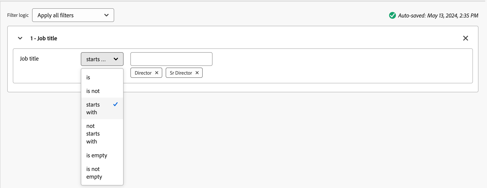

# 그룹 역할 템플릿 구매 중

B2B 시장에서는 일반적으로 여러 개인이 매수 결정을 내린다. 그 개인들은 조직 내에서 자신의 역할에 따라 의사결정 과정에 참여한다. 각 제품 제공 유형 또는 계정 사용 사례에 따라 이러한 역할 정의를 포함하는 구매 그룹 역할 템플릿을 만듭니다.

## 역할 템플릿 액세스 및 찾아보기

1. Adobe Experience Platform 홈페이지에서 Adobe Journey Optimizer B2B 에디션을 클릭합니다.

1. 왼쪽 탐색에서 **[!UICONTROL 구매 그룹]**&#x200B;을 클릭합니다.

1. _[!UICONTROL 구매 그룹]_ 페이지에서 **[!UICONTROL 역할 템플릿]** 탭을 선택합니다.

   {width="700" zoomable="yes"}

   탭에는 다음과 같은 열이 있는 모든 기존 역할 템플릿의 인벤토리 목록이 제공됩니다.

   * [!UICONTROL 이름]
   * [!UICONTROL 상태]
   * [!UICONTROL 만든 날짜]
   * [!UICONTROL 만든 사람]
   * [!UICONTROL 마지막 업데이트]
   * [!UICONTROL 마지막으로 업데이트한 사람]
   * [!UICONTROL 게시 날짜]
   * [!UICONTROL 게시자]

   이 목록은 기본적으로 _[!UICONTROL 마지막 업데이트]_ 열을 기준으로 정렬됩니다.

   _live_(게시된) 역할 템플릿 수가 페이지의 오른쪽 상단에 표시됩니다. 모든 역할 템플릿의 상태가 `Draft` 또는 `Live`입니다.

1. 이름별로 목록을 필터링하려면 목록 맨 위에 있는 검색 필드를 사용하십시오.

   이름의 처음 몇 문자를 입력하여 표시된 목록을 일치하는 항목으로 줄입니다.

   {width="700" zoomable="yes"}

## 역할 템플릿 만들기

1. _[!UICONTROL 역할 템플릿]_ 탭에서 오른쪽 상단의 **[!UICONTROL 템플릿 만들기]**&#x200B;를 클릭합니다.

1. 대화 상자에서 템플릿에 고유한 **[!UICONTROL 이름]**(필수)과 **[!UICONTROL 설명]**(선택 사항)을 입력합니다.

   {width="400"}

1. 템플릿에 정의할 각 역할에 대한 규칙을 추가합니다.

* 목록에서 **[!UICONTROL 구매 그룹 역할]**&#x200B;을(를) 선택하십시오.

  현재 릴리스에는 6개의 역할 `Decision Maker`, `Influencer`, `Practitioner`, `Executive Steering Committee`, `Champion` 및 `Other`이(가) 있습니다.

{width="700" zoomable="yes"}

* 참여 점수를 계산하는 데 사용되는 역할에 대해 **[!UICONTROL 가중치]**&#x200B;를 설정합니다.

  각 옵션의 값은 점수 계산에 대한 백분율로 변환됩니다. [!UICONTROL Trivial] = 20, [!UICONTROL Minor] = 40, [!UICONTROL Normal] = 60, [!UICONTROL Important] = 80 및 [!UICONTROL Vital] = 100.

  예를 들어, Vital, Important 및 Normal을 사용하는 역할이 있는 역할 템플릿은 100/240, 80/240, 60/240으로 변환됩니다.

* **[!UICONTROL 자동 할당을 위한 조건 추가]** - 조건에 일치하는 구매 그룹에 자동 할당 구성원을 위한 조건을 추가하려면 이 확인란을 선택하십시오. 확인란을 선택하지 않으면 조건을 추가할 필요가 없습니다.

* **[!UICONTROL 완결성 점수 필요]** - 완결성 점수를 계산하기 위한 요구 사항이 되도록 하려면 역할에 대해 이 확인란을 선택합니다. —>

* **[!UICONTROL 조건 추가]**&#x200B;를 클릭합니다.

   * 조건 대화 상자에서 **[!UICONTROL 개인 특성]** 목록을 확장하고 역할과 일치하는 데 사용할 특성을 찾습니다. 오른쪽으로 드래그하여 필터 공간에 놓습니다.

     {width="700" zoomable="yes"}

   * 하나 이상의 값을 사용하여 일치하는 필터를 만들려면 특성을 사용합니다.

     다음 예제에서는 Job 제목 속성을 사용하여 의사 결정자의 일치를 식별합니다. `Director` 또는 `Sr Director`(으)로 시작하는 제목의 모든 값은 조건에 대해 true로 평가됩니다.

     {width="700" zoomable="yes"}

   * 필요한 경우 역할에 대한 일치 기준을 더 구체화하는 다른 속성 및 조건을 추가합니다.

   * **[!UICONTROL 완료]**&#x200B;를 클릭합니다.

템플릿에 포함할 각 추가 역할에 대해 **[!UICONTROL 다른 역할 추가]**&#x200B;를 클릭하고 역할에 대해 일치시킬 하나 이상의 조건을 정의합니다.

{width="700" zoomable="yes"}

1. 템플릿을 사용할 준비가 되면 오른쪽 상단의 **[!UICONTROL Publish]**&#x200B;을(를) 클릭합니다.

   템플릿을 게시하면 해당 템플릿이 _Live_ 상태로 설정되며 솔루션 관심사에 연결할 수 있습니다. 역할 템플릿을 게시하려면 정의된 역할이 하나 이상 있어야 합니다.

   변경 사항이 _초안_ 상태로 자동 저장됩니다. 역할 템플릿을 게시할 준비가 되지 않은 경우 페이지 상단에 있는 왼쪽(뒤로) 화살표를 클릭하고 역할 템플릿 목록으로 돌아갑니다.

## 초안 역할 템플릿 편집

역할 템플릿이 _초안_ 상태인 경우 정의된 역할을 계속 편집할 수 있습니다. 모든 변경 사항은 자동으로 저장됩니다.

구매 그룹 역할, 가중치, 자동 지정 및 완성도 점수 요구 사항을 포함하여 역할 카드의 헤더에 있는 설정을 변경합니다.

{width="600"}

### 역할 필터 수정

역할에 대한 필터링 논리를 변경하려면 역할 카드의 오른쪽 상단에 있는 _편집_(연필) 아이콘을 클릭합니다. 이 작업은 기존 필터를 수정하거나, 다른 필터를 추가하거나, 필터를 제거하거나, 필터 논리를 변경할 수 있는 _[!UICONTROL 조건]_ 작업 영역을 엽니다.

### 역할 카드 삭제

템플릿에서 역할을 제거하려면 역할 카드에서 _삭제_(휴지통) 아이콘을 클릭하십시오.

### 역할에 대한 우선 순위 설정

템플릿 내에서 역할을 재정렬하여 역할에 가망 고객 지정 우선순위를 결정할 수 있습니다. 각 역할 카드의 오른쪽에 **[!UICONTROL 우선 순위]** 컨트롤러가 표시됩니다. 오른쪽의 _위쪽_ 또는 _아래쪽_ 화살표를 클릭하여 우선 순위에서 역할 카드를 위 또는 아래로 이동합니다.

{width="700"}

## 역할 템플릿 삭제

역할 템플릿이 _초안_ 상태인 경우 삭제할 수 있습니다.

1. 목록에서 역할 템플릿을 선택하여 엽니다.

1. 오른쪽 상단의 **[!UICONTROL 삭제]**&#x200B;를 클릭합니다.

   {width="700"}

1. 대화 상자에서 **[!UICONTROL 삭제]**&#x200B;를 클릭하여 확인합니다.
