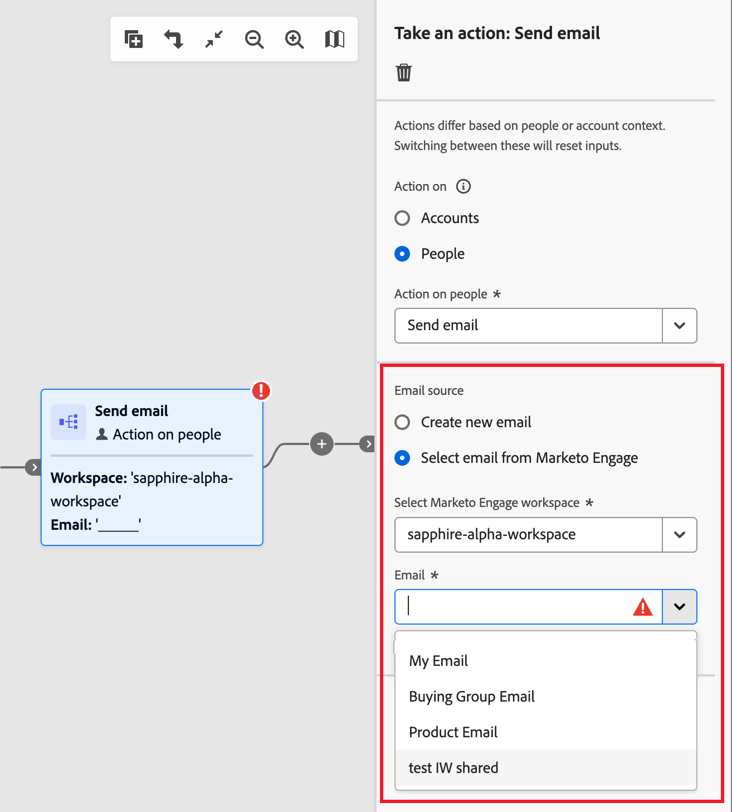

# 여정에 이메일 추가

Adobe Journey Optimizer B2B edition을 사용하여 계정 여정을 통해 고객에게 이메일 메시지를 전송합니다. 이메일 디자인 공간에서 메시지를 만들고, 개인화하고, 미리 보도록 선택할 수 있습니다. 또는 연결된 Marketo Engage 인스턴스에 이미 정의된 이메일을 보내도록 선택할 수 있습니다.

>[!NOTE]
>
>이메일을 처음으로 보내는 경우 이메일 채널이 Adobe Marketo Engage 내에서 구성되었는지 확인하십시오. 자세한 내용은 [추적 및 전자 메일 게재용 프로토콜](../start/email-protocols.md)을 참조하세요.

## 여정에 이메일 작업 노드 추가

[여정에 _[!UICONTROL 작업 추가]_ 노드 추가](../journeys/action-nodes.md)하고 다음을 수행하면 노드에서 전자 메일 게재를 설정할 수 있습니다.

1. _[!UICONTROL Action on]_ 대상에 대해 **[!UICONTROL 사람]**&#x200B;을 선택하세요.

1. _[!UICONTROL 사용자에 대한 작업]_&#x200B;에 대해 **[!UICONTROL 전자 메일 보내기]**&#x200B;를 선택하세요.

1. _[!UICONTROL 전자 메일 원본]_&#x200B;에 대해 보낼 전자 메일 원본 방법을 선택하세요.

   {width="700" zoomable="yes"}

   * Journey Optimizer B2B edition에서 기본적으로 전자 메일을 작성하려면 **[!UICONTROL 새 전자 메일 만들기]**&#x200B;를 선택하세요.

     이 옵션을 사용하면 Journey Optimizer B2B edition에서 기본적으로 이메일 콘텐츠를 관리할 수 있습니다. **[!UICONTROL 전자 메일 만들기]**&#x200B;를 클릭하여 _새 전자 메일 만들기_ 대화 상자를 엽니다. 새 이메일 콘텐츠 에셋을 만들거나 기존 이메일 콘텐츠 에셋을 복제할 수 있습니다.

     +++새 이메일

     빈 캔버스 또는 전자 메일 템플릿을 사용하여 전자 메일을 만들려면 _[!UICONTROL 새 전자 메일]_ 옵션을 사용하십시오.

      1. 대화 상자에서 **[!UICONTROL 새 메일]**&#x200B;을 선택합니다.

      1. 전자 메일의 고유한 **[!UICONTROL 이름]**&#x200B;과(와) **[!UICONTROL 제목 줄]**&#x200B;을(를) 입력하세요.

         {width="400"}

      1. **[!UICONTROL 만들기]**&#x200B;를 클릭합니다.

         전자 메일 콘텐츠 페이지의 _[!UICONTROL 전자 메일 속성]_ 섹션에서 _[!UICONTROL 전자 메일을 통해]_ 및 _[!UICONTROL 주소에 회신]_ 필드가 이미 구성되어 있습니다. _[!UICONTROL 보낸 사람 이름]_ 및 _[!UICONTROL 설명]_(선택 사항) 필드에 값을 입력할 수 있습니다.

      1. **[!UICONTROL 전자 메일 편집]**&#x200B;을 클릭하여 전자 메일 [설정](#define-the-email-settings)을(를) 정의하고 [콘텐츠](./email-authoring.md)을(를) 디자인합니다.

+++

     +++기존 이메일 복제

     현재 여정 또는 다른 여정의 기존 전자 메일을 사용하여 전자 메일을 만들려면 _[!UICONTROL 기존 전자 메일 복제]_ 옵션을 사용하십시오. 여정 노드의 목표에 따라 복제된 이메일을 변경할 수 있습니다.

      1. _[!UICONTROL 새 전자 메일 만들기]_ 대화 상자에서 **[!UICONTROL 기존 전자 메일 복제]**&#x200B;를 선택합니다.

      1. **[!UICONTROL 기존 이메일을 복제하려면]**&#x200B;에 대해 _선택_ 아이콘()을 클릭하고 복제하여 여정 노드에 사용할 이메일을 선택하십시오.

         전자 메일 이름과 일치하도록 검색 필드에 텍스트 문자열을 입력하여 전자 메일 목록을 필터링할 수 있습니다.

         {width="600" zoomable="yes"}

         복제할 전자 메일의 확인란을 선택하고 **[!UICONTROL 선택]**&#x200B;을 클릭합니다.

      1. 전자 메일의 고유한 **[!UICONTROL 이름]**&#x200B;과(와) **[!UICONTROL 제목 줄]**&#x200B;을(를) 입력하세요.

         {width="400"}

      1. **[!UICONTROL 만들기]**&#x200B;를 클릭합니다.

         전자 메일 콘텐츠 페이지의 _[!UICONTROL 전자 메일 속성]_ 섹션에서 _[!UICONTROL 전자 메일을 통해]_ 및 _[!UICONTROL 주소에 회신]_ 필드가 이미 구성되어 있습니다. _[!UICONTROL 보낸 사람 이름]_ 및 _[!UICONTROL 설명]_(선택 사항) 필드에 값을 입력할 수 있습니다.

      1. 필요한 경우 **[!UICONTROL 전자 메일 편집]**&#x200B;을 클릭하여 전자 메일 [설정](#define-the-email-settings) 및 [콘텐츠](./email-authoring.md)를 수정합니다.

+++

   * Marketo Engage에서 미리 작성된 이메일 중 하나를 사용하여 여정의 일부로 보내려면 **[!UICONTROL Adobe Marketo Engage에서 이메일 선택]**&#x200B;을(를) 선택하십시오.

     연결된 Market Engage 인스턴스에서 두 개 이상의 작업 영역을 사용할 수 있는 경우 작업 영역을 선택합니다. 그런 다음 여정 노드에 보낼 승인된 이메일을 선택합니다.

     {width="500" zoomable="yes"}

     이 옵션을 사용하면 노드가 설정되며 이메일 콘텐츠는 여정에 추가 정의가 필요하지 않습니다.

## 이메일 설정 정의

오른쪽의 _요약_ 패널에서 **[!UICONTROL 세부 정보]** 탭을 선택한 상태에서 맨 아래로 스크롤하여 전자 메일 옵션을 보고 설정합니다.

{width="600" zoomable="yes"}

| 옵션 | 설명 |
| ------ | ----------- |
| [!UICONTROL 이름에서] | 이메일 헤더에 사용된 발신자 이름. 수신자에게 표시할 발신자의 이름을 입력합니다. 필드에서 개인화 토큰을 사용하려면 _개인화_ 아이콘( )을 클릭하십시오. |
| [!UICONTROL 전자 메일] | 이메일 헤더에 사용된 발신자 주소. 기본값은 [전자 메일 채널 게재 설정](../admin/configure-channels-emails.md#delivery-settings)에서 채워집니다. 필드에서 개인화 토큰을 사용하려면 _개인화_ 아이콘( )을 클릭하십시오. |
| [!UICONTROL 회신 주소] | 이메일 헤더에 사용된 발신자 주소. 기본값은 [전자 메일 채널 게재 설정](../admin/configure-channels-emails.md#delivery-settings)([!UICONTROL 레이블에서])에서 채워집니다. 수신자가 회신 기능을 사용하는 경우 채울 이메일 주소를 입력합니다(발신자 주소와 다르거나 동일할 수 있음). 필드에서 개인화 토큰을 사용하려면 _개인화_ 아이콘( )을 클릭하십시오. |
| [!UICONTROL 제목 줄] | 이메일의 제목 필드에 표시되는 텍스트입니다. 기본값은 _[!UICONTROL 새 전자 메일 만들기]_ 대화 상자에 입력한 텍스트에서 채워집니다. 필요한 경우 텍스트를 변경할 수 있습니다. 필드에서 개인화 토큰을 사용하려면 _개인화_ 아이콘(  )을 클릭하십시오.<!-- Click the AI Assistant button ( {width="30" zoomable="no"} ) to generate the subject line based on the current email content.--> |
| [!UICONTROL 운영 전자 메일] | 이메일을 작동 상태로 지정하려면 확인란을 선택합니다. 운영 이메일은 옵트아웃/구독 취소 목록 및 통신 제한에서 제외됩니다. 수신자가 이메일 메시지를 원치 않는 상업성 메시지(SPAM)로 간주할 수 없는 경우에만 이 옵션을 선택합니다. |
| [!UICONTROL 보기를 웹 페이지로 포함] | 이메일 메시지 콘텐츠에서 생성된 웹 페이지에 대한 링크를 포함하려면 확인란을 선택합니다. 이메일 메시지는 웹 페이지보다 기능이 제한적이므로 JavaScript, 확장된 CSS 및 양식에 유용합니다. HTML 링크를 생성하는 데 사용되는 텍스트는 [전자 메일 채널 게재 설정](../admin/configure-channels-emails.md#delivery-settings)([!UICONTROL 웹 페이지로 보기] 및 [!UICONTROL 웹 페이지로 보기])에 구성되어 있습니다. |
| [!UICONTROL 열린 추적 사용 안 함] | 이메일 열기 활동을 추적하지 않으려면 확인란을 선택합니다. 기능을 비활성화하면 고유 사용자가 이메일을 여는 경우에만 이메일 열기 활동 수가 증가합니다. 이메일 본문 콘텐츠를 디자인할 때 [이메일 콘텐츠 링크에 대한 추적을 관리](./email-authoring.md#content-authoring---link-tracking)할 수 있습니다. |
| [!UICONTROL 사전 머리글] | 사전 헤더를 포함하려면 확인란을 선택하십시오. 사전 헤더는 일부 이메일 클라이언트에서 제목란 뒤에 표시되는 짧은 요약 텍스트입니다. 일반적으로 이메일에 대한 간단한 요약을 제공하며, 일반적으로 한 문장입니다. <!-- , or click the AI Assistant button ( {width="30" zoomable="no"} ) to generate summary text based on the current email content --> 필드에 요약 텍스트를 입력합니다. |
| [!UICONTROL 참조 주소로 사용되는 필드] | 가능한 경우 `Email` 유형을 사용하여 Marketo Engage에 설정된 최대 25개의 리드 또는 회사 필드를 선택합니다. |

## 경고 확인

이메일 메시지 콘텐츠를 디자인할 때 주요 설정이 없을 때 인터페이스(페이지 오른쪽 상단)에 경고가 표시됩니다. 이 단추가 표시되지 않으면 발견된 문제가 없습니다.

{width="600" zoomable="yes"}

두 가지 유형의 경고를 감지할 수 있습니다.

* 권장 사항 및 모범 사례를 참조하는 **_경고_**:

   * `The opt-out link is not present in the email body`: 이메일 본문에 구독 취소 링크를 추가하는 것이 좋습니다.

     >[!NOTE]
     >
     >마케팅 스타일 이메일 메시지에는 옵트아웃 링크가 포함되어야 합니다. 옵트아웃 링크는 트랜잭션 메시지에는 필요하지 않습니다.

   * `Text version of HTML is empty`: HTML 콘텐츠를 표시할 수 없을 때 사용되는 전자 메일 본문의 텍스트 버전을 정의하는 것을 잊지 마십시오.

   * `Empty link is present in email body`: 전자 메일의 모든 링크가 올바른지 확인하십시오.

   * `Email size has exceeded the limit of 100KB`: 최적의 배달을 위해 전자 메일의 크기가 100KB를 초과하지 않도록 하십시오.

* 여정/캠페인을 테스트하거나 활성화하지 못하는 **_오류_**(예:

   * `The subject line is missing`: 전자 메일 제목 줄은 필수입니다.

   * `The email version of the message is empty`: 이 오류는 전자 메일 콘텐츠가 구성되지 않은 경우에 표시됩니다.
