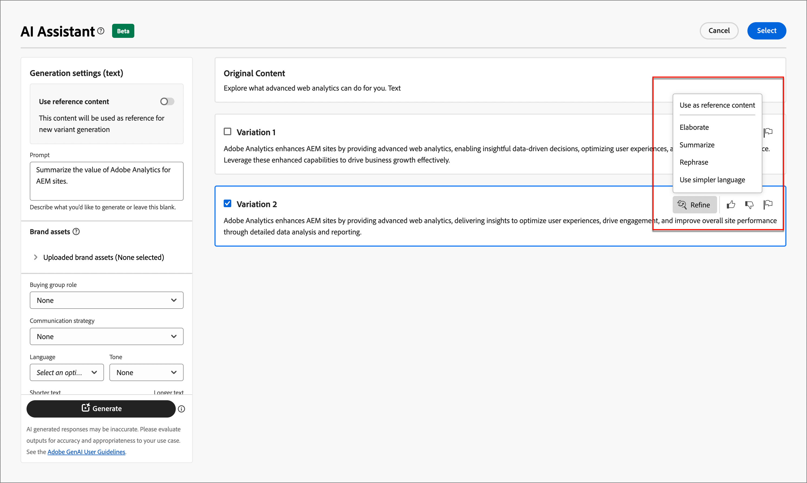

# 이메일 작성을 위한 AI 어시스턴트

마케팅 산업의 경쟁력이 높아짐에 따라 브랜드는 효과적인 콘텐츠를 빠르고 효율적으로 생성할 수 있는 효율적인 방법을 모색하고 있습니다. Adobe Journey Optimizer B2B edition의 이메일 작성을 위한 AI Assistant는 Adobe의 AI 기반 콘텐츠 생성 기능으로, 마케터가 전문적이고 브랜드 일관된 이메일 콘텐츠를 만드는 방식을 혁신합니다. 고급 GenAI 모델과 브랜드 가이드라인에 대한 깊은 이해를 바탕으로 AI Assistant는 브랜드 윤곽이 잡힌 스타일, 레이아웃, 색조 등에 최적화된 콘텐츠로 마케팅 목표를 기반으로 개인화되고, 매력적이며, 효과적인 콘텐츠를 자동 생성합니다. AI Assistant를 사용하면 이메일 마케팅 캠페인을 직관적이고, 단순하며, 간편한 방법으로 만들고 실행할 수 있습니다. 워크플로우에 이 기능을 추가하면 시간을 절약하고 효율성을 개선하며 더 나은 결과를 얻을 수 있습니다.

이 새로운 기능은 프롬프트 기반 텍스트 생성, 전체 이메일 생성 및 이메일 구조 내 콘텐츠 생성을 제공합니다. 이미지는 생성되지 않지만 모델에 대한 입력 브랜드 에셋의 이미지 카탈로그 내에서 권장됩니다. 또한 이 기능을 사용하여 열람률에 영향을 줄 수 있는 최적의 제목 줄과 사전 헤더를 생성할 수 있습니다.

>[!NOTE]
>
>이 기능은 Beta 버전에서 사용할 수 있으며 사전 공지 없이 변경될 수 있습니다.

## 지침 및 제한 사항

이메일 콘텐츠 생성을 위해 Adobe Journey Optimizer B2B edition에서 AI Assistant를 시작하기 전에 다음 지침을 검토하십시오.

* 정의하는 마케팅 목표/프롬프트는 생성된 콘텐츠 품질을 결정하는 주요 요소입니다. GenAI 모델이 정확하게 해석될 수 있도록 잘 정의된 프롬프트를 사용하십시오.
* 브랜드 에셋을 업로드하여 브랜드 콘텐츠에 정확한 정보를 얻습니다. 이러한 에셋이 없으면 콘텐츠는 공개적으로 사용할 수 있는 정보를 기반으로 합니다.
   * 업로드된 에셋은 PDF, JPEG, PNG 또는 ZIP 파일(지원되는 파일 형식 포함) 형식일 수 있습니다.
   * 업로드된 브랜드 에셋의 최대 크기는 50MB입니다. 파일이 커지거나 이미지가 대량으로 표시될 수 있지만 처리 시간은 늘어납니다.
* Adobe Journey Optimizer B2B edition 작성 이메일 템플릿, 바람직하게는 기본 제공 또는 샘플 템플릿, 브랜드별 템플릿, 또는 사용자 지정 템플릿을 사용하여 이메일 콘텐츠를 만듭니다. 최대 8~10개의 이미지가 포함된 이메일 템플릿이 권장됩니다.
* 생성된 변형에 대해 축소판 또는 플래그 아이콘을 사용하여 문제가 있는 출력을 보고해야 합니다.
* AI Assistant 사용 시 [Adobe 생성 AI 사용자 지침](https://www.adobe.com/legal/licenses-terms/adobe-gen-ai-user-guidelines.html)이 적용됩니다.

이메일 콘텐츠 생성을 위해 Adobe Journey Optimizer B2B edition의 AI Assistant에는 다음과 같은 제한이 적용됩니다.

* 영어는 유일하게 지원되는 언어입니다.
* 이메일 채널에서만 사용할 수 있습니다.
* GenAI 콘텐츠가 정확하지 않을 수 있습니다. Adobe 엔지니어가 모델을 개선할 수 있도록 피드백을 공유하십시오.
* 여러 브랜드 자산을 업로드할 수 있지만 특정 세대에 대해 하나만 활용할 수 있습니다.

>[!BEGINSHADEBOX]

## 프롬프트 라이브러리

최상의 콘텐츠를 생성하기 위해서는 효과적인 프롬프트가 필수적입니다. 프롬프트를 만드는 데 도움이 필요하면 _프롬프트 라이브러리_&#x200B;에 액세스하십시오. 이 라이브러리는 콘텐츠 생성을 개선하기 위한 다양한 즉각적인 아이디어를 제공합니다.

{width="500" zoomable="no"}

의도한 목표를 가장 잘 반영하는 프롬프트를 선택하고 브랜드, 제안, 캠페인 및 사용 사례를 지정하는 필요한 값을 추가합니다.

>[!ENDSHADEBOX]

## 구매 그룹 역할

Adobe Journey Optimizer B2B edition은 5개의 표준 B2B 구매 그룹 역할을 즉시 제공합니다. 각 구매 그룹 역할에는 고유한 메시지 초점이 있습니다.

| 역할 | 메시징 포커스 |
| ---- | --------------- |
| 집행 운영 위원회 | 제품 정보  가격  기술 통합 세부 정보  제품 기능 및 기능 |
| 영향력 있는 사용자 | 품질 증명  구현의 용이성  전문 분야별 전문 지식  경쟁 우위 |
| 의사 결정자 | 투자 수익률  재무 가치(RoI)  고객 사례 |
| 실무자 | 사용 편의성  제품 기능  제품 호환성  제품 통합의 용이성 |
| 챔피언 | 교육 콘텐츠  사고 리더십 콘텐츠  고객 스토리 |

이러한 구매 그룹 역할 중 하나를 선택하면 이러한 각 역할에 대해 관심 있는 특성 및 주제에 따라 출력이 자동으로 사용자 정의됩니다.

## AI Assistant를 사용하여 이메일 속성 생성

계정 여정에 [전자 메일 작업을 추가](./add-email.md#add-an-email-action-node-in-a-journey)하면 전자 메일을 보내는 데 사용되는 전자 메일 속성 집합을 정의합니다. AI 도우미는 이메일 **제목 줄** 및 **사전 머리글**&#x200B;에 대한 권장 콘텐츠를 생성하여 더 나은 이메일 참여를 달성할 수 있습니다.

1. 계정 여정에서 이메일을 만들거나 여정 노드에서 기존 이메일을 엽니다.

   오른쪽에 _[!UICONTROL 전자 메일 속성]_&#x200B;과 함께 전자 메일 미리 보기 페이지가 표시됩니다.

1. 다음 탭 중 하나를 선택하여 이메일 속성 작성에서 AI Assistant를 사용하는 방법을 알아봅니다.

>[!BEGINTABS]

>[!TAB 제목 줄 생성]

다음 단계에서는 AI Assistant를 사용하여 이메일에 최적화된 제목 줄을 생성하기 위한 작업 시퀀스를 설명합니다.

1. _[!UICONTROL 전자 메일 속성]_&#x200B;에서 **[!UICONTROL 제목 줄]** 필드 오른쪽에 있는 AI Assistant 아이콘({width="30" zoomable="no"})을 클릭합니다.

   전자 메일 제목 줄에 대한 {width="600" zoomable="yes"}

   이메일 제목 줄에 대한 생성 설정과 함께 AI 도우미 팝업이 열립니다.

   이메일과 연결된 이메일 콘텐츠 또는 목적에 맞게 제목란을 사용하려는 방법에 따라 제목란 텍스트를 생성하는 두 가지 옵션이 있습니다.

   * 프롬프트 또는 브랜드 에셋 없이 바로 **[!UICONTROL 생성]**&#x200B;을 클릭하여 기존 전자 메일 본문을 제목 줄 생성을 위한 컨텍스트로 사용할 수 있습니다.

   * (권장) 프롬프트, 브랜드 에셋 및 기타 설정 값을 제공하여 요구 사항에 가장 적합한 제목 줄 텍스트를 생성하기 위한 컨텍스트를 제공할 수 있습니다. (2~7단계)

1. **[!UICONTROL 프롬프트]** 필드에 생성할 내용에 대한 설명을 입력합니다.

   효과적인 프롬프트를 만드는 데 도움이 필요하면 [프롬프트 라이브러리](#prompt-library)를 사용하십시오.

1. 텍스트 생성의 소스 역할을 할 콘텐츠가 포함된 브랜드 자산을 지정합니다.

   * 카탈로그에서 자산을 선택합니다.

   * 브랜드 자산 파일을 추가하려면 **[!UICONTROL 브랜드 자산 업로드]**&#x200B;를 클릭하십시오.

   {width="600" zoomable="yes"}

1. 필요한 경우 스크롤하여 생성된 텍스트의 대상 대상자로 사용할 **[!UICONTROL 구매 그룹 역할]**&#x200B;을(를) 선택하십시오.

1. 필요한 경우 메시징 옵션을 사용하여 콘텐츠를 맞춤화합니다.

   * **[!UICONTROL 커뮤니케이션 전략]** - 생성된 텍스트에 가장 적합한 커뮤니케이션 스타일을 선택합니다.
   * **[!UICONTROL 언어]** - 콘텐츠를 생성할 언어를 선택합니다.
   * **[!UICONTROL 음색]** - 대상자와 공감하는 음색을 선택합니다. 유익하거나, 장난스럽거나, 설득력 있게 들리도록 지정하면 AI 도우미가 메시지를 그에 따라 조정할 수 있습니다.

1. 필요한 경우 슬라이더를 사용하여 생성할 텍스트 길이를 설정합니다.

1. 원하는 대로 **[!UICONTROL 이모지 사용]** 옵션을 변경합니다(설정 또는 해제).

1. 프롬프트 및 설정이 준비되면 **[!UICONTROL 생성]**&#x200B;을 클릭합니다.

1. AI 도우미 패널을 스크롤하고 생성된 변형을 탐색하여 가장 적합한 변형을 결정합니다.

   * 선택한 변형의 전체 화면 버전을 보려면 **[!UICONTROL 미리 보기]**&#x200B;를 클릭하십시오.

   * _엄지손가락 위로_, _엄지손가락 아래로_ 또는 _플래그_ 아이콘을 클릭하여 생성된 변형에 대한 피드백을 제공하고 피드백을 가장 잘 요약하는 이유를 선택하세요.

1. 추가 사용자 지정 기능에 액세스하려면 미리 보기 창에서 _개선_ 옵션으로 이동하십시오.

   * **[!UICONTROL 참조 콘텐츠로 사용]** - 다른 결과를 생성하기 위해 변형을 참조 콘텐츠로 사용하려면 이 옵션을 선택하십시오.

   * **[!UICONTROL 구문 변경]** - AI Assistant는 다양한 방식으로 메시지를 다시 구문 처리하여 쓰기를 신선하게 유지하고 다양한 대상자를 유혹할 수 있습니다.

   * **[!UICONTROL 더 간단한 언어 사용]** - AI Assistant를 사용하여 언어를 단순화함으로써, 더 많은 대상자가 명확하고 쉽게 사용할 수 있습니다.

   {width="600" zoomable="yes"}

1. 제목란 텍스트를 선택한 변형으로 바꾸고 전자 메일 속성으로 돌아가려면 **[!UICONTROL 선택]**&#x200B;을 클릭하세요.

>[!TAB 사전 머리글 생성]

이메일 사전 헤더는 받은 편지함에서 이메일을 볼 때 제목 줄 다음에 오는 짧은 요약 텍스트입니다. 이메일의 선택적 요소이지만 참여를 향상시킬 수 있는 좋은 기회입니다. 다음 단계에서는 AI Assistant를 사용하여 이메일에 최적화된 사전 헤더를 생성하는 작업 시퀀스를 설명합니다.

1. 이메일 속성에서 **[!UICONTROL 사전 머리글]** 확인란을 선택하고 오른쪽에 있는 AI Assistant 아이콘({width="30" zoomable="no"})을 클릭합니다.

   전자 메일 사전 헤더에 대한 {width="600" zoomable="yes"}

   이메일 사전 헤더에 대한 생성 설정이 있는 AI Assistant 팝업이 열립니다.

   이메일과 연결된 이메일 콘텐츠 또는 이메일을 타겟팅하는 방법에 따라 사전 헤더를 생성하는 두 가지 옵션이 있습니다.

   * 프롬프트나 브랜드 자산 없이 **[!UICONTROL 생성]**&#x200B;을 바로 클릭하여 기존 이메일 본문을 프리 헤더 생성의 컨텍스트로 사용할 수 있습니다.

   * (권장) 프롬프트, 브랜드 에셋 및 기타 설정 값을 제공하여 요구 사항에 가장 적합한 사전 헤더를 생성하기 위한 컨텍스트를 제공할 수 있습니다. (2~7단계)

1. **[!UICONTROL 프롬프트]** 필드에 생성할 내용에 대한 설명을 입력합니다.

   효과적인 프롬프트를 만드는 데 도움이 필요하면 [프롬프트 라이브러리](#prompt-library)를 사용하십시오.

1. 텍스트 생성의 소스 역할을 할 콘텐츠가 포함된 브랜드 자산을 지정합니다.

   * 카탈로그에서 자산을 선택합니다.

   * 브랜드 자산 파일을 추가하려면 **[!UICONTROL 브랜드 자산 업로드]**&#x200B;를 클릭하십시오.

   {width="600" zoomable="yes"}

1. 필요한 경우 스크롤하여 생성된 텍스트의 대상 대상자로 사용할 **[!UICONTROL 구매 그룹 역할]**&#x200B;을(를) 선택하십시오.

1. 필요한 경우 메시징 옵션을 사용하여 콘텐츠를 맞춤화합니다.

   * **[!UICONTROL 커뮤니케이션 전략]** - 생성된 텍스트에 가장 적합한 커뮤니케이션 스타일을 선택합니다.
   * **[!UICONTROL 언어]** - 콘텐츠를 생성할 언어를 선택합니다.
   * **[!UICONTROL 음색]** - 대상자와 공감하는 음색을 선택합니다. 유익하거나, 장난스럽거나, 설득력 있게 들리도록 지정하면 AI 도우미가 메시지를 그에 따라 조정할 수 있습니다.

1. 필요한 경우 슬라이더를 사용하여 생성할 텍스트 길이를 설정합니다.

1. 원하는 대로 **[!UICONTROL 이모지 사용]** 옵션을 변경합니다(설정 또는 해제).

1. 프롬프트 및 설정이 준비되면 **[!UICONTROL 생성]**&#x200B;을 클릭합니다.

1. AI 도우미 패널을 스크롤하고 생성된 변형을 탐색하여 가장 적합한 변형을 결정합니다.

   * 선택한 변형의 전체 화면 버전을 보려면 **[!UICONTROL 미리 보기]**&#x200B;를 클릭하십시오.

   * _엄지손가락 위로_, _엄지손가락 아래로_ 또는 _플래그_ 아이콘을 클릭하여 생성된 변형에 대한 피드백을 제공하고 피드백을 가장 잘 요약하는 이유를 선택하세요.

1. 추가 사용자 지정 기능에 액세스하려면 미리 보기 창에서 _개선_ 옵션으로 이동하십시오.

   * **[!UICONTROL 참조 콘텐츠로 사용]** - 다른 결과를 생성하기 위해 변형을 참조 콘텐츠로 사용하려면 이 옵션을 선택하십시오.

   * **[!UICONTROL 구문 변경]** - AI Assistant는 다양한 방식으로 메시지를 다시 구문 처리하여 쓰기를 신선하게 유지하고 다양한 대상자를 유혹할 수 있습니다.

   * **[!UICONTROL 더 간단한 언어 사용]** - AI Assistant를 사용하여 언어를 단순화함으로써, 더 많은 대상자가 명확하고 쉽게 사용할 수 있습니다.

   {width="600" zoomable="yes"}

1. **[!UICONTROL 선택]**&#x200B;을(를) 클릭하여 프리 헤더를 선택한 변형으로 바꾸고 전자 메일 속성으로 돌아갑니다.

>[!ENDTABS]

## AI Assistant를 사용하여 이메일 본문 콘텐츠 생성

[이메일을 만들고 개인화한](./email-authoring.md) 후에는 생성 AI에서 제공하는 Adobe Journey Optimizer B2B edition의 AI Assistant를 사용하여 이메일 본문 콘텐츠를 다음 수준으로 높이십시오.

이메일 디자이너에서 AI 어시스턴트는 전체 이메일 본문, 타겟팅된 텍스트 콘텐츠 및 대상자와 공감하는 이미지에 대한 권장 사항을 생성하여 게재의 영향을 최적화하는 데 도움이 될 수 있습니다. 이메일 캠페인의 이러한 최적화는 더 나은 참여를 생성하도록 설계되었습니다.

1. 계정 여정에서 전자 메일을 만들고 **[!UICONTROL 전자 메일 Designer 열기]** 또는 **[!UICONTROL 전자 메일 콘텐츠 추가]**&#x200B;를 클릭합니다.

1. 시각적 이메일 디자이너에서 이메일 템플릿을 선택하여 엽니다.

1. 여정 노드에 대해 필요에 따라 이메일을 개인화합니다.

1. 이메일 본문 콘텐츠 작성에서 AI Assistant를 사용하는 방법을 알려면 다음 탭 중 하나를 선택하십시오.

>[!BEGINTABS]

>[!TAB 전체 전자 메일 생성]

다음 단계에서는 AI Assistant를 사용하여 기존 이메일 템플릿을 구체화하는 작업 시퀀스를 설명합니다.

1. 이메일 디자이너에서 오른쪽에 있는 아이콘({width="30" zoomable="no"})을 클릭하여 AI Assistant 메뉴에 액세스합니다.

   {width="600" zoomable="yes"}

   오른쪽의 AI 도우미 설정은 _생성 설정(전체 이메일)_&#x200B;을 반영합니다.

1. **[!UICONTROL 프롬프트]** 필드에 생성할 내용에 대한 설명을 입력합니다.

   효과적인 프롬프트를 만드는 데 도움이 필요하면 [프롬프트 라이브러리](#prompt-library)를 사용하십시오.

   {width="600" zoomable="yes"}

1. AI Assistant에 추가 컨텍스트를 제공할 수 있는 콘텐츠가 포함된 브랜드 자산을 지정합니다.

   * 카탈로그에서 자산을 선택합니다.

   * 브랜드 자산 파일을 추가하려면 **[!UICONTROL 브랜드 자산 업로드]**&#x200B;를 클릭하십시오.

   이 입력 에셋은 이메일 내에서 콘텐츠 생성 및 이미지 추천의 소스 역할을 합니다.

1. 전자 메일 커뮤니케이션의 대상 대상자로 사용할 **[!UICONTROL 구매 그룹 역할]**&#x200B;을(를) 선택하십시오.

1. 필요한 경우 메시징 옵션을 사용하여 콘텐츠를 맞춤화합니다.

   * **[!UICONTROL 커뮤니케이션 전략]** - 생성된 텍스트에 가장 적합한 커뮤니케이션 스타일을 선택합니다.
   * **[!UICONTROL 언어]** - 콘텐츠를 생성할 언어를 선택합니다.
   * **[!UICONTROL 음색]** - 대상자와 공감하는 음색을 선택합니다. 유익하거나, 장난스럽거나, 설득력 있게 들리도록 지정하면 AI 도우미가 메시지를 그에 따라 조정할 수 있습니다.
   * **콘텐츠 형식** - 시각적 요소의 특성을 반영하는 옵션을 선택합니다. 이 설정은 사진, 그래픽 또는 예술과 같은 다양한 형태의 시각적 표현을 구별합니다.

1. 메시지가 준비되면 **[!UICONTROL 생성]**&#x200B;을 클릭합니다.

1. AI 도우미 패널을 스크롤하고 생성된 변형을 탐색하여 가장 적합한 변형을 결정합니다.

   * 선택한 변형의 전체 화면 버전을 보려면 **[!UICONTROL 미리 보기]**&#x200B;를 클릭하십시오.

   * _엄지손가락 위로_, _엄지손가락 아래로_ 또는 _플래그_ 아이콘을 클릭하여 생성된 변형에 대한 피드백을 제공하고 피드백을 가장 잘 요약하는 이유를 선택하세요.

     {width="600" zoomable="yes"}

1. 템플릿 콘텐츠를 선택한 변형으로 바꾸고 이메일 디자이너로 돌아가려면 **[!UICONTROL 선택]**&#x200B;을 클릭합니다.

   전자 메일 디자이너에서는 캔버스의 편집 및 서식 도구를 사용하여 콘텐츠를 변경할 수 있으며 오른쪽의 _[!UICONTROL 설정]_ 및 _[!UICONTROL 스타일]_ 옵션도 변경할 수 있습니다.

>[!TAB 텍스트 생성]

다음 단계에서는 AI Assistant를 사용하여 기존 이메일의 텍스트 콘텐츠를 세분화하거나 향상시키는 작업 시퀀스를 설명합니다.

1. 이메일 디자이너에서 오른쪽에 있는 아이콘({width="30" zoomable="no"})을 클릭하여 AI Assistant 메뉴에 액세스합니다.

   {width="600" zoomable="yes"}

1. 특정 콘텐츠를 타깃팅할 _Text_ 구성 요소를 선택하십시오.

   오른쪽의 AI 도우미 설정은 _생성 설정(텍스트)_&#x200B;을 반영합니다.

1. **[!UICONTROL 프롬프트]** 필드에 생성할 내용에 대한 설명을 입력합니다.

   {width="600" zoomable="yes"}

   효과적인 프롬프트를 만드는 데 도움이 필요하면 [프롬프트 라이브러리](#prompt-library)를 사용하십시오.

1. 텍스트 생성의 소스 역할을 할 콘텐츠가 포함된 브랜드 자산을 지정합니다.

   * 카탈로그에서 자산을 선택합니다.

   * 브랜드 자산 파일을 추가하려면 **[!UICONTROL 브랜드 자산 업로드]**&#x200B;를 클릭하십시오.

1. 생성된 텍스트의 대상 대상자로 사용할 **[!UICONTROL 구매 그룹 역할]**&#x200B;을(를) 선택하십시오.

1. 필요한 경우 언어 및 메시징 옵션을 사용하여 콘텐츠를 사용자 정의합니다.

   * **[!UICONTROL 커뮤니케이션 전략]** - 생성된 텍스트에 가장 적합한 커뮤니케이션 스타일을 선택합니다.
   * **[!UICONTROL 언어]** - 콘텐츠를 생성할 언어를 선택합니다.
   * **[!UICONTROL 음색]** - 대상자와 공감하는 음색을 선택합니다. 유익하거나, 장난스럽거나, 설득력 있게 들리도록 지정하면 AI 도우미가 메시지를 그에 따라 조정할 수 있습니다.

1. 필요한 경우 슬라이더를 사용하여 생성할 텍스트 길이를 설정합니다.

1. 메시지가 준비되면 **[!UICONTROL 생성]**&#x200B;을 클릭합니다.

1. 생성된 _변형_&#x200B;을 찾은 다음 **[!UICONTROL 미리 보기]**&#x200B;를 클릭하여 선택한 변형의 전체 화면 버전을 봅니다.

1. 추가 사용자 지정 기능에 액세스하려면 미리 보기 창에서 _개선_ 옵션으로 이동하십시오.

   * **[!UICONTROL 참조 콘텐츠로 사용]** - 다른 결과를 생성하기 위해 변형을 참조 콘텐츠로 사용하려면 이 옵션을 선택하십시오.

   * **[!UICONTROL 자세히]** - AI Assistant를 통해 특정 주제를 확장하고 더 나은 이해와 참여를 위해 추가 세부 정보를 제공할 수 있습니다.

   * **[!UICONTROL 요약]** - 정보가 길면 전자 메일 수신자에게 과부하가 걸릴 수 있습니다. AI Assistant를 사용하여 주요 사항을 명확하고 간결한 요약으로 요약하여 주목 받고 더 자세히 읽을 수 있도록 장려합니다.

   * **[!UICONTROL 구문 변경]** - AI Assistant는 다양한 방식으로 메시지를 다시 구문 처리하여 쓰기를 신선하게 유지하고 다양한 대상자를 유혹할 수 있습니다.

   * **[!UICONTROL 더 간단한 언어 사용]** - AI Assistant를 사용하여 언어를 단순화함으로써, 더 많은 대상자가 명확하고 쉽게 사용할 수 있습니다.

   {width="700" zoomable="yes"}

1. 원하는 컨텐츠가 있으면 **[!UICONTROL 선택]**&#x200B;을 클릭하여 텍스트를 선택한 변형으로 바꾸고 이메일 디자이너로 돌아갑니다.

   전자 메일 디자이너에서는 캔버스의 편집 및 서식 도구를 사용하여 텍스트와 오른쪽의 _[!UICONTROL 설정]_ 및 _[!UICONTROL 스타일]_ 옵션을 변경할 수 있습니다.

>[!TAB 이미지 권장 사항]

AI Assistant를 사용하여 에셋을 최적화 및 개선하고 보다 사용자 친화적인 경험을 보장할 수 있습니다. 다음 단계에서는 AI Assistant를 사용하여 이메일의 이미지 콘텐츠를 향상시키는 작업 시퀀스를 설명합니다.

1. 오른쪽의 아이콘({width="30" zoomable="no"})을 클릭하여 AI Assistant 메뉴에 액세스합니다.

   {width="600" zoomable="yes"}

1. 특정 콘텐츠를 대상으로 지정할 _이미지_ 구성 요소를 선택하고 AI Assistant 메뉴에 액세스합니다.

   오른쪽의 설정은 _[!UICONTROL 생성 설정(이미지)]_&#x200B;을 반영합니다.

1. 자산을 미세 조정하려면 **[!UICONTROL 프롬프트]** 필드에 원하는 내용에 대한 설명을 입력하십시오.

   {width="600" zoomable="yes"}

   효과적인 프롬프트를 만드는 데 도움이 필요하면 [프롬프트 라이브러리](#prompt-library)를 사용하십시오.

1. AI Assistant에 추가 컨텍스트를 제공할 수 있는 콘텐츠가 포함된 브랜드 자산을 추가하려면 **[!UICONTROL 브랜드 자산 업로드]**&#x200B;를 클릭하십시오.

   필요한 에셋을 이미 사용할 수 있는 경우 **[!UICONTROL 업로드된 브랜드 에셋]**&#x200B;을(를) 확장하고 에셋을 선택합니다.

   프롬프트는 항상 기존 에셋에 연결되어야 합니다.

1. 이미지 설정을 사용하여 프롬프트를 구체화합니다.

   * **[!UICONTROL 종횡비]** - 이 설정은 에셋의 너비와 높이를 결정합니다. 16:9, 4:3, 3:2 또는 1:1과 같은 일반적인 비율 중에서 선택할 수 있는 옵션이 있거나 사용자 지정 크기를 입력할 수 있습니다.
   * **[!UICONTROL 색상 및 색조]** - 이 설정은 이미지 내의 전체 색상 모양과 이미지 내의 분위기 또는 분위기에 영향을 줍니다.
   * **[!UICONTROL 콘텐츠 형식]** - 이 설정은 시각적 요소의 특성을 분류하여 사진, 그래픽 또는 미술과 같은 시각적 표현의 다른 형식을 구분합니다.
   * **[!UICONTROL 조명]** - 이 설정은 이미지의 대기를 형성하고 특정 요소를 강조 표시하는 이미지에 있는 번개를 조정합니다.
   * **[!UICONTROL 컴포지션]** - 이 설정은 이미지 프레임 내의 요소 배열을 결정합니다.

1. 프롬프트 구성에 만족하면 **[!UICONTROL 생성]**&#x200B;을 클릭합니다.

   AI Assistant는 요청을 처리하고 프롬프트 및 기타 입력을 기반으로 입력 브랜드 에셋 내에서 가장 적합한 이미지를 추천합니다.

   >[!IMPORTANT]
   >
   >입력 브랜드 자산에 이미지가 없거나 입력 프롬프트와 관련된 이미지가 없으면 출력이 비어 있습니다.

1. _[!UICONTROL 변형]_&#x200B;을 찾아 전자 메일에 가장 적합한 변형을 선택하십시오.

   선택한 변형의 전체 화면 버전을 보려면 **[!UICONTROL 미리 보기]**&#x200B;를 클릭하세요.

1. 원하는 이미지를 강조 표시하고 **[!UICONTROL 선택]**&#x200B;을 클릭하여 이미지 또는 자리 표시자를 선택한 항목으로 바꾸고 이메일 디자이너로 돌아갑니다.

   전자 메일 디자이너에서는 캔버스의 편집 및 서식 도구를 사용하여 콘텐츠를 변경할 수 있으며 오른쪽의 _[!UICONTROL 설정]_ 및 _[!UICONTROL 스타일]_ 옵션도 변경할 수 있습니다.

>[!ENDTABS]
