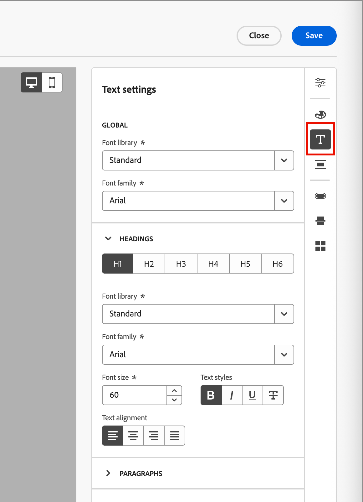
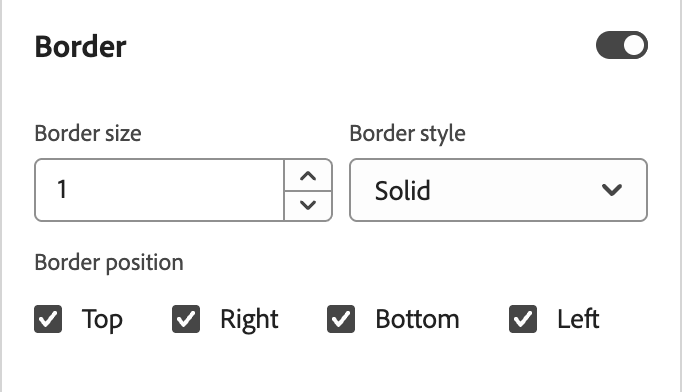

# 이메일 콘텐츠에 브랜드 테마 사용 {#email-brand-themes}

>[!CONTEXTUALHELP]
>id="ajo-b2b_email_brand_theme"
>title="이메일 또는 이메일 템플릿에 브랜드 테마 적용"
>abstract="이메일 또는 이메일 템플릿에 대한 테마를 선택하여 브랜드 및 디자인에 맞는 특정 스타일을 적용합니다."

테마를 사용하는 비기술 디자이너는 특정 브랜드 및 스타일에 맞게 조정할 수 있는 재사용 가능한 이메일 콘텐츠 디자인 지침을 만들 수 있습니다. 테마는 마케터가 시각적으로 호소력 있고 브랜드 일관성이 있는 이메일을 적은 노력으로 더 빠르고 활용할 수 있도록 하며, 고유한 디자인 요구에 대한 고급 사용자 지정 옵션을 제공합니다.

## 테마 지침 및 제한 사항 {#themes-guidelines}

테마를 사용하여 작업할 때는 다음 지침 및 제한 사항을 염두에 두십시오.

* 빈 캔버스(_처음부터 디자인_)에서 전자 메일 또는 전자 메일 템플릿을 만드는 경우 _테마 모드_&#x200B;를 선택하여 테마를 사용한 콘텐츠 빌드를 시작하여 브랜드와 디자인에 맞는 특정 스타일을 적용할 수 있습니다. _수동 모드_&#x200B;를 선택하는 경우 전자 메일 또는 전자 메일 서식 파일에 대한 디자인을 다시 설정하지 않는 한 테마를 적용할 수 없습니다.

* [조각](./fragments.md)은(는) 전자 메일 콘텐츠의 _테마 모드_&#x200B;와(과) _수동 모드_ 간에 상호 호환되지 않습니다. 테마가 적용되는 전자 메일 콘텐츠에서 조각을 사용하려면 _테마 모드_&#x200B;에서도 조각을 만들어야 합니다.

* 사용자 지정 테마에 대한 변경 사항이 이미 사용 중인 모든 이메일 또는 이메일 템플릿에 자동으로 캐스케이드되지 않습니다. 테마를 새로 고치려면 각각에 대한 콘텐츠를 편집합니다.

* 테마를 삭제해도 이미 적용된 이메일 또는 이메일 템플릿에는 영향을 주지 않습니다.
<!-- 
* If using a content created in HTML, you will be in [compatibility mode](existing-content.md) and you cannot apply themes to this content.
-->

## 브랜드 테마 만들기 {#create-theme}

향후 이메일 콘텐츠에서 이메일 및 이메일 템플릿 콘텐츠에 적용할 수 있는 나만의 브랜드 테마를 정의하십시오.

1. 다음 방법 중 하나를 사용하여 테마 도구에 액세스합니다.

   * [새 전자 메일 서식 파일을 만들고](./email-templates.md#create-an-email-template) **[!UICONTROL 전자 메일 서식 파일 편집]**&#x200B;을 클릭하여 _[!UICONTROL 서식 파일 디자인]_ 페이지를 시작합니다.

   * **[!UICONTROL 클릭... 이메일 콘텐츠 디자인 스페이스 오른쪽 상단에서]**&#x200B;을(를) 더 자세히 살펴보고 **[!UICONTROL 디자인 변경]**&#x200B;을(를) 선택합니다.

     {width="700" zoomable="yes"}

     확인 대화 상자에서 **[!UICONTROL 템플릿 변경]**&#x200B;을 클릭하여 디자인 페이지를 엽니다.

1. 디자인 페이지에서 **[!UICONTROL 테마 만들기 또는 편집]**&#x200B;을 선택합니다.

   {width="800" zoomable="yes"}

1. 기본 테마를 선택하거나 Adobe 테마를 사용하여 시작점으로 사용합니다.

   >[!NOTE]
   >
   >사용자 지정 테마(_[!UICONTROL 내 테마]_) 중 하나를 시작점으로 사용하려면 [복제](#delete-or-duplicate-a-theme)하고 [테마를 편집](#edit-a-theme)할 때 테마 이름을 변경할 수 있습니다.

1. **[!UICONTROL 만들기]**&#x200B;를 클릭합니다.

   {width="750" zoomable="yes"}

   _[!UICONTROL 테마 만들기]_ 페이지에서는 시작 테마의 모든 텍스트, 단추 및 컨테이너의 기존 요소를 캔버스에 제공합니다.

1. 오른쪽 탐색을 사용하여 다양한 테마 스타일 탭에 액세스하고 테마 설정을 변경합니다.

   * [일반 설정](#general-settings)
   * [색상](#colors)
   * [텍스트 설정](#text-settings)
   * [간격 및 테두리](#spacing-and-border)
   * [버튼](#button)
   * [분할자](#divider)
   * [격자](#grid)

   새 테마 설정을 정의하면 캔버스에서 시각적 요소가 변경됩니다. 결과가 원하는 결과가 아닌 경우 오른쪽 패널 하단에 있는 _실행 취소_( {width="16"}) 아이콘을 클릭할 수 있습니다. 변경 사항을 다시 적용하려면 _다시 실행_( {width="16"} ) 아이콘을 클릭하십시오.

1. 테마 정의가 완료되면 **[!UICONTROL 저장]**&#x200B;을 클릭합니다.

1. **[!UICONTROL 닫기]**&#x200B;를 클릭하여 _[!UICONTROL 테마 만들기]_ 페이지로 돌아간 다음 **[!UICONTROL 취소]**&#x200B;를 클릭하여 디자인 페이지로 돌아갑니다.

   그런 다음 **[!UICONTROL 처음부터 디자인]**&#x200B;을 선택하여 시각적 디자인 공간을 열고 [전자 메일 또는 템플릿에 테마를 사용](#use-your-theme-for-email-content-authoring)할 수 있습니다.

### 일반 설정

**[!UICONTROL 일반 설정]** 탭에서 테마의 기본 매개 변수를 정의합니다.

* 고유한 **[!UICONTROL 테마 이름]**&#x200B;을(를) 입력하십시오.

* 전자 메일 콘텐츠(본문)에 대한 **[!UICONTROL 뷰포트 너비]**&#x200B;를 조정합니다. 위쪽 및 아래쪽 화살표를 사용하여 폭을 늘리거나 줄이거나 값을 픽셀 단위로 입력합니다.

{width="450"}
<!--  and also export the current theme to [share it across sandboxes](../configuration/copy-objects-to-sandbox.md).-->

### 색상

**[!UICONTROL 색상]** 탭을 선택하고 설정을 사용하여 테마 색상 팔레트를 정의합니다.

{width="450"}

* **[!UICONTROL 편집]**&#x200B;을 클릭하여 테마 색상이 포함된 색상 팔레트를 표시합니다.

  **[!UICONTROL 사전 설정]**&#x200B;을 선택하여 테마의 색 구성표를 사용하거나 집합에서 각 색을 조정합니다. 두 가지를 조합하여 사용할 수도 있습니다.

  {width="350"}

  맨 위에 있는 선택한 색상 사각형의 경우 알려진 RGB, HSL, HSB 또는 16진수 값을 입력하여 색상을 설정할 수 있습니다. 또는 색상 슬라이더와 색상 필드를 사용하여 색상을 선택할 수 있습니다.

  색상 팔레트 도구를 닫으려면 _뒤로_ 화살표를 클릭하십시오.

* **[!UICONTROL 변형 추가]**&#x200B;를 클릭하여 _light_ 및 _dark_ 모드와 같은 여러 색상 변형을 만듭니다. 각 변형에는 고유한 색상 팔레트 및 뉘앙스 컨트롤이 있습니다. 최대 6개의 변형을 가질 수 있습니다.

  각 변형에 대해 _편집_(  ) 아이콘을 클릭합니다. 기본 팔레트 또는 사용자 지정 색상을 사용할 수 있습니다.

  {width="450"}

  변형에 대해 변경하려는 각 색상에 대해 토글을 왼쪽 또는 오른쪽으로 이동하여 비활성화하거나 활성화합니다. 활성화된 색상 설정의 경우 색상 사각형을 클릭하여 색상을 선택합니다.

  {width="450"}

  +++변형 색상 설정

  설정은 유형에 따라 그룹화됩니다.

  | 유형 | 설정 | 설명 |
  | ---- | -------- | ----------- |
  | [!UICONTROL 일반] | {width="300"} | 이러한 설정을 사용하면 본문, 구조, 컨테이너, 배경, 링크, 격자 및 테두리의 색상을 설정할 수 있습니다. |
  | [!UICONTROL 머리글] | {width="300"} | 이러한 설정은 `Heading` 요소에 적용되며, 이 요소에서 6개의 제목 수준 각각에 대해 텍스트 및 테두리 색상을 설정할 수 있습니다. 변형에 대한 색상을 설정할 각 제목 수준을 확장합니다. |
  | [!UICONTROL 단락] | {width="300"} | 이러한 설정은 `Paragraph` 요소에 적용되며, 이 요소에서 세 가지 단락 유형에 대해 각각 텍스트 및 테두리 색상을 설정할 수 있습니다. 변형의 색상을 설정할 각 단락 유형을 확장합니다. |
  | [!UICONTROL 단추] | {width="300"} | 이 설정은 단추 요소에 적용되며, 여기서 세 개의 단추 사전 설정 각각 _기본_, _보조_ 및 _3차_&#x200B;에 대해 채우기 색상, 테두리 색상 및 텍스트 색상을 설정할 수 있습니다. |

  +++

### 텍스트 설정

**[!UICONTROL 텍스트 설정]** 탭에서 테마에 사용할 전역 글꼴 형식, 스타일 및 크기를 설정할 수 있습니다. 보다 세분화된 제어를 위해 머리글 및 단락 유형에 대해 이러한 매개 변수를 편집할 수도 있습니다.

{width="450"}

+++유형별 텍스트 설정

| 유형 | 설정 | 설명 |
| ---- | -------- | ----------- |
| [!UICONTROL 전역] | {width="300"} | **[!UICONTROL 글꼴 라이브러리]**&#x200B;를 _[!UICONTROL 표준]_ 또는 _[!UICONTROL Google 글꼴]_(으)로 설정합니다. 그런 다음 사용할 글꼴 모음을 선택합니다. 이러한 전역 텍스트 설정은 머리글 수준 및 단락 유형에 대해 서로 다른 텍스트 스타일을 설정하지 않는 한 전체에 적용됩니다. |
| [!UICONTROL 머리글] | {width="300"} | 설정할 머리글 수준에 대해 **[!UICONTROL H1]**, **[!UICONTROL H2]** 등을 선택합니다. **[!UICONTROL 글꼴 라이브러리]**&#x200B;를 _[!UICONTROL 표준]_ 또는 _[!UICONTROL Google 글꼴]_(으)로 설정합니다. 그런 다음 글꼴 모음, 크기 및 스타일을 선택합니다. **[!UICONTROL 텍스트 맞춤]**: _왼쪽_, _가운데_, _오른쪽_ 또는 _양쪽 맞춤_&#x200B;을 선택하세요. |
| [!UICONTROL 단락] | {width="300"} | 설정할 제목 수준을 보려면 **[!UICONTROL P1]**, **[!UICONTROL HP]** 등을 선택하십시오. **[!UICONTROL 글꼴 라이브러리]**&#x200B;를 _[!UICONTROL 표준]_ 또는 _[!UICONTROL Google 글꼴]_(으)로 설정합니다. 그런 다음 글꼴 모음, 크기 및 스타일을 선택합니다. 필요에 따라 **[!UICONTROL 줄 높이]**&#x200B;를 조정합니다. **[!UICONTROL 텍스트 맞춤]**: _왼쪽_, _가운데_, _오른쪽_ 또는 _양쪽 맞춤_&#x200B;을 선택하세요. |

+++

### 간격 및 테두리

**[!UICONTROL 간격]** 탭에서 다른 요소 유형에 대해 패딩과 여백을 설정할 수 있습니다. **[!UICONTROL 유형 선택]**&#x200B;의 경우 콘텐츠 유형을 선택하십시오. 그런 다음 해당 요소 유형에 적용할 수 있는 패딩, 여백, 모서리 및 테두리를 설정합니다.

{width="450"}

+++간격 설정

| 유형 | 설정 | 설명 |
| ---- | -------- | ----------- |
| [!UICONTROL 여백] | {width="300"} | _Margin_ 아이콘을 선택하여 CSS `margin` 매개 변수를 복제하는 설정을 표시합니다. 이 매개 변수는 구성 요소 테두리 외부의 공간으로 제어하고 다른 구성 요소/요소와 구분합니다. 구성 요소 주위에 간격을 만들어 위치 및 주변 컨텐츠 레이아웃에 영향을 줍니다. 디자인 요구에 따라 여백 값을 픽셀 단위로 설정합니다. 구성 요소의 모든 면, 위쪽 단추, 왼쪽/오른쪽 또는 각 면에 대한 여백을 독립적으로 설정할 수 있습니다. 상단-하단 및 왼쪽-오른쪽 여백 값을 동기화하거나 동기화하지 않으려면 _잠금_ 및 _잠금 해제_ 아이콘을 클릭하십시오. |
| [!UICONTROL 패딩] | {width="300"} | _패딩_ 아이콘을 선택하여 구성 요소/요소의 콘텐츠와 테두리 사이의 공간인 CSS `padding` 매개 변수를 복제하는 설정을 표시합니다. 패딩은 내용과 구성 요소 테두리 사이의 거리를 제어하는 데 사용할 수 있는 내부 공간을 제공합니다. 디자인 요구에 따라 패딩 값을 픽셀 단위로 설정합니다. 구성 요소의 모든 면, 상단, 왼쪽-오른쪽 또는 각 면에 대한 패딩을 독립적으로 설정할 수 있습니다. 상단-하단 및 왼쪽-오른쪽 패딩 값을 동기화하거나 동기화하지 않으려면 _잠금_ 및 _잠금 해제_ 아이콘을 클릭하십시오. |
| [!UICONTROL 모서리] | {width="300"} | 구성 요소/요소 모퉁이의 반경을 정의하는 CSS _매개 변수를 복제하는 설정을 표시하려면_&#x200B;모퉁이`border-radius` 아이콘을 선택하십시오. 코너에 대해 원하는 커브에 따라 숫자 값을 설정합니다. 값이 0(기본값)이면 사각형 모서리가 생성됩니다. |

+++

+++테두리 설정

**[!UICONTROL 테두리]** 토글을 오른쪽으로 이동하여 테두리 표시 옵션을 활성화하고 디자인 기준에 따라 설정합니다.

* **[!UICONTROL 테두리 크기]**(선 폭)을 설정하려면 위쪽 및 아래쪽 화살표 아이콘을 클릭하여 픽셀 수를 늘리거나 줄입니다.

* **[!UICONTROL 테두리 스타일]**&#x200B;을(를) 설정하려면 표준 CSS `border-style` 값 목록에서 값(예: _단색_, _점선_, _파선_)을 선택하십시오.

* 테두리가 표시되는 위치를 확인하려면 각 **[!UICONTROL 테두리 위치]** 확인란을 선택하십시오.

{width="250"}

+++

### 버튼

**[!UICONTROL 단추]** 탭에서 테두리 반경(모양), 텍스트 및 크기와 같은 단추 요소에 대해 색상 이외의 다른 특성을 설정할 수 있습니다. 세 단추 사전 설정 각각(_[!UICONTROL 기본]_, _[!UICONTROL 보조]_ 및 _[!UICONTROL 3차]_)의 설정을 변경할 수 있습니다.

{width="450"}

+++단추 설정

| 유형 | 설정 | 설명 |
| ---- | -------- | ----------- |
| [!UICONTROL 텍스트] | {width="300"} | **[!UICONTROL 글꼴 라이브러리]**&#x200B;를 _[!UICONTROL 표준]_ 또는 _[!UICONTROL Google 글꼴]_(으)로 설정합니다. 그런 다음 글꼴 모음, 크기 및 스타일을 선택합니다. **[!UICONTROL 텍스트 맞춤]**: _왼쪽_, _가운데_, _오른쪽_ 또는 _양쪽 맞춤_&#x200B;을 선택하세요. |
| [!UICONTROL 테두리] | {width="300"} | **[!UICONTROL 테두리]** 토글을 오른쪽으로 이동하여 단추 테두리 표시 옵션을 활성화하고 디자인 기준에 따라 설정합니다. 픽셀 수를 늘리거나 줄여 **[!UICONTROL 테두리 크기]**(선 폭)을 설정하십시오. 표준 CSS **[!UICONTROL 값 목록에서 값을 선택하여]**&#x200B;테두리 스타일`border-style`을(를) 설정합니다(예: _Solid_, _Dotted_, _Dashed_). |
| [!UICONTROL 크기] | {width="300"} | **[!UICONTROL 높이]** 옵션의 경우 위쪽 및 아래쪽 화살표 아이콘을 클릭하여 픽셀 수를 늘리거나 줄입니다. 빈 값(자동)은 기본값이며 내용에 따라 버튼의 높이를 조정합니다. **[!UICONTROL 너비]**&#x200B;에 대해 전환으로 너비를 픽셀 또는 백분율로 설정하십시오. 백분율 너비의 경우 슬라이더를 사용하여 백분율 값을 설정합니다. 백분율은 포함 블록의 콘텐츠 상자를 기반으로 단추 크기를 결정합니다. 이 콘텐츠 상자에서는 패딩과 테두리가 제외됩니다. 예를 들어 값 50은 단추 너비를 포함된 블록 콘텐츠 너비의 50%로 설정합니다. 픽셀 기반 너비의 경우 위쪽 및 아래쪽 화살표 아이콘을 클릭하여 픽셀 수를 늘리거나 줄입니다. 빈 값(_Auto_)은 기본값이며 내용에 따라 단추의 너비를 조정합니다. |

+++

### 분할자

**[!UICONTROL 분할기]** 탭에서 분할기 구성 요소의 줄 스타일 및 컨테이너 설정을 설정할 수 있습니다.

{width="450"}

+++분할자 설정

| 유형 | 설정 | 설명 |
| ---- | -------- | ----------- |
| [!UICONTROL Line] | {width="300"} | 표준 CSS **[!UICONTROL 값 목록에서 값을 선택하여]**&#x200B;테두리 스타일`border-style`을(를) 설정합니다(예: _Solid_, _Dotted_, _Dashed_). |
| [!UICONTROL 컨테이너 크기] | {width="300"} | **[!UICONTROL 높이]** 옵션의 경우 위쪽 및 아래쪽 화살표 아이콘을 클릭하여 구성 요소/요소의 픽셀 수를 늘리거나 줄입니다. 빈 값(자동)은 기본값이며 내용에 따라 높이의 크기를 조정합니다(선 스타일). **[!UICONTROL 너비]**&#x200B;에 대해 전환으로 너비를 픽셀 또는 백분율로 설정하십시오. 백분율 너비의 경우 슬라이더를 사용하여 백분율 값을 설정합니다. 백분율은 포함 블록의 콘텐츠 상자를 기반으로 요소 너비를 결정합니다. 예를 들어, 50이라는 값은 구분선 너비를 포함하는 블록 콘텐츠 너비의 50%로 설정합니다. 픽셀 기반 너비의 경우 위쪽 및 아래쪽 화살표 아이콘을 클릭하여 픽셀 수를 늘리거나 줄입니다. 빈 값(_Auto_)은 기본값이며 내용에 따라 구분선 너비의 크기를 지정합니다. |
| [!UICONTROL 정렬] | {width="300"} | 포함 블록 내에서 수평 정렬을 선택합니다. _왼쪽_, _가운데_ 또는 _오른쪽_. |

+++

### 격자

**[!UICONTROL 그리드]** 탭에서 그리드 요소의 열과 행 간격을 제어할 수 있습니다.

* **[!UICONTROL 열 간격]** - 위쪽 및 아래쪽 화살표 아이콘을 클릭하여 표 형태 창 사이의 간격 픽셀 수를 늘리거나 줄입니다. 또는 필드에 숫자를 입력할 수 있습니다.

* **[!UICONTROL 행 간격]** - 위쪽 및 아래쪽 화살표 아이콘을 클릭하여 그리드 행 사이의 간격 픽셀 수를 늘리거나 줄입니다. 또는 필드에 숫자를 입력할 수 있습니다.

{width="700" zoomable="yes"}

## 테마 편집

테마를 만들 때 사용하는 것과 동일한 워크플로 및 도구를 사용하여 테마를 편집할 수 있습니다. **[!UICONTROL 내 테마]** 탭을 선택하고 변경할 사용자 지정 테마를 선택한다는 점이 다릅니다.

{width="750" zoomable="yes"}

오른쪽의 레일을 사용하여 다양한 탭을 탐색하고 테마 설정을 변경합니다.

* [일반 설정](#general-settings)
* [색상](#colors)
* [텍스트 설정](#text-settings)
* [간격 및 테두리](#spacing-and-border)
* [버튼](#button)
* [분할자](#divider)
* [격자](#grid)

{width="800" zoomable="yes"}

설정을 변경하면 표시된 시각적 요소가 변경됩니다. 캔버스의 결과가 원하는 결과가 아닌 경우 오른쪽 패널 하단에 있는 _실행 취소_( {width="16"}) 아이콘을 클릭할 수 있습니다. 변경 사항을 다시 적용하려면 _다시 실행_( {width="16"} ) 아이콘을 클릭하십시오.

테마 변경이 완료되면 **[!UICONTROL 저장]**&#x200B;을 클릭하세요.

>[!NOTE]
>
>저장된 변경 사항은 현재 테마를 사용 중인 모든 이메일 또는 이메일 템플릿에 자동으로 캐스케이드되지 않습니다. 테마를 새로 고치고 업데이트된 스타일을 일치시키려면 각각에 대한 콘텐츠를 편집하십시오.

## 사용자 정의 테마 관리

테마를 만들 때 사용하는 것과 동일한 워크플로 및 도구를 사용하여 사용자 지정 테마를 관리할 수 있습니다. **[!UICONTROL 내 테마]** 탭을 선택하고 표시된 목록 내에서 테마를 관리한다는 점이 다릅니다.

사용자 지정 테마 목록이 많으면 _검색_ 필드 및 기타 필터를 사용하여 표시된 목록을 줄이십시오. 사용 가능한 테마 목록을 관리하면 언제든지 사용자 지정 테마를 편집, 삭제 또는 복제할 수 있습니다.

{width="750" zoomable="yes"}

### 테마 편집

1. 변경할 테마를 선택하고 오른쪽 상단의 **[!UICONTROL 편집]**&#x200B;을 클릭합니다.

   {width="750" zoomable="yes"}

1. 오른쪽의 탐색을 사용하여 다양한 스타일 탭을 사용하고 테마 설정을 변경합니다.

   * [일반 설정](#general-settings)
   * [색상](#colors)
   * [텍스트 설정](#text-settings)
   * [간격 및 테두리](#spacing-and-border)
   * [버튼](#button)
   * [분할자](#divider)
   * [격자](#grid)

   {width="800" zoomable="yes"}

   설정을 변경하면 표시된 시각적 요소가 변경됩니다. 캔버스의 결과가 원하는 결과가 아닌 경우 오른쪽 레일 하단에 있는 _실행 취소_ 아이콘을 클릭할 수 있습니다. 변경 사항을 다시 적용하려면 _다시 실행_ 아이콘을 클릭하십시오.

1. 테마 변경이 완료되면 **[!UICONTROL 저장]**&#x200B;을 클릭하세요.

>[!NOTE]
>
>저장된 테마 변경 사항은 현재 테마를 사용 중인 모든 이메일 또는 이메일 템플릿에 자동으로 캐스케이드되지 않습니다. 테마를 새로 고치고 업데이트된 스타일을 일치시키려면 각각에 대한 콘텐츠를 편집하십시오.

### 테마 삭제 또는 복제

테마를 찾으면 테마 카드의 오른쪽 하단에 있는 _추가 메뉴_(**...**) 아이콘을 클릭하고 수행할 작업을 선택합니다.

{width="220"}

* **[!UICONTROL 복제]** - 이 작업을 선택하여 테마를 복제합니다. 새 테마는 원본 이름에 추가된 _복사본_&#x200B;과(와) 동일합니다. [테마를 편집](#edit-a-theme)할 때 이름을 변경할 수 있습니다.

* **[!UICONTROL 삭제]** - 사용자 지정 테마를 제거하려면 이 작업을 선택하십시오. 확인 대화 상자에서 **[!UICONTROL 삭제]**&#x200B;를 클릭합니다.

  >[!NOTE]
  >
  >테마를 삭제해도 이미 적용된 이메일 또는 이메일 템플릿에는 영향을 주지 않습니다.

## 이메일 콘텐츠 작성에 테마 사용 {#use-email-theme}

새 이메일 또는 이메일 템플릿을 만들 때 콘텐츠 작성 프로세스를 간소화하고 디자인이 정의된 표준에 맞게 조정되도록 하는 브랜드 테마를 사용하도록 선택할 수 있습니다. 새 조각의 경우 조각을 저장하기 전에 테마를 적용할 수도 있습니다. 조각은 그 시점에서부터 _테마 모드_&#x200B;에 남아 있으며, _테마 모드_&#x200B;에 있는 전자 메일 및 전자 메일 템플릿에 추가하도록 호환됩니다.

1. 다음 작업 중 하나를 선택합니다.

   * _테마 모드_&#x200B;에서 만든 테마를 통합하는 전자 메일 템플릿을 선택하십시오. 각 템플릿에 해당하는 테마는 자동으로 적용됩니다.

   * _[!UICONTROL 처음부터 디자인]_ 옵션을 사용하고 **[!UICONTROL 테마 사용]**&#x200B;을 선택하여 미리 정의된 스타일 테마로 시작합니다.

     {width="450"}

     >[!IMPORTANT]
     >
     >_[!UICONTROL 수동 스타일 지정]_ 모드를 선택한 경우 테마를 적용하려면 전자 메일 디자인을 다시 설정해야 합니다.
     >
     >_[!UICONTROL 테마]_ 모드를 선택한 경우 [테마](./fragments.md) 모드에서도 만들어진 _조각_&#x200B;만 전자 메일 콘텐츠에 추가할 수 있습니다.

1. 이메일 디자인 공간에서 오른쪽의 _테마_(  ) 아이콘을 클릭합니다.

   {width="600" zoomable="yes"}

   기본 테마 또는 템플릿에 적용된 테마가 표시됩니다. 이 테마의 색상 변형 간을 전환할 수 있습니다.

1. 표시된 테마 옆에 있는 화살표를 클릭하여 사용 가능한 사용자 지정 및 Adobe 테마 목록을 봅니다.

1. **[!UICONTROL 내 테마]**&#x200B;를 클릭하고 사용자 지정 테마를 선택하십시오.

   {width="325"}

1. 목록 외부를 클릭합니다.

   새로 선택한 사용자 지정 테마는 캔버스의 모든 이메일 구성 요소에 스타일을 적용합니다. 색상 변형 간을 전환할 수 있습니다.

1. 선택한 구성 요소의 테마 스타일을 재정의해야 하는 경우 _구성 요소 스타일 잠금 해제_(  ) 아이콘을 클릭합니다.

   {width="600" zoomable="yes"}

   확인 대화 상자에서 **[!UICONTROL 잠금 해제]**&#x200B;를 클릭합니다.

   오른쪽 패널에서 **[!UICONTROL 스타일]** 탭을 선택하여 구성 요소의 설정을 변경합니다.

   {width="600" zoomable="yes"}

## 이메일 콘텐츠의 테마 변경

_테마 모드_&#x200B;에서 만든 전자 메일 또는 전자 메일 템플릿의 경우 언제든지 테마를 변경할 수 있습니다. 이메일 콘텐츠는 변경되지 않지만 스타일은 새 테마를 반영하도록 업데이트됩니다.

1. 디자인 공간에서 이메일 또는 이메일 템플릿을 엽니다.

1. 오른쪽의 _테마_(  ) 아이콘을 클릭합니다.

   적용된 테마가 오른쪽 패널에 표시됩니다.

1. 표시된 테마 옆에 있는 화살표를 클릭하여 사용 가능한 사용자 지정 및 Adobe 테마 목록을 봅니다.

1. 다른 테마를 선택하십시오.

1. 목록 외부를 클릭합니다.

   선택한 테마는 캔버스의 모든 이메일 구성 요소에 스타일을 적용합니다. 색상 변형 간을 전환할 수 있습니다.

<!--
>[!NOTE]
> - Themes apply styles globally. Ensure your theme is finalized before applying it to multiple emails.
> - Switching themes may override custom styles applied to individual components.

>[!CAUTION]
> - When using fragments, the email's theme will override the fragment's styles. A warning will be displayed in the editor if there is a conflict.

## Example Use Cases {#example-use-cases}

### 1. Creating a New Theme
- A designer creates a theme with their brand's colors, fonts, and button styles.
- The theme is saved and reused by marketers to author multiple emails.

### 2. Switching Themes
- A marketer applies a holiday-themed design to an existing email by switching to a pre-designed holiday theme.-->
