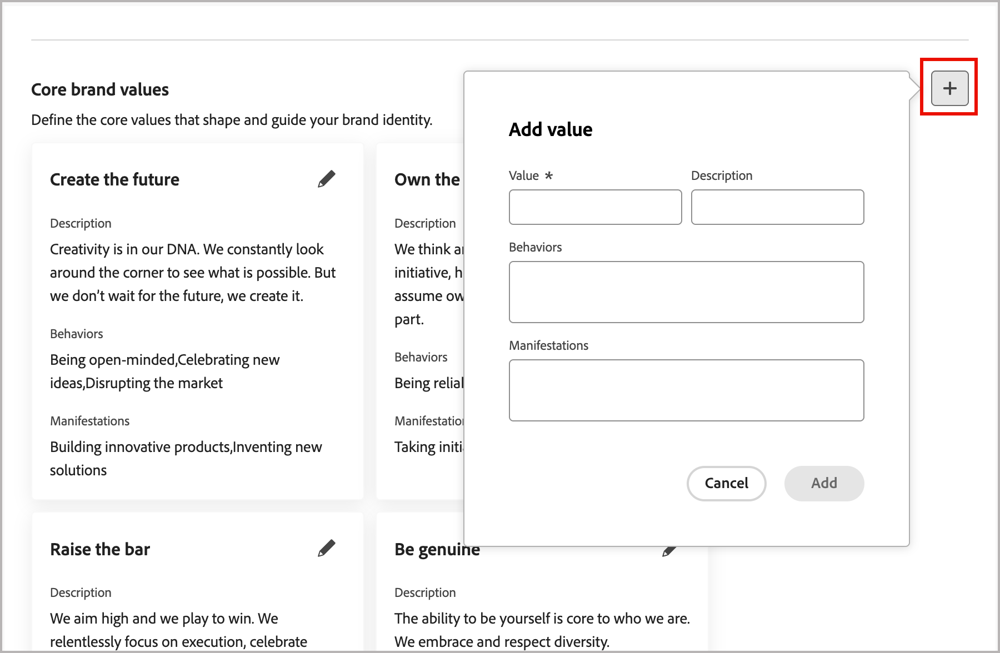

# 브랜드 생성 및 관리 {#brand-library}

브랜드를 정의하여 시각적 및 언어적 정체성을 설정하는 자세한 규칙 및 표준 세트를 제공합니다. 이 지침은 모든 마케팅 및 커뮤니케이션 플랫폼에서 일관된 브랜드 표현을 유지하기 위한 참조를 제공합니다. 조직은 잘 정의된 브랜드 지침을 활용함으로써 모든 콘텐츠 제작 노력이 전략적 목표와 전반적인 브랜드 정체성에 부합하도록 할 수 있습니다. 이러한 일관성은 브랜드 인지도와 신뢰를 향상시킬 뿐만 아니라 모든 접점에서 보다 통합적이고 영향력 있는 고객 경험에 기여합니다.

Journey Optimizer B2B edition에서 브랜드 정의 및 에셋을 수동으로 정의 및 구성하거나 자동 정보 및 시각적 에셋 추출을 위해 브랜드 지침 문서를 업로드할 수 있습니다.

>[!AVAILABILITY]
>
>이 기능은 현재 비공개 베타로 제공되며, 향후 릴리스에서 모든 고객에 대해 점진적 가용성이 계획되어 있습니다.
>
> 
>
>Adobe Journey Optimizer B2B edition에서 AI 기반 기능을 사용하려면 [사용자 동의](https://www.adobe.com/kr/legal/licenses-terms/adobe-dx-gen-ai-user-guidelines.html){target="_blank"}가 필요합니다. 자세한 내용은 Adobe 담당자에게 문의하십시오.
>
> 
>
>제품 관리자가 이러한 기능을 사용할 수 있는 방법에 대한 자세한 내용은 [브랜드 관련 권한](./brands-overview.md#brand-related-permissions)을 참조하세요.

## 브랜드 라이브러리에 액세스

Adobe Journey Optimizer B2B edition의 브랜드 키트에 액세스하려면 왼쪽 탐색으로 이동하여 **[!UICONTROL 콘텐츠 관리]** > **[!UICONTROL 브랜드]**&#x200B;를 클릭하십시오. 이 작업을 수행하면 생성된 브랜드가 카드로 표시되는 페이지가 열립니다.

{width="800" zoomable="yes"}

아직 만든 브랜드가 없는 경우 [첫 번째 브랜드를 만들기](#create-and-define-a-brand) 단추가 있는 단일 그래픽이 표시됩니다.

### 브랜드 관리 작업

각 카드에 대해 _추가 메뉴_( ) 아이콘을 클릭하고 브랜드에 대한 동작을 선택할 수 있습니다.

* **[!UICONTROL 브랜드 보기]** - 브랜드 페이지를 열고 정의를 표시합니다.
* **[!UICONTROL 기본 브랜드로 표시]**(Live 전용) - 콘텐츠 정렬 및 생성을 위해 [브랜드를 기본값으로 표시](#default-brand)합니다.
* **[!UICONTROL 편집]** - 브랜드 페이지를 열고 브랜드 지침, 제외 및 예를 편집합니다.
* **[!UICONTROL 복제]** - 새 초안 브랜드로 복사본을 만듭니다.
* **[!UICONTROL 게시]**(초안만 해당) - [브랜드를 게시하여 콘텐츠 정렬 및 생성에 사용할 수 있도록 합니다](#publish-the-brand).
* **[!UICONTROL 게시 취소]**(라이브 전용) - 콘텐츠 정렬 및 생성에 사용되지 않도록 브랜드를 게시 취소합니다.
* **[!UICONTROL 삭제]** - 브랜드 라이브러리에서 브랜드를 제거합니다.

{width="440"}

### 기본 브랜드

콘텐츠를 생성하고 콘텐츠를 만드는 동안 정렬 점수를 계산할 때 자동으로 적용할 기본 브랜드를 지정할 수 있습니다. 게시된(_Live_) 브랜드만 기본값이 될 수 있습니다.

브랜드 라이브러리에서는 기본 브랜드 카드가 플래그와 함께 표시됩니다.

{width="200"}

게시된 모든(_Live_) 브랜드를 기본 브랜드로 설정할 수 있습니다. 브랜드 카드에서 _추가 메뉴_( ) 아이콘을 클릭하고 **[!UICONTROL 기본 브랜드로 표시]**&#x200B;를 선택합니다.

{width="350"}

## 브랜드 만들기 및 정의 {#create-brand}

>[!CONTEXTUALHELP]
>id="ajo-b2b_brands_create"
>title="브랜드 만들기"
>abstract="브랜드 이름을 입력하고 브랜드 지침 파일을 업로드합니다. 이 도구는 주요 세부 정보를 자동으로 추출하므로 브랜드 정체성을 보다 쉽게 유지할 수 있습니다."

브랜드 지침을 만들고 정의하려면 세부 정보를 입력하거나 자동 추출에 사용할 브랜드 지침 문서를 업로드할 수 있습니다.

### 브랜드 추가

1. _[!UICONTROL 브랜드]_ 페이지의 오른쪽 상단에서 **[!UICONTROL 브랜드 만들기]**&#x200B;를 클릭합니다.

1. 브랜드의 **[!UICONTROL 이름]**&#x200B;을(를) 입력하십시오.

1. 파일을 드래그 앤 드롭하거나 선택하여 브랜드 지침을 업로드하고 자동으로 관련 브랜드 정보를 추출합니다.

   {width="500"}

   >[!NOTE]
   >
   >PDF 형식으로 저장된 문서가 없는 경우 수동으로 지침을 추가하고 브랜드 생성 후 개별 시각적 에셋을 업로드할 수 있습니다.

1. **[!UICONTROL 브랜드 만들기]**&#x200B;를 클릭합니다.

   브랜드를 생성할 하나 이상의 파일을 포함하는 경우 정보 추출 프로세스가 시작됩니다. 완료하는 데 몇 분 정도 걸릴 수 있습니다.

   추출 프로세스가 완료되면 콘텐츠 및 시각적 작성 표준이 자동으로 채워집니다.

   {width="700" zoomable="yes"}

### 브랜드 가이드라인 세분화 및 업데이트

1. 필요에 따라 더 자세한 정보를 조정하고 정의하려면 다양한 탭을 탐색하십시오.

   * [!UICONTROL 개요]

   * [[!UICONTROL 브랜드 정보]](#about-the-brand)

   * [[!UICONTROL 작성 스타일]](#writing-style)

   * [[!UICONTROL 시각적 콘텐츠]](#visual-content)

   브랜드를 만들 때 하나 이상의 문서를 포함한 경우 정보 추출 프로세스에서 탭과 섹션에 대한 정의를 만들었습니다. 완결성은 모든 문서에 포함된 범위와 세부 사항에 따라 다릅니다. 결과를 검토하면서 정보를 변경하거나 제거할 수 있습니다.

   각 탭이나 범주에 대한 _추가 메뉴_( )에서 문서를 추가하여 관련 브랜드 정보를 자동으로 추출할 수 있습니다. 기존 콘텐츠를 지울 수도 있습니다.

   {width="500" zoomable="yes"}

   하위 섹션에서 추출된 정보에 대한 원본을 검토하려면 **[!UICONTROL 원본 보기]** 링크를 클릭하세요.

   {width="700" zoomable="yes"}

1. 각 세부 정보 탭에서 카테고리를 검토하고 정의를 추가, 제거 및 변경하여 브랜드를 개선합니다.

   **[!UICONTROL 다음 작업]**&#x200B;이라는 하위 섹션에서 범주에 대한 지침을 간략하게 설명합니다. 이 영역을 사용하여 지침 설명 및 지침의 예를 추가합니다.

   {width="500" zoomable="yes"}

   **[!UICONTROL 사용하지 않음]** 레이블이 지정된 하위 섹션에서 제외에 대한 개요를 제공합니다. 이 영역을 사용하여 제외 설명 및 제외의 예를 추가합니다.

   {width="500" zoomable="yes"}

   * **지침 또는 제외 추가**.

     지침을 추가하려는 섹션에서 오른쪽의 _추가_( ) 아이콘을 클릭합니다. 팝업 대화 상자에서 지침을 입력하고 확인란을 선택하여 지침이 적용되는 채널과 요소를 지정합니다. **[!UICONTROL 추가]**&#x200B;를 클릭합니다.

     {width="600" zoomable="yes"}

   * **지침 또는 제외 변경**.

     안내선을 제거할 섹션에서 안내선 위젯을 클릭합니다. 팝업 대화 상자에서 필요에 따라 지침 및 선택한 확인란의 내용을 변경합니다. **[!UICONTROL 업데이트]**&#x200B;를 클릭합니다.

     {width="600" zoomable="yes"}

   * **지침 또는 제외 제거**.

     안내선을 제거할 섹션에서 안내선 위젯을 클릭합니다. 팝업 대화 상자에서 맨 위에 있는 _삭제_( ) 아이콘을 클릭합니다.

   * **지침 및 제외 예제를 추가하거나 수정합니다**.

     표시된 예제 타일에서 _편집_(  )을 클릭하여 예제를 변경하거나 _삭제_(  ) 아이콘을 클릭하여 제거합니다.

1. 모든 항목을 정의했으면 **[!UICONTROL 저장]**&#x200B;을 클릭합니다.

   초안 브랜드를 게시할 준비가 될 때까지 계속 변경할 수 있습니다.

### 브랜드 게시

브랜드에 전체 정의 집합이 포함되어 있고 요구 사항을 충족하면 **[!UICONTROL 게시]**&#x200B;를 클릭하여 브랜드 지침을 콘텐츠 정렬 및 생성에 사용할 수 있도록 합니다.

게시된 브랜드는 AI **[!UICONTROL 브랜드 정렬]** 및 콘텐츠 생성 도구의 [브랜드](./brand-alignment.md) 옵션에서 액세스할 수 있습니다. <!-- [Learn more about content generation](gs-generative.md) -->

{width="300"}

## 브랜드 정의

브랜드 정의는 세 가지 카테고리로 구성되어 탭으로 표시됩니다. 각 탭을 선택하여 브랜드 지침을 완료하고 업데이트합니다.

### 브랜드 정보 {#about-brand}

**[!UICONTROL 브랜드 정보]** 탭을 사용하여 브랜드의 핵심 정체성을 설정합니다. 이 정보는 목적, 성격, 태그 및 기타 높은 수준의 속성에 대해 간략하게 설명합니다.

1. **[!UICONTROL 주요 세부 정보]** 범주에 브랜드의 기본 정보를 추가하십시오.

   * **[!UICONTROL 브랜드 키트 이름]** - 브랜드 이름을 업데이트합니다.

   * **[!UICONTROL 사용할 시기]** - 이 브랜드를 적용해야 하는 시나리오 또는 컨텍스트를 지정합니다.

   * **[!UICONTROL 브랜드 이름]** - 공식 브랜드 이름을 입력합니다.

   * **[!UICONTROL 이 브랜드에 대한 설명]** - 이 브랜드가 나타내는 것에 대한 개요를 제공합니다.

   * **[!UICONTROL 태그 라인(기본값)]** - 브랜드와 연결된 기본 태그 라인을 추가합니다.

   {width="600" zoomable="yes"}

1. **[!UICONTROL 지침 원칙]** 범주에서 브랜드의 핵심 방향과 철학을 명확히 합니다.

   * **[!UICONTROL 임무]** - 브랜드 목적을 자세히 설명합니다.

   * **[!UICONTROL 비전]** - 장기적인 목표 또는 원하는 미래 상태를 설명합니다.

   * **[!UICONTROL 시장 포지셔닝]** - 브랜드가 시장에서 어떻게 포지셔닝되고 있는지 설명합니다.

   {width="600" zoomable="yes"}

   **[!UICONTROL 핵심 브랜드 값]** 범주에서 정의된 브랜드 값을 검토하고 필요에 따라 조정하십시오.

   * 새 핵심 값을 정의하려면 오른쪽의 _추가_( ) 아이콘을 클릭하고 세부 정보를 완료하십시오.

     {width="500" zoomable="yes"}

      * **[!UICONTROL 값]** - 핵심 브랜드 값의 이름을 입력하십시오.

      * **[!UICONTROL 설명]** - 이 값이 브랜드에 어떤 의미가 있는지 설명합니다.

      * **[!UICONTROL 동작]** - 실제로 이 값을 반영하는 동작 또는 태도에 대한 개요를 제공합니다.

      * **[!UICONTROL 매니페스트]** - 이 값이 실제 브랜딩에서 표현되는 방식에 대한 예제를 제공합니다.

   * 핵심 값을 변경하거나 삭제하려면 _편집_( ) 아이콘을 클릭하여 핵심 브랜드 값을 업데이트하거나 삭제합니다.

     {width="500" zoomable="yes"}

     세부 정보를 변경하고 **[!UICONTROL 업데이트]**&#x200B;를 클릭합니다. 또는 맨 위에 있는 _삭제_( ) 아이콘을 클릭하여 코어 값을 제거합니다.

1. **[!UICONTROL 브랜드 지침 문서]** 범주에서 브랜드 지침을 생성하는 데 사용되는 문서를 검토하십시오.

   기타 메뉴 아이콘을 클릭하고 업로드된 참조 문서를 사용하여 브랜드 지침을 업데이트하는 옵션을 선택합니다.

   * **[!UICONTROL 다시 추출 지침]** - 현재 문서를 사용하여 추출 작업을 실행하려면 이 작업을 선택하십시오.
   * **[!UICONTROL 추출에 대한 참조 추가]** - 다른 문서를 업로드하고 추출 작업을 실행하려면 이 작업을 선택하십시오.

   {width="600" zoomable="yes"}

[작성 스타일](#writing-style) 또는 [시각적 콘텐츠](#visual-content) 지침, 제외 및 예제를 개선하거나 [브랜드를 게시](#publish-the-brand)할 수 있습니다.

### 작성 스타일 {#writing-style}

>[!CONTEXTUALHELP]
>id="ajo_brand_writing_style"
>title="작성 스타일 정렬 점수"
>abstract="작성 스타일 섹션에서는 명확하고 일관된 콘텐츠를 보장하기 위해 언어, 형식 및 구조에 대한 표준을 정의합니다. 정렬 점수는 높은 순위에서 낮은 순위로 평가되고, 콘텐츠가 이러한 지침을 얼마나 잘 따르고 있는지를 보여 주며, 개선이 필요한 영역을 강조 표시합니다."

_[!UICONTROL 작성 스타일]_ 정의는 콘텐츠 작성에 대한 표준을 요약하며, 모든 자료의 명확성, 일관성 및 일관성을 유지하기 위해 언어, 서식 및 구조를 사용해야 하는 방법에 대해 자세히 설명합니다.

**[!UICONTROL 작성 스타일]** 탭을 선택하고 각 범주를 검토합니다.

{width="600" zoomable="yes"}

| 카테고리 | 하위 범주 | 지침 예 | 제외 예 |
|----------------------------|----------------|-----------------------|-----------------------|
| [!UICONTROL 브랜드 커뮤니케이션 스타일] | [!UICONTROL 브랜드 특성] | 친숙하고 접근하기 쉬워. | 패배주의자가 되지 마라. |
|                            | [!UICONTROL 쓰기 기계] | 문장을 짧고 굵게 유지하세요. | 과도한 전문 용어를 사용하지 마십시오. |
|                            | [!UICONTROL 상황별 톤] | 위기 커뮤니케이션에서 전문적 태도를 유지하십시오. | 지원 커뮤니케이션을 무시하지 마십시오. |
|                            | [!UICONTROL 단어 선택 지침] | _innovative_ 및 _smart_&#x200B;과(와) 같은 단어를 사용합니다. | _싸구려_ 또는 _해킹_&#x200B;과 같은 단어를 사용하지 마십시오. |
|                            | [!UICONTROL 언어 표준] | 미국 영어 규칙을 따르십시오. | 영국 철자와 미국 철자를 혼합하지 마십시오. |
| [!UICONTROL 브랜드 메시징 표준] | [!UICONTROL 브랜드 메시징 표준] | 혁신과 고객 중심의 메시지를 강조하십시오. | 제품 기능을 너무 많이 약속하지 마십시오. |
|                            | [!UICONTROL 태그 라인 사용] | 모든 디지털 마케팅 에셋의 로고 아래에 타깃을 놓습니다. | 타깃줄을 수정하거나 번역하지 마십시오. |
|                            | [!UICONTROL 핵심 메시지] | 생산성 향상과 같은 주요 이점 설명을 강조합니다. | 관련 없는 값 제안을 사용하지 마십시오. |
|                            | [!UICONTROL 명명 표준] | _ProScheduler_&#x200B;와 같이 간단한 수사적 이름을 사용하십시오. | 복잡한 용어나 특수 문자를 사용하지 마십시오. |
| [!UICONTROL 법적 준수 표준] | [!UICONTROL 상표 표준] | 항상 ™ 또는 ® 기호를 사용하십시오. | 필요한 경우 법적 기호를 생략하지 마십시오. |
|                            | [!UICONTROL 저작권 표준] | 마케팅 자료에 대한 저작권 고지를 포함합니다. | 권한 없이 서드파티 콘텐츠를 사용하지 마십시오. |
|                            | [!UICONTROL 면책조항 표준] | 디지털 에셋에 고지 사항을 눈에 띄게 표시합니다. | 보이지 않는 영역에 면책조항을 숨기지 마십시오. |

<!-- #### Preferred and avoided terms

Supplement your work choice guidelines by adding preferred and avoided terms. 

#### Primary tagline and variations

#### Brand names and variations

#### Approved and restricted statements
-->

### 시각적 콘텐츠 {#visual-content}

>[!CONTEXTUALHELP]
>id="ajo-b2b_brand_imagery"
>title="시각적 콘텐츠 정렬 점수"
>abstract="시각적 콘텐츠 정렬 점수는 콘텐츠가 구성된 브랜드 가이드라인과 얼마나 잘 일치하는지를 나타냅니다. 높은 점수부터 낮은 점수까지 매겨져 있어 한눈에 정렬 상태를 평가하는 데 도움이 됩니다. 다양한 카테고리를 탐색하여 개선이 필요한 영역을 파악하고 브랜드 이미지에 어긋나는 요소를 정확히 파악하십시오."

_[!UICONTROL 시각적 콘텐츠]_ 정의는 이미지 및 디자인에 대한 표준을 요약하고, 통일되고 일관된 브랜드 디자인을 유지하는 데 필요한 사양을 자세히 설명합니다.

**[!UICONTROL 시각적 콘텐츠]** 탭을 선택하고 각 범주를 검토합니다.

{width="600" zoomable="yes"}

| 카테고리 | 지침 예 | 제외 예 |
|------------------------|---------------------|---------------------|
| [!UICONTROL 사진 표준] | 야외 촬영에는 자연 채광을 사용하십시오. | 지나치게 편집되거나 픽셀화된 이미지는 피하십시오. |
| [!UICONTROL 일러스트레이션 표준] | 깔끔하고 미니멀한 스타일을 사용하세요. | 지나치게 복잡하지 않도록 합니다. |
| [!UICONTROL 아이콘 표준] | 일관된 24px 격자 시스템을 사용합니다. | 아이콘 차원을 혼합하지 않거나, 일관성이 없는 획 가중치를 사용하거나, 격자 규칙을 벗어나지 않습니다. |
| [!UICONTROL 사용 지침] | 전문 환경에서 제품을 사용하는 실제 고객을 반영하는 라이프스타일 이미지를 선택하십시오. | 브랜드 톤과 모순되거나 문맥에서 벗어난 이미지를 사용하지 마십시오. |

<!-- #### Styles

To define the overall style for the category, click **[!UICONTROL Add style]**. In the popup dialog, enter the style type and description. 

{width="500" zoomable="yes"}

#### Specifications

-->

#### 이미지 예

올바른 또는 잘못된 사용을 표시하는 이미지를 추가하려면 **[!UICONTROL 지침 추가]** 또는 _[!UICONTROL 제외 추가]_ 팝업 대화 상자에서 _[!UICONTROL 예]_&#x200B;를 선택하십시오. **[!UICONTROL 이미지 선택]**&#x200B;을 클릭하여 시스템에서 이미지 파일을 선택합니다. 이미지를 업로드하고 영역의 축소판을 표시하려면 **[!UICONTROL 추가]**&#x200B;를 클릭하십시오.

{width="500" zoomable="yes"}

## 게시된 브랜드 편집

게시된 (라이브) 브랜드는 수정할 수 없지만, 편집할 초안 사본을 만들 수 있습니다. 편집 내용이 포함된 초안을 게시하면 해당 버전이 라이브 버전을 대체합니다.

1. 브랜드 페이지를 열고 오른쪽 상단에서 **[!UICONTROL 브랜드 편집]**&#x200B;을 클릭합니다.

1. 확인 대화 상자에서 **[!UICONTROL 브랜드 편집]**&#x200B;을 클릭합니다.

   이 작업은 브랜드의 초안 사본을 만듭니다.

1. 필요에 따라 브랜드 정보를 업데이트하려면 여러 탭을 탐색하십시오.

   * 개요

   * [브랜드 정보](#about-the-brand)

   * [작성 스타일](#writing-style)

   * [시각적 콘텐츠](#visual-content)

1. 초안 업데이트 작업을 하면서 **[!UICONTROL 저장]**&#x200B;을 클릭한 다음 **[!UICONTROL Live]** 버전을 바꿀 준비가 되면 _게시_&#x200B;을 클릭합니다.
