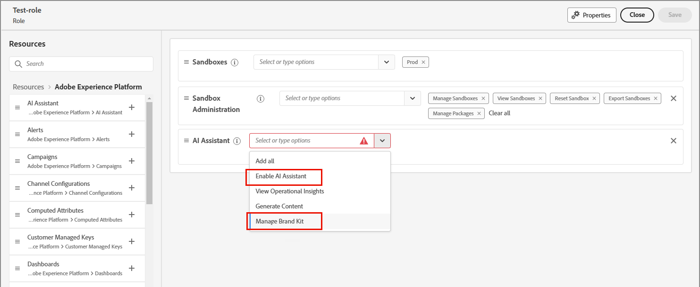

# 콘텐츠 생성 및 일관성을 위해 브랜드 사용 {#brands}

>[!CONTEXTUALHELP]
>id="ajo-b2b_brand_overview"
>title="브랜드 시작하기"
>abstract="고유한 시각적 및 언어적 정체성을 정의하고, 브랜드 스타일과 표현에 맞는 콘텐츠를 손쉽게 생성할 수 있도록 자체 브랜드를 만들고 맞춤화합니다."

>[!CONTEXTUALHELP]
>id="ajo-b2b_brand_ai_menu"
>title="브랜드 선택"
>abstract="브랜드를 선택하여 모든 AI 생성 콘텐츠가 브랜드의 사양과 지침에 맞게 조정되도록 합니다."

브랜드는 _브랜드 정체성_&#x200B;을(를) 정의하는 데 도움이 되며 브랜드 정체성, 가치 및 메시지를 정확하게 나타내는 일관되고 효과적인 콘텐츠 생성을 보장하는 데 중요한 역할을 합니다. 잘 정의된 브랜드 스타일을 준수함으로써 조직은 채널과 터치포인트 전반에 걸쳐 통합적이고 인식 가능한 브랜드 존재감을 유지하고 타겟 대상자 간의 브랜드 인식, 신뢰 및 충성도를 강화할 수 있습니다.

+++브랜드 사용의 이점

조직은 콘텐츠를 만들고 평가할 때 브랜드를 사용하여 다음과 같은 중요한 가치를 실현할 수 있습니다.

* **일관된 브랜드 정체성** - 브랜드 지침은 시각적 및 언어적 정체성에 대한 기본 블루프린트 역할을 합니다. 로고, 색상 팔레트, 타이포그래피, 이미지 스타일 및 목소리 톤과 같이 브랜드를 인식할 수 있도록 하는 핵심 요소를 정의합니다. 콘텐츠 작성자는 이 지침을 따라 웹 카피부터 소셜 미디어 게시물, 이메일 캠페인에 이르기까지 모든 마케팅 자료가 고유한 브랜드 개성과 시각적 정체성을 일관되게 반영하도록 할 수 있습니다. 이러한 일관성은 브랜드 인지도를 강화하는 데 도움이 되며 대상 시장 내에서 신뢰를 구축합니다.

* **정렬된 메시징 및 위치 지정** - 브랜드 지침에는 일반적으로 브랜드 가치 제안, 주요 메시징 기둥 및 위치 지정 문을 요약한 메시징 지침이 포함됩니다. 콘텐츠 작성자는 이러한 지침을 준수하여 콘텐츠의 메시지가 전체 브랜드 포지셔닝 및 가치 제안에 부합하는지 확인할 수 있습니다. 이러한 메시징의 일관성은 고유한 판매 포인트와 차별화 요소를 강화하는 데 도움이 되므로 고객이 브랜드 오퍼링을 더 쉽게 이해하고 연결할 수 있습니다.

* **정품 브랜드 음성 및 톤** - 브랜드 지침에는 선호하는 음성 톤, 커뮤니케이션 스타일 및 언어 사용에 대한 자세한 지침이 포함되어 있는 경우가 많습니다. 이러한 지침은 친숙하고 쉽게 접근할 수 있거나, 전문적이고 권위적이거나, 장난스럽고 재치있는 콘텐츠 작성자가 브랜드 인성을 포착할 수 있도록 도와줍니다. 모든 콘텐츠에서 일관된 브랜드 음성을 유지하는 것은 고객을 위한 보다 진실하고 매력적인 브랜드 경험을 만드는 데 도움이 됩니다.

* **시각적 결합 및 브랜드 인식** - 브랜드 지침은 로고, 색상 팔레트, 타이포그래피, 이미지 스타일 및 레이아웃 템플릿과 같은 시각적 요소에 대한 명확한 규칙과 사양을 제공합니다. 이 지침을 준수하면 모든 시각적 콘텐츠가 응집력이 있고 인식할 수 있는 브랜드 미학을 유지합니다. 이러한 시각적 일관성은 콘텐츠를 쉽게 식별하고 브랜드와 연결할 수 있으므로 브랜드 인식을 강화하고 고객과 신뢰를 구축하는 데 도움이 됩니다.

* **브랜드 지분 및 신뢰도 유지** - 브랜드 지침을 일관되게 준수하면 브랜드의 지분 및 평판을 유지 및 보호하는 데 도움이 됩니다. 모든 콘텐츠와 마케팅 자료가 브랜드 정체성, 가치, 메시징을 정확히 반영할 때 브랜드 신뢰도를 강화하고 시장에서의 입지를 강화한다. 이러한 공정성과 평판은 고객 충성도 및 옹호 증가로 이어져 궁극적으로 브랜드의 장기적인 성공에 기여할 수 있다.

+++

>[!AVAILABILITY]
>
>이 기능은 현재 비공개 베타로 제공되며, 향후 릴리스에서 모든 고객에 대해 점진적 가용성이 계획되어 있습니다.
>
>Adobe Journey Optimizer B2B edition에서 AI 기반 기능을 사용하려면 [사용자 동의](https://www.adobe.com/kr/legal/licenses-terms/adobe-dx-gen-ai-user-guidelines.html){target="_blank"}가 필요합니다. 자세한 내용은 Adobe 담당자에게 문의하십시오.

정의된 브랜드는 크리에이티브 팀이 시각적 또는 기록된 콘텐츠를 만들 때 사용할 _진실의 원본_&#x200B;을 제공합니다. 이러한 지침이 컴파일되고 브랜드 자산이 공유되면 모든 팀 구성원 또는 공동 작업자가 제품에 대한 브랜드 내 콘텐츠를 만들 수 있습니다. Journey Optimizer B2B edition에서 브랜드 내 컨텐츠 생성을 활성화하려면 다음 작업을 완료하십시오.

1. 브랜드 정의를 준비합니다.

   * 높은 수준의 브랜드 특성
   * 작성 스타일
   * 시각적 요소

1. 이 정보를 하나 이상의 PDF 파일에 취합합니다.

1. PDF 파일을 사용하여 Journey Optimizer B2B edition에서 [브랜드를 만들기](./brands-manage-create.md#create-and-define-a-brand)하십시오.

1. 사용할 준비가 되면 [브랜드를 게시](./brands-manage-create.md#publish-the-brand)합니다.

1. [전자 메일 콘텐츠 정렬](./brand-alignment.md)에 브랜드를 사용하십시오.
<!-- 
1. Use the brand to generate content. -->

>[!BEGINSHADEBOX]

## 브랜드 관련 권한

제품 관리자는 Adobe Experience Cloud의 **[!UICONTROL 권한]** 앱을 통해 **[!UICONTROL 브랜드 키트 관리]** 또는 _AI 도우미 사용_ 리소스 권한을 할당하여 브랜드 관리 및 브랜드 정렬 기능에 대한 액세스를 활성화할 수 있습니다.

1. 권한 앱에서 **[!UICONTROL 역할]** 탭으로 이동하여 원하는 [역할](https://experienceleague.adobe.com/ko/docs/experience-platform/access-control/abac/permissions-ui/roles){target="_blank"}을 선택합니다.

1. 권한을 수정하려면 **[!UICONTROL 편집]**&#x200B;을 클릭하십시오.

1. **[!UICONTROL AI Assistant]** 리소스를 추가한 다음 **[!UICONTROL 브랜드 키트 관리]** 또는 **[!UICONTROL Ai Assistant 사용]**&#x200B;을 선택합니다.

   >[!NOTE]
   >
   >**[!UICONTROL Ai 도우미 사용]** 권한은 **[!UICONTROL 브랜드]** 라이브러리에 대한 읽기 전용 액세스를 제공합니다.

   {width="700" zoomable="yes"}

1. 변경 내용을 적용하려면 **[!UICONTROL 저장]**&#x200B;을 클릭하세요.

   권한은 이미 역할에 할당된 모든 사용자에 대해 자동으로 업데이트됩니다.

1. 이 역할을 새 사용자에게 할당하려면 **[!UICONTROL 역할]** 대시보드에서 _[!UICONTROL 사용자]_ 탭을 선택하고 **[!UICONTROL 사용자 추가]**&#x200B;를 클릭하십시오.

   * 사용자 이름과 이메일 주소를 입력하거나 목록에서 기존 사용자를 선택합니다.

     사용자를 아직 만들지 않은 경우 [Experience Platform 설명서](https://experienceleague.adobe.com/ko/docs/experience-platform/access-control/abac/permissions-ui/users){target="_blank"}를 참조하세요.

   * 변경 내용을 적용하려면 **[!UICONTROL 저장]**&#x200B;을 클릭하세요.

>[!ENDSHADEBOX]
