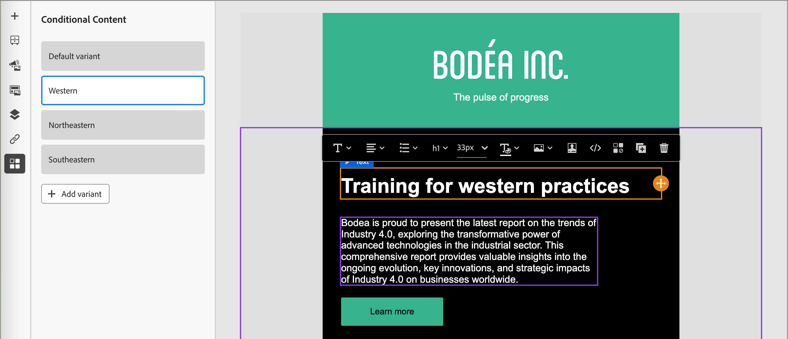
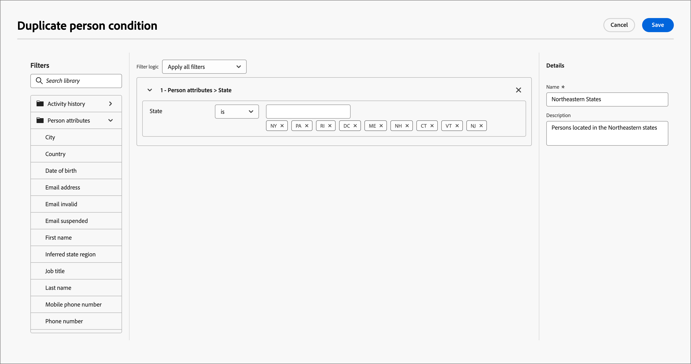

# 조건부 콘텐츠

조건부 콘텐츠를 사용하면 조건부 규칙에 따라 이메일 및 조각 콘텐츠를 조정할 수 있습니다. 이러한 규칙은 프로필 속성 또는 컨텍스트 이벤트를 사용하여 정의됩니다. 규칙 빌더에서 조건부 규칙을 만들고, 이를 저장하여 계정 여정 전반에서 재사용할 수 있습니다.

조각 및 전자 메일 메시지에 조건부 콘텐츠를 추가하기 위해 Adobe Journey Optimizer에서는 _조건_ 라이브러리에 저장된 조건부 규칙을 적용할 수 있습니다. [계정 여정에 대한 전자 메일 콘텐츠](./email-authoring.md) 또는 [시각적 조각](./fragment-authoring.md)을 작성할 때 시각적 디자인 공간 내에 조건부 규칙을 적용합니다.

## 조건부 콘텐츠 추가 {#email-fragment-content}

>[!CONTEXTUALHELP]
>id="ajo-b2b_conditional_content"
>title="조건부 콘텐츠"
>abstract="조건부 규칙을 사용하여 여러 콘텐츠 구성 요소 변형을 만듭니다. 메시지를 전송할 때 다음 조건 중 어느 것도 충족되지 않으면 기본 변형의 콘텐츠가 표시됩니다."

>[!CONTEXTUALHELP]
>id="ajo-b2b_conditional_rule_select"
>title="조건부 콘텐츠"
>abstract="라이브러리에 저장된 조건부 규칙을 사용하거나 새로 만듭니다."

시각적 디자인 공간에서 조각 또는 이메일을 작성할 때 조건부 규칙을 사용하여 콘텐츠 구성 요소에 대한 여러 변형을 정의합니다.

1. 콘텐츠 구성 요소를 선택하고 구성 요소 도구 모음에서 **[!UICONTROL 조건부 콘텐츠 활성화]** 아이콘을 클릭합니다.

   구성 요소는 조건부 구성 요소로 활성화되었음을 나타내기 위해 주황색으로 표시됩니다. **[!UICONTROL 조건부 콘텐츠]** 창은 왼쪽에 _기본 변형_ 및 _변형 - 1_&#x200B;과 함께 표시됩니다.

   {width="700" zoomable="yes"}

   선택하고 활성화한 원래 콘텐츠는 기본값이며 정의하는 변형에 대해 충족되는 조건부 규칙이 없을 때 적용됩니다.

   이 창에서는 조건부 규칙을 사용하여 선택한 콘텐츠 구성 요소에 대해 여러 변형을 정의할 수 있습니다.

1. 첫 번째 변형(_변형 - 1_) 위로 마우스를 가져간 후 _조건 선택_ 아이콘()을 클릭합니다.

   {width="700" zoomable="yes"}

   _[!UICONTROL 조건 선택]_ 대화 상자가 열리고 조건 라이브러리가 표시됩니다.

   원하는 조건에 대한 세부 정보를 보려면 _추가 메뉴_ 아이콘(**...**)을 클릭하고 **[!UICONTROL 정보 보기]**&#x200B;를 선택하십시오.

   {width="600" zoomable="yes"}

   필요한 조건이 없으면 [새로 만들기](#create-condition)를 클릭하여 **[!UICONTROL 조건부 규칙을 만듭니다]**.

1. 조건부 규칙을 선택하고 **[!UICONTROL 선택]**&#x200B;을 클릭하여 변형과 연결합니다.

   변형에 대한 _추가 메뉴_ 아이콘(**...**)을 클릭하고 **[!UICONTROL 조건 보기]**&#x200B;를 선택하여 연결된 조건을 검토할 수 있습니다.

   {width="600" zoomable="yes"}

   팝업을 닫으려면 오른쪽 상단의 X 를 클릭합니다.

   {width="500"}

1. 가독성을 높이려면 변형에 대한 _추가 메뉴_ 아이콘(**...**)을 클릭하고 **[!UICONTROL 이름 바꾸기]**&#x200B;를 선택하여 변형의 이름을 바꾸십시오.

   변형 및 해당 의도를 식별하는 데 도움이 되는 변형의 의미 있는 이름을 입력합니다.

   {width="600" zoomable="yes"}

1. 왼쪽 창에서 변형을 선택한 상태에서 조건이 true일 때 구성 요소가 이메일 메시지에 표시되는 방식을 변경합니다.

   이 예에서 텍스트 구성 요소에 대한 변형은 수신자 지역에 따라 다른 설명을 사용합니다.

   {width="600" zoomable="yes"}

1. 필요한 경우 **[!UICONTROL 변형 추가]**&#x200B;를 클릭하여 다른 변형을 정의합니다.

   2~5단계를 반복하여 조건을 선택하고, 변형의 이름을 변경하고, 변형에 대한 구성 요소를 변경합니다.

   콘텐츠 구성 요소에 필요한 만큼 변형을 추가할 수 있습니다. 언제든지 왼쪽 창에서 선택한 변형을 변경하여 조건에 대한 콘텐츠 구성 요소가 표시되는 방식을 확인합니다.

   >[!IMPORTANT]
   >
   >조건부 콘텐츠는 변형이 나열된 순서로 연결된 규칙에 대해 평가됩니다. true로 평가되는 조건이 있는 첫 번째 변형이 구성 요소에 사용됩니다.
   >
   >이메일을 보낼 때 정의된 변형 조건 중 어느 것도 true로 평가되지 않으면 콘텐츠 구성 요소가 **[!UICONTROL 기본 변형]**&#x200B;에 따라 표시됩니다.

1. 변형을 삭제하려면 변형에 대한 _추가 메뉴_ 아이콘(**...**)을 클릭하고 **[!UICONTROL 삭제]**&#x200B;를 선택합니다.

   확인 대화 상자에서 **[!UICONTROL 삭제]**&#x200B;를 클릭합니다.

## 조건부 규칙

조건부 규칙은 true 또는 false로 평가할 수 있는 조건부 표현식 세트입니다. 이러한 규칙을 사용하여 프로필 속성 또는 컨텍스트 이벤트와 같은 다양한 필터를 기반으로 이메일 메시지에 표시할 콘텐츠 변형을 결정할 수 있습니다.
규칙은 조건 라이브러리에 저장되며, 여기서 조직의 이메일 및 조각 콘텐츠를 재사용할 수 있습니다.
<!--
>[!NOTE]
>
>You need the [Manage Library Items](../administration/ootb-product-profiles.md) permission to save or delete conditional rules. Saved conditions are available for use by all users within an organization.-->

### 조건 필터 {#condition-filters}

| 조건 유형 | 필터 | 설명 |
| -------------- | ------- | ----------- |
| **계정** | 계정 속성 | 다음을 포함한 계정 프로필의 속성: <li>연간 수익</li><li>구/군/시</li><li>국가</li><li>직원 규모</li><li>업종</li><li>이름</li><li>SIC 코드</li><li>주/도</li> |
| | [!UICONTROL 특수 필터] > [!UICONTROL 구매 그룹 있음] | 계정에 구매 그룹의 구성원이 있거나 없습니다. 다음 기준 중 하나 이상에 대해 필터를 평가할 수도 있습니다. <li>솔루션 관심 분야</li><li>구매 그룹 상태</li><li>완성도 점수</li><li>참여 점수</li> |
| **사용자** | [!UICONTROL 활동 기록] > [!UICONTROL 전자 메일] | 여정과 연계된 이메일 활동: <li>[!UICONTROL 전자 메일에서 링크를 클릭함]</li><li>이메일 열림</li><li>게재됨 이메일</li><li>이(가) 이메일을 보냈습니다.</li> 이러한 조건은 여정 앞부분에서 선택한 이메일 메시지를 사용하여 평가됩니다. |
|  | [!UICONTROL 사용자 특성] | 다음을 포함한 개인 프로필의 속성: <li>구/군/시</li><li>국가</li><li>생년월일</li><li>이메일 주소</li><li>잘못된 이메일</li><li>이메일 일시 중단됨</li><li>이름</li><li>상태 영역 유추</li><li>직위</li><li>성</li><li>휴대폰 번호</li><li>전화번호</li><li>우편번호</li><li>주/도</li><li>구독 취소</li><li>구독 취소 이유</li> |
| | [!UICONTROL 특수 필터] > [!UICONTROL 구매 그룹 구성원] | 개인이 다음 기준 중 하나 이상에 대해 평가된 구매 그룹 구성원이거나 구매 그룹 구성원이 아닙니다. <li>솔루션 관심 분야</li><li>구매 그룹 상태</li><li>완성도 점수</li><li>참여 점수</li><li>역할</li> |

### 조건부 규칙 만들기 {#create-condition}

>[!CONTEXTUALHELP]
>id="ajo-b2b_conditions_rule_editor"
>title="조건 만들기"
>abstract="속성과 상황별 이벤트를 결합하여 이메일 메시지에 표시할 콘텐츠 변형을 결정하는 규칙을 작성합니다."

구성 요소 변형에 대한 조건을 선택하는 경우 이메일 디자인 공간에서 조건부 규칙 빌더에 액세스할 수 있습니다.

1. _[!UICONTROL 조건 선택]_ 대화 상자에서 **[!UICONTROL 새로 만들기]**&#x200B;를 클릭하고 조건 유형을 선택합니다.

   * **[!UICONTROL 사용자 조건]** - 사용자 특성 및 컨텍스트 이벤트를 사용하여 조건부 규칙을 만들려면 이 유형을 선택하십시오.
   * **[!UICONTROL 계정 조건]** - 계정 특성을 사용하여 조건부 규칙을 만들려면 이 형식을 선택하십시오.

   {width="600" zoomable="yes"}

1. 필요에 따라 조건부 규칙을 만듭니다.

   규칙에 포함할 각 속성 또는 이벤트에 대해 항목을 규칙 캔버스로 드래그하여 놓습니다. 필터를 확장하고 표현식을 완료합니다.

   {width="600" zoomable="yes"}

   필터를 두 개 이상 포함하는 경우 **[!UICONTROL 필터 논리]**&#x200B;를 설정하십시오.

   * **[!UICONTROL 모든 필터 적용]** - 필터가 true인 경우 규칙이 true로 평가됩니다. **모두**.
   * **[!UICONTROL 모든 필터 적용]** - **모든** 필터가 true인 경우 규칙이 true로 평가됩니다.

1. 오른쪽에서 **[!UICONTROL 이름]** 및 **[!UICONTROL 설명]**(선택 사항)을 입력하십시오.

   다른 중복 조건을 만드는 대신 재사용할 수 있도록 조직의 다른 사용자가 도움을 받을 수 있도록 의미 있는 이름과 유용한 설명을 사용하십시오.

   {width="600" zoomable="yes"}

1. 조건부 규칙이 완료되면 **[!UICONTROL 저장]**&#x200B;을 클릭하세요.

   조건부 규칙은 라이브러리에 저장되며 현재 변형에 대해 선택할 수 있습니다. 또한 계정 여정 간의 다른 다이내믹 콘텐츠 변형에서 사용할 수 있도록 라이브러리에 포함되어 있습니다.

### 규칙 복제

라이브러리에 저장된 조건부 규칙은 수정할 수 없습니다. 그러나 기존 규칙을 복제한 다음 변경하여 새 규칙을 만들 수 있습니다.

1. 변형에 대한 _추가 메뉴_ 아이콘(**...**)을 클릭하고 **[!UICONTROL 복제]**&#x200B;를 선택합니다.

   규칙 복제본이 규칙 빌더에서 열립니다. 중복을 빌드할 규칙의 시작점으로 사용합니다.

   {width="600" zoomable="yes"}

1. 규칙 빌더에서 필요한 항목에 따라 조건을 변경, 추가 또는 삭제합니다.

1. 규칙의 목적 또는 항목과 일치하도록 이름 및 설명을 변경합니다.

1. 조건부 규칙이 완료되면 **[!UICONTROL 저장]**&#x200B;을 클릭하세요.
