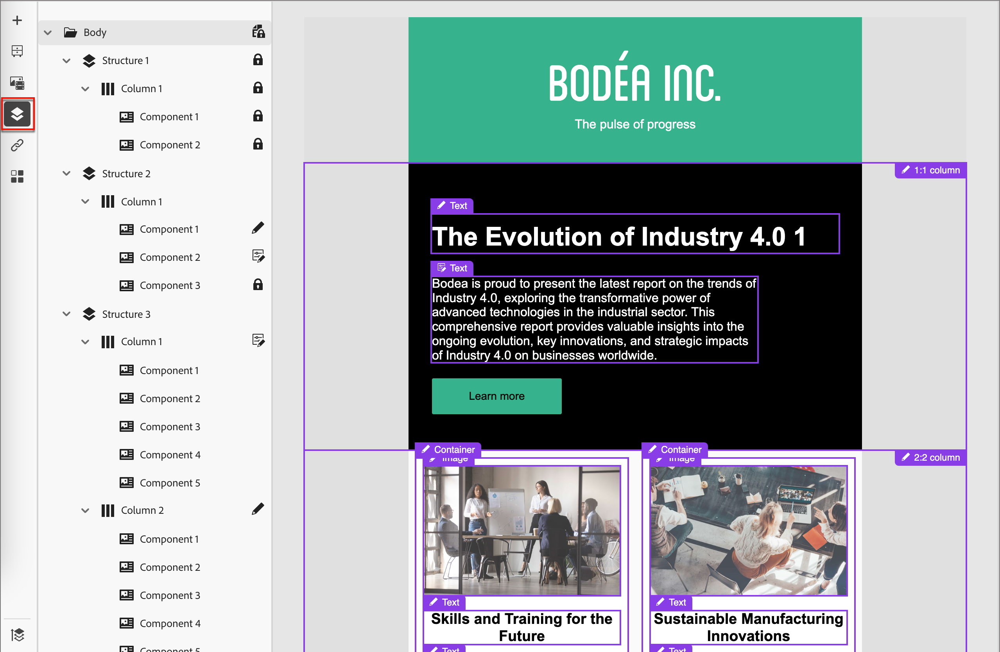

# 관리 템플릿에서 작성자

콘텐츠 디자이너는 전자 메일 템플릿을 만들 때 [거버넌스(_콘텐츠 잠금_)](./template-content-governance.md)을(를) 사용하도록 설정할 수 있습니다. 거버넌스 기능을 사용하면 계정 여정에서 사용할 때 변경할 수 없는 디자인 부분을 지정할 수 있습니다. 전자 메일을 작성하기 위해 [저장된 템플릿을 선택](./email-authoring.md#select-a-template)하면 전자 메일의 기반으로 사용할 수 있도록 시각적 디자인 공간에 템플릿이 로드됩니다.

템플릿에 거버넌스가 활성화되어 있으면 오른쪽의 속성 패널에 경고가 표시됩니다. 캔버스 상단의 **[!UICONTROL 편집 가능한 영역 강조 표시]**&#x200B;를 켜면 여정에서 사용할 수 있는 구성 요소와 콘텐츠 요소를 확인할 수 있습니다.

{width="800" zoomable="yes"}

_탐색 트리_&#x200B;를 사용하여 잠기거나 편집할 수 있는 요소를 확인할 수도 있습니다. 캔버스 왼쪽에 있는 _탐색 트리_ 아이콘()을 클릭하여 트리를 표시합니다.

{width="600" zoomable="yes"}

아이콘은 적용된 컨텐츠 잠금 설정을 나타냅니다.

| 아이콘 | 이름 | 설명 |
|------|------|-------------|
|  | 읽기 전용 | 구성 요소가 잠겨 있어 편집할 수 없습니다. 루트(_[!UICONTROL Body]_) 수준에서 적용하면 모든 하위 구성 요소가 잠겨서 편집할 수 없습니다. |
|  | 컨텐츠 잠금 | 콘텐츠 잠금은 구성 요소 수준에서 적용됩니다. |
|  | 편집 가능 | 구성 요소를 완전히 편집할 수 있습니다. 그러나 요소를 삭제하지 못할 수 있습니다. |
|  | 편집 가능 - 컨텐츠만 | 구성 요소와 스타일은 정적이지만 콘텐츠(예: 텍스트 또는 이미지)를 변경할 수 있습니다. |
