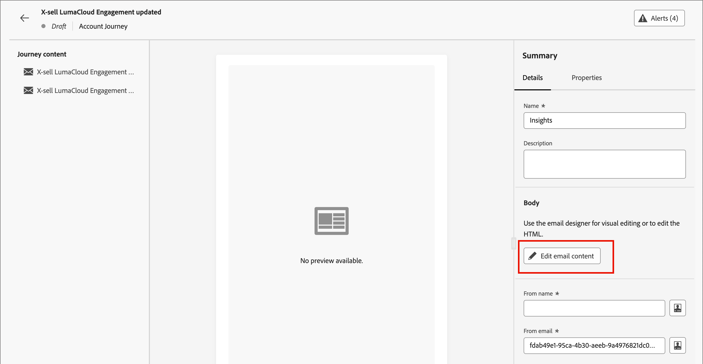

# 이메일 작성

Adobe Journey Optimizer B2B 에디션을 사용하여 고객에게 이메일 메시지를 전송합니다. [이메일 디자이너]에서 메시지를 만들고 개인화하고 미리 볼 수 있습니다.

## 계정 여정에 이메일 작업 추가

_[!UICONTROL 작업 수행]_ 여정을 추가하고 다음을 수행하면 계정 노드에서 전자 메일 게재를 설정할 수 있습니다.

1. _[!UICONTROL Action on]_ 대상에 대해 **[!UICONTROL 사람]**&#x200B;을 선택하세요.
1. _[!UICONTROL 사용자에 대한 작업]_&#x200B;에 대해 **[!UICONTROL 전자 메일 보내기]**&#x200B;를 선택하세요.
1. _[!UICONTROL 전자 메일 원본]_&#x200B;에 대해 **[!UICONTROL 새 전자 메일 만들기]**&#x200B;를 선택하세요.

   또는 _[!UICONTROL Adobe Marketo Engage에서 전자 메일 선택]_ 옵션을 선택하여 Marketo Engage에서 미리 작성된 전자 메일 중 하나를 사용하고 이를 계정 여정의 일부로 보낼 수도 있습니다.

   >[!NOTE]
   >
   >이메일을 처음 만드는 경우 이메일 채널이 Adobe Marketo Engage 내에서 구성되었는지 확인하십시오. 자세한 내용은 Marketo Engage 설명서에서 [전자 메일 배달 가능성 확인](https://experienceleague.adobe.com/en/docs/marketo/using/getting-started/initial-setup/setup-steps#ensure-email-deliverability)을 참조하세요.

   {width="700" zoomable="yes"}

1. _[!UICONTROL 작업 수행]_ 패널 아래쪽에서 **[!UICONTROL 전자 메일 만들기]**&#x200B;를 클릭합니다.

1. 대화 상자에서 전자 메일의 고유한 **[!UICONTROL 이름]**&#x200B;과(와) **[!UICONTROL 제목 줄]**&#x200B;을(를) 입력합니다.

   {width="400"}

1. **[!UICONTROL 만들기]**&#x200B;를 클릭합니다.

   전자 메일 콘텐츠 페이지의 _[!UICONTROL 전자 메일 속성]_ 섹션에서 _[!UICONTROL 전자 메일을 통해]_ 및 _[!UICONTROL 주소에 회신]_ 필드가 이미 구성되어 있습니다. _[!UICONTROL 보낸 사람 이름]_ 및 _[!UICONTROL 설명]_(선택 사항) 필드에 값을 입력할 수 있습니다.

## 이메일 콘텐츠 만들기

_[!UICONTROL 전자 메일]_ 미리 보기 패널 위쪽에 있는 **[!UICONTROL 전자 메일 콘텐츠 추가]**&#x200B;를 클릭합니다.

{width="700" zoomable="yes"} 클릭

이 작업은 이메일 Designer을 시작하며, 여기에서 다음 옵션 중 이메일을 디자인할 방법을 선택할 수 있습니다.

* 이메일 Designer 인터페이스를 사용하여 [이메일을 처음부터 디자인하기](#design-your-email-from-scratch).

* [파일 또는 .zip 폴더에서 기존 HTML 내용을 가져옵니다](#import-existing-html-content).

* 기본 제공 또는 사용자 지정 전자 메일 서식 파일 목록에서 [기존 서식 파일을 선택하십시오](#select-a-template).

표현식 편집기로 제목 줄을 구성하고 개인화하려면 _Personalization_ 아이콘을 클릭하고 Marketo Engage 토큰을 추가합니다.

이메일 콘텐츠를 만들고 개인화한 후에는 유효성 검사 또는 나중에 사용하기 위해 콘텐츠를 내보낼 수 있습니다. 콘텐츠를 HTML 및 자산을 포함하는 .zip 파일로 저장하려면 **[!UICONTROL HTML 내보내기]**&#x200B;를 클릭합니다.

>[!TIP]
>
>생성형 AI에서 제공하는 Adobe Journey Optimizer B2B 에디션의 AI Assistant를 사용하여 콘텐츠를 한 차원 높입니다. AI Assistant를 사용하면 전체 이메일, 타겟팅된 텍스트 콘텐츠를 생성하고, 대상자에게 반향을 일으키는 이미지에 대한 AI Assistant 권장 사항을 얻음으로써 게재의 영향을 최적화하는 데 도움이 될 수 있습니다. [자세히 알아보기](./ai-assistant-emails.md)

### 이메일 콘텐츠 처음부터 만들기 {#design-from-scratch}

>[!CONTEXTUALHELP]
>id="ajo-b2b_structure_components_landing_page"
>title="구조 구성 요소 추가"
>abstract="구조 구성 요소는 랜딩 페이지 레이아웃을 정의합니다. **구조** 구성 요소를 캔버스로 드래그 앤 드롭하여 랜딩 페이지의 콘텐츠 디자인을 시작할 수 있습니다."

>[!CONTEXTUALHELP]
>id="ajo-b2b_content_components_landing_page"
>title="콘텐츠 구성 요소 정보"
>abstract="콘텐츠 구성 요소는 랜딩 페이지 레이아웃 제작에 사용할 수 있는 빈 콘텐츠 플레이스홀더입니다."

시각적 콘텐츠 편집기를 사용하여 이메일 콘텐츠 구조를 정의합니다. 간단한 드래그 앤 드롭 작업으로 구조 구성 요소를 추가 및 이동하여 초 내에 재사용 가능한 이메일 콘텐츠의 형태를 디자인할 수 있습니다.

1. _[!UICONTROL 템플릿 디자인]_ 홈 페이지에서 **[!UICONTROL 처음부터 디자인]** 옵션을 선택합니다.

1. 전자 메일 메시지에 [구조 및 콘텐츠를 추가](#add-structure-and-content)합니다.
1. 전자 메일 메시지에 [이미지 자산 추가](#add-assets).
1. [전자 메일 콘텐츠 개인화](#personalize-content).
1. [링크 검토 및 업데이트](#preview-and-edit-linked-urls).

<!-- If needed, you can further personalize your email by clicking **[!UICONTROL Switch to code editor]** from the advanced menu. The code editor allows you to edit the email source code, such as adding tracking or custom HTML tags.

>[!CAUTION]
>
>You cannot revert back to the visual designer for this email after switching to the code editor. -->

콘텐츠가 완료되면 맨 위에 있는 **[!UICONTROL 콘텐츠 시뮬레이션]**&#x200B;을 클릭하여 렌더링을 확인합니다. 데스크탑 또는 모바일 보기를 선택할 수 있습니다.

내용이 만족스러우면 **[!UICONTROL 저장]**&#x200B;을 클릭하세요.

### 기존 HTML 콘텐츠 가져오기

{{$include /help/_includes/content-design-import.md}}

{width="500"}

>[!NOTE]
>
>`<table>` 태그를 HTML 파일의 첫 번째 레이어로 사용하면 맨 위 레이어 태그의 배경 및 너비 설정을 포함하여 스타일이 손실될 수 있습니다.

시각적 이메일 편집기 도구를 사용하여 필요에 따라 가져온 콘텐츠를 개인화할 수 있습니다.

### 템플릿 선택

{{$include /help/_includes/content-design-select-template.md}}

## 구조 및 콘텐츠 추가 {#structure-content}

>[!CONTEXTUALHELP]
>id="ajo-b2b_structure_components_email"
>title="구조 구성 요소 추가"
>abstract="구조 구성 요소는 이메일 레이아웃을 정의합니다. **구조** 구성 요소를 캔버스로 드래그 앤 드롭하여 이메일 콘텐츠 디자인을 시작할 수 있습니다."

>[!CONTEXTUALHELP]
>id="ajo-b2b_content_components_email"
>title="콘텐츠 구성 요소 정보"
>abstract="콘텐츠 구성 요소는 이메일 레이아웃 제작에 사용할 수 있는 빈 콘텐츠 플레이스홀더입니다."

{{$include /help/_includes/content-design-components.md}}

### 조각 추가

시각적 콘텐츠 편집기에서 _조각_ 아이콘이 왼쪽에 표시됩니다. 다음 예제에서는 템플릿 콘텐츠에 조각을 추가하는 단계에 대해 간략히 설명합니다.

1. 조각 목록을 열려면 _조각_ 아이콘을 클릭합니다.

   다음과 같은 작업을 수행할 수 있습니다.

   * 목록을 정렬합니다.
   * 목록을 검색 또는 필터링합니다.
   * 썸네일 보기와 목록 보기 간에 전환합니다.
   * 최근에 만들어진 조각을 반영하도록 목록을 새로 고칩니다.

   {width="700" zoomable="yes"}

1. 조각을 구조 구성 요소 자리 표시자로 끌어서 놓습니다.

   편집기는 이메일 구조의 섹션/요소 내에서 조각을 렌더링합니다.

조각의 콘텐츠는 구조 내에서 동적으로 업데이트되어 이메일에 콘텐츠가 표시되는 방식을 보여 줍니다.

>[!TIP]
>
>이메일 내의 전체 수평 레이아웃을 차지하도록 조각을 추가하려면 1:1 열 구조를 추가한 다음 조각을 끌어서 놓습니다.

전자 메일이 저장되면 요약에서 _[!UICONTROL 사용자]_ 탭을 선택하면 조각 세부 정보 페이지에 전자 메일이 표시됩니다. 이메일 템플릿에 추가된 조각은 템플릿 내에서 편집할 수 없습니다. 콘텐츠는 소스 조각에 의해 정의됩니다.

### 에셋 추가

{{$include /help/_includes/content-design-assets.md}}

### 레이어, 설정 및 스타일 탐색

{{$include /help/_includes/content-design-navigation.md}}

### 콘텐츠 개인화

{{$include /help/_includes/content-design-personalization.md}}

### 연결된 URL 추적 편집

{{$include /help/_includes/content-design-links.md}}

### 옵션 보기

시각적 이메일 편집기에서 사용할 수 있는 보기 및 콘텐츠 유효성 검사 옵션을 활용합니다.

* 사전 설정된 확대/축소 옵션에서 콘텐츠를 확대/축소합니다.

* 데스크탑, 모바일 또는 텍스트 전용/일반 텍스트에서 컨텐츠 보기를 전환합니다.
   * 여러 장치에서 콘텐트 미리 보기를 위해 _눈_ 아이콘을 클릭합니다.
   * 기본 제공 장치 중 하나를 선택하거나 사용자 지정 차원을 입력하여 콘텐츠를 미리 봅니다.

## 경고 확인

이메일 메시지 콘텐츠를 디자인할 때 주요 설정이 없을 때 인터페이스(페이지 오른쪽 상단)에 경고가 표시됩니다.

이 단추가 표시되지 않으면 발견된 문제가 없습니다.

두 가지 유형의 경고를 감지할 수 있습니다.

* 권장 사항 및 모범 사례를 참조하는 **_경고_**:

   * `The opt-out link is not present in the email body`: 이메일 본문에 구독 취소 링크를 추가하는 것이 좋습니다.

     >[!NOTE]
     >
     >마케팅 스타일 이메일 메시지에는 옵트아웃 링크가 포함되어야 합니다. 옵트아웃 링크는 트랜잭션 메시지에는 필요하지 않습니다.

   * `Text version of HTML is empty`: HTML 내용을 표시할 수 없을 때 사용되는 전자 메일 본문의 텍스트 버전을 정의하는 것을 잊지 마십시오.

   * `Empty link is present in email body`: 전자 메일의 모든 링크가 올바른지 확인하십시오.

   * `Email size has exceeded the limit of 100KB`: 최적의 배달을 위해 전자 메일의 크기가 100KB를 초과하지 않도록 하십시오.

* 여정/캠페인을 테스트하거나 활성화하지 못하는 **_오류_**(예:

   * `The subject line is missing`: 전자 메일 제목 줄은 필수입니다.

   * `The email version of the message is empty`: 이 오류는 전자 메일 콘텐츠가 구성되지 않은 경우에 표시됩니다.

## 이메일 확인 및 테스트 {#preview-test}

>[!CONTEXTUALHELP]
>id="ajo-b2b_email_preview_simulate"
>title="콘텐츠 렌더링 방식 확인"
>abstract="콘텐츠가 정의되면 미리 보고 사용 중인 채널에 대해 렌더링이 올바른지 확인할 수 있습니다."

메시지 콘텐츠가 정의된 경우 테스트 프로필을 사용하여 콘텐츠를 미리 보고, 증명을 보내고, 인기 있는 데스크탑, 모바일 및 웹 기반 클라이언트에서 렌더링을 제어할 수 있습니다. 개인화된 콘텐츠를 삽입한 경우 테스트 프로필 데이터를 사용하여 이 콘텐츠가 메시지에 표시되는 방식을 미리 볼 수 있습니다.

전자 메일 콘텐츠를 미리 보려면 **[!UICONTROL 콘텐츠 시뮬레이션]**&#x200B;을 클릭한 다음 테스트 프로필을 추가하여 테스트 프로필 데이터를 사용하여 메시지를 확인하세요.

{width="700" zoomable="yes"}
