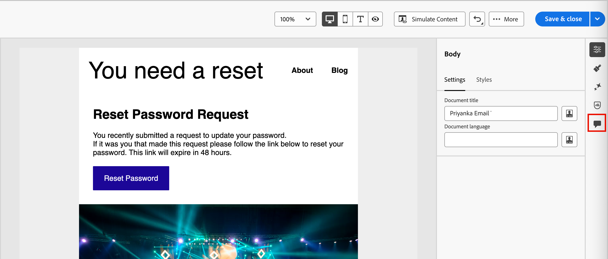

# 이메일 공동 작업 도구

[이메일 디자인 공간](./email-authoring.md)에는 댓글 달기 및 해결을 위한 공동 작업 도구가 포함되어 있어 마케팅 팀이 [!DNL Journey Optimizer B2B Edition] 내에서 바로 이메일 자산을 원활하게 검토하고, 논의하고, 마무리할 수 있습니다. 외부 도구(예: 채팅, 이메일 스레드 또는 스프레드시트)를 통해 초안을 공유하는 대신, 사용자는 이메일 디자인 공간 내에서 댓글을 달고, 편집을 제안하고, 피드백을 해결할 수 있습니다. 계정 여정 내에서 이메일 캠페인을 시작하기 전에 다음 도구를 사용하여 워크플로우를 간소화하고, 오류를 줄이고, 관련자들의 협조를 얻으십시오.

* **_중앙 집중식 피드백_** - 한 곳에서 모든 피드백을 수집하고 추적합니다.

* **_더 빠른 검토_** - 공동 작업자가 작성 환경 내에서 전자 메일 복사본 및 자산을 검토할 수 있습니다.

* **_정확도 향상_** - 모든 편집 내용을 전자 메일 자체와 연결하여 통신 오류 위험을 줄입니다.

* **_투명도_** - 모든 댓글과 해결 방법이 기록된 상태로 유지되므로 어떤 변경 사항이 제안되고 구현되었는지 알 수 있습니다.

* **_컨텍스트의 Collaboration_** - 레이아웃 내에서 전자 메일 본문 복사본, 이미지 및 call-to-action(CTA) 요소를 검토합니다.

<!-- Enable asynchronous collaboration between team members for an email asset
Allow users to attach comments to specific design elements
Provide a unified interface for viewing and managing all comments within a project
Support comment placement, editing, deleting, and navigation
Display visual indicators (badges) for elements with associated comments -->

## 검토자를 위한 이메일 공동 작업 도구 활성화

제품 관리자는 Adobe Experience Cloud의 **[!UICONTROL 권한]** UI를 통해 _B 전자 메일 관리_ 권한을 할당하여 전자 메일 공동 작업 도구에 액세스할 수 있습니다.

+++ 이메일 권한 활성화

1. 권한 앱에서 **[!UICONTROL 역할]** 탭으로 이동하여 원하는 [역할](https://experienceleague.adobe.com/ko/docs/experience-platform/access-control/abac/permissions-ui/roles){target="_blank"}을 선택합니다.

1. 권한을 수정하려면 **[!UICONTROL 편집]**&#x200B;을 클릭하십시오.

1. **[!UICONTROL B2B Assets]** 리소스를 추가한 다음 **[!UICONTROL B2B 전자 메일 관리]**&#x200B;를 선택합니다.

   {width="700" zoomable="yes"}

1. 변경 내용을 적용하려면 **[!UICONTROL 저장]**&#x200B;을 클릭하세요.

   권한은 이미 역할에 할당된 모든 사용자에 대해 자동으로 업데이트됩니다.

1. 이 역할을 새 사용자에게 할당하려면 **[!UICONTROL 역할]** 대시보드에서 _[!UICONTROL 사용자]_ 탭을 선택하고 **[!UICONTROL 사용자 추가]**&#x200B;를 클릭하십시오.

   * 사용자 이름과 이메일 주소를 입력하거나 목록에서 기존 사용자를 선택합니다.

     사용자를 아직 만들지 않은 경우 [Experience Platform 설명서](https://experienceleague.adobe.com/ko/docs/experience-platform/access-control/abac/permissions-ui/users){target="_blank"}를 참조하세요.

   * 변경 내용을 적용하려면 **[!UICONTROL 저장]**&#x200B;을 클릭하세요.

+++

## 공동 작업 도구 및 주석 표시

전자 메일 디자인 공간에서 콘텐츠를 만들거나 편집하거나 검토하는 동안 _Collaboration_ 패널에 액세스하여 전자 메일 콘텐츠에 대한 주석을 추가하거나 관리할 수 있습니다.

오른쪽 탐색에서 _Collaboration_(  ) 아이콘을 클릭합니다.

{width="700" zoomable="yes"}

## Collaboration 워크플로

공동 작업 도구를 사용하여 표준 콘텐츠 워크플로를 따를 수 있습니다.

1. 공동 작업자 및 검토자를 [초대](#invite-collaborators-and-reviewers)합니다.
1. 검토자는 [댓글을 추가](#add-comments)합니다.
1. 의견을 읽고 피드백을 논의하고 필요한 편집을 하려면 [답글을 추가](#reply-to-a-comment)하세요.
1. 검토자 또는 작성자 [댓글 확인](#resolve-comments).

>[!BEGINSHADEBOX]

**공동 작업 도구 사용 모범 사례**

* `@` 태깅을 사용하여 피드백이 적절한 팀원에게 빠르게 전달되도록 하십시오.

* 여러 개의 흩어져 있는 메모 대신 하나의 댓글 스레드로 관련 피드백을 그룹화합니다.

* 항상 깔끔한 워크플로를 유지하기 위해 주석이 해결되는 즉시 해결하십시오.

* 준수/감사 목적으로 최종 승인된 버전을 저장합니다.

>[!ENDSHADEBOX]

### 공동 작업자 및 검토자 초대

1. 이메일 본문을 선택합니다.

1. 오른쪽 탐색에서 _Collaboration_(  ) 아이콘을 클릭합니다.

1. 오른쪽 패널의 맨 위에 사용자가 공동 작업을 수행하고 피드백을 제공할 수 있도록 초대 텍스트를 입력합니다.

   `@` 기호를 사용하여 주소를 지정하고 사용자에게 알립니다. 이러한 사용자는 이메일 및 제품 내 Pulse 알림을 수신합니다.

   기호 뒤에 이름의 처음 몇 글자를 입력하면 일치하는 사용자 이름이 팝업 목록에 표시됩니다. 이름에 더 많은 문자를 입력하여 결과를 개선할 수 있습니다.

   {width="550"}

   알림을 위해 추가할 이름을 선택합니다.

   초대에 포함할 협력자 또는 검토자를 최대한 많이 추가합니다.

   {width="700" zoomable="yes"}

1. **[!UICONTROL 제출을 클릭합니다]**.

### 댓글 추가

이메일 공동 작업자 또는 검토자는 디자인 공간에서 이메일을 열고 피드백을 추가합니다. _Collaboration_ 패널에 일반 피드백을 입력하거나 캔버스에서 구성 요소를 선택하고 해당 디자인 요소에 대한 설명을 추가할 수 있습니다. `@`과(와) 같은 _을(를) 사용하여 팀원을 태그@John 지정합니다. CTA 복사본을 업데이트하십시오_.

새 의견이 나올 때마다 공동 작업자가 _회신_&#x200B;을 사용하여 토론을 계속할 수 있는 스레드가 시작됩니다. 디자인 요소와 연관된 각 주석/스레드에는 번호가 매겨져서 해당 요소가 적용되는 요소를 쉽게 식별할 수 있습니다.

#### 일반 댓글 및 피드백

_Collaboration_ 패널에서 상단의 텍스트 필드를 사용하여 전자 메일 콘텐츠에 대한 일반 설명을 입력합니다. `@` 기호를 사용하여 주소를 지정하고 사용자에게 알립니다.

{width="400"}

댓글을 기록하고 태그 지정된 사용자에게 알림을 보내려면 **[!UICONTROL 제출]**&#x200B;을 클릭하세요.

#### 구성 요소 주석

1. 구조 또는 콘텐츠 구성 요소를 선택합니다.

1. 도구 모음에서 _Collaboration_ 도구를 클릭합니다.

   구성 요소별 설명을 추가하기 위한 전자 메일 편집기 도구 모음의 {width="600"}

1. 텍스트 필드에 설명을 입력합니다.

1. **[!UICONTROL 제출을 클릭합니다]**.

공동 작업자는 이메일 캔버스에서 번호 매기기 핀 아이콘을 클릭하여 댓글을 볼 수 있습니다.

{width="450"}

#### 댓글에 회신

각 댓글에 대해 _[!UICONTROL 답글]_ 함수를 사용하여 토론을 계속하거나 질문에 답할 수 있습니다.

댓글의 맨 아래에 있는 **[!UICONTROL 답글]**&#x200B;을 클릭하고 답글 텍스트를 입력하십시오. 회신에 현재 댓글의 견적을 포함하려면 _추가 메뉴_(**...**) 아이콘을 클릭하고 **[!UICONTROL 답글 견적]**&#x200B;을 선택하세요.

{width="350"}

### 댓글 확인

작성자 또는 디자이너는 검토자의 피드백을 평가하고 변경할 사항을 결정합니다. 변경 사항이 완료되고 요청이 충족되면 _추가 메뉴_(**...** ) 아이콘을 클릭하고 **[!UICONTROL 해결]**&#x200B;을 선택합니다.

{width="350"}

확인 대화 상자에서 **[!UICONTROL 해결]**&#x200B;을 클릭합니다.

## 댓글 관리

의견 및 스레드를 관리하여 공동 작업 상태를 평가합니다.

### 댓글 달기

댓글이 전자 메일 캔버스의 요소와 연결되어 있지 않으면 필요에 따라 댓글을 요소에 _고정_&#x200B;할 수 있습니다. _추가 메뉴_( **...**) 아이콘을 클릭하고 **[!UICONTROL 댓글 넣기]**&#x200B;를 선택합니다. 그런 다음 캔버스에서 디자인 구성 요소를 선택합니다.

{width="350"}

### 댓글 제거 또는 삭제

주석 로그를 제거하고 삭제하여 정리할 수 있습니다. _추가 메뉴_( **...**) 아이콘을 클릭하고 **[!UICONTROL 댓글 제거]** 또는 **[!UICONTROL 삭제]**&#x200B;를 선택합니다.

{width="350"}

* 주석을 제거하면 작업이 해당 주석을 디자인 요소에서 분리합니다(주석이 생성될 때 선택됨). 댓글은 여전히 전자 메일에 대한 댓글 레코드의 일부입니다.

* 댓글을 삭제하면 해당 작업이 레코드에서 영구적으로 삭제됩니다.

### 해결된 댓글

기본적으로 해결된 댓글은 _Collaboration_ 패널에서 숨겨집니다. 필터를 지워 언제든지 해결된 주석을 표시할 수 있습니다. _필터_(  ) 아이콘을 클릭하고 **[!UICONTROL 해결된 댓글 숨기기]** 확인란의 선택을 취소합니다.

해결된 전자 메일 댓글을 표시하는 필터를 보여 주는 {width="350"}

해결된 댓글에는 _확인 안 함_( ) 아이콘이 있습니다. 주석/스레드가 해결되지 않았으며 추가 변경이 필요한 경우 아이콘을 클릭하여 _[!UICONTROL 해결됨]_ 지정을 제거하십시오.

{width="300"}
