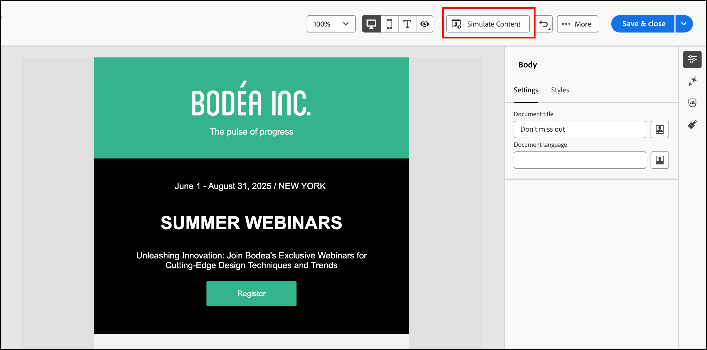
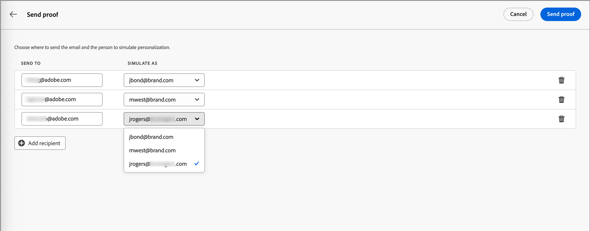

# 이메일 콘텐츠 미리보기 및 테스트

_콘텐츠 시뮬레이션_ 기능을 사용하여 전자 메일 콘텐츠를 미리 보고 특정 수신자에게 테스트 게재를 보냅니다. 미리 보기 및 테스트 기능에 액세스하려면 _[!UICONTROL 보낸 사람 이름]_, _[!UICONTROL 보낸 사람 주소]_, _[!UICONTROL 회신 주소]_ 및 _[!UICONTROL 제목 줄]_&#x200B;을 포함한 필수 전자 메일 필드를 정의해야 합니다.

>[!IMPORTANT]
>
>오류가 있는 경우 이메일을 미리 볼 수 없습니다. 미리 보기 기능을 차단하는 오류가 없는지 확인하려면 _경고_&#x200B;를 확인하세요. 경고는 미리 보기를 차단하지 않지만, 이메일 게재를 트리거하는 여정을 게시하기 전에 경고를 해결해야 합니다.

## 이메일 미리 보기 표시

1. 전자 메일 디자인 공간<!-- or the email properties -->에서 **[!UICONTROL 콘텐츠 시뮬레이션]**&#x200B;을 클릭하세요.

   {width="800" zoomable="yes"}

   >[!NOTE]
   >
   >오류가 있거나 이메일에 대한 필수 필드가 정의되지 않은 경우 이 버튼을 사용할 수 없습니다.

1. _[!UICONTROL 시뮬레이션]_ 페이지에서 전자 메일 렌더링에 사용할 **[!UICONTROL 사람]** 목록의 사람 프로필을 선택하십시오.

   콘텐츠 미리보기에서 개인화된 요소는 선택한 개인 프로필에 따라 채워집니다.

   {width="800" zoomable="yes"}

   왼쪽의 _[!UICONTROL 사람]_ 목록이 비어 있는 경우 연결된 Marketo Engage 인스턴스의 연락처를 사용하여 [사람을 추가](#add-people-to-the-profiles-list)합니다.

   >[!TIP]
   >
   >[Litmus 테스트 렌더링 통합](./email-test-rendering.md)을 사용하여 인기 있는 데스크톱, 모바일 및 웹 기반 클라이언트에서 이메일 메시지 렌더링을 확인할 수도 있습니다.

## 표시 옵션 조정

디스플레이 도구를 사용하여 장치 유형 또는 확대/축소 수준에 따라 미리 보기를 변경할 수 있습니다.

* 바탕 화면 스타일 및 종횡비를 사용하여 미리 보기를 표시하려면 _바탕 화면_( ) 아이콘을 선택하십시오.
* 모바일 장치 스타일 및 종횡비를 사용하여 미리 보기를 표시하려면 _Mobile_( ) 아이콘을 선택하십시오.
* _확대/축소 수준_ 화살표를 클릭하고 확대/축소 비율을 선택하여 컨텐츠가 확대/축소 수준에 따라 어떻게 변경되는지 검토합니다.

{width="600" zoomable="yes"}

## 교정쇄 보내기

증명은 사용자와 팀 구성원이 대상자에게 이메일 메시지를 보내기 전에 검토할 수 있도록 해 주는 배달된 테스트 메시지입니다. 증명 수신자는 메시지 렌더링, 콘텐츠, 개인화 설정 및 구성을 확인할 수 있습니다. 선택한 테스트 프로필을 사용하여 증명을 보낼 수 있습니다.

1. 오른쪽 상단의 **[!UICONTROL 증명 보내기]**&#x200B;를 클릭합니다.

   {width="500"}

1. _증명 보내기_ 페이지에서 첫 번째 받는 사람의 전자 메일 주소를 입력하세요.

1. 검토에 포함하려는 각 추가 받는 사람에 대해 **[!UICONTROL 받는 사람 추가]**&#x200B;를 클릭하고 **[!UICONTROL 받는 사람 보내기]** 필드에 해당 전자 메일 주소를 입력하십시오.

   증명 게재를 위해 최대 10명의 수신자를 추가할 수 있습니다.

1. 각 수신자에 대해 메시지 콘텐츠를 개인화하는 데 사용할 테스트 프로필을 선택하여 **[!UICONTROL 다음으로 시뮬레이션]** 필드를 설정하십시오.

   {width="700" zoomable="yes"}

1. **[!UICONTROL 증명 보내기]**&#x200B;를 클릭합니다.

## 프로필 목록에 사람 추가

1. _[!UICONTROL 직원]_ 목록의 맨 위에서 **[!UICONTROL 직원 추가]**&#x200B;를 클릭합니다.

   {width="500"}

1. _[!UICONTROL 테스트를 위해 직원 추가]_ 대화 상자에서 연락처의 전체 이메일 주소를 입력합니다.

   여러 연락처를 추가하려면 쉼표로 구분하여 여러 주소를 입력하십시오.

1. 테스트 프로필 목록에 추가하려는 일치하는 각 연락처에 대한 확인란을 선택합니다.

   {width="700" zoomable="yes"}

1. 오른쪽 상단의 **[!UICONTROL 추가]**&#x200B;를 클릭합니다.
