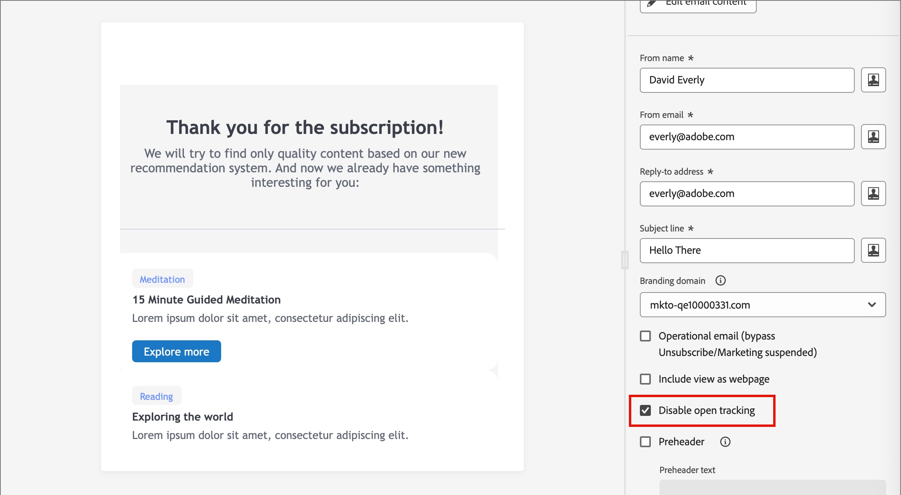
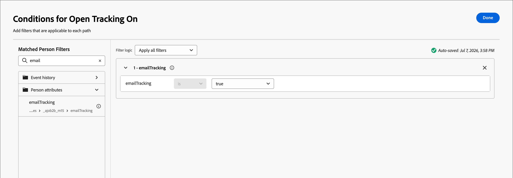
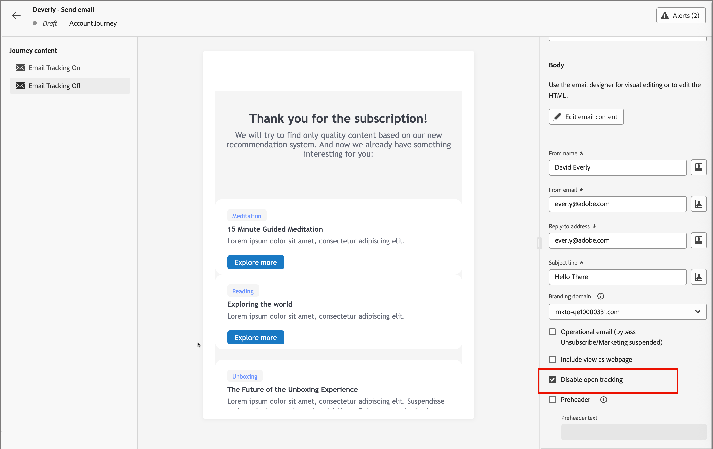

# 이메일 열기 추적 관리

개별 이메일에 대한 공개 추적을 비활성화하거나 Adobe Experience Platform에서 각 개인의 추적 환경 설정을 캡처하고 분할 경로를 사용하여 사람들을 추적 및 비추적 이메일 변형으로 라우팅할 수 있습니다.

>[!BEGINSHADEBOX &quot;전자 메일 추적 픽셀에 대한 CNIL 지침&quot;]

2026년 4월 14일, *CNIL(Commission Nationale de l&#39;Informatique et des Libertés)에서 [이메일 내 픽셀 추적 사용에 대한 권장 사항](https://www.cnil.fr/sites/default/files/2026-04/recommandation-pixels_de_suivi.pdf)을 게시했습니다.*&#x200B;안내서에서는 동의가 필요한 시기를 명확히 설명하고 이메일 픽셀 추적에 대한 적절한 동의 사례의 중요성을 강조합니다. 이 정책은 프랑스에 기반을 둔 구독자에게 이메일을 게재하는 모든 엔터티의 전송 사례에 영향을 줄 수 있습니다.

이메일 추적 픽셀은 이메일의 HTML에 임베드된 1x1 투명 이미지입니다. 수신자의 이메일 클라이언트가 해당 이미지를 로드할 때 픽셀은 타임스탬프, 디바이스 유형, 이메일 클라이언트 및 경우에 따라 대략적인 위치에 대한 IP 주소와 같은 데이터를 기록하는 서버를 ping합니다. 그러면 해당 로그가 수신자의 레코드에 연결되어 마케터는 이메일이 열렸는지 여부를 알 수 있습니다.

여기에 설명된 [!UICONTROL Journey Optimizer B2B edition] 제품 기능은 적절하게 구성 및 작동되어 호환되는 구현을 지원할 수 있는 기본 구성입니다. 각 고객은 해당 법률에 따라 자신의 의무를 결정하고 준수할 책임이 있습니다.

>[!ENDSHADEBOX]

## 단일 이메일에 대한 추적 비활성화 {#disable-tracking-single-email}

수신자와 관계없이 특정 이메일이 진행 중인 활동을 보고하지 않도록 하려면 이 옵션을 사용하십시오.

1. 오른쪽의 여정 노드 속성에서 이메일을 엽니다.

1. 전자 메일 속성에서 **[!UICONTROL 공개 추적 사용 안 함]** 확인란을 선택합니다.

   {width="500" zoomable="yes"}

   전자 메일 속성의 전체 목록은 [전자 메일 설정 정의](./add-email.md#define-the-email-settings)를 참조하십시오.

## 추적 환경 설정을 통해 사람 세그먼트화 {#segment-people-tracking-preference}

각 사용자가 이메일 열기 추적 여부를 선택할 수 있도록 하려면 해당 환경 설정을 Adobe Experience Platform(AEP)에서 개인 속성으로 캡처합니다. [랜딩 페이지 양식](./forms.md)에서 이 필드를 사용하여 연락처가 전자 메일 열기 추적을 옵트아웃할 수 있도록 할 수 있습니다. 그런 다음 여정의 _경로 분할_ 노드를 사용하여 추적 및 비추적 사용자를 다른 전자 메일 변형으로 라우팅할 수 있습니다. 이를 통해 모든 사용자에 대해 공개 추적을 비활성화하지 않고 개별 옵트아웃을 적용할 수 있습니다.

워크플로에는 세 가지 부분이 있습니다.

1. [추적 환경 설정에 대한 사용자 지정 필드를 AEP에 추가](#add-custom-field-tracking-preference)하고 양식 링크로 옵트아웃 통신을 보냅니다.
1. [여정에 옵트아웃 추적을 위한 분할 경로를 추가](#add-split-path-tracking)합니다.
1. 각 경로에 대해 [추적 및 비추적 전자 메일 변형을 구성](#configure-tracking-and-non-tracking-email-variants)합니다.

### 추적 환경 설정에 대한 사용자 정의 필드 추가 {#add-custom-field-tracking-preference}

>[!NOTE]
>
>사용자 지정 XDM 필드를 추가하고 매핑하는 것은 Adobe Experience Platform 관리 작업입니다. AEP 관리자 또는 데이터 엔지니어링 팀과 협력하여 이 단계를 완료합니다.

1. AEP에서 B2B 개인 프로필에 사용되는 스키마를 엽니다(예: _B2B 개인_).

1. 테넌트 ID에서 조직의 동의 관리 필드(예: `consents`)에 대한 필드 그룹을 찾거나 만듭니다.

1. 필드 그룹(예: 이름이 `emailTracking`인 부울 필드)에 필드를 추가하여 개인이 추적 열기에 동의했는지 여부를 나타냅니다.

1. 필드 이름과 표시 이름을 입력하고 유형을 설정하여 필드 그룹에 할당한 다음 **[!UICONTROL 적용]**&#x200B;을 클릭합니다.

1. 스키마 변경 내용을 저장하려면 **[!UICONTROL 저장]**&#x200B;을 클릭합니다.

   {width="800" zoomable="yes"}

1. [XDM 필드 관리](../admin/xdm-field-management.md#managed-fields)에서 [!UICONTROL XDM 개별 프로필] 클래스에 대한 _관리 필드_(으)로 선택하여 [!DNL Journey Optimizer B2B Edition]에서 사용할 수 있는 필드를 만드십시오.

   {width="450"}

   이렇게 하면 필드를 분할 경로 노드에서 조건으로 사용할 수 있습니다.

### 옵트아웃 추적을 위한 분할 경로 추가 {#add-split-path-tracking}

[_사람별로 경로 분할_ 노드](../journeys/split-merge-paths-nodes.md#split-paths-by-people)을(를) 여정에 추가하고 각 추적 환경 설정 값에 대한 경로를 정의합니다.

1. **[!UICONTROL 분할 경로]** 노드를 추가하고 분할에 대해 **[!UICONTROL 사람]**&#x200B;을(를) 선택하십시오.

1. 첫 번째 경로에 대해 사용자 지정 추적 환경 설정 필드를 사용하여 조건을 적용하여(예: `emailTracking`은(는) `true`임) 공개 추적을 허용하는 사람을 식별합니다.

   {width="700" zoomable="yes"}

1. 두 번째 경로를 추가하고 역조건(`emailTracking`은(는) `false`임)을 적용하여 추적을 옵트아웃한 사람을 식별합니다.

   경로 추가, 조건 적용 및 경로 순서 변경에 대한 일반적인 단계는 [사람 노드별 분할 경로 추가](../journeys/split-merge-paths-nodes.md#add-a-split-path-by-people-node)를 참조하십시오.

   {width="500" zoomable="yes"}

### 추적 및 비추적 이메일 변형 구성 {#configure-tracking-and-non-tracking-email-variants}

모든 사용자가 추적 기본 설정에 일치하는 전자 메일 변형을 받도록 각 경로에 [_[!UICONTROL 전자 메일 보내기&#x200B;]_작업 노드](./add-email.md)를 추가합니다.

1. 추적을 사용할 수 있는 경로에서 **[!UICONTROL 전자 메일 보내기]** 작업을 추가하고 평소대로 전자 메일을 선택하거나 만듭니다. 전자 메일 속성에서 **[!UICONTROL 열려 있는 추적 사용 안 함]**&#x200B;을 지웁니다.

1. 옵트아웃 경로에서 동일하거나 중복된 메일을 사용하여 **[!UICONTROL 전자 메일 보내기]** 작업을 추가한 다음 오른쪽의 전자 메일 속성에서 **[!UICONTROL 열린 추적 사용 안 함]** 확인란을 선택합니다.

   {width="600" zoomable="yes"}

1. [여정을 게시합니다](../journeys/create-publish-journey.md#publish-a-journey).

   사람들은 자신의 추적 환경 설정 필드 값과 일치하는 이메일 변형으로 자동 라우팅되며, 환경 설정에 대한 모든 업데이트는 다음에 여정을 입력할 때 반영됩니다.
