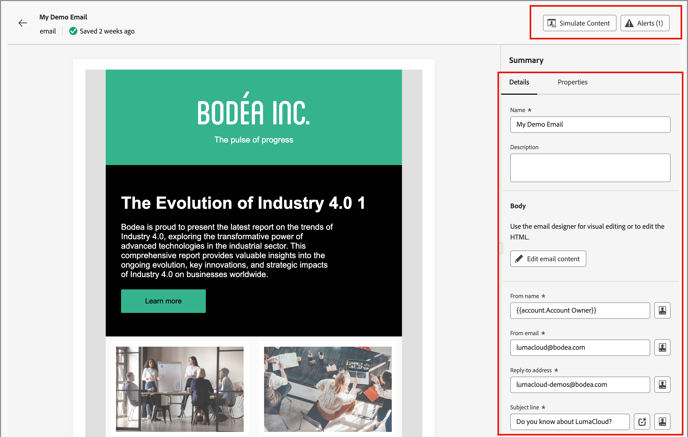

# 이메일

[전자 메일을 만듭니다](./add-email.md). 여정 노드의 컨텍스트에 전자 메일을 추가합니다. 여정 맵 외부의 전자 메일로 작업하려면 _[!UICONTROL 전자 메일]_ 목록을 사용하여 전자 메일을 찾아 업데이트합니다. 이메일을 검토하거나 설정 및 콘텐츠를 업데이트할 수 있습니다.

## 이메일 액세스 및 관리

Adobe Journey Optimizer B2B edition에서 전자 메일에 액세스하려면 왼쪽 탐색으로 이동하여 **[!UICONTROL 콘텐츠 관리]** > **[!UICONTROL 전자 메일]**&#x200B;을 클릭합니다. 이 작업을 수행하면 테이블에 나열된 인스턴스에 대해 생성된 모든 이메일이 포함된 목록 페이지가 열립니다.

표는 기본적으로 _[!UICONTROL 수정됨]_ 열을 기준으로 정렬되며 가장 최근에 업데이트된 전자 메일이 맨 위에 있습니다. 오름차순과 내림차순 간을 변경하려면 열 제목을 클릭합니다.

이름으로 이메일을 검색하려면 검색 막대에 텍스트 문자열을 입력합니다. 왼쪽 상단의 _필터_(  ) 아이콘을 클릭하여 표시된 전자 메일을 생성 및 수정 날짜별로 필터링합니다. 만들거나 수정한 이메일로 목록을 제한할 수도 있습니다.

{width="700" zoomable="yes"}

## 이메일 편집

목록에서 이메일 이름을 클릭하여 엽니다. [전자 메일 설정](./add-email.md#define-the-email-settings)을 검토하고 변경할 수 있습니다. **[!UICONTROL 전자 메일 콘텐츠 편집]**&#x200B;을 클릭하여 [콘텐츠를 업데이트](./email-authoring.md)합니다.

페이지 오른쪽 상단에 [경고가 표시](./add-email.md#check-alerts)된 경우 을 클릭하여 경고 또는 오류를 검토하고 필요에 따라 항목을 해결하십시오.

{width="700" zoomable="yes"}
