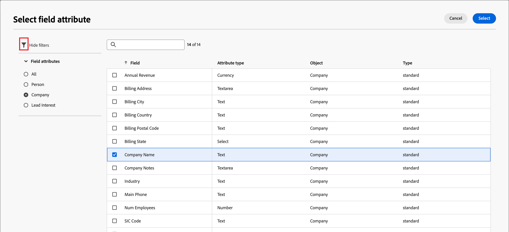

# 양식 디자인

[양식을 만들기](./landing-pages.md#create-a-landing-page)한 후 비주얼 디자인 공간에서 기본 기본 기본 양식 정의가 있는 초안이 열립니다. 오른쪽의 _[!UICONTROL 요약]_ 패널에서 **[!UICONTROL 양식 편집]**&#x200B;을 클릭하고 시각적 디자인 공간을 사용하여 양식 스타일 및 필드 구성 요소를 정의합니다.

{width="700" zoomable="yes"}

## 필드

양식 필드는 사용자를 타겟팅하고 계정 및 구매 그룹과 연결하는 데 사용할 수 있는 개인 프로필 데이터를 캡처하는 데 사용됩니다. 모든 새 양식은 단일 열 레이아웃에서 다음 필드로 시작합니다.

* 이름
* 성
* 이메일 주소

필드 디자인 도구를 사용하여 계정 기반 마케팅 활동에 필요한 데이터를 수집하는 데 필요한 필드 및 레이아웃 세트를 구성합니다.

### 필드 추가 {#add-field}

1. 왼쪽의 _[!UICONTROL 구성 요소]_ 패널에서 **[!UICONTROL 필드]** 콘텐츠 구성 요소를 드래그하여 캔버스에 놓습니다.

   {width="700" zoomable="yes"}

1. **[!UICONTROL 필드 특성 선택]**&#x200B;을 클릭합니다.

1. _[!UICONTROL 필드 특성 선택]_ 대화 상자에서 필드에 사용할 개인 프로필 특성에 대한 확인란을 선택하고 **[!UICONTROL 선택]**&#x200B;을 클릭합니다.

   [XDM 비즈니스 스키마](../data/field-mapping.md#xdm-business-person-attributes)에서 사용 가능한 특성을 확인합니다.  Journey Optimizer B2B edition 인스턴스에 대해 정의된 모든 사용자 지정 필드도 사용할 수 있습니다. 검색 텍스트 상자를 사용하여 목록을 이름별로 필터링하거나 필터 아이콘을 클릭하여 목록을 스키마/데이터 유형별로 필터링합니다.

   {width="700" zoomable="yes"}

   캔버스에서 선택한 속성에 대한 기본 필드 레이블이 캔버스에 채워집니다. **[!UICONTROL 필드 세부 정보]**&#x200B;가 오른쪽 패널에 표시됩니다.

1. 필요한 경우 **[!UICONTROL 레이블]** 텍스트를 변경합니다.

   이 텍스트는 양식의 필드 옆에 표시됩니다. 기본 텍스트는 필드 속성에서 채워집니다.

1. 필드의 데이터 형식에 따라 **[!UICONTROL 필드 형식]**&#x200B;을(를) 설정합니다.

   | 필드 유형 | 사용 | 예 |
   | ---------- | ----- | ------- |
   | **[!UICONTROL 확인란]** | 방문자가 _true_(선택됨) 또는 _false_(선택되지 않음) 값을 선택할 수 있도록 이 형식을 사용하십시오. | |
   | **[!UICONTROL 확인란 그룹]** | 방문자가 여러 항목에 대해 _true_(선택됨) 또는 _false_(선택되지 않음) 값을 선택할 수 있도록 이 형식을 사용하십시오. | |
   | **[!UICONTROL 통화]** | 이 유형을 사용하여 Journey Optimizer B2B edition 인스턴스에 대해 선택한 기본 통화 유형을 나타내는 부동 소수점 필드를 허용할 수 있습니다. | |
   | **[!UICONTROL 날짜]** | 이 유형을 사용하여 날짜 형식으로 입력을 제한하고 필드에 달력 선택기를 제공합니다. | |
   | **[!UICONTROL 이중]** |  | |
   | **[!UICONTROL 이메일]** | 이메일 주소 형식으로 입력을 제한하려면 이 유형을 사용하십시오. | |
   | **[!UICONTROL 숫자]** | 이 유형을 사용하여 필드를 숫자 값으로 제한합니다. | |
   | **[!UICONTROL 라디오 그룹]** | 방문자가 옵션 세트 중 하나를 선택할 수 있도록 하려면 이 유형을 사용합니다. | |
   | **[!UICONTROL 선택]** | 방문자가 드롭다운 목록을 사용하여 옵션 세트 중 하나를 선택할 수 있도록 하려면 이 유형을 사용하십시오. | |
   | **[!UICONTROL 슬라이더]** | 방문자가 슬라이더를 사용하여 숫자 값을 설정할 수 있도록 하려면 이 유형을 사용하십시오. | |
   | **[!UICONTROL 전화]** | 전화 번호 입력 필드에 이 유형을 사용합니다. | |
   | **[!UICONTROL 텍스트]** | 표준 텍스트(문자열) 입력 필드에 이 유형을 사용합니다. | |
   | **[!UICONTROL 텍스트 영역]** | 더 긴 텍스트 항목을 지원하려면 이 유형을 사용하십시오. | |
   | **[!UICONTROL URL]** | 이 유형을 사용하여 텍스트 입력을 표준 URL 프로토콜을 포함한 URL로 제한합니다. | |

1. 선택한 필드 유형에 따라 필드 항목 및 유효성 검사에 대한 다른 옵션을 설정합니다.

   {width="400" zoomable="yes"}

   * **[!UICONTROL 자리 표시자]** - 방문자에게 필드에 필요한 값의 예를 제공하는 필드의 자리 표시자 값입니다.

   * **[!UICONTROL 지침]** - 방문자가 필드를 완성하는 데 도움이 되는 지침 텍스트입니다. 필드에 대해 _가리킨 텍스트_(으)로 표시할 텍스트를 입력하십시오.

     >[!TIP]
     >
     >_지침과 자리 표시자 텍스트 비교_ 
     >
     >방문자가 필드를 채울 수 있도록 안내하려면 이 두 속성을 사용하십시오. 포인터를 필드 위에 올리면 지침 텍스트가 도구 설명/팝업 텍스트로 표시됩니다. 자리 표시자 텍스트는 필드 내부에 _흐리게_ 나타나며 방문자가 텍스트를 필드에 입력할 때 사라집니다. 두 가지 방법을 모두 사용하거나 한 가지 방법만 사용할 수 있습니다.

   * **[!UICONTROL 기본값]** - 이 옵션을 사용하여 필드의 기본값을 지정하십시오.

   * **[!UICONTROL 유효성 검사 메시지]** - 이 옵션을 사용하여 필드에 대한 유효성 검사 메시지를 지정하십시오. 이 메시지는 방문자가 필드에 잘못된 값을 입력하면 표시됩니다. _[!UICONTROL Standard]_ 메시지는 기본적으로 설정되어 있습니다. **[!UICONTROL 사용자 지정]**&#x200B;을(를) 선택하고 직접 메시지를 입력하세요.

   * **최대 길이** - 필드에 입력할 수 있는 최대 문자 수를 입력합니다.

1. 필요에 따라 **[!UICONTROL 필드 동작]**&#x200B;을 설정합니다.

   * **필수** - 양식을 제출하는 데 필요한 필드 입력을 만들려면 확인란을 선택하십시오.

   * **입력 마스크 사용** - 입력 마스크를 사용하여 방문자의 입력을 제한하려면 확인란을 선택합니다. 예를 들어 방문자가 특정 형식의 전화 번호를 입력하도록 할 수 있습니다. 대화 상자에서 임의의 숫자에 대해 `9`, 임의의 문자에 대해 `a`, 둘 중 하나에 대해 `*`을 사용하여 마스크를 입력합니다. 저장 을 클릭하여 지정된 입력 마스크를 활성화합니다.

     {width="500" zoomable="yes"}

### 필드 스타일 변경 {#field-styling}

오른쪽 패널의 **[!UICONTROL 스타일]** 탭을 선택하여 선택한 필드의 스타일을 변경합니다.

* **[!UICONTROL 배경]** - 필드에 배경색을 적용하려면 확인란을 선택하십시오. 흰색이 기본 색상입니다. **[!UICONTROL 배경색]** 사각형을 클릭하여 팝업 색상 선택기를 열고 필드 배경색을 선택합니다.

  {width="600" zoomable="yes"}

* **[!UICONTROL 레이블]** - 레이블 스타일이 필드 옆에 표시되는 텍스트의 시각적 특성을 제어합니다. 필드를 기준으로 상단 또는 측면 레이블 표시를 선택합니다. 글꼴 크기, 선 높이, 텍스트 스타일 및 텍스트 정렬을 설정할 수 있습니다. **[!UICONTROL 글꼴 색상]** 사각형을 클릭하여 팝업 색상 선택기를 열고 레이블 텍스트의 색상을 선택합니다.

  {width="600" zoomable="yes"}

* **[!UICONTROL 테두리]** - **[!UICONTROL 테두리 색상]** 사각형을 클릭하여 팝업 색상 선택기를 열고 테두리 색상을 선택합니다. 색상 및 선 너비를 포함하여 필드에 대한 테두리를 정의할 수 있습니다. 표시된 필드 테두리를 제거하려면 확인란의 선택을 취소하십시오. 모퉁이에 대한 테두리 크기(픽셀 너비), 스타일 및 반경 설정을 변경할 수도 있습니다.

  {width="600" zoomable="yes"}

* **[!UICONTROL 크기]** - 필드의 표시 너비를 결정할 크기 설정을 선택합니다. _[!UICONTROL 전체 너비]_, _[!UICONTROL 절반 너비]_ 또는 _[!UICONTROL 자동]_&#x200B;을 선택하세요.

* **[!UICONTROL 여백]** - 필드 주위에 여백(픽셀 단위)을 설정합니다. 네 개의 면에 동일한 여백을 설정하거나 **[!UICONTROL 각 면에 대해 다른 여백]** 확인란을 선택하여 가로 및 세로 여백을 별도로 설정할 수 있습니다.

* **[!UICONTROL 패딩]** - 필드 주위에 패딩을 설정합니다(픽셀 단위). 4개의 면에 동일한 여백을 설정하거나 **[!UICONTROL 각 면에 대해 다른 패딩]** 확인란을 선택하여 가로 및 세로 여백을 별도로 설정할 수 있습니다.

  {width="600" zoomable="yes"}

### 필드 순서 바꾸기 {#field-reorder}

시각적 작업 영역에서 양식 필드를 직접 이동할 수 있습니다. 선택한 필드의 오른쪽 가장자리에 있는 _이동_ 도구를 클릭하고 새 위치로 끕니다.

양식에 구조적 구성 요소를 추가하고 필드를 열로 이동하여 그룹화하고 레이아웃을 변경합니다. 선택한 열 구성 요소의 왼쪽 가장자리에 있는 _이동_ 도구를 클릭하고 양식 내의 새 위치로 끕니다.

{width="500"}

### 필드 삭제 또는 복제 {#field-delete-duplicate}

선택한 필드를 삭제하려면 도구 모음 또는 오른쪽 패널에서 _삭제_ 아이콘(  )을 클릭하십시오. 확인 대화 상자에서 **[!UICONTROL 삭제]**&#x200B;를 클릭합니다.

선택한 필드를 복제하려면 도구 모음 또는 오른쪽 패널에서 _복제_ 아이콘(  )을 클릭하십시오. 새 필드는 원래 필드 바로 아래에 표시됩니다. 필드의 특성을 설정하려면 **[!UICONTROL 필드 특성 선택]**&#x200B;을 클릭합니다. 필요에 따라 필드 유형, 세부 정보 및 스타일을 설정합니다.

{width="600" zoomable="yes"}

## 전송 단추

제출 단추(바닥글 필드)는 기본적으로 양식의 일부이며 제거할 수 없습니다. 양식에서 단추/바닥글 구성 요소를 선택하여 단추의 텍스트와 스타일을 변경합니다.

### 단추 콘텐츠 편집 {#button-content}

오른쪽 패널에 표시되는 _[!UICONTROL 콘텐츠]_ 탭에서 **[!UICONTROL 단추 텍스트]** 필드의 텍스트를 변경합니다. 단추 크기가 텍스트 길이에 맞게 조정됩니다.

{width="600" zoomable="yes"}

### 제출 단추 스타일 지정 {#button-styles}

오른쪽 패널의 **[!UICONTROL 스타일]** 탭을 선택하여 선택한 단추/바닥글 구성 요소의 스타일을 변경합니다.

* **[!UICONTROL 배경]** - 단추의 배경색을 적용하려면 확인란을 선택하십시오. 기본값은 파란색입니다. **[!UICONTROL 배경색]** 사각형을 클릭하여 팝업 색상 선택기를 열고 단추 배경색을 선택합니다.

  {width="600" zoomable="yes"}

* **[!UICONTROL 레이블]** - 레이블 스타일이 단추 안의 텍스트에 대한 시각적 특성을 제어합니다. 글꼴 크기, 선 높이, 텍스트 스타일 및 텍스트 정렬을 설정할 수 있습니다. **[!UICONTROL 글꼴 색상]** 사각형을 클릭하여 팝업 색상 선택기를 열고 레이블 텍스트의 색상을 선택합니다.

* **[!UICONTROL 테두리]** - **[!UICONTROL 테두리 색상]** 사각형을 클릭하여 팝업 색상 선택기를 열고 테두리 색상을 선택합니다. 색상 및 선 너비를 포함하여 단추의 테두리를 정의할 수 있습니다. 표시된 단추 테두리를 제거하려면 확인란의 선택을 취소합니다. 둥근 모서리의 테두리 크기(픽셀 너비), 스타일 및 반지름 설정을 변경할 수도 있습니다.

* **[!UICONTROL 크기]** - 단추의 표시 너비를 결정할 크기 설정을 선택합니다. _[!UICONTROL 전체 너비]_, _[!UICONTROL 절반 너비]_ 또는 _[!UICONTROL 자동]_&#x200B;을 선택하세요. 패딩은 크기와 정렬 설정에 따라 조정됩니다.

  {width="600" zoomable="yes"}

* **[!UICONTROL 단추 정렬]** - 단추의 _절반 폭_ 또는 _자동_ 크기를 선택한 경우 왼쪽, 오른쪽 또는 가운데에서 정렬을 설정합니다. 패딩은 크기와 정렬 설정에 따라 조정됩니다.

* **[!UICONTROL 여백]** - 필드 주위에 여백(픽셀 단위)을 설정합니다. 네 개의 면에 동일한 여백을 설정하거나 **[!UICONTROL 각 면에 대해 다른 여백]** 확인란을 선택하여 가로 및 세로 여백을 별도로 설정할 수 있습니다.

* **[!UICONTROL 패딩]** - 필드 주위에 패딩을 설정합니다(픽셀 단위). 4개의 면에 동일한 여백을 설정하거나 **[!UICONTROL 각 면에 대해 다른 패딩]** 확인란을 선택하여 가로 및 세로 여백을 별도로 설정할 수 있습니다. 크기와 정렬 설정을 변경하면 패딩이 조정됩니다.

  {width="600" zoomable="yes"}

## 양식 스타일 지정 {#form-styling}

구조 또는 양식 구성 요소의 외부를 클릭할 때 양식 영역의 스타일을 변경할 수 있습니다. 필드 또는 단추/바닥글 수준에서 다른 스타일이 정의되지 않은 경우 양식 구성 요소(필드 및 단추)는 최상위 스타일에 정의된 _Body_ 스타일을 상속합니다.

{width="600" zoomable="yes"}

### CSS 스타일

새 양식에서는 스타일링에 기본 CSS를 사용합니다. CSS를 수정하여 스타일을 변경하려는 경우, CSS를 복사한 다음 이를 사용하여 양식의 사용자 지정 CSS를 정의할 수 있습니다.

_양식에 대한 사용자 지정 CSS를 정의하려면_

1. 오른쪽 패널에서 **[!UICONTROL CSS 보기]**&#x200B;를 클릭하여 CSS 코드를 검토합니다.

   {width="450" zoomable="yes"}

1. 스크롤 창에서 CSS 코드를 선택하고 클립보드에 복사합니다.

1. Click **[!UICONTROL Close]**.

1. (선택 사항) 복사한 코드를 즐겨 찾는 CSS 도구에 붙여넣고, 원하는 스타일을 반영하도록 CSS를 편집합니다.

1. 오른쪽 패널에서 **[!UICONTROL 사용자 지정 CSS 추가]**&#x200B;를 클릭합니다.

1. CSS 코드를 창에 붙여넣습니다.

   {width="450" zoomable="yes"}

   이 창에서 붙여넣은 텍스트를 편집할 수 있습니다.

1. **[!UICONTROL 저장]**&#x200B;을 클릭합니다.

### 수동 스타일 지정

오른쪽 패널의 설정을 변경하여 전체 양식의 표시를 정의합니다.

* **[!UICONTROL 배경색]** - 양식 영역 주위에 배경색을 적용하려면 확인란을 선택하십시오. 흰색이 기본 색상입니다. 색상 사각형을 클릭하여 팝업 색상 선택기를 열고 양식 배경에 사용할 색상을 선택합니다.

* **[!UICONTROL 뷰포트 배경]** - 모든 양식 구성 요소에 배경색을 적용하려면 확인란을 선택하십시오. 기본값은 색상 없음(외부 배경에서 상속)입니다. 색상 사각형을 클릭하여 팝업 색상 선택기를 열고 양식 구조 구성 요소의 색상을 선택합니다.

  {width="600" zoomable="yes"}

* **[!UICONTROL 텍스트]** - 양식 필드의 레이블, 힌트 및 자리 표시자 텍스트에 영향을 주는 양식의 **[!UICONTROL 글꼴 모음]**&#x200B;을 선택합니다. 기본 제출 단추 텍스트에도 영향을 줍니다.

* **[!UICONTROL 크기]** - 양식의 크기(너비)를 픽셀 단위로 변경합니다.

* **[!UICONTROL 여백]** - 양식 구성 요소 주위에 여백(픽셀 단위)을 설정합니다. 네 개의 면에 동일한 여백을 설정하거나 **[!UICONTROL 각 면에 대해 다른 여백]** 확인란을 선택하여 가로 및 세로 여백을 별도로 설정할 수 있습니다.

  {width="600" zoomable="yes"}
