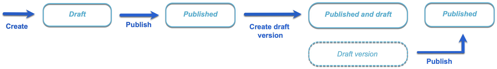
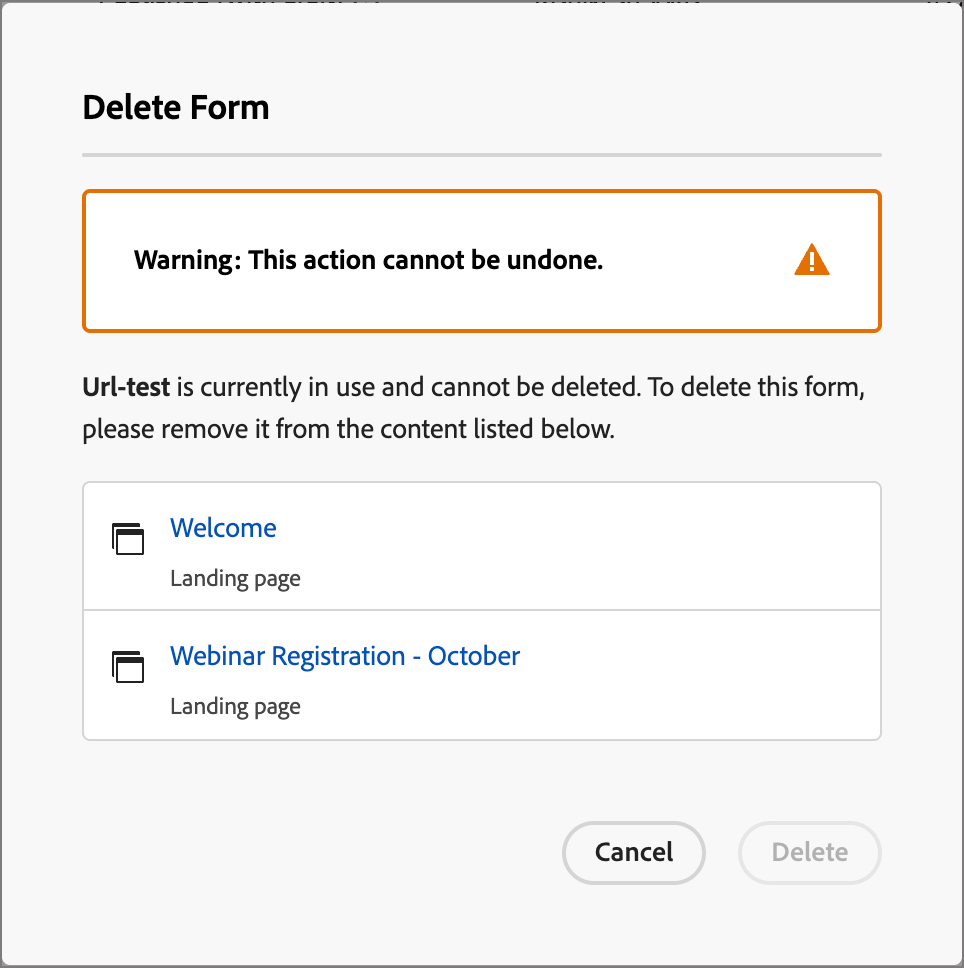

# 양식

웹 페이지 방문자의 정보를 캡처하려면 양식을 만들고 랜딩 페이지에 추가합니다. 양식은 백서, 온디맨드 웨비나 무료 체험판 등과 같은 콘텐츠 또는 오퍼를 얻기 위해 페이지 방문자가 작성하고 제출하는 필드 세트입니다.

양식에서 캡처해야 하는 정보의 양은 콘텐츠 또는 오퍼의 값에 따라 다릅니다. 백서 같은 간단한 항목을 제공하는 경우 이름, 이메일 및 회사와 같은 최소한의 정보만 수집해야 합니다. 오퍼가 데모 또는 무료 체험판처럼 가치가 높은 경우 추가 정보를 수집할 수 있습니다. 콘텐츠 보기를 허용하는 데 제출된 양식을 필요로 하는 것을 _제어된 콘텐츠_&#x200B;라고 합니다. 조직에서 제어할 콘텐츠와 그렇지 않은 콘텐츠를 결정합니다(_free_). 가장 좋은 방법은 일부 콘텐츠를 무료로 허용하고 프리미엄 또는 수요가 높은 콘텐츠만 시작하는 것입니다.

## 양식 액세스 및 관리

Journey Optimizer B2B edition의 양식에 액세스하려면 왼쪽 탐색으로 이동하여 **[!UICONTROL 콘텐츠 관리]** > **[!UICONTROL Forms]**&#x200B;을(를) 클릭하십시오. 이 작업을 수행하면 인스턴스에 생성된 모든 양식이 표에 나열된 목록 페이지가 열립니다.

{width="700" zoomable="yes"}

표는 _[!UICONTROL 수정됨]_ 열을 기준으로 정렬되며 가장 최근에 업데이트된 양식이 기본적으로 맨 위에 있습니다. 오름차순과 내림차순 간을 변경하려면 열 제목을 클릭합니다.

### 양식 상태 및 라이프사이클

양식 상태에 따라 랜딩 페이지 또는 랜딩 페이지 템플릿에서 사용할 수 있는 가용성과 변경 사항이 결정됩니다.

| 상태 | 설명 |
| -------------------- | ----------- |
| 초안 | 양식을 만들 때 초안 상태가 됩니다. 랜딩 페이지 또는 랜딩 페이지 템플릿에서 사용하기 위해 게시하기 전까지 필드를 정의하거나 편집할 때 이 상태가 유지됩니다. 사용 가능한 작업:  <ul><li>모든 세부 정보 편집<li>시각적 디자인 공간에서 편집<li>게시<li>복제<li>삭제 |
| 게시일 | 양식을 게시하면 랜딩 페이지 또는 랜딩 페이지 템플릿에서 사용할 수 있습니다. 시각적 디자인 공간에서 게시된 양식 콘텐츠를 수정할 수 없습니다. 사용 가능한 작업:  <ul><li>이름, 설명 또는 감사 페이지 편집<li>랜딩 페이지 또는 랜딩 페이지 템플릿에 추가<li>초안 버전 만들기<li>복제<li>삭제(사용하지 않는 경우)<li>포함 코드 |
| 초안과 함께 게시됨 | 게시된 양식에서 초안을 만들면 게시된 버전은 랜딩 페이지나 템플릿에서 사용할 수 있습니다. 시각적 디자인 공간에서 초안 콘텐츠를 수정할 수 있습니다. 초안 버전을 게시하면 현재 게시된 버전이 대체되며 콘텐츠는 사용 중인 랜딩 페이지 또는 랜딩 페이지 템플릿에서 업데이트됩니다. 사용 가능한 작업:  <ul><li>이름, 설명 또는 감사 페이지 편집<li>랜딩 페이지 또는 랜딩 페이지 템플릿에 추가<li>시각적 디자인 공간에서 초안 버전 편집<li>초안 버전 게시<li>복제<li>삭제(사용하지 않는 경우)<li>포함 코드 |

{zoomable="yes"}

### 양식 목록 필터링

이름별로 양식을 검색하려면 검색 막대에 일치 항목 텍스트 문자열을 입력합니다. _필터_ 아이콘( )을 클릭하여 사용 가능한 필터 옵션을 표시하고 설정을 변경하여 지정된 조건에 따라 표시된 항목을 필터링합니다.

{width="700" zoomable="yes"}

### 열 표시 사용자 정의

오른쪽 상단의 _표 사용자 지정_ 아이콘()을 클릭하여 표에 표시할 열을 사용자 지정합니다.

대화 상자에서 표시할 열을 선택하고 **[!UICONTROL 적용]**&#x200B;을 클릭합니다.

{width="300"}

## 양식 만들기

Journey Optimizer B2B edition에서 재사용 가능한 양식을 작성하기 전에 고려해야 할 몇 가지 사항이 있습니다.

* 필요한 양식을 결정합니다.

  4가지 표준 양식만 사용하는 것이 가능할 수 있다. 하나는 다운로드 가능한 콘텐츠에 액세스하기 위한 것이고, 하나는 프리미엄 웹 페이지에 액세스하기 위한 것이며, 하나는 비디오를 보기 위한 것이며, 다른 하나는 웨비나와 같은 작업에 등록하기 위한 것입니다. 양식의 필드를 변경해야 하는 경우 모든 마케팅 프로그램에 걸쳐 있는 여러 양식을 변경하는 대신 전역적으로 사용되는 4개의 표준 양식을 쉽게 업데이트할 수 있습니다. <!-- Global forms also make progressive profiling much easier to implement. -->

* 각 표준 양식에 대해 사용할 필드와 표시 방법을 결정합니다.

  전환에 더 적합한 것으로 입증된 더 짧은 양식을 사용하는 것이 좋습니다. 각각의 양식을 통해 생각할 때, 그 목적에 합리적이고 필요한 분야가 무엇인지 결정하라.

  이름 및 이메일과 같은 기본 정보가 미리 채워지도록 양식 필드를 미리 채울지 여부를 고려합니다. 하지만 직책과 조직의 크기와 같은 다른 정보는 그렇지 않습니다. 이렇게 하면 방문자가 두 개의 필드만 채우고 양식을 제출하면 됩니다. Facebook 또는 Twitter의 데이터로 소셜 양식 채우기를 사용할 수도 있습니다.

* 방문자가 양식을 제출한 후 표시되는 후속 페이지를 계획합니다(_감사합니다_ 페이지).

  모든 사용자가 동일한 페이지를 사용합니까? 또는 동적 페이지이며 데이터를 기반으로 합니까? 예를 들어 의료 업계의 사용자는 기술 업계의 사용자와 다른 페이지 콘텐츠를 볼 수 있습니다.

* 필요한 정보가 이미 있는 경우 양식을 완전히 무시할지 여부를 고려하십시오.

  랜딩 페이지를 방문한 알려진 사람에 대해 양식 무시를 허용할 때 단순히 콘텐츠에 직접 액세스할 수 있습니다. 양식을 무시하면 보다 간소화된 방문자 경험이 제공됩니다.

### 새 양식 추가

**[!UICONTROL Forms]** 목록 페이지의 오른쪽 상단에 있는 _[!UICONTROL 양식 만들기]_&#x200B;를 클릭하여 Journey Optimizer B2B edition에서 양식을 만들 수 있습니다.

1. _[!UICONTROL 양식 만들기]_ 대화 상자에서 유용한 **[!UICONTROL 이름]**(필수)과 **[!UICONTROL 설명]**(선택 사항)을 입력하십시오.

   양식 요구 사항:

   * 이름 - 최대 100자이며, 고유해야 하며 대소문자를 구분하지 않습니다.

   * 설명 - 최대 300자

   * Alpha, 숫자 및 특수 문자가 허용됩니다.

   * 예약된 문자가 **_허용되지 않음_**: `\ / : * ? " < > |`

   {width="400"}

1. **[!UICONTROL 만들기]**&#x200B;를 클릭합니다.

   기본 기본 양식 정의가 포함된 양식 세부 정보 페이지가 열립니다.

   {width="700" zoomable="yes"}

### 기본 양식 디자인 변경

필요에 따라 시각적 디자인 도구를 사용하여 양식 콘텐츠를 변경합니다.

* [필드 추가](./form-design.md#add-a-field)
* [필드 스타일 변경](./form-design.md#change-field-styling)
* [필드 순서 바꾸기](./form-design.md#reorder-fields)
* [제출 단추 텍스트 및 스타일 변경](./form-design.md#edit-and-style-the-submit-button)
* [양식 스타일 변경](./form-design.md#change-form-styling)

양식 콘텐츠 디자인 변경 내용을 저장하고 양식 세부 정보로 이동하려면 **[!UICONTROL 저장 및 닫기]**&#x200B;를 클릭하십시오.

### 감사 인사 페이지 설정

오른쪽의 _[!UICONTROL 요약]_ 패널에서 **[!UICONTROL 감사 페이지]** 섹션으로 스크롤한 다음 **[!UICONTROL 다음 작업을 수행]** 설정을 사용하여 방문자가 양식을 제출할 때 수행되는 작업을 정의합니다.

* **[!UICONTROL 페이지에서 유지]** - 양식을 제출할 때 방문자를 동일한 페이지에 유지하려면 이 옵션을 선택하십시오.

* **[!UICONTROL 랜딩 페이지]** - 후속 작업으로 Journey Optimizer B2B edition 또는 Marketo Engage 랜딩 페이지를 선택하려면 이 옵션을 선택하십시오.

* **[!UICONTROL 외부 URL]** - URL을 후속 페이지로 지정하려면 이 옵션을 선택하십시오. 방문자가 양식을 제출하면 브라우저가 지정된 URL을 로드합니다.

  >[!TIP]
  >
  >파일 다운로드에 양식을 사용하려는 경우 호스팅된 파일의 URL을 지정할 수 있습니다. 이 구성에서 제출 버튼은 다운로드 버튼으로 작동합니다.

### 양식 초안 게시

양식을 랜딩 페이지 또는 랜딩 페이지 템플릿에서 사용할 수 있도록 만들 준비가 되면 **[!UICONTROL 게시]**&#x200B;를 클릭합니다.

{width="400"}

이 작업을 수행하면 확인 대화 상자가 열립니다. **[!UICONTROL 취소]**&#x200B;를 클릭하여 게시 프로세스를 중단하거나 **[!UICONTROL 게시]**&#x200B;를 클릭하여 확인할 수 있습니다.

## 양식 세부 정보 보기

목록 페이지에서 양식 이름을 클릭하여 조각 세부 사항 페이지를 엽니다. 양식을 편집하거나, 양식 이름을 바꾸거나, 양식 설명을 업데이트하도록 선택할 수 있습니다. 변경 사항을 자동으로 저장하려면 업데이트하고 이름 또는 설명 필드 외부를 클릭합니다.

>[!NOTE]
>
>게시된 양식을 랜딩 페이지 또는 랜딩 페이지 템플릿에서 사용 중인 경우, 콘텐츠를 편집하거나 감사 페이지를 변경할 수 없습니다. 양식을 변경하려는 경우 초안 버전을 생성할 수 있습니다.

{width="600" zoomable="yes"}

시각적 디자인 공간에서 조각을 열려면 **[!UICONTROL 양식 편집]**&#x200B;을 클릭합니다.

왼쪽 상단의 _뒤로_ 화살표를 클릭하여 언제든지 보기를 종료하십시오. 그러면 _[!UICONTROL Forms]_ 목록 페이지로 돌아갑니다.

## 참조에서 사용하는 양식 보기

오른쪽의 _[!UICONTROL 요약]_ 패널에서 **[!UICONTROL 사용자]** 탭을 클릭하여 랜딩 페이지 및 랜딩 페이지 템플릿에서 Journey Optimizer B2B edition 내에서 현재 양식을 사용하는 위치에 대한 세부 정보를 볼 수 있습니다.

>[!IMPORTANT]
>
>현재 랜딩 페이지나 랜딩 페이지 템플릿에서 사용 중인 모든 양식은 삭제할 수 없습니다.

{width="600" zoomable="yes"}

_랜딩 페이지_ 또는 _랜딩 페이지 템플릿_ 범주에 따라 참조가 표시됩니다. 링크를 클릭하여 양식이 사용되는 해당 페이지 또는 템플릿을 엽니다.

## 양식 삭제

현재 랜딩 페이지 또는 랜딩 페이지 템플릿에서 사용 중인 모든 양식은 삭제할 수 없습니다. 양식 제거를 시작하기 전에 _used-by_ 참조를 확인할 수 있습니다. 또한 제거 작업은 실행 취소할 수 없으므로 삭제 작업을 시작하기 전에 확인하십시오.

다음 방법 중 하나를 사용하여 양식을 삭제할 수 있습니다.

* 오른쪽 상단에서 **[!UICONTROL 을(를) 클릭합니다. 자세히]**. **[!UICONTROL 삭제]**&#x200B;를 선택하세요.
* _[!UICONTROL Forms]_ 목록 페이지에서 양식 이름 옆에 있는 줄임표를 클릭하고 **[!UICONTROL 삭제]**&#x200B;를 선택합니다.

이 작업을 수행하면 확인 대화 상자가 열립니다. **[!UICONTROL 취소]**&#x200B;를 클릭하여 프로세스를 중단하거나 **[!UICONTROL 삭제]**&#x200B;를 클릭하여 삭제를 확인할 수 있습니다.

{width="400"}

양식이 현재 사용 중인 경우 작업을 수행하면 양식을 삭제할 수 없음을 알리는 정보 대화 상자가 열립니다. **[!UICONTROL 확인]**&#x200B;을 클릭하여 삭제 작업을 중단합니다.

{width="400"}

## 양식 복제

기존 양식을 양식 디자인의 시작점으로 사용하여 새 양식을 빠르고 쉽게 만들 수 있는 방법으로 양식을 복제합니다.

다음 방법 중 하나를 사용하여 양식을 복제할 수 있습니다.

* 양식 세부 정보 페이지의 오른쪽 상단에서 **[!UICONTROL ...을 클릭합니다. 추가]**&#x200B;하고 **[!UICONTROL 복제]**&#x200B;를 선택하세요.
* _[!UICONTROL Forms]_ 목록 페이지에서 양식 이름 옆에 있는 줄임표를 클릭하고 **[!UICONTROL 복제]**&#x200B;를 선택합니다.

{width="450"}

대화 상자에서 유용한 이름(고유)과 설명을 입력합니다. 작업을 완료하려면 **[!UICONTROL 복제]**&#x200B;를 클릭하십시오.

{width="400"}

중복 양식을 편집하여 필요에 따라 이름을 변경하고 양식을 의도한 용도로 변경합니다.

## 양식 편집

양식에 대한 변경 사항은 현재 상태에 따라 다릅니다.

* 양식이 _초안_ 상태일 때 해당 양식의 세부 정보 및 콘텐츠(필드, 단추 및 스타일)를 편집할 수 있습니다.
* 양식이 _게시됨_ 상태일 때 양식 이름이나 설명을 편집할 수 있습니다. 콘텐츠를 편집할 수 없습니다.
* 양식이 _초안으로 게시됨_ 상태일 때 양식 이름이나 설명을 편집할 수 있습니다. 초안 버전에서 콘텐츠와 감사 페이지를 편집할 수도 있습니다.

>[!BEGINTABS]

>[!TAB 초안]

1. _[!UICONTROL Forms]_ 목록 페이지에서 양식 이름을 클릭하여 엽니다.

   오른쪽에 양식 세부 정보가 있는 양식 콘텐츠 미리보기가 표시됩니다.

1. 이름, 설명 등 세부 사항을 수정합니다.

   {width="600" zoomable="yes"}

1. 시각적 디자인 공간에서 양식을 변경하려면 **[!UICONTROL 양식 편집]**&#x200B;을 클릭합니다.

   필요에 따라 시각적 디자인 도구를 사용합니다.

   * [필드 추가](./form-design.md#add-a-field)
   * [필드 스타일 변경](./form-design.md#change-field-styling)
   * [필드 순서 바꾸기](./form-design.md#reorder-fields)
   * [제출 단추 텍스트 및 스타일 변경](./form-design.md#submit-button)
   * [양식 스타일 변경](./form-design.md#change-form-styling)

   양식 세부 정보로 돌아가려면 **[!UICONTROL 저장 및 닫기]**&#x200B;를 클릭하십시오.

1. 양식이 조건에 맞고 랜딩 페이지 또는 랜딩 페이지 템플릿에서 사용할 수 있게 하려면 **[!UICONTROL 게시]**&#x200B;를 클릭합니다.

>[!TAB 게시됨]

1. _[!UICONTROL Forms]_ 목록 페이지에서 양식 이름을 클릭하여 엽니다.

   오른쪽에 양식 세부 정보가 있는 양식 콘텐츠 미리보기가 표시됩니다.

1. 양식 편집을 위한 초안 버전을 만들려면 오른쪽의 **[!UICONTROL 요약]** 패널에서 _[!UICONTROL 양식 편집]_&#x200B;을(를) 클릭합니다.

1. 대화 상자에서 **[!UICONTROL 초안 버전 만들기]**&#x200B;를 클릭하여 시각적 디자인 공간에서 초안 버전을 엽니다.

   {width="400"}

1. 필요에 따라 시각적 디자인 도구를 사용하여 양식 콘텐츠를 업데이트합니다.

   * [필드 추가](./form-design.md#add-a-field)
   * [필드 스타일 변경](./form-design.md#change-field-styling)
   * [필드 순서 바꾸기](./form-design.md#reorder-fields)
   * [제출 단추 텍스트 및 스타일 변경](./form-design.md#submit-button)
   * [양식 스타일 변경](./form-design.md#change-form-styling)

   양식 세부 정보로 돌아가려면 **[!UICONTROL 저장 및 닫기]**&#x200B;를 클릭하십시오.

1. 초안 양식이 기준에 맞고 랜딩 페이지나 랜딩 페이지 템플릿에서 사용할 수 있도록 변경 사항을 만들려면 **[!UICONTROL 게시]**&#x200B;를 클릭합니다.

   초안 버전을 게시하면 현재 게시된 버전이 대체되고 양식 콘텐츠가 이미 사용 중인 랜딩 페이지 또는 랜딩 페이지 템플릿에서 업데이트됩니다.

>[!TAB 초안으로 게시됨]

1. 양식 이름을 클릭하여 엽니다.

1. **[!UICONTROL 초안]** 탭을 선택합니다.

   오른쪽에 양식 세부 사항이 있는 초안 버전의 양식 콘텐츠 미리보기가 표시됩니다.

   {width="700" zoomable="yes"}

1. 오른쪽의 **[!UICONTROL 요약]** 창에서 _[!UICONTROL 양식 편집]_&#x200B;을 클릭하고 필요에 따라 시각적 디자인 도구를 사용하십시오.

   * [필드 추가](./form-design.md#add-a-field)
   * [필드 스타일 변경](./form-design.md#change-field-styling)
   * [필드 순서 바꾸기](./form-design.md#reorder-fields)
   * [제출 단추 텍스트 및 스타일 변경](./form-design.md#submit-button)
   * [양식 스타일 변경](./form-design.md#change-form-styling)

   양식 세부 정보로 돌아가려면 **[!UICONTROL 저장 및 닫기]**&#x200B;를 클릭하십시오.

1. 초안 양식이 기준에 맞고 랜딩 페이지 및 랜딩 페이지 템플릿에서 변경 사항을 사용할 수 있게 하려면 **[!UICONTROL 게시]**&#x200B;를 클릭합니다.

   초안 버전을 게시하면 현재 게시된 버전이 대체되며 이미 사용 중인 랜딩 페이지 및 템플릿에서 양식이 업데이트됩니다.

>[!ENDTABS]

## 랜딩 페이지 또는 템플릿에 양식 추가

Forms은 재사용을 위해 디자인되었으며 [랜딩 페이지](./landing-page-design.md) 또는 [랜딩 페이지 템플릿](./landing-page-templates.md)을 디자인할 때 삽입할 수 있습니다.

{{$include /help/_includes/content-design-add-forms.md}}

## 페이지 및 템플릿 작성에 대한 양식 작업

양식이 랜딩 페이지 또는 랜딩 페이지 템플릿에 포함된 경우, 페이지 또는 템플릿 내에서 양식 콘텐츠를 변경할 수 없습니다. 하지만 다음 작업을 적용할 수 있습니다.

* **[!UICONTROL 삭제]** - 이 작업은 현재 페이지 또는 템플릿 콘텐츠에서 양식을 제거합니다(조각 소스는 영향을 받지 않음).
* **[!UICONTROL 복제]** - 이 작업은 편집기 내의 동일한 페이지 또는 템플릿 내에서 동일한 차원으로 양식을 복제하고 바로 아래에 추가합니다.
* **[!UICONTROL HTML 보기]** - 이 작업은 양식에 대한 HTML을 사용하여 팝업을 엽니다. HTML을 편집하거나 복사하여 다른 웹 콘텐츠에서 사용할 수 있습니다.
* **[!UICONTROL 양식 편집]** - 이 작업을 수행하면 양식 편집기 페이지와 세부 정보가 있는 새 브라우저 탭이 열립니다.

랜딩 페이지 디자인 공간에서 양식을 선택하면 이러한 작업은 컨텍스트 도구 모음과 오른쪽의 속성 패널에서 사용할 수 있습니다.

{width="600" zoomable="yes"}
